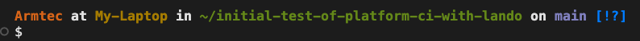

# KNOWING WHERE YOU ARE

## Why

When we described [Operating Systems & Shells](operating&shells.md) it was noted that you had something like a BASH or ZSH file on yours that allowed your computer code to talk to the system kernal.  In that discussion we talked about the importance of knowing where you are.  Knowing which computer or environment and which subdirectory the file you might be looking at is located; because we noted it was good practice to keep copies and use [Git/GitHub](gitbasics.md) to keep them coordinated. 

## What

The normal [Command Prompt](https://www.alphr.com/open-command-prompt-mac/) isn't very descriptive.  Usually just a $ sign or a > symbol and your cursor is sitting immediately after it blinking.  Wouldn't it be nice to have a prompt that looked more like this...

What you are seeing is the USER name on the Machine you are working on; in this case ARMTEC is the user on MY-LAPTOP.  Then you see the subdirectory you are located within; showing here as "initial-test-of-platform-ci-with-lando" and a ~ in front of it saying directly below the root.  And the environment being work is 'main'.  If you get to the point of using our [templated ci/cd workflow for a drupal project](drupalcicd.md) you will learn you better just be looking and not changing programs in this important production environment of 'main'.

## How
### Unhide & Find

You want to edit the .BASH_PROMPT file.  The 'dot' in front of it hints that it is a hidden file.  On a Mac you can hit CMD SHFT DOT and it will show hidden files.  Now go find it with Finder.

### Edit It

Now [copy the code from this link](https://raw.githubusercontent.com/mathiasbynens/dotfiles/master/.bash_prompt), paste it in that .BASH_PROMPT file and save it.*  Next time you open the terminal you should have a command prompt that shows you a colored two part prompt that indicates first what local subdirectory you are in and second where you on on GITHUB (since you probably haven't set up and logged into GITHUB yet it probably won't show anything for the second part yet, but trust me, it will later and be very helpful).

* HINT - BACKTICKS: What look like single qoutes in computer code are more often 'backticks' (extreme upper left on your keyboard).  You edit these in a text editor and if you are using the terminal in the apple/mac/iOS system you need to make sure that editor is set up for the right formats.  That editor will use the keyboard function setting of your operating system and those are set in your “System Preferences” “Keyboard” in an OS system.  There is a tab called “Text” in there and a box on that tab which, if checked, using “smart quotes and dashes" (smart quotes are those normal wordprocessor style ones).  Uncheck that box or you will be screwed up because the terminal can’t use that smart quote style in its commands.  

 
 
 

[Better way to see it all](ide.md)
