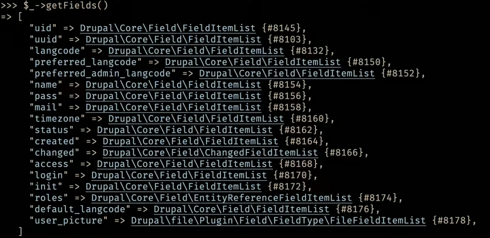

# Architecture & Entities

In the [Content Management System Overview](../book/cms.md) it was noted that a CMS has a database component and a display component where "There is also code in between the data and display that applies any logic."  Some of that logic might be things you code in to do stuff unique to your website; either coded directly or grabbed from a [contributed module](../chapters.md#drupal-modules) that has underlying code accomplishing what you want.   However, before all that happens it is being applied to Drupal's Core.  Understanding some of the logic in what Drupal Core is doing can be helpful in using Drupal no matter if you are just working with modules as a site builder or you get under the hood as a developer.

##  Information Types

In addition to the "parts" of a CMS being the front-end, the back-end, and the database, there are different ["information types" in Drupal.](https://api.drupal.org/api/drupal/core%21core.api.php/group/info_types/10)  The information types might be thought of cutting across all the parts but where an understanding of them is very valuable is between the back-end and the database.  The basic information types in Drupal are:

-  Content
-  Session
-  State
-  Configuration

The [Session information,](https://www.drupal.org/project/session_api) being things like is someone logged in, can be used in how you design or run your system.  This is especially true with things like ['Permissions by Role'](https://www.drupal.org/docs/7/understanding-drupal/users-permissions-and-roles) which Drupal is known to have extraordinarily effective management of in how it works.  Think about what you might show to an anonymous user versus a logged in user, verses a premium paying users, versus editors, and developers; all under your control.   And if what is in Core isn't enough there are contributed modules that take things even further with [Groups or what might be thought of as Departments in your organization.](https://www.drupal.org/project/group)

[State information]( https://www.drupal.org/docs/8/api/state-api/overview) can be thought of as more mechanical stuff the system itself generates.  Not as likely to be directly used in things you may do unless you are a developer.  Think of it often valuable in relating to 'time'; like when the the cache last updated or [CRON](https://www.drupal.org/docs/administering-a-drupal-site/cron-automated-tasks/cron-automated-tasks-overview) last run. 

[Configuration information](https://www.drupal.org/docs/drupal-apis/configuration-api) is something you care a lot about.  What will happen if you don't do anything with importing and exporting configurations, the work you do in setting things the way you want them as you get started will disappear.  I don't mean your Drupal installation will be gone.  Rather, things like the name you set, the theme change you made, the logo you applied, those will revert back to the default starting point because you didn't really save them.  The basics of saving your configuration are simply to think that what you have done [doesn't get saved until it gets converted into files, something called YML formats, and those making their way into the database.](https://www.youtube.com/watch?v=s46oXPDsJ3M)   That is the basic way, but if you are [using the Continuous Integration and Continuous Development Base Project we provide this configuration management process is set up across our multi-environment workflow.](../cicd/configatroot.md#you-care-about-this-one-now)

## Content Information Type

We slipped the word 'information' out and this brings focus toward what you will commonly find on the Drupal.org site or basic Drupal tutorials that may find some familiarity.  A standard installation of Drupal has two content types already set up; Article and Basic.  Article works well for things like a Blog or a Newspaper where you want to have a template of common content that will be reused as a shell for lots of additional material.  A Basic content type is more typically used for things like an "About Us" page or other 'one-off' pages as their starting point.

It is key to understand that you can create any number of [Custom Content Types.](https://www.drupal.org/docs/user_guide/hy/structure-content-type.html)  Why would you?  Think of it this way.  Let's assume you are making a website with a list of attractions in your area for people who visit for a fishing tournament you run.   You believe they come a long way and will stay many days before and after the event.  You also know that they often bring spouses who really aren't into three days of fishing.  So you want to present other area attractions that they might consider.  You want to include area restaurants you recommend,  hotels they might consider, nearby museums, shopping, spas, etc.   Do you think that the same information would logically be presented for each of these?  Sure, some information might be like the address, or phone number or website URL.  But would you classify a hotel as 'white table cloth' or 'food truck' or present a 'menu'?  Each of these things you might broadly consider attractions might be presented in a search list of results, pulled forward with a [taxonomy](../modules/taxonomy.md) enabled query but once the user clicks to look at a given item the 'fields' of information they contain would be different.  Seems like you should consider different content types that have fields associated with them which are unique to what should be presented. 

### Content Type

We slipped the word 'information' out and this brings focus toward what you will commonly find on the Drupal.org site or basic Drupal tutorials that may find some familiarity.  A standard installation of Drupal has two content types already set up; Article and Basic.  Article works well for things like a Blog or a Newspaper where you want to have a template of common content that will be reused as a shell for lots of additional material.  A Basic content type is more typically used for things like an "About Us" page or other 'one-off' pages as their starting point.

It is key to understand that you can create any number of [Custom Content Types.](https://www.drupal.org/docs/user_guide/hy/structure-content-type.html)  Why would you?  Think of it this way.  Let's assume you are making a website with a list of attractions in your area for people who visit for a fishing tournament you run.   You believe they come a long way and will stay many days before and after the event.  You also know that they often bring spouses who really aren't into three days of fishing.  So you want to present other area attractions that they might consider.  You want to include area restaurants you recommend,  hotels they might consider, nearby museums, shopping, spas, etc.   Do you think that the same information would logically be presented for each of these?  Sure, some information might be like the address, or phone number or website URL.  But would you classify a hotel as 'white table cloth' or 'food truck' or present a 'menu'?  Each of these things you might broadly consider attractions might be presented in a search list of results, pulled forward with a [taxonomy](../modules/taxonomy.md) enabled query but once the user clicks to look at a given item the 'fields' of information they contain would be different.  Seems like you should consider different content types that have fields associated with them which are unique to what should be presented. 

### Fieldable

One of the things that makes Drupal superior is that it is 'fieldable'.  Not a farming term.  Rather, from the example above of how different content types might logically contain different fields for you to use, somehow these need to be created and a home for them established in the database where the values for each would be stored.   So does this mean now you also need to know SQL or some other database administration language to work with Drupal?  Good news, NO!  Because Drupal does this; or perhaps somewhat more accurately the [Symfony framework](https://symfony.com/) of PHP that Drupal is built with is set up to handle this for your.   For now, probably far enough this part of the rabbit hole but if you are a developer you may want to understand [Drupal's Database abstraction layer](https://api.drupal.org/api/drupal/core%21lib%21Drupal%21Core%21Database%21database.api.php/group/database/10)  The key highlights to understand are that Drupal's domain module is [decoupled not only from the user-interface](../themes/decoupled.md) but also from storage.  Think about that last point in the sense of being able to select different databases that you connect to your Drupal website.  Without getting into PHP programming, you should also understand that Drupal's data domain is a configurable, structured, translatable, revisionable, typed document.   To understand what that means relative to Drupal being fieldable you need to shift your mindset from Drupal as database application to it really be a services and objects application in an [object oriented programming (OOP)](https://en.wikipedia.org/wiki/Object-oriented_programming) language.  With that mindset and the fact that "Classes" in OOP provide the definition for data formats and may even contain data you can think of Drupal as programmatically inserting fields when and where it needs it via code syntax.  Then it has things like its [DataDefinitions and Creation types of functions to have the data if dynamically defines inject what is needed into the supporting database](https://www.youtube.com/watch?v=mQHkKq5UUHo) you have elected to use.   Unless you are aiming to be a Core Contributor to Drupal, you probably will find the actual complexity mind boggling but here is an example of the many functional parts that are called together to just assemble a basic field in Drupal.  

### Entities

Content Types are just one of the fieldable entities in Drupal.   That shouldn't surprise us if we just go look at the definition of an [Entity](https://www.merriam-webster.com/dictionary/entity) as something of an independent, separate, or self-contained existence.   So Drupal Core also considers a "User" as an entity different from content plus "Vocabulary", "Block", "Media", "Comment", and "Contact Form".  Contributed modules have added [several more.](https://www.drupaleasy.com/blogs/ultimike/2021/01/10-fieldable-entity-types-every-drupal-developer-should-know-about) With a tool called Drupal Console]() you can actually [query your system to see which entity types are available.](https://trainingcloud.io/blog/2021/05/drupal-8-9-listing-available-entity-types/)

We understand that Drupal is using its Object Oriented Programming (OOP) approach to make fields we want to add to a content type or any other entity on our system.  These are inserted into database tables so what we put in that field on any given page of our website has a home to be saved.  And, since additional entities can be created, you can assume that OOP is able to even allow the insertion of a table into the relational database for storage needs unique to it.   If you are from the database world you probably know about how you can see tables, relationships between tables, and fields in tables in an [Entity Relationship Diagram.](https://betterprogramming.pub/what-is-an-entity-relationship-diagram-d5db69a87971)  The data model presented in a good diagram can communicate additional perspective with the line end symbols you see between tables which communicate one-to-one, one-to-many, and many-to-many relationships.  For another time and place, you might even talk to a professional data architect and learn the interesting schema approaches that are used for various types of optimization.

For course, even more interesting is to see an actual [entity relationship diagram for a modern Drupal database instance](https://www.drupal.org/files/Drupal8_UPsitesWeb_Schema_10-19-2013.png)

Perhaps of more direct practical value is to look at the [Drupal Entity API.](https://api.drupal.org/api/drupal/core%21lib%21Drupal%21Core%21Entity%21entity.api.php/group/entity_api/10)  Again, if we remember that we should thing about Drupal as a services and objects OOP application that drives the supporting data structure, it is more valuable to know how the classes and functions in Drupal's Symfony underpinnings are interacting to define and manage data, entities, and fields.

However, even that might be more than a basic site builder is going to care alot about in Drupal.  Rather, one probably simply wants to think of Drupal as able to make new entities, edit or insert fields in them, and manage the supporting the database structure behind all this that makes a home to store your important stuff.  From that mindset, you can then probably better understand [contributed modules which do extra things on your behalf around the entity concept.](../modules/entityref.md) 

 
 
 

[Learn more... Drupal Basics](../chapters.md#drupal-basics)
