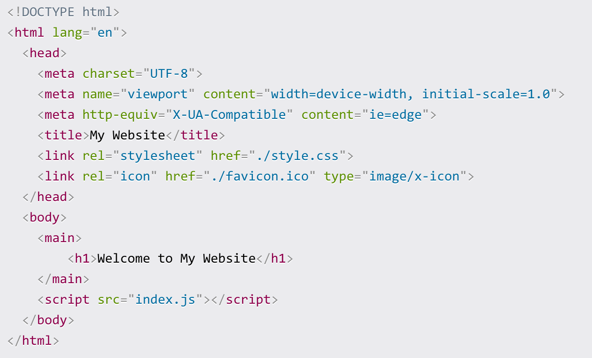

# Browser & Index.something

Browsers on your computer are something like Safari, Chrome, FireFox, Opera, and others.  Browsers have built in 'smarts'.  They know how to run code for things on the Front-end like HTML, JavaScript, CSS, etc.  

## Index File

The first file a browser looks for at the start is an 'index' file.  Most people are familiar with that being an index.html file that is styled like this:

 

<table align="center"><tr><td align="center" width="9999">

  
 
        
This [example from "FreeCodeCamp" is explained in detail on their site.](https://www.freecodecamp.org/news/html-starter-template-a-basic-html5-boilerplate-for-index-html/) Generally think of the first line of an index file like this telling the browser what language to talk.  Then the stuff between <head> and </head> are behind the scenes instructions and calls to supporting links that your site might need; and sometimes the list is way, way more extensive than the above example.  The stuff between <body> and </body> is really the working part of your website that people see; or at least the parts between <main> and </main> in the example.  Why is that <script> stuff in the <body> area then if it isn't showing directly?  Think of it because JS or JavaScript is actually very involved in unique display aspects of your site, especially where interaction or actions are displayed.

## Other Index

[While Index.html is most commonly used, extensions other than 'html' can also follow. ]( https://en.wikipedia.org/wiki/Web_server_directory_index)  If index.cgi or  index.pl is found, PERL is the language expected.  With index.php the language is php. If your system were to find multiple index.something files there is an order the webserver searches for an index file:

`index.html index.cgi index.pl index.php index.xhtml index.htm`

These other index.something files are often called when a website has more depth to it and the [front-end ](../theme/frontoverview.md)  speaks to a back-end server-side component.  Since Drupal's [CMS](../book/cms.md) is built upon a 'php' framework, a q[uick peek at index.php may be worth understanding.](https://www.youtube.com/watch?v=0YMt5JdvOmc)

If you happen to know HTML already, you will find it interesting that you can mix it with 'php' to quickly add some dynamic updates to your work.  An example of [building several parts of a website with HTML and having index.php make key calls to it is worth understanding.](https://www.makeuseof.com/tag/build-simple-php-website/) For a more [in depth review of mixing HTML and php you might find this summary tutorial session valuable.](https://code.tutsplus.com/tutorials/how-to-use-php-in-html-code--cms-34378)

 
 
 

[More Chapters on - Information Technology](../chapters.md#information-technology)

