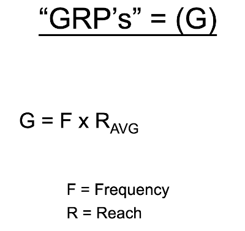
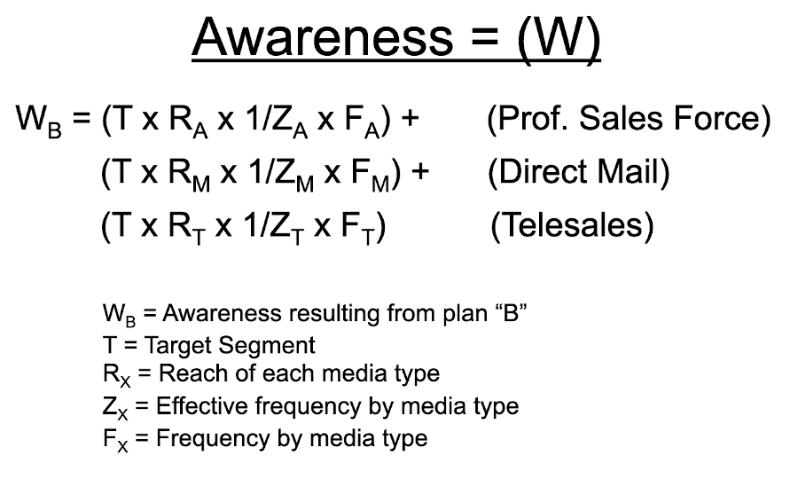
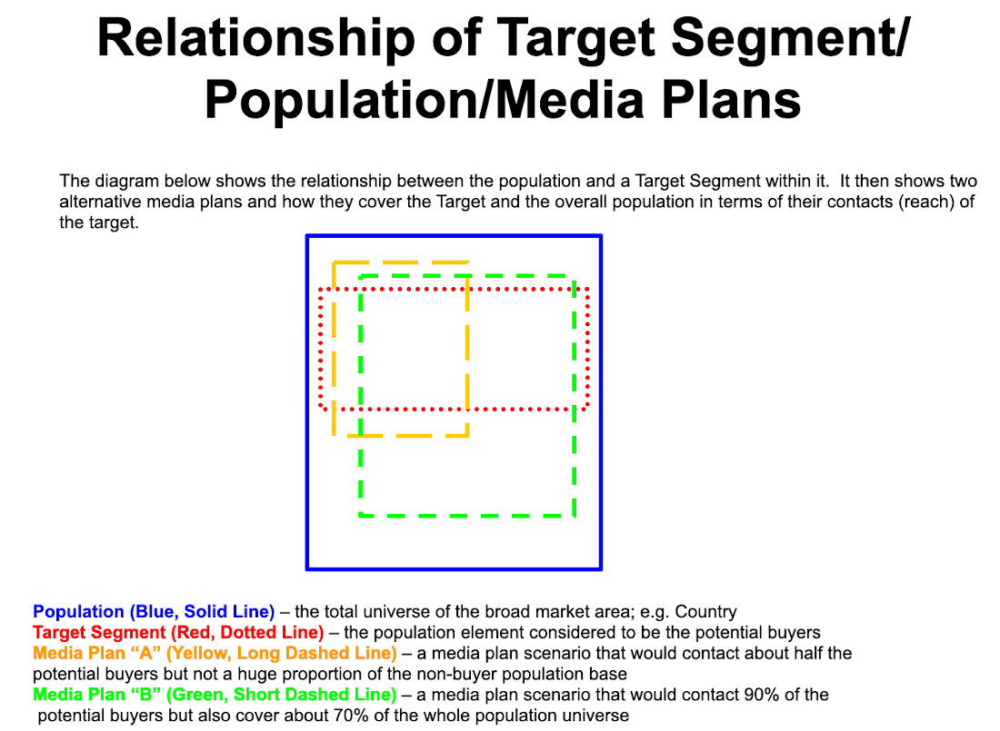
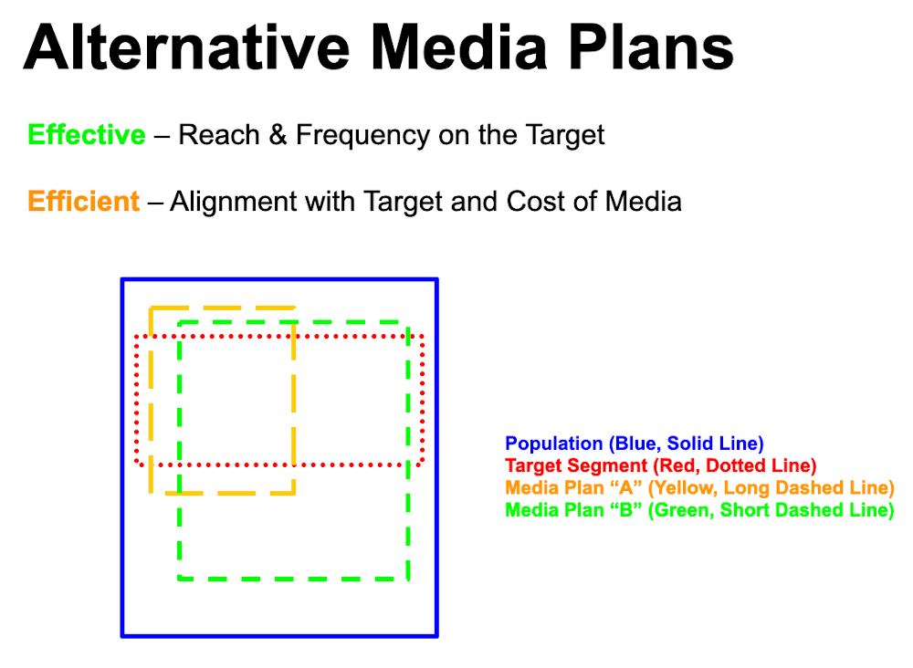
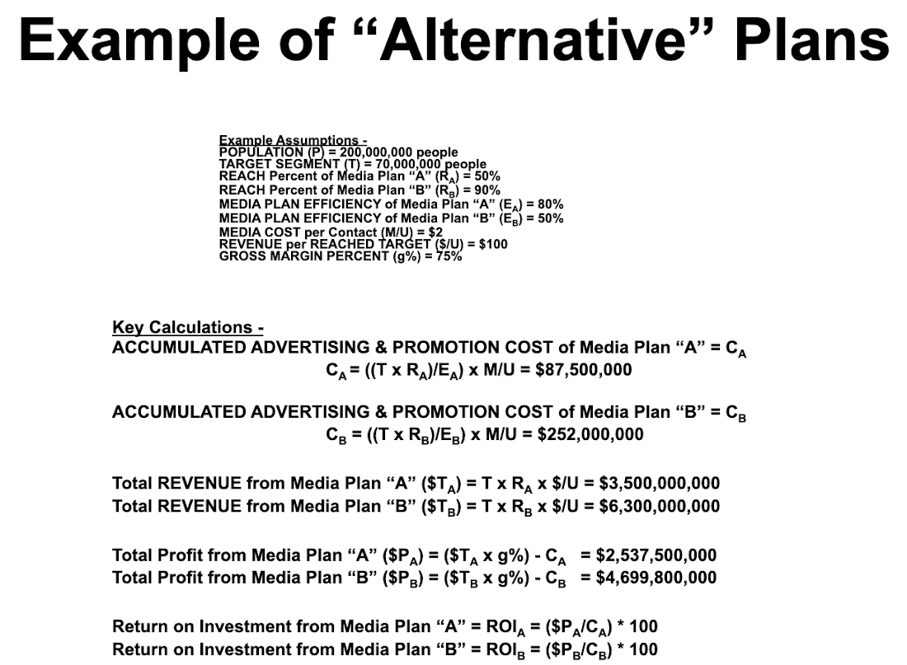

## A Company's Perspective
Often agencies will suggest “It’s an art” or “Measuring a creative process is impossible”.   The bottom line for a client company is a perfectly reasonable expectation that their media expenditures should produce financially attractive results.  With a carefully designed approach to media management, testing, and performance monitoring, the financial return for media can be managed just like any other investment.

That said, a client needs to understand that their relationship with an advertising agency is a partnership.  Expectations and clarity on 'who has what covered' is critical.  Advertising agencies may be boutique graphic shops, digital placement specialists, full creative with and without media planning, etc.  Looking at the 'parts' of advertising and promotion effectiveness and efficiency can help assure all are clear on who has what covered.

## Positioning
At the most fundamental level of understanding what you make/sell/do and why prospects/customers should care about it is the client company/organization's responsibility. However, if you are only at a first level skill in truly understanding your [positioning](../business/positioning.md) and its foundation may be more judgmental than research driven, admit it!  Full scope agencies are typically good in drawing out improvement in this area and the agency typically maintains relationships with research specialist to move you forward.  

Also, don't be shy in discussing budget considerations with them.  Agencies are NOT typically going to 'price gouge' you by having a financial framework.  Where it plays out in your favor is that they aren't going to tell you to refine positioning with a $million research study when your ad placement budget isn't even at that level.  There are ways to bring focus to improvements at lessor costs.  However, if you do plan on a major ad placement expediture, you will get lots more mileage out of it if you do the research to fine tune focus.

## Persuasion Scores

Persuasion of your communication is the greatest lever in terms of media performance.  We will discuss all sorts of math around targeting in a moment.  But don't let that leave you thinking targeting and placement and media buying discounts are the ruling factors.  The question of your message and creative to have 'stopping power' so it gets heard and 'relevance' on factors most impactful of 'influencing a call to action' is by far the thing that will make or break performance.  

Ideally as an overall media performance tracking and management program is laid out, you would obtain measured persuasion scores for communication pieces to be used in ‘all’ significant media channels. If you are a major player, there is opportunity to establish clear guidelines for consistency.  The key is gathering measures in the right format so they can be utilized as an appropriate modifying term in a media performance tracking and management tool. This would also consider key sample frame management (target segment fitting) and research instrument by media channel.  ARMTEC, Inc. has done work in this area to the point of establishing underlying database architectures for retention and performance norms.  This can be especially important in developing your own category specific exposure-to-awareness ratios by media type.

## Vehicle & Targeting
### Media Planning

Media - The Broad View!
As used in the following discussion, the term 'media' includes any contact activity with a directed message.  This includes traditional media like television, print, radio, etc.  It also includes non-traditional media like e-mail, web registration, professional sales force, telemarketing, and even public relations where highly directed.

## Gross Rating Points

GRP = Gross Rating Points represent the percentage of the target audience reached by an advertisement.

If the advertisement is aired more than once, the GRP figure represents the sum of each individual GRP. Therefore, a commercial aired 5 times reaching 50% of the target audience would have 250 GRP = 5 x 50%.”  This raises several challenges in properly managing underlying media data.  With about a 1,000 GRP’s each, is one buyer who sees the same commercial three times a day for a year, the same as 365 buyers who see it three times? Since reach translates to people and aware people are who buy, it is absolutely essential to begin to manage media data at this more detailed level. (Reach/Frequency)

## Awareness Generation

Awareness - A Critical Measure!  You don't buy what you don't know about!
Media can be expected to play a number of roles.  Sometimes media is simply promised to the retail trade because it is ‘expected’ and may be considered a cost of gaining access to the distribution channel.  More often, however, media has a more direct role of creating awareness and building brand equity.  Creating awareness is the most easily understood; ‘you can’t buy what you don’t know about’.  This simple proposition becomes a keystone for the connection of media expense to revenue generation.

## Exposure to Awareness Ratio
The media information and plans we put in place are aimed at the point “you can’t buy what you don’t know about”.  There is not a one-to-one relationship between creating ‘exposure’ and creating ‘awareness’.  Properly calibrating the true relationship for each media type is one of the major hinge pins of a media performance tracking and management capability. This requires maintaining detailed records of all media exposure data and linking it with awareness tracking research findings by ‘source’ of awareness.

Exposure Frequency:Awareness
Advertising theory says people need to see an advertisement between 7 and 17 times for it to register.  If the goal of our advertising is to make those exposed “aware” of our product, then we must establish how many people see an advertisement how many times.  We can see from the large range of exposures that it takes for an advertisement to translate to awareness that substantial error in predicting sales results could occur.  If the cost of a manufacturing process had a range where costs sometimes would double, we would jump on the issue with massive re-engineering studies.  Yet, a factor which has just as direct an impact on the P&L remains to be properly quantified and tracked. 

## Need State & Influence Model
### Time Alignment
Time is a key consideration in data architecture of a media performance tracking and management database.  The general principle that must be included in the technical design is to make all of the information elements available at the most granular time level and allow aggregation at multiple and overlapping accumulation levels.  The goal is to accept the reality that some input sources will only be available at an aggregate rather than a more granular level.  Therefore, more granular elements must be allowed to accumulate at any higher combination level to match the input level limitation in an analysis process.

## Multiple Media Modifiers
- What is Media Plan “A” and “B” are not alternatives but become possible combinations.

- To fully reach a Target Segment might require using multiple media channels. 

- The basic revenue/profit/ROI projection logic is as earlier.  But, multiple media combinations must recognize interaction effects. 

## Media Interaction Overlap
The basic exposure-to-revenue-generation logic of the media performance tracking & management tool accumulates reach and frequency from all media types one-by-one.  There are overlaps that exist between media types.  They can be accounted for by measuring the overlap rates and using a weighting term based on these weights as the combinations of each media type are made. Interaction measures will need to be established to populate the data behind the tool.

Poly-dimensional Evaluation
- Marketers use alternative media to tighten targeting efficiency.

- That means that placement must recognize the unique segments to be reached by each media channel.

- Therefore, that same segment definition must also frame the sample for an media testing of persuasion or other factors.

- Poly-dimensional means we must be able to “optimize” segment targeting efficiency with research, frequency, cost, and special creative against predictions of profit improvement.  This becomes a poly-dimensional optimization which is mathematically challenging, is likely to be iterative in working with clients, and may have constraint equations overlaid on it from practical experience in use, from consultation based selling with client preferences, etc.

- It also means some real technical challenges in data architecture design work and statistical optimization modeling work.

- But, there are also a number of intermediate revenue generation opportunities as various parts of the overall effort are established over a period of several years.

## Price Elasticity
The price elasticity-volume relationship has NOT been directly included as a dynamic adjustment term in the detailed equations to follow.  It could be incorporated via equation adjustment if wide ranging price differences were commonly used on the same brand.  However, the basic equation logic currently outlined assumes that the purchase intent measures obtained in persuasion measurement can be done on a ‘price-known’ basis.  Client interest for incorporating price elasticity, especially for new product launch scenario planning, should guide the importance of development.
