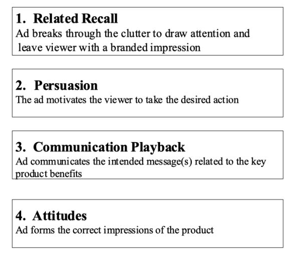

# Advertising & Promotion

## Consider these

At the detailed level, there are some serious number crunching opportunities to get powerful 'Return on Investment' (ROI) from your expenditures on advertising and promotion.  ARMTEC's experience in each and data entity connections between them is a key strength.  That said, a quick summary of the factors involved will at least get a client moving in the right direction.

Think about these factors and their meaning to your advertising and promotion effectiveness

- [Population](../business/admath.md#multiple-media-modifiers): 
    Simple count.  If you sell hats, count heads.  If you sell shows, count feet. 
- [Target Segment](../business/admath.md#multiple-media-modifiers): 
    Your count.  If you sell men's hats, think age appropriate male heads.
- [Media Plan/Mix](../business/admath.md#vehicle--targeting): 
    All your ways you will reach your target segment.
- [Time](../business/admath.md#need-state--influence-model): 
    Nice plan but is it right place at right time?
- [GRP](../business/admath.md#gross-rating-points):  
   Gross Rating Points. Exposures in the traditional media way of thinking.
- [Reach](../business/admath.md#media-interaction-overlap):  
   Breadth of your target segment that your media plan covers.
- [Frequency](../business/admath.md#efficiency-impact):  
   Number of times your message is delivered to the same people.
- [Awareness](../business/admath.md#awareness-generation):  
   Did your target hear and remember you.
- [Exposure Frequency to Awareness Ratio](../business/admath.md#exposure-to-awareness-ratio):  
   Not all media hits perform equally.
- [Persuasion](../business/admath.md#persuasion-scores):  
   They may have heard & remember you but don't intend to buy.
- [Purchase Intent](../business/purchaseintent.md):  
   So they say they will buy; will they?
- [Availability or Distribution](../business/availability.md):   
   They intend to buy but can they?
 

[For More Details On These](../business/admath.md)

 

## For the Win!

All that stuff is important and you are encouraged to understand it.  But if your head is spinning and you are sitting at an ad agency looking at draft campaign alternatives, at least consider these key points:

If your prospective consumers see it, is it engaging enough at a momentary glance they would stop to read it?  Is the way they are stated persuasively executed?  After seeing the ad, what tiny handful of things would someone logically recall from it?  Are the takeaways just informative or are they enough to intersect with and shift attitudes in your favor?

 
 

## Sore Points

While the listed items might be reasonably self explanatory, too many advertising agencies are only good at a few.  They may be extraordinarily good at several but by not considering how they all work together your advertising and promotion ROI is a bust.  Most commonly you have a reasonable handle on your population potential and your target segment(s) such that an advertising agency can coordiate with a media buyer to layout a plan that is economically efficient at placing exposures.  Separately, you and they may have done enough homework to develop creative that is relevant enought to the target to be [persuasive](../business/admath.md#persuasion-scores), sufficiently attention grabbing to produce [stopping power](../business/stoppingpower.md).  The most common failure points are that the media buying plan does not account for [exposure frequency to awareness ratio](../business/admath.md#exposure-to-awareness-ratio) impacts to produce top ROI, does not adequately [time](../business/admath.md#need-state--influence-model) align to your [availability or distribution](../business/availability.md) build, and you disappoint motivated buyers and/or disenfranchise distribution chain retailers.

Trust your success to [ARMTEC](../index.md)!

 
 

[Learn More - Business Chapter Index](../chapters.md#business)

