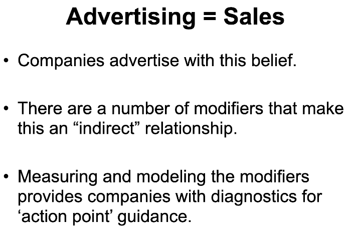
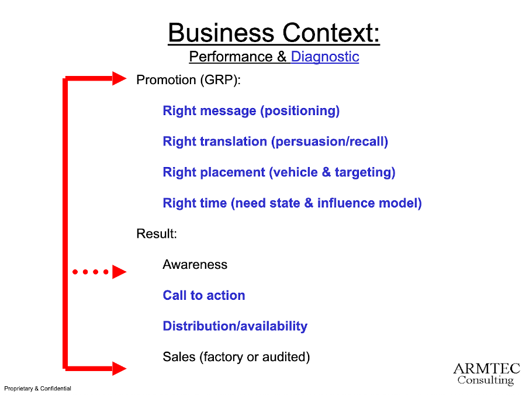
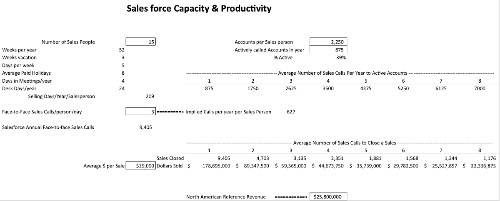
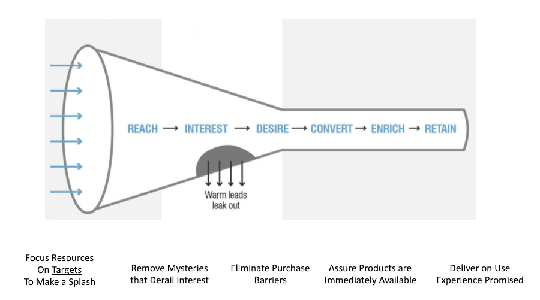
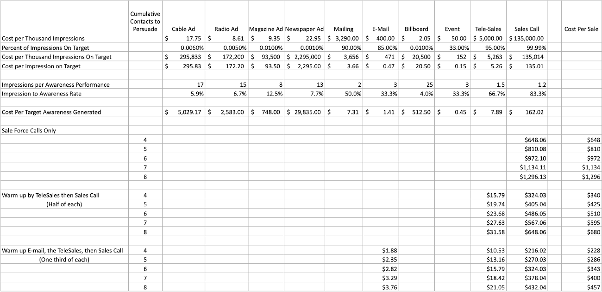

# Advertising & Promotion

Perhaps the most powerful lever in profitable success is advertising and promotion.  Too many businesses cringe at spending in this area.  You hear the story of how "half of my advertising spend is wasted, I just don't know which half".  That is very sad because your organization likely has something great where you and potential customers are losing out on not knowing about it.

## Premise?

Most people believe there is a relationship between "Advertising" and resulting "Sales".  Obviously this is why advertising and promotion are the most powerful lever of profitablity.  Some would say lack of profitablity if they have had disappointment with prior advertising.  There is a relationship but the fact a bunch of things can go right or wrong with it is why ARMTEC, Inc. is often engaged by clients.

## Overview of Parts

The summary below gives you a quick way to think about what you should consider in planning your advertising and promotion. They are the modifiers in the linkage between advertising and resulting sales.  So paying close attention to details matters.   The "Right Message" [positioning]() is foundational to telling your story; 'what you say'.  Make sure you are very disciplined in that step.  How persuasive your message is comes from 'how you say it'; think about it as message traction.  Would you respond to "17.35% burn to movement efficiency gain" or "Enjoy great mileage to that next fun destination"?   Is your reaction to that "Well it depends if I was telling an engineer or just a normal driver"?  If you think like that you won't have any problem understanding how the "Right Placement" depends on who you are targeting and if you are placing an ad in an engineering journal or the local newspaper.  "Right time" is ideally fairly tightly managed and also acknowledges the value of an on-going relationship contact plan that a [CRM approach]() provides.  At its most basic level "don't promote your show shovels in June (well, unless you are in the southern hemisphere).

## Salesforce Example

Without getting all complicated with the multiple ways you might reach your customers, lets start by just looking at your Salesforce. Think you can just take 365 days a year, tell your Sales staff to make 8 calls a day, and figure 10 sales people can cover around 29,000 accounts!  Oops... as much as you hoped, they don't work seven days a week; they don't work 52 weeks a year; you keep calling them into meetings to yell at or motivate them; they have vacations, holidays, sick days; and just maybe they have to call on a prospect more than once to make a sale!

You probably need to develop a model like this to start plotting out realistic account coverage and staffing...

## Bright Idea

Clearly you are a 'sharp' business person.  Somewhere you read about a Sales funnel.  The idea of casting a wider net to reach more prospects at a lower cost than what a face-to-face sales call amounts to is appealing.  So you plan to use advertising to reach broadly, maybe put in place an internet form to capture and screen initial interest, perhaps pre-qualify inquires with a telesales effort and pass the "hot ones" to your Salesforce to handle and close.

If you think like ARMTEC, Inc. you are disciplined enough when you work out the steps of the sale funnel integration of advertising, promotion, and salesforce actions you develop standard operating procedures, quantify expectation for profitable performance, measure Key Performance Indicators(KPIs), and align your incentive compensation plans.

 
 
 

[Learn More - Business Chapter Index](../chapters.md#business)
