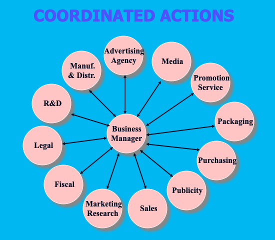
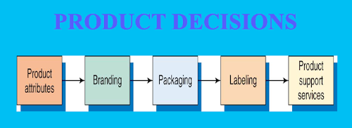
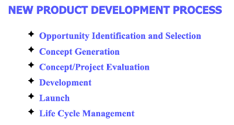
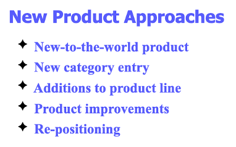
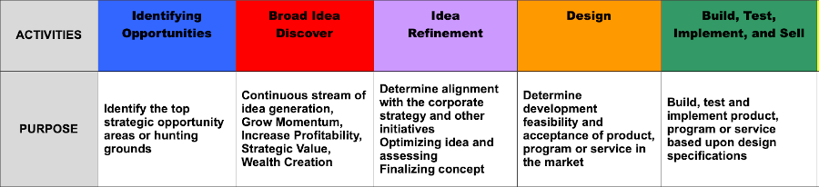

# COGS/COSS
## Cost of Good Sold/Cost of Services Sold

Probably the most traditional way a company hopes to make more profit is via a product or service they can make for less and sell for more.  We already noted industries like software and pharmaceuticals that  fundamentally resell intellectual property over and over again.  There are other pretty interesting ways to pay little and sell for more.   For example, if you can find what is fundamentally waste from one industry and figure out a way to cost-efficiently turn it into something others will pay well for, you have a business.  Power plant scrubbers produce a waste material that might be used as gypsum like material in plasterboard if you don't run into a [Chinese Drywall](https://en.wikipedia.org/wiki/Chinese_drywall) issue with the captured sulfur.  People who happen to have owned a sausage company figured out how to take the skin or rind layer of the pigs and turn them into a [fishing bait business](https://www.nytimes.com/1987/06/17/sports/outdoors-the-lure-of-pork-rind.html).  Others source [recycled materials to make furniture](https://everydayrecycler.com/eco-friendly-furniture/).

## Cost-Value

Too many businesses look at what they offer as being driven by technical feature.  The classic example is allowing engineering, cost accounting, or procurement to drive the nature of the product/service.   It would be pretty hard to argue that soda is 'engineered' at anywhere near the level of the quality of what milk offer yet [soda consumption is double that of milk](https://www.manufacturing.net/operations/blog/13190185/americans-drink-more-soft-drinks-than-water-more-beer-than-milk#:~:text=Jun%2027%2C%202011-,According%20to%20Advertising%20Age%2C%20Americans%20drink%20more%20carbonated%20soft%20drinks,milk%20for%20the%20third%20spot.).  I am not saying that the American consumer is 'valuing' the right thing.  However, understanding what [attributes of a product or service are most and least desired is important to understand](../business/needgap.md).   In optimizing the performance of your business or organization, you also need to know more than just the valued attributes but how best to [talk about them in a motivating manner](../buinsess/valueladder.md).  Assuring your offering delivers a valued promise is important to achieving the best price and the leverage of [price elasticity](../business/priceelasticity.md) advantage will nearly always trump the small percentage gains from cost cutting.  In fact, often cost cutting will hurt your performance by weakening a valued attribute or projecting a cheap image.

## Product/Service

We have been presumptive to this point that you have your product or service defined and developed.  If not, or if you are looking to improve or expand your product line, you not only will need to nail down your COGS, but go about defining the whole product or business.  How do you go about that?

The first thing you need to do is consider this a very wholistic process.   We can think about it in terms of all the stuff an effective business manager needs to think about to run a strong organization. 

That's great.  However, it is too overwhelming to start out.  So lets think about it first in the way classic marketing mix has been taught for years; [considering the 4-P's.](https://www.mayple.com/blog/marketing-mix)  All this says is that when you think about one of the "P's" you should consider how it fits with the other three.  As you work, just keep thinking back to the 4: Product, Price, Place, & Promotion.  Simple examples might be... "If I make this product will it cost so much no one can afford it?", "If I try to sell this product in a grocery store how will I get it there, on the right shelf, and now have the [Category Captain](https://www.antitrustinstitute.org/wp-content/uploads/2018/10/Gundlach-and-Loff_Comp-Exc.-in-Cat-Cap_8.31.18-FINAL.pdf) boot me out?", "Are the attributes I plan to have in my product so technical they will be difficult to communicateto potential busyers and where will I get the skill set to [develop effective commuications](../chapters.md#chapter-effective-communication) to my target users?"

Lets take another step back toward focusing on the Product! Product decisions start by consideing the 'attributes'.  Start with thinking about the attributes as 'features' but don't stop there.  Remember that often times you really sell the benefits of yoyur product rather than its technical features; more on that under [Value Laddering.](../business/ladder.md)

If we look at the new product development process we see that a series of steps gives guidance.  We look to generate ideas for an opportunity and this might come from talking with consumers, from our R&D sefforts, from seeing a weakness in a competitive item.  There are companies whose [whole business is about ideation](https://www.sitsite.com/method/) and, of course, you can also contact ARMTEC, Inc. for more fully coordinated help in this area as well.

You will also notice that the new product process has additional steps.  For a better understanding of Concept Generation you might think about it as framing the ideas with some perspective of [Potential and Structure](../business/potential.md) plus considerations of [Structure and Segments](../business/segmentation.md) to frame how the ideas might fit into a market.  You might also leverage [Need Gap](../business/needgap.md) research to see how the attributes you are considering in your product will fit the target users situation.   [Concept Development](../business/concept.md) and [Concept Testing](../business/conceptquestions.md) provide the 'how to' behind Concept or Project Evaluation, although the final step will be to [measure purchase intent on a priced concept.](../business/purchaseintent.md)

As you are search product ideas, it may help to consider the range of entry points.  New-to-the-world products can offer mega opportunities but also mega risk.  So if you find yourself in that space, definitely look for experienced help.  ARMTEC, Inc. has developed and launched just short of a dozen new products in a single year; all but one was a success.  You have someone better to turn to, go for it.  Don't forget, you can often be very successful with a new product entry that has key attributes that no one else is fulfilling and do great.  People think of Apple, Inc. as super novel but if you really break it down, they are fast followers into categories someone else opened but Apple did its homework on buyer needs and gaps to deliver novel solutions.

As you can detect, normal product/service development occurs in a stepwise sequence.  Most organizations aren't foolish enough to run the complete development of a product through R&D plus pilot lab production before they have done some basic testing at the concept level.  During that process they will typically define some sort of score level that they believe demonstrates preliminary success.  They probably will refine some attributes and/or the way they talk about them and watch for improvement in their measures.  We talked about some of these in the [Concept Testing](../business/conceptquestions.md) and [Purchase Intent measures,](../business/purchaseintent.md) but there are a lot more that we have used along the journey.

Speaking of journey's, organizations which attempt to maintain a continuous stream of new product/service innovations actually also define the process itself.  These processes are variously called things like Stage-Gate flows; a generic example of that type of flow process is shown below.  You can probably do some of this yourself.  ARMTEC, Inc. can help you make such a flow your own so it fits well within existing processes and departments in your organization.  And if you want to go with the 'big boys' there is actually a company called [Stage-Gate](https://www.stage-gate.com/) who not only does this but will assign staff to work with you on an on-going basis to keep you tuned to an effective flow; having worked with them in the past, they do a nice job.

 
 

## Price

As noted earlier, marketing mix with the 4-P's considers Product, Price, Place, and Promotion.  Price plays such a uniquely important role to your success, that we will discuss it in a [separate section; jump there now!](../business/priceelasticity.md)

 
 
 

[Learn More - Business Chapter Index](../chapters.md#business)
