# CRM
### Customer Relationship Marketing

## The Logic

Customer Relationship Marketing can be summarized as "Continuity of Contact".  You can't really argue with the basic premise that you are likely to convince someone to buy the first time they hear about something; although [impulse buying](https://www.nerdwallet.com/article/finance/impulse-buying-definition#:~:text=Impulse%20buying%20means%20you%20purchase,line%2C%20is%20an%20impulse%20buy.) is a thing for the right type of goods or services.  Even then, it is very likely you had heard and maybe even experienced that candy bar you grabbed at checkout when you went in to buy your kale.

More importantly, you can't really argue with the math telling you that a low cost insert, digital ad, phone call, or other lead generation actions make better sense than the much more substantial cost of sending your sales people on face-to-face [cold calls](https://www.investopedia.com/terms/c/coldcalling.asp). 

At its most basic level CRM aims to establish a connection with who you believe to be your general market.  You may have done research on both basic [potential](../business/potential.md) and first level focus on [attractive and likely responsive segments](../business/sementation.md).  Most importantly you have refined your offer with development of [concepts](../business/concept.md) that you believe or have measured as [persuasive](../business/persuasion.md).  Because we know the value of continuity of contact, we also maintain continuity of that message throughout the exposures provided via our [media plan](../business/admath.html#need-state--influence-model).  We typically are going to front-load the spending in our media plan timing so that we create [awareness](../business/admath.md#awareness-generation) quickly to generate sales, expecially if we are dependent on retail partners who might delist a slow mover.  Our analytics of actual buyer response becomes an important guide to then back down our advertising and promotion spending and gain profitability. 

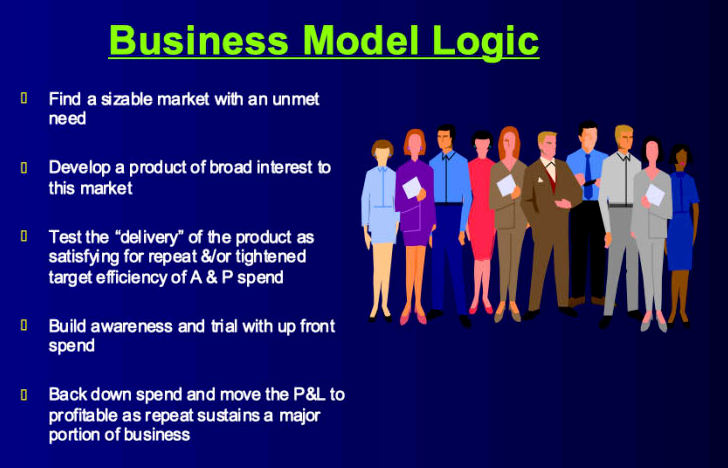

Continuity of Contact offers a whole additional profitability lever than just the expense efficiency of different routes we use to talk to prospective customers.  The value of using it to "bond" the customer is of huge value.  First because your product might enjoy better [repeat rate](https://www.investopedia.com/terms/r/repeat-sales.asp) continuity.  But loyalty can extend beyond the base product or service you sold them.  In fact, this is why we are so oriented to establishing a brand with consumer connection at the emotional rewards/personal values level of its [value ladder](../business/ladder.md).  You have seen this play out many times when you see a brand offer a line extension; new sizes, new flavors, new colors, new engine, etc.  The logic here is that advertising and promotion are an expense and if it can be spread across more points of revenue you will gain more profit.

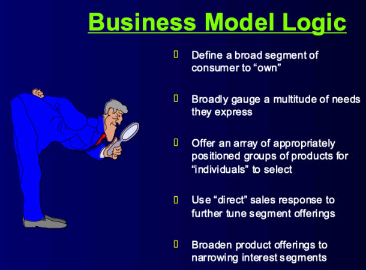

Another way to think of it is that you pursue a progression.  A mass market product that everyone might buy could use broad appeal general advertising.  The more you can pinpoint your targets the more you can use more focused appeals.  And the more you connect those appeals with continuity of contact the more you understand the scope of your customer's needs.  If you bond with those customers so they interact with your brand and share information, especially real-time, the more you hit the holy grail of advertising ... "You know who, you know what, and you know WHEN".

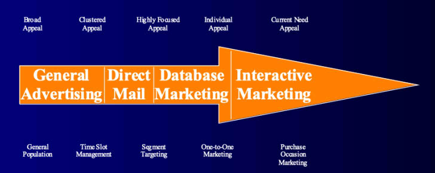

The good news in all this is that your promotional efficiency is on an improving path.  The bad news is that the target segment can be getting smaller.

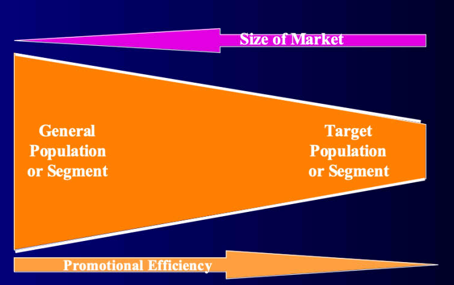

You offset this issue of small target segments by owning a broader set of solutions to more of their needs.  You offer more products and services to YOUR customers.

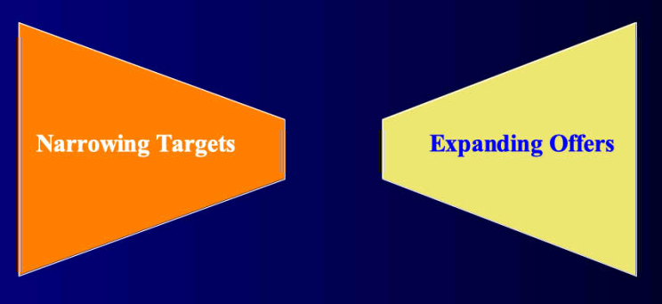

 
 
 

## The Parts

We talked about how understanding your [potential](../business/potential.md) and the [segments](../business/segmentation.md) of mutual attraction; these leading you to the 'Identification & Acquisition' element of CRM.  We talked about [media or promotion plans](../business/admath.html#need-state--influence-model).  You execute those with the tools you put in place.  You generate the consumer response and you analyze performance and adjust dynamically.

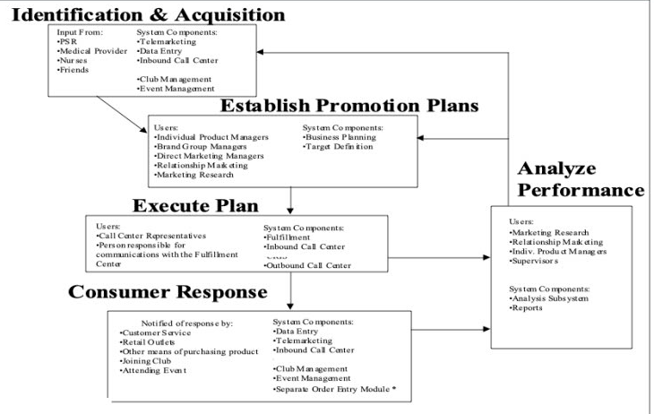

So what you you need to put together to construct a CRM capability?  Could be all of these and more!

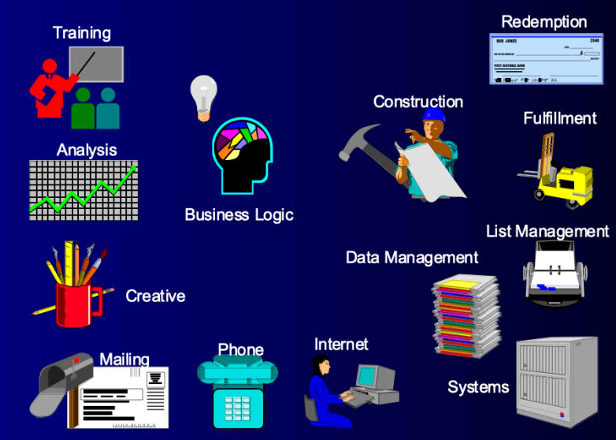

For each step you want to break down the parts and make sure you know the who and how you are getting it done.  Take something as simple as direct mailing...

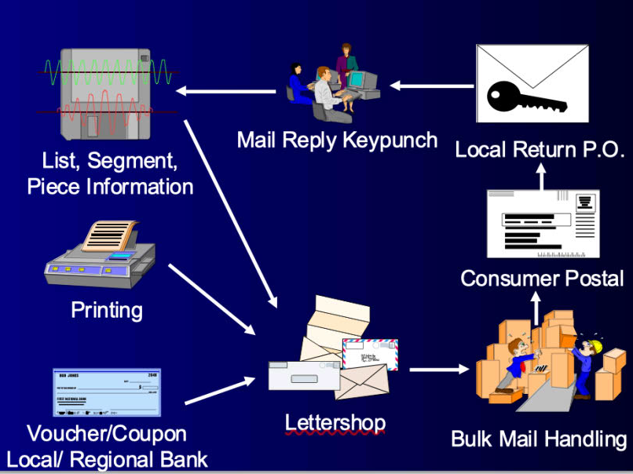

You ideally want to have an integrated database that all the moving parts connect with in real-time.  This can include telephone support for orders and status.  If you offer promotional coupons you might want to know redemption information and remaining eligiblity.  Your view into order history can be important to trigger a recontact to assure repeat and that your competitor isn't slipping into one of your accounts. 

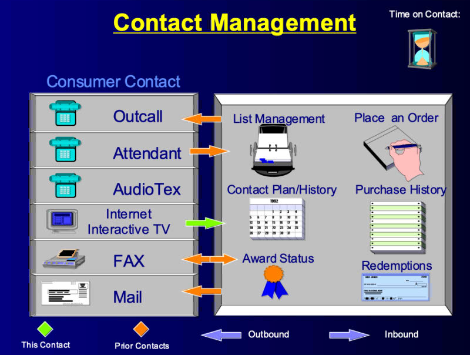

Taking an order might be initiated on the internet but a follow up happens by phone.  Your customer service phone staff should be able to see payment, fullfilment, order history, credit status, and more...

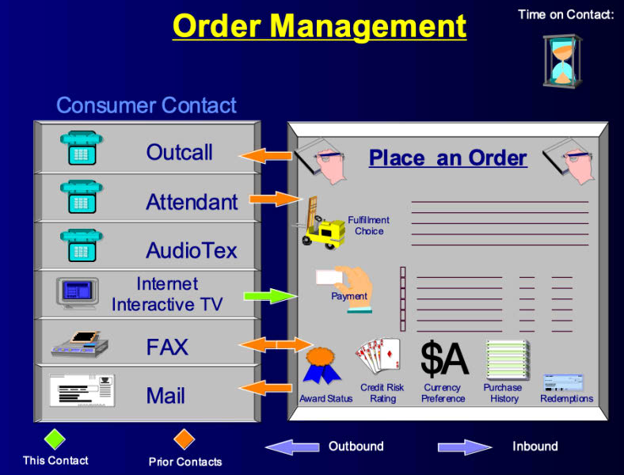

Don't forget that after the order is taken you need to get it there!

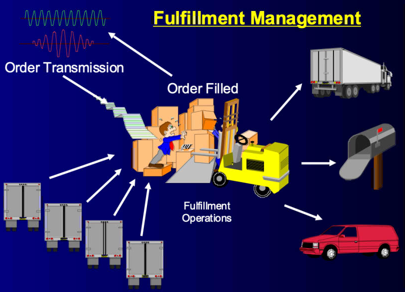

Don't forget that Worldwide Web thing is up 24-7-365.  And those people talk differing languages, have countries with their own postal and import regualtions, and may call your product category by a different name.  Heck, don't forget that ounces-grams thing and any other package configuration things you better know about.

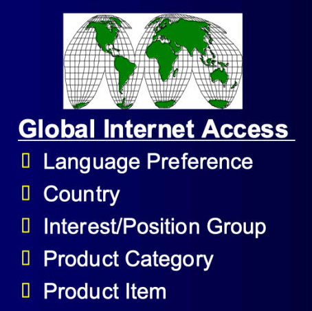

Coordination across media can be a meaningfully important consideration in how you work your CRM capabilities.  If you might use SPOT Television buys in local markets, are you keeping track of precise flighting dates and times?

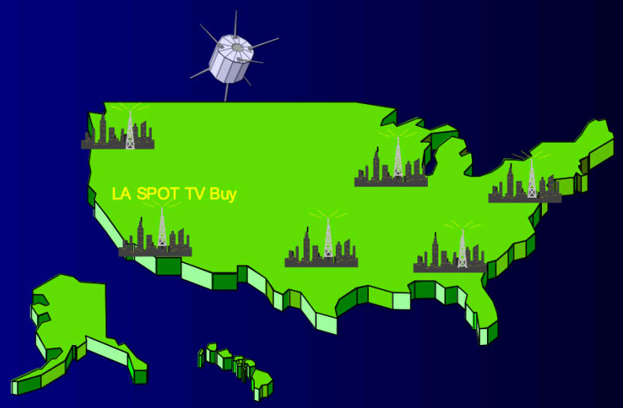

Why do you care?  Drop that SPOT ad in Los Angles with a 1-800 number on it just as your call center is closing, has low dinner time staffing, etc. and you will have a ton of lost sale call abandons.  Plus, you probably will have some dissatisfieds who will do who knows what to your brand on social media.

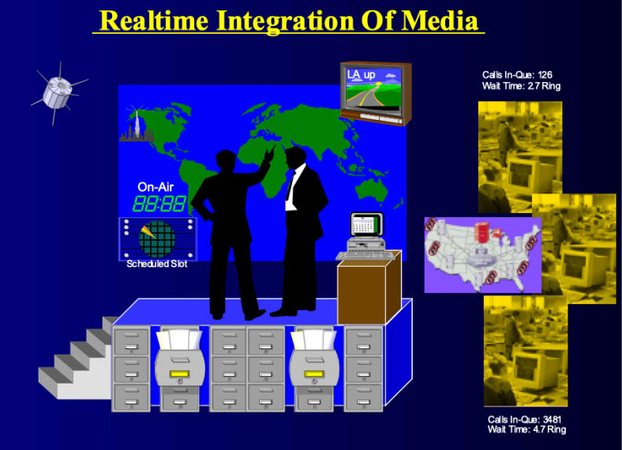

As you work with ARMTEC or others to establish or enhance your efforts, make sure you understand the value of analytics in delivering profitable performance!!!

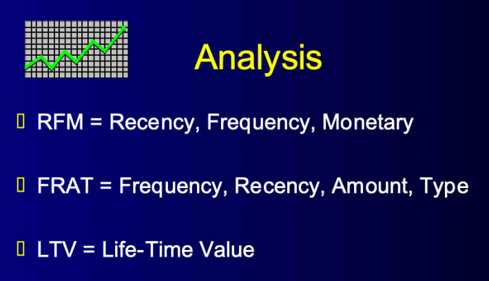

 
 
 

[Learn More - Business Chapter Index](../chapters.md#business)
