# Value Ladder

Some how you have developed a list of things that you believe are important in your product or as part of your service.  Ideally you went through the formal [Need Gap](../business/needgap.md) research process to get true quantitative measures.  Hopefully you did such a study with a well defined sample of sufficient size to be both representative and sufficient to slice and dice findings by subgroup and interaction effects.  That said, if you have a solidly experienced researher on your team you may be able to take some short-cuts.  For example, over a series of three days, with morning and evening sessions, we did the study around critical attibute drivers for the [financial website development of Mint.com back in 2006-2007 timeframe](https://en.wikipedia.org/wiki/Aaron_Patzer).

## A Brand

The Value Ladder step is to relate lower level feature/attributes and functional benefits to higher level emotional rewards and personal values important to the target productive customers.  Doing this is about creating a "Brand" rather than a generic product.  By making a brand you provide continuity with your messaging as your products or services grow and expand.  Your advertising dollars show greater memory retention across a line of products and your repeat customers return to your brand even if they find an evolved product/service portfolio.  You are building an enduring business via a meaningful, clearly defined brand identity.

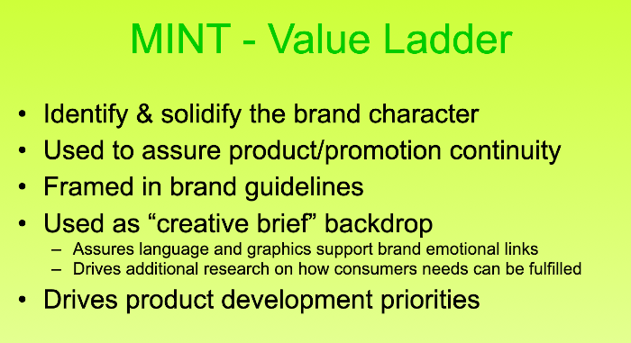

## A Continuity

The aim of your value laddering process if to put the important things you identified as valued attributes at the bottom and start linking them to higher level benefits and values.  Don't get frustrated by that seems like a pychology school exercise; I know you got her via a tech driven link and you probably like the clear discipline of computer coding.  This isn't all that complicated.  You just need to keep answering the question "WHY?".  Why does someone like "bank level security" in a website... because it makes them feel SAFE.  Why is it important to feel safe... because I want to feel less STRESS.  Why or How does less stress fit in your view of an ideal world...  I am into "Confidence" and personal "Control" as part of feeling happy versus say worried or annoyed.  

Look at some other attributes at the bottom of the chart below and follow them up.  You brand message, your communication plan, it going to headline the top level stuff and use the low level stuff as 'Reasons to Believe'.  "Believe"?  Yeah, remember in the [Need Gap research the Part 3 line of questions](../business/needgap.md#query-crediblity-challenge)...

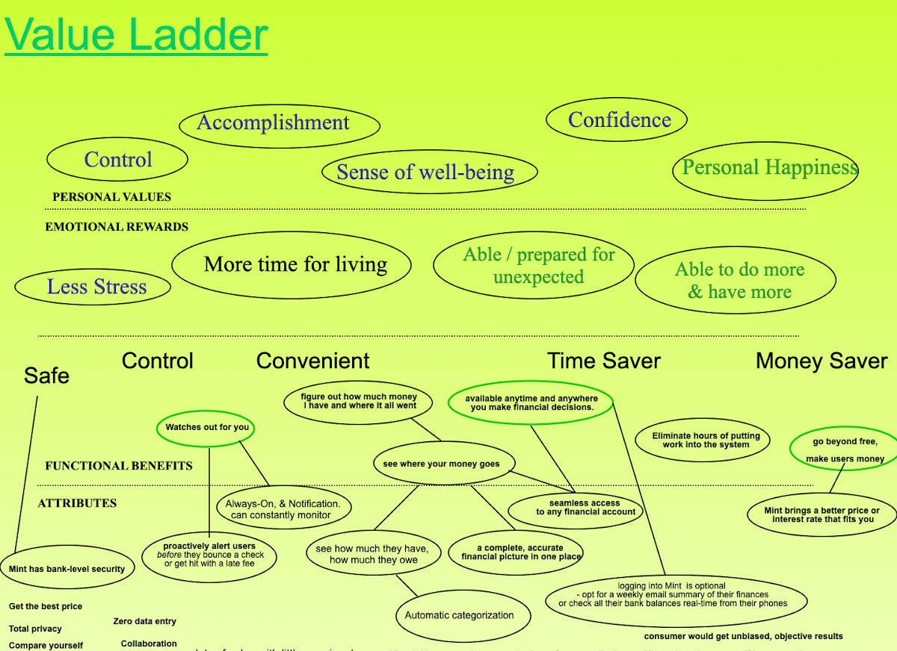

## Attribute Priorities

Ok, that value ladder bottom to top path stuff seems like an unending platter of fun if I was a pysch major, but I'm not.  Is there any way one should be focusing on which of the attributes to worry about?  Obviously we would focus our efforts on those things from the [Need Gap research Part 1 line of questions](../business/needgap.md#query-importance) that people said were most important.  From amoung the important ones, we want to further focus on the [Need Gap research Part 2 line of questions](../business/needgap.md#query-current-satisfaction) that people said they weren't getting satisfied.  If we were really doing our job on detailed demographic or classification questions when we did that study, we would know what product/service/brand the respondents currently used and we would know which brands did great and which sucked at various things.

So in the example below, we might have found that people said that having full, high visibility into their total financial picture was really important.  And they also said how much time they spent doing what they needed to in order to get at that picture was also important.  So we could plot those to factors against one another and then take a look at how they thought various services did in each regard.  Now if we were working on designing our own new product, MINT, we know where we would find open competitive advantage space.  We might not believe our design could initially hit the 'ideal' point, but we know where we can get and we know our development roadmap direction.

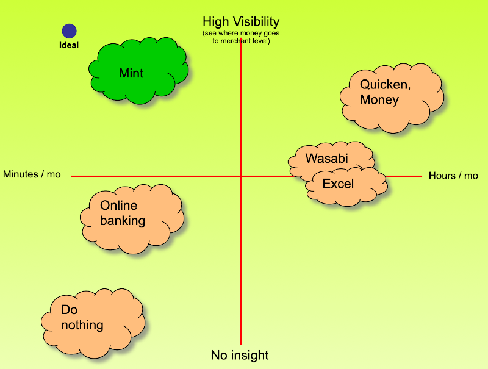

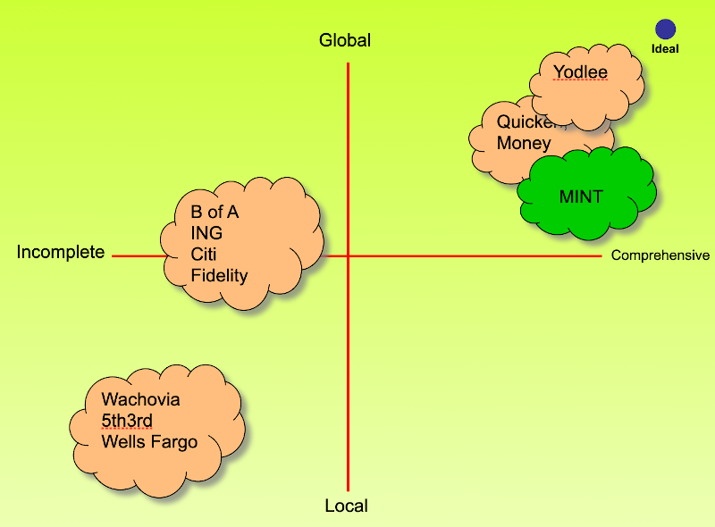

 ## Security is our gap
 
Jump back to 2006-2007 and think for a moment.  Do you believe giving all your bank, investment, and credit card account numbers and passwords to some random kid on the internet is your wisest security move?  Obviously MINT needed to do things to emphasize safety and security in its messaging. 
 
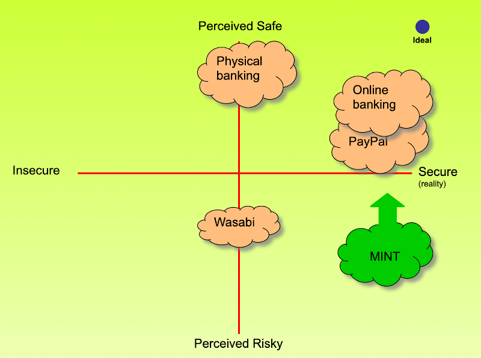

MINT's anytime/anywhere advantage could be a player in the 'how'.  Could we take that ubitious advantage as a reason to believe for safety and security?  Now you see how things like setting activity alerts jumped into a product development priority to assure support of an important prospective customer emotional benefit need.

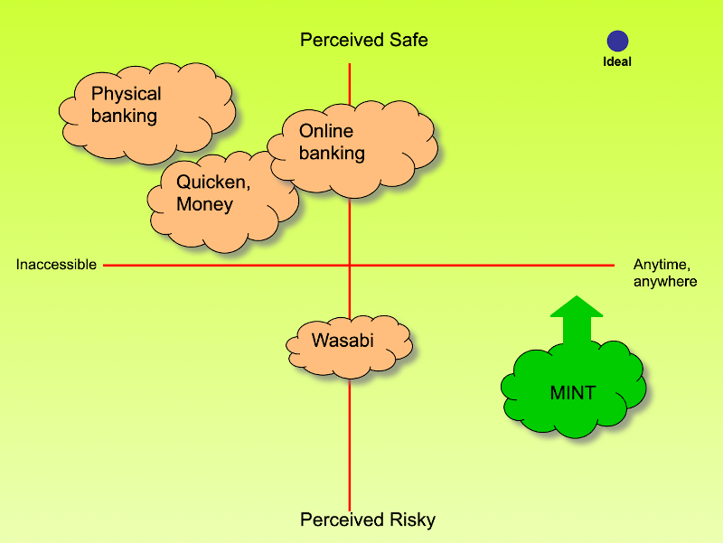

## What else moves people

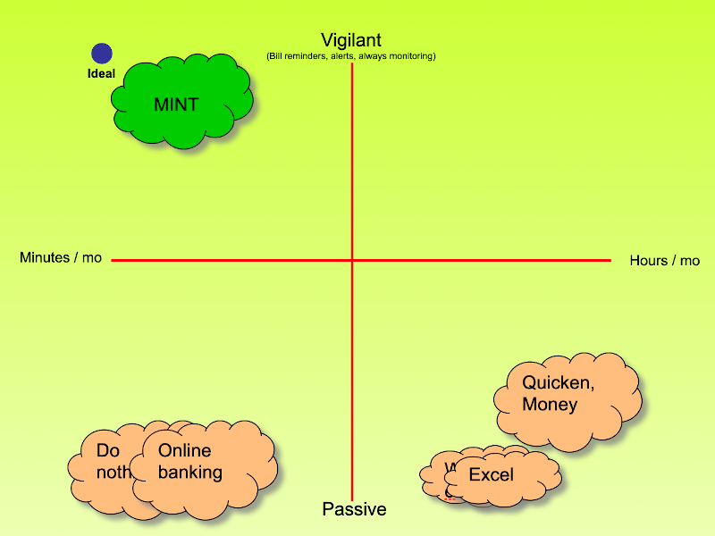

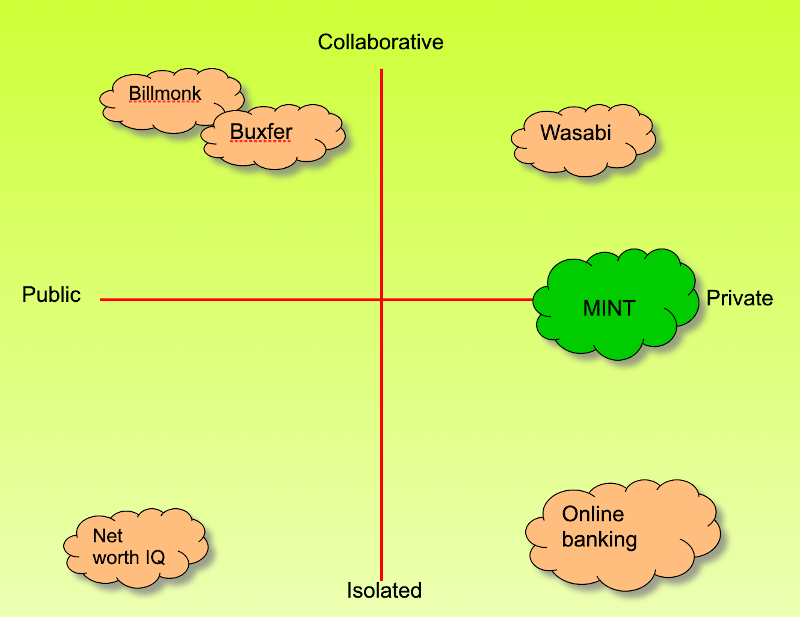

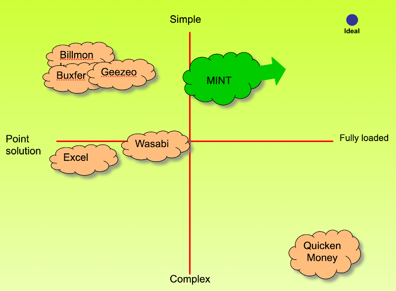

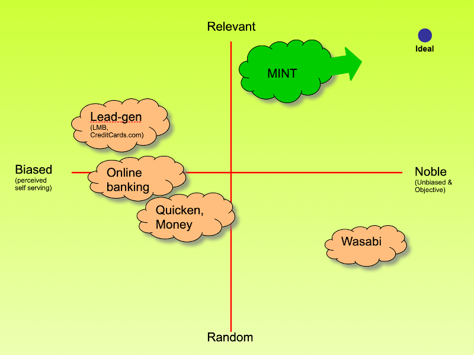

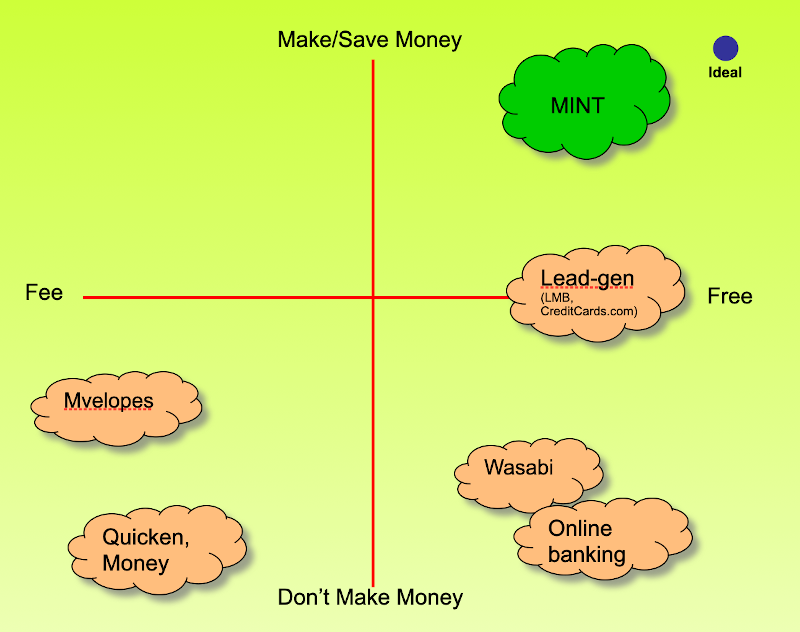

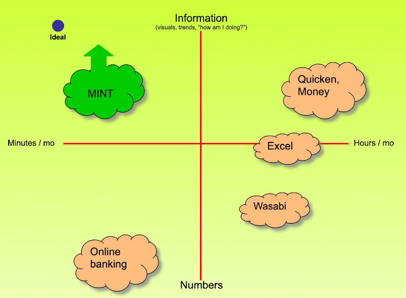

## Taglines & Logos

When that [Need Gap research](../business/needgap.md) there is no reason after doing the main part of the study (do it after) that you can't drop in some 'Tag Lines' to test reactions and even different logos.  Below you see some taglines tested.  But testing was also done with Mint logos in the sense it might be played out as 'fresh' like the mint plant or financial like the place that makes money.  The name itself was carefully chosen to communicate both but the importance of the 'fresh idea' to how you can better manage your money won out with a mint leaf logo.

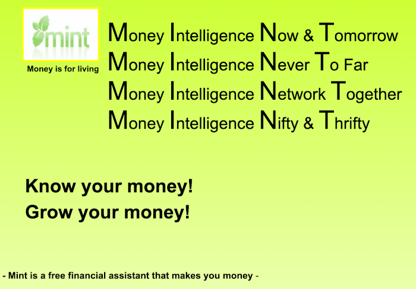

## Generic or Unique

The more elaborated example for MINT was for a unique financial product. Would another financial product essentially look the same in a Value Ladder?  It might have some similarities, especially at the highest level because people tend to hold 'Personal Values' that cut across a variety of needs they fulfill with various products and services they buy.  However, you will find enough differences in the nature of how these are delievered by the emotional benefits your product or service delivers to uniquely differentiate what you offer.   We will discuss that more in [positioning]() and [concept development](). 

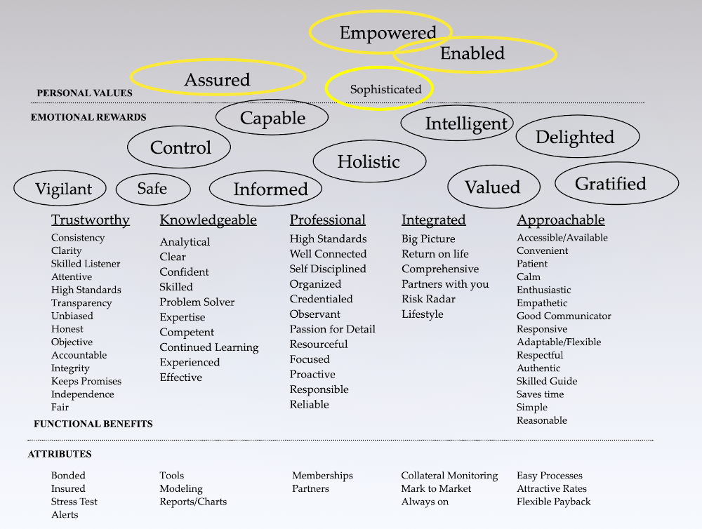

[- Next -]()

