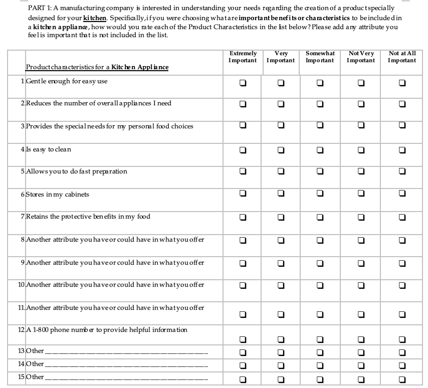
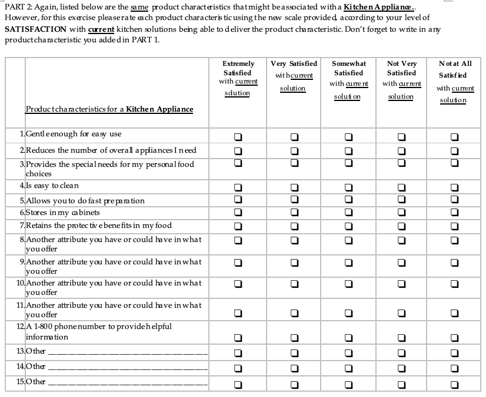
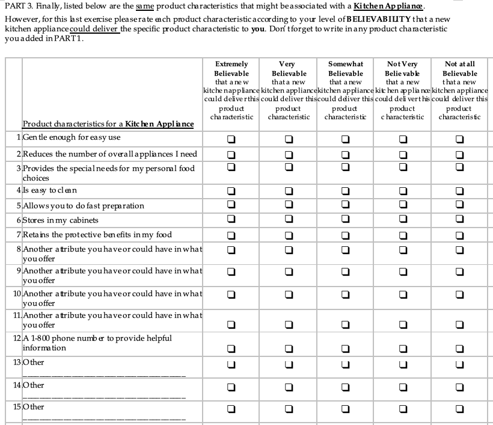
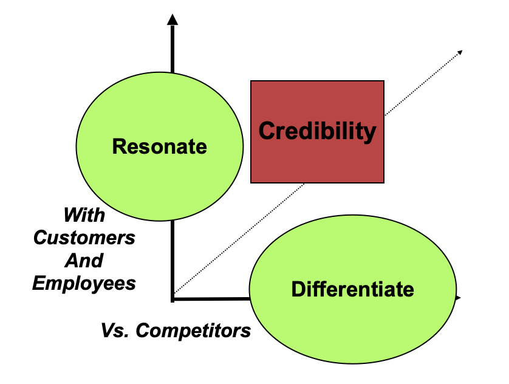

# Need Gap

Need Gap research is a quantitative study that typically follows ideation and qualitiative study inputs.  From your technical development possiblities and/or from prospective customer feedback, you have a good number of attributes that you could include in your product or service.  You have reviewed the competitive landscape and know both what appears to be common basic requirements in the category plus what things you believe you can uniquely provide to differentiate your product.  However, putting things into a product or service incurs costs and you want to make sure you focus on those things that are most valued.  

You need to come up with a comprehensive list of attributes.  The example below, on a 'kitchen appliance', only presents a very abbreviated list of attributes so you can see how survey questions are assembled from them.  You should have 3 or 4 times that many if you really breakdown the full scope of a potential offering at a really detailed level that guides decision making.  Do NOT combine attributes on the same line; each should be individually presented. 

## Query Importance

## Query Current Satisfaction

## Query Crediblity Challenge

## Get at the 'Who'

Again, the example below is just that.  You should make sure you are collecting a very extensive list of classification/[segmentation and targeting]() questions.  These will both allow you to be very clear on who you are going to find interest in your product/service and begin to drive your list source capture plans. 
 
 
 
## Using the Findings

These findings will help point you to tangible feature or functional benefits valued by prospective customers.  However, if you recall the discussion about [Cost of Goods Sold or Cost of Services](../business/cogs.md), you remember communicating about having the ['right stuff' rather than stumbling into it](https://www.google.com/search?q=the+right+stuff&source=lnms&tbm=vid&sa=X&ved=2ahUKEwio04XZ-Z_-AhXStTEKHf4HD_cQ0pQJegQIBRAC&biw=1440&bih=586&dpr=2#fpstate=ive&vld=cid:25b010d5,vid:nYEKSqa41q8) is what will maximize profit. 

Think about the first section of questions aimed at what people find important and, therefore, will 'resonate' with them.  The second set of the same questions is aimed at finding gaps in satisfaction that your product/service can fill; by taking the two questions together and honestly filling the gap with your solution, you will 'differentiate' your product/service from the competition.  That 'honestly' part is important.  Later we will talk about how important it is both in "how you tell your story" and how you support that story with "[reasons to believe](https://lillianlabs.com/2020/11/10/7-examples-reasons-to-believe-rtb/)"... the basis of 'credibilty'.

 

The Need Gap findings point to what attributes are important and unique, then we move to developing a [Value Ladder](../business/ladder.md) to frame how best to talk about them.

 
 
 

[Learn More - Business Chapter Index](/chapters.md#chapter-business-basics)
