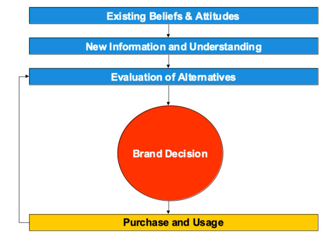
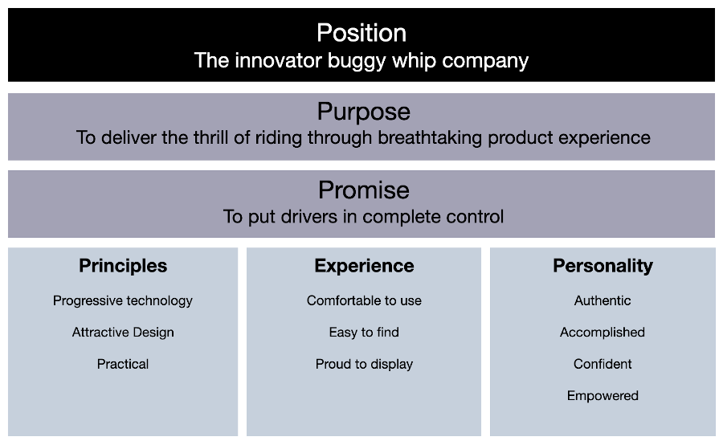

# Positioning

Fundamental to communication or even business operation is knowing "who you are".  Or, if a new business "who you want to be".

Since you communicate about your business in a way that you create expectations of a perpective customer, you basically "Make a Promise".   You're graded on how well your and your employees keep that promise in every interaction they have with a customer.  Therefore, what you say should be what you actually do and who your actually are.  It is your "Position"!

## Existing Business/Product

Research can be done which attempts to draw from [interviews with you and your employees to elicite the attributes](../business/archetype.md) most endearingly associated with our business selves.  You will subsequently encapsulate that with your product/services description to summary a concept that you will promote.  If you are efficient about it, you will aim to tell that story about your business to those who are most likely to care and thus be pursued.

## New Business/Product

For new products/businesses, the process is similar but focuses on finding what attributes people want and aren't feeling that they are currently receiving. Understanding existing beliefs & attitudes can come from exploring their ["need gaps"](../business/needgap.md). You ask, how can you fulfill it?   This is where you are working to develop your [concept](../business/concept.md) from a depth of understanding about what they want and well crafted summation of your solution.  And don't forget, make sure you engage your brand with an emotional and personal value connection; using our [value ladder](../business/ladder.md) process to get there.

The buyer will start from their existing beliefs which you want to acknowledge.  They will review the information from your well stated concept and try to understand it in their own context.  The concept will become part of your [creative brief](../business/thebrief.md) that your advertising agency helps creatively translate for presentation with powerful "stopping power" and [persuasive](../business/persuasion.md) ways that influence the buyer's evaluation of your solution and its alteratives to produce a brand decision favorable to you.

## Encapsulate it

You have the noted tools to help develop and capture your own ideal "WHO".  This can further be summarized or encapsulated in a Positioning Statement that should be your organization's mantra!

 
 
 

[Learn More - Business Chapter Index](../chapters.md#business)

