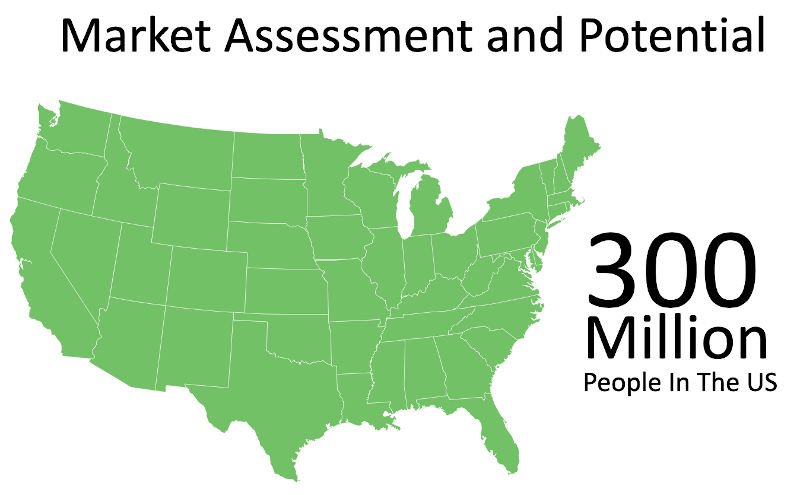
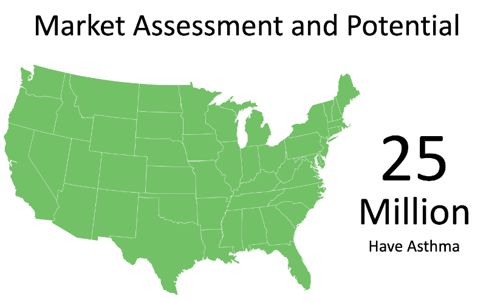
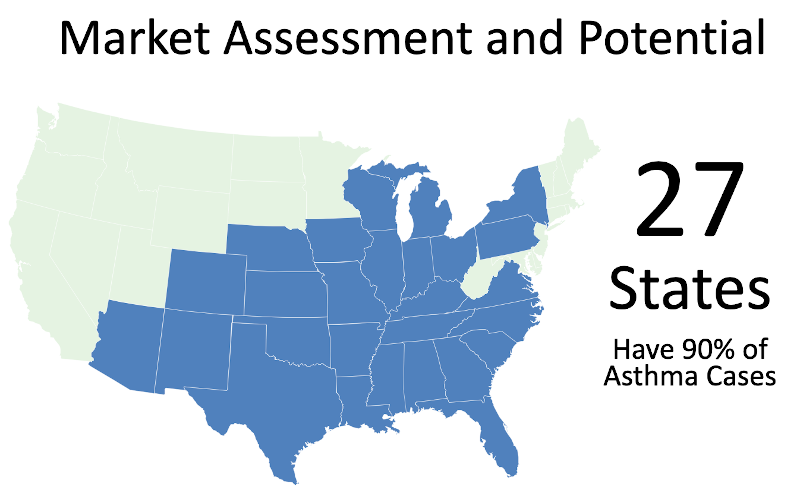
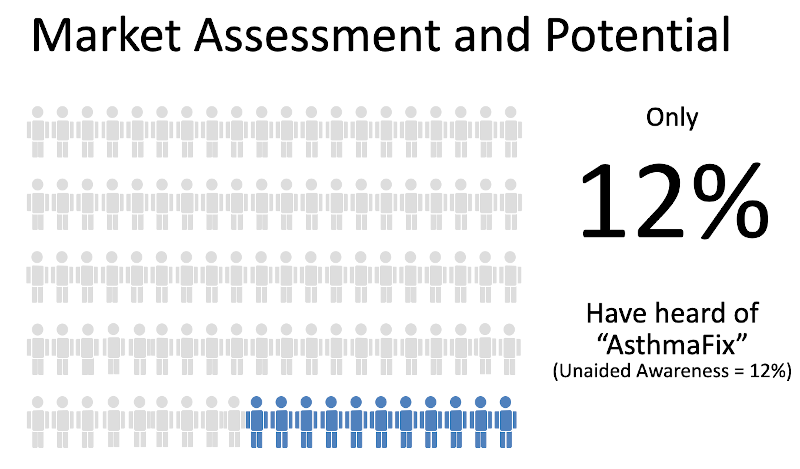
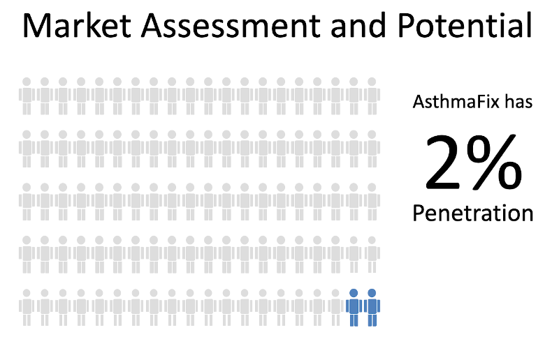
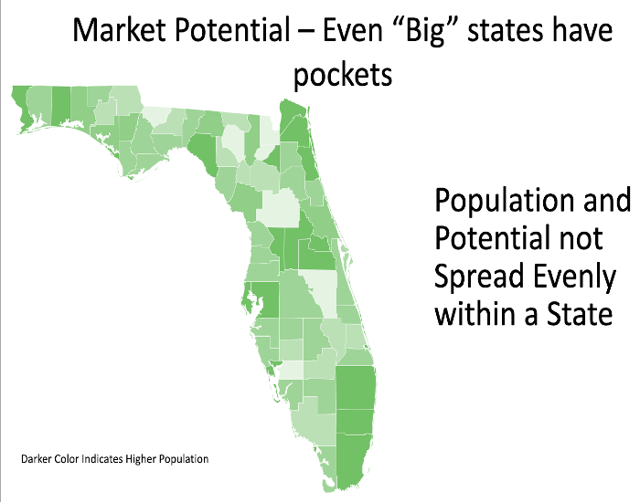
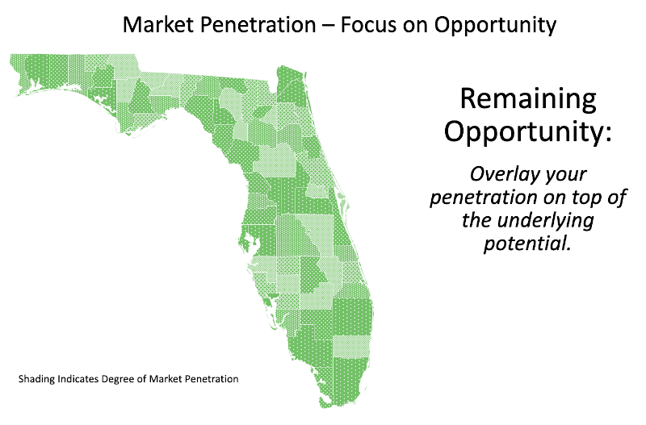
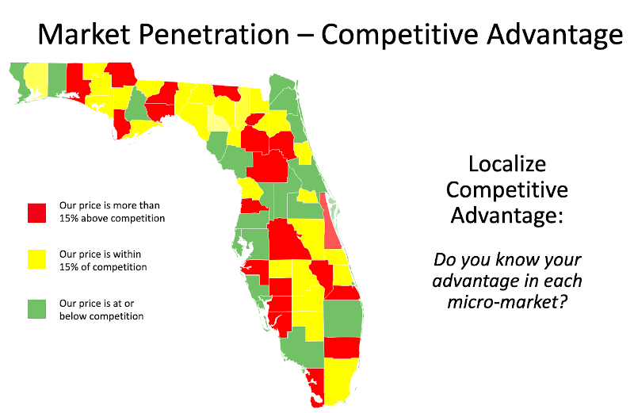
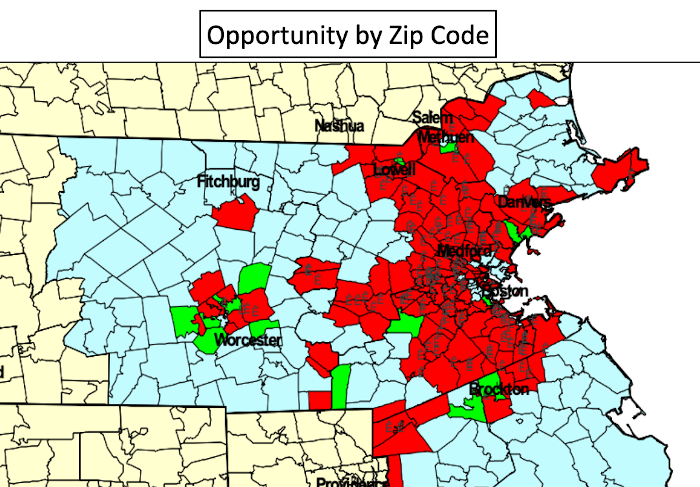

# Potential & Structure

One of the first steps that can be valuable in understanding the Sales or Revenue potential of a business is to simply understand the overall Market Potential.  In the following example we will start by looking at a situation where someone has a product called "AsthmaFix" that may have national opportunity.  So we might start by simply looking at the count of total people in the market place. 

Our example product wouldn't logically be promoted to those who don't have it.  So instead of the expense of communicating to 300 million, we might more logically target the 25 million asthma sufferer.  

(example only; do NOT use count as accurate) 
 
 

How might we find those asthma sufferer so we don't have to spend money to reach everyone?  Perhaps the western and mountain areas don't have the growth pattern of offending plants producing pollen.  Whatever the reason, we might look at the 'incidence' of the problem our product is going to solve and see if it might offer opportunity to target further. 

(example only; do NOT use count as accurate) 

## Penetration & Share

Once we understand the broad potential for our product, the potential for the 'category', we want to begin to understand how we fit.   One of the most basic measures that we probably need to do some primary research on is the extent to which our potential target even knows our product exist; what is known as [awareness](https://www.driveresearch.com/market-research-company-blog/what-is-unaided-and-aided-awareness-in-market-research/).   If you had a product like AsthmaFix, and your unaided awareness were only 12%, either you have not done much advertising generally (e.g. limited media placement) or your advertising message has not shown effective [stopping power]() and [persuasion)(../business/admath.md#persuasion-scores). 

When you are doing an awareness research, you should make sure you also collect information on people's purchase activity.  Make sure it collects how many, who, and how often people are using your brand; and let's say you find 2% are have bought AsthmaFix.  You need to also collect information on how often they buy in the category and what competitive products they purchase.  With this added information you can start to calculate your "market share".  If you happen to sell in a category through channels that are audited, like retail food/drug/mass merchandise, you can compare your study findings with secondary sources of movement data.  With a combined perspect you can see more about who your buyers are compared to others, if you ask about attitudes in your study you can learn about your and competitor psychograpics, you might ask about what triggers their asthma and product use so you can talk about your impact on benefits to their life from taking AsthmaFix, and more! 

Don't stop your targeting efforts only at the broad level.  You may only have incurred the expense of survey research at the nationals or multi-state level.  However, if you collected a good set of demographics or firm-o-graphics tied directly to the same questions and response structure of list sources you have in your targeting database or that you know in advance you can buy, you can link the findings from any survey question to tight micro-markets.  Will it be perfect?  No.  Will it be effective in improving your advertising effectiveness and efficiency?  You bet! 

Knowing where the opportunity is combines with knowing your own brand's status in increasingly focused markets is a game changer...

Ideally, as we drill down to look at our opportunity, we don't stop at just the "count" of prospects and their location.  If we know something about the local competition we can also bring that into the picture.  For example, one of the simplest competitive comparisons might be to get data on competitor prices in each micro-market.  How is our own market penetration compared to a competitor versus their price advantage or disadvantage?  Might we want to promote our price advantage where we have it by using hyper-local media approaches to point it out to potential buyers? 

We can utilize things like direct mail by zip code, even by block group or tighter with list source databases, to really focus our communication.  It costs money to buy data sources, develop databases, etc.  So we compare that versus the cost of "slippage" by sending the wrong people, the wrong message.  If you have a very broad appeal product for the masses you might not find the trade off balance toward tight targeting.  However, most organizations find powerful advantage from careful targeting. 

 
 
 

[Learn More - Business Chapter Index](/chapters.md#business)
