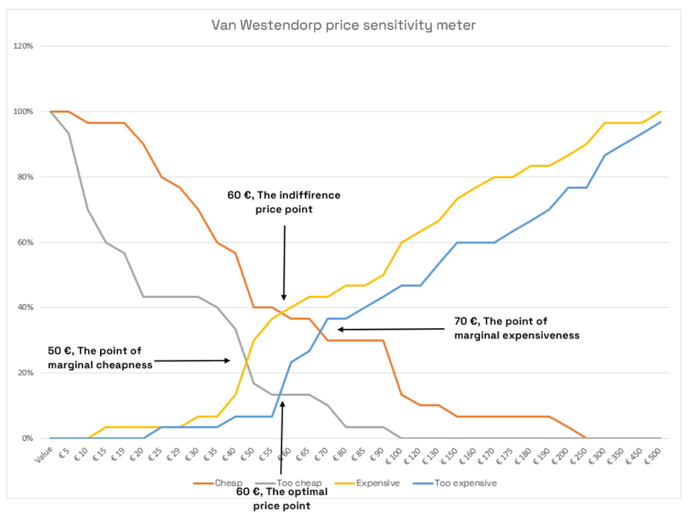

# Price & Elasticity

Pricing is one of the four marketing mix factors. The other three are product, promotion, and place (distribution).  Price is considered such a powerful choice influence that it is an underpinning of [microeconomic price allocation theory](https://en.wikipedia.org/wiki/Microeconomics).  Just how powerful price is in any given situation is what is behind the [Price Elasticity of Demand.](https://en.wikipedia.org/wiki/Price_elasticity_of_demand)  This is a fancy way to say that as you drop price you will sell more and as you raise price you will sell less; but in your real world you want to know the "how much more or less" part of that answer so you can model out the best price to use.

## More than Research

Later on this page you will find a bunch of Price Research information.  All that science can lead you down an expectation of 'hero solutions' on price from doing research.   Yeah, well sort of, but only to a certain point.  Throwing the kitchen sink in a single "best" price research study probably isn't going to be fully satisfying.  Conjoint can handle a bunch of options but isn't the best for pure price research.  Discrete Choice is the pure price research winner but you can't throw all the stuff you want into the mix.  More on all that later.

For now, what else might you want to consider?  From the marketers point of view, an efficient price might be the maximum that customers are willing to pay.  That is if we are maximizing profit margin?  But we really want to know the price elasticity; we want to get at the body count aspect as well.  With that we can maximize total profit? Maximum profit margin and total profit are two different objective.  So first we need to be clear on what objectives we want to optimization.  These objectives can drive research on the optimization point from price-volume perspective.  That is your "backdrop" to an answer, but alone it is not "THE" answer.   Price is part of the Marketing Mix Strategy. So we need to think about the fit of price in that overall strategy.

To use your understanding of price-volume wisely you really need to fit it into the context of an overall price strategy.  Chicken and egg discussion?  Not really.  Lets start with an example.    Your overall strategy may deploy tactical changes in price over various points in time.  Are you opening a new market and using a price discount to accelerate initial trial?  Research may have told you the price you wanted to level at post launch.  Your research price-volume findings can let you know the extent you can accelerate trial with an introductory price.  If you know your gross and net margins you know how much you can logically afford from a variable cost perspective.  If you know your repeat rates/volumes, and purchase cycle you can forecast the recovery time to payback the trial driving price discount you took.  A Price Strategy really should start by laying out your objectives and the tactical approach you might use to achieve some of them via price. 

## Price Strategy

Price strategy considers the interplay of many factors in the marketing mix; promotion being one example.  Your research may have guided expected response.  Your modeling of factors into economic optimization is the translation of your strategy into a combination of tactics.  Rough out a model of what you plan to do and drop in your best guess assumptions.  After you have the model draft in place, you can tweak the various assumptions and see which are really seeming to have an impact.  It is those, where your best guess should be replaced with specific research; but look at it this way, you have pretty clear research objectives doing it this way and your research guides will be much more productive. 

Pricing strategy really starts with your pricing objectives.  In preparing your over all plan have you considered:

 The overall objectives of the company. Is it to... 
    • maximize long-run profit 
    • maximize short-run profit 
    • increase sales quantity 
    • increase dollar sales 
    • increase market share 
    • obtain a target ROI 
    • stabilize market or stabilize market price 
    • demonstrate company growth 
 
 The objectives of your product or brand... 
    • motivate distributors and other sales personnel 
    • enhance brand image 
    • generate trial 
    • discourage competitors 
    • build store traffic 
    • harvest profits 
    • maintain price leadership 
    • desensitize customers to price 
    • discourage new entrants into the industry 
    • match competitors prices 

* Buyer price elasticity... 

 

## Price Tactics

It is nice to say you need to have a strategic plan with price tactics and associated assumptions.  However, it might be nice if we were a little more explicit in what sort of strategy and tactic approaches to consider.

▪ Fitting price in with the other marketing mix factors is key. 
-  Where costs to manufacture, distribution, and promote the product you are likely to have a higher price.
-  Where you are limiting product quality, where your distributors selling effort get your product in the face of the end-users with limited cost and effort, you may find low price aligns with the other marketing mix factors. But understanding price elasticity among your buyer may leave you plenty of room to charge more. 

▪ Nail down your price floor. Determine production factors like costs, understand variable costs, know your economies of scale, understand marginal cost, and degree of operating leverage.  

▪  Most basic is to challenge the assumption you are even going to use price as a marketing mix tactical factor. It is most common to do so but not mandatory it is a foot forward factor.  How visible do you want the price be? - Is price neutral? Not important in differentiating you offer., or is it highly visible?  Perhaps you are selling a commodity and promoting a low price is about all you have? 

▪ Price-Volume based tactics leverage price elasticity of consumer demand to your advantage.

- [Penetration Pricing](https://www.investopedia.com/terms/p/penetration-pricing.asp) - is typically used for Trial Acceleration – discounting at launch to gain volume quickly. 
  
- [Loss Leader Pricing](https://www.investopedia.com/terms/l/lossleader.asp) – may be the ultimate in Penetration Pricing where you actually sell below cost; at least fully allocated cost as variable cost isn't sustainable long other than short trial acceleration. 

- [Bogo & Related](https://happypoints.io/blog/top-optimal-solutions-to-implement-bogo-strategy-c1-sa-160/#:~:text=A%20BOGO%20strategy%20is%20to,item%20at%20a%20full%20price.) - is one type of discounting that might be used to generate trial or goose up retailer satisfaction with a brand by offering more units for a lower per unit price. 

- [Price Skimming](https://www.coursera.org/articles/skim-pricing) – discounting at the risk or point of a competitive product entry to block their success. This can be very effective if you know that in many categories of products there is an 18-24 month breakeven period from launch and you can make staying in the game painful for new entrants. 

- [Psychological Pricing](https://www.paddle.com/resources/psychological-pricing) – is the type of thing you see where something is $3.99 rather than $4.00 or you get the second item's shipping free if you buy two now. 
                    
- [Bundle Pricing](https://pagefly.io/blogs/shopify/bundle-pricing#:~:text=In%20a%20bundle%20pricing%2C%20companies,and%20cable%20TV%20channel%20packages.) - offers one of these at a discount when you buy one of these other things. It may make good sense for logical companion goods; e.g. graham crackers, marshmallows, and chocolate bars. 

- [Price Lining](https://courses.lumenlearning.com/wm-retailmanagement/chapter/technique-price-lining/#:~:text=Price%20lining%20is%20a%20technique,can%20support%20assortments%20of%20goods.) - offering a tiered set of price points for similar but slightly differentiated versions of a product/service. 

- [Price Discrimination and Yield Management](https://competera.net/resources/glossary/yield-management-pricing#:~:text=Yield%20management%20has%20been%20used,tool%20used%20in%20various%20industries.) - is the sort of pricing you see used by the airlines.  Different people have differing willingness to pay and the airline has a perishable good in unfilled seats; so they start offering seats at different prices given the very specific demand they are observing.br>

- [Premium or prestige pricing)](https://www.indeed.com/career-advice/career-development/prestige-pricing) - is the strategy of pricing at the high end of the range. High price is used as a signal of quality and appeals to ego self worth of a buyer.  It requires flawless performance but is a fix with a luxury brand promise that is being kept at every touchpoint.  

 

 When crafting your Pricing Strategy and Tactics, Ask if… 
--  prices should change by geographical area? 
--  there should be quantity discounts? 
--  the sort of payment used should be priced differently? 
--  you should Mirror or Beat prices competitors charging? 
--  your communication and distribution approach allows real-time pricing? 
--  there are legal/regulatory/contractual restrictions to how you price?  
--  the price action you take is likely to trigger a price war? 
--  you need to coordinate any joint product pricing considerations?  

 

## Pricing Research

Some methods of figure out pricing your product or service are rocket science like.  Before we go there, lets start with the more basic ones to see if they will do the job your your situation.  As we look at them we will disclose their warts so you have an idea if their limitation(s) are meaningful to your situation.

 

### Cost-plus

The most basic approach is to just 'cover your costs' plus some profit percent above that.  It costs you a buck to make and ship and advertise and whatever else you need to cover so if you sold it at a buck and a half you would make some good profit.  Don't forget that your selling price might be wholesale and that the retailer may add their own up-charge; maybe they sell it to the end-user for two bucks.

If what you are selling is a commodity with little specific advantage to what your version has, that basic cost-plus approach might be a starting point.   You probably will find some competitor quickly offering some lower set of numbers so that they can attract buyers away from you.  You might go into your costs of creating yours to look for ways to make it more cheaply so that you can lower your price and maintain your profit.  The competitor will probably respond and you have the 'race to the bottom'.  Good for the consumer to get the best deal on a commodity item but not so good for the manufacturer's profit.    You have discovered why people try to differentiate their products from others to [position](../business/positioning.md) as 'better' and seek more premium price advantage.

 

###  Historical Sales data 

Existing in-market product probably have seen some level of difference in the price their product was presented and can analyze shifts in movement that they may attribute to the price effect.  Obviously there is the caution that other market conditions may have been factors in differing movement; so do take this type of analysis casually.  ARMTEC, Inc. has been brought in after three major consulting firms failed to identify impacts in this type of analysis.  Having experience using tools from our technical health division work around signal-to-noise and applying Fourier Transform methods combined with disaggregated international country-by-country lag factor differences we solved a fortune 100's mystery in a matter of weeks.  If you do it yourself or you hire it done, when analyzing historical data look to both technical breath and a personality type typified by the scuba diver who can stay down examining the bottom three times as long with the same air tank.  Persistence and enjoyment of task count big time; way more than random statistical methods slammed through big iron.  

 

### Van Westendorp

Let's assume you believe you actually have a better product/service and/or that you have [Effective Marketing Communication](../chapters#chapter-effective-communication) that distinguishes you.  So are you going to go for that buck and a half commodity price?  No, what you have is something much more valuable.  But "how much more valuable" that just cost plus a little profit?

The answer to that question depends on just how much more valuable yours is.  Does it just clean a little better, taste lots better, or cure cancer?  Obviously you have worked through the [Need Gap perspectives of your target customers](../business/needgap.md, mapped out a [Value Ladder](../business/ladder.md) that supports your optimal [Positioning](../business/positioning.md), and proceeded through [Concept Development](../business/concept.md) and [Concept Testing](../business/conceptquestions.md) to pull forward your strongest case for value.  That work was all done with your end-user.  And it is your end-user who is also the judge or guide to saying what value they perceive or price they will pay. 

The [van Westendorp](https://www.forbes.com/sites/rebeccasadwick/2020/06/22/how-to-price-products/?sh=3864be4455c7) method of price research is straightforward in simply asking...

-- At what price would you consider the product to be so expensive that you would not consider buying it?  
-- At what price would you consider the product to be priced so low that you would feel the quality cannot be very good? 
-- At what price would you consider the product starting to get expensive, so that it is not out of the question, but you would have to give some thought to buying it?  
-- At what price would you consider the product to be a bargain - a great buy for the money?  

These questions are straightforward enough you may be able to figure out how to set up your own research using one of those online survey research systems.  You probably should go through the effort of including some other important stuff as long as you are doing a survey.  If you need help, contact ARMTEC, Inc. for a consultation at whatever depth you want.  When you collect the data, you need to crunch the number and interpret it.  Luckily, there is a fellow named Matej Luptak that published a wonderful ['how to' using Excel](https://themaykin.com/blog/a-complete-guide-to-van-westendorp-how-to-graph-it-in-excel) that produces the output in the graph below:

There are some issues with the van Westendorp approach.  One of the biggest is that it isn't very good for new products; more so new-to-the world, but the more novel or unique the less the people who answer have good enough context about the product to answer knowledgable.  However, it could be that you might want to start with this simple approach to sort of 'bracket' where you might be on price and then use one of the more advanced methods to refine price within more specific attribute messaging and purchase contexts.

 

### Concept Test 

We already talked about the standard [Concept Development](../business/concept.md) and [Concept Testing;](../business/conceptquestions.md)  even making note of the fact you should be doing these with price included as you measure [Purchase Intent.](../business/purchaseintent.md)  You can use this technique varying only price, or price and product. 
As we noted with purchase intent scores,  respondents to overstate their purchase intent. For the raw intent we noted how to adjust the respondents' propensity to overstate their likelihood of purchase.  And, for use in most pricing applications, the interest is more on the relative impact of price than on the absolute adoption levels. So the respondents' propensity to overstate their purchase likelihood is less of a problem.
There is also a practical and technical limitation of this technique.  From a practical perspective you wear out respondents clarity of choices if you do a whole bunch of alternatives.  From a technical perspective the math really seeks that several concept evaluations are independent of one another and that isn't realistic because respondents are inclined to compare a second concept to the first instead of considering its merits independently. Some of the error can be reduced in aggregate by rotating the presentation order of the concepts you present.

In the ideal use of this method respondents should evaluate only one concept at say five price points.  Now if you change the concept, you increase the number of respondents needed in the study for each one. Take a design with five price points and a minimum of 100 respondents per design cell and you already need 500 completed interviews.  Do that for each concept also being independent and the number of respondents pushes the cost way up.   And cell to cell comparison with only 100 respondents in a cell has a fairly wide confidence interval at statistically meaningful percentages.  So using some of the next methods, though technically more complex and probably requiring a research specialist, will likely be more cost effective and business guidance productive.

 

### Conjoint Analysis 

Conjoint analysis is likely where you want to be in the product design optimization phase of planning how to configure and communicate your product/service.  This is because with the use of an [adaptive conjoint design](https://sawtoothsoftware.com/conjoint-analysis/aca) you can handle a whole bunch of options.  And unlike the concept test with varying prices, you aren't overwhelming respondents with confusing comparative whole paragraph descriptions differing only by an an individual item level difference.  Rather, conjoint basically is a decomposition approach where you are presenting individual trade-offs; pretty real world in the sense that you do this all the time as a consumer as you shop.

There is another thing that is especially attractive about a conjoint approach; individual utilities.  You don't have to know the math behind utilities, what you care about is the 'individual' point.  One aspect of these utilities is that it gives you a real opportunity to understand order of magnitude power differences; why you care is that with the right underlying software deploying a study like this you can have it send additional rounds of responses for the more minor effects so you can actually get more solid, specific quantitative measures.  Where I have found this helpful is if I am considering a few alternative in-store promotion options and the other factors in the study so overwhelm the minor effects I couldn't distinguish between the in-store options comparative effects.   The other thing about individual utilities is that it gives you a chance to examine potential segmentation that may exist in the overall target population.  If segments exist you might be able to offer alternative brand/sub-brand options to capture more of the total market.  We had one client where this resulted in them moving from a fifth position rank in the market to tied for number one just by offering tiered product offers.  

One of the biggest issues with adaptive conjoint is that it is about relative rather than absolute preference.  That's good to say predict a market share.  It is not good in the sense it doesn't project to a market volume.  There are basic ways to get at market [Potential and Structure](../business/potential.md) and [Structure and Segments](../business/segmentation.md) but these are sort of point in time or requiring independent future projections.  In a lot of cases that's ok.  However, if the product/service you are about to put in the market is of a magnitude that it may change the scale of the overall market, you will want to move to the next technique.  Conjoint analysis is about share but not about the question of whether the carefully optimized product/service offer will be selected in a purchase intent sense.  If you were to lower the price your share estimate would change but you have no perspective provided by this type of research if the total number of purchases attracted to the market overall would also increase.  Regular conjoint designs also don't capture the interactive effect of price with product features often included in desired measures.
Conjoint analysis, especially the hybrid models like adaptive conjoint, are very powerful for product design and optimization. The individual level utilities also provide very good data for market segmentation. 

 

### Discrete Choice 

[Discrete choice or adaptive choice-based conjoint](https://sawtoothsoftware.com/conjoint-analysis/acbc) helps addresses the limitations. Discrete choice modeling captures price and brand interactions. It also projects to volumes.   However, since discrete choice sacrifices individual level utilities it won't pop segments.  Lots of times people are ok with not popping segments because they have structural segmentation already set up and/or have a K-means segmentation study they plan to run several concepts through. 
Another advantage of discreet choice is that it can seem more respondent friendly in an interview.    It uses fewer choices from each respondent.  Since the question it asks is "which product would you select" instead of preference on a point scale, the respondent task feels more simple. 
Discrete choice modeling is probably where you want to head for pure price research.  But the number of product features to be practically studied is limited to between 3 to 5 in addition to price and brand. Therefore is isn't as useful for product design research. 

If the focus of the research is both, we recommend using both. A hybrid conjoint can be used to develop the utilities for the product features. Discrete choice modeling can then be used to determine the utility for price and brand. In instances such as these, it is possible to estimate individual level utilities for the discrete choice levels of price and brand. This can be done using a bridging design. 

 

### Test markets 

At least for Consumer Package Goods (CPG) it is pretty common to launch a product into a test market or several in advance of a full roll out.  In those test markets you or your vendor already have worked closer with retailers to obtain shelf position, to perhaps display or coupon or conduct other in-store test, and probably to obtain movement data from them for with an in-store audit company acting as a proxy category capital/shelf auditor.  Since you have so many mechanisms already set up, it is likely you can leverage carefully matched test markets with different prices to do real, in market price testing.  This option is obviously well past the point of a conjoint study tuning product features with price relationship understanding.  You might think of test market price testing more likely around trial generation discounting and that sort of use of price adaptation rather than setting a running price.  But obviously existing products also manage price by monitoring secondary movement data reports, so there is no reason you can't flow naturally from the test market findings to setting a target post-launch price strategy.

 
 

[Learn More - Business Chapter Index](../chapters.md#business)
