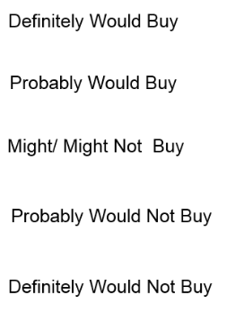

# Purchase Intent

## Measurement

The key to measuring purchase intent is to assure a proper stimulus.  In an ideal fantasy world this would be the actual product with full explanation of all use benefits clearly elaborated and a price with any adjustments provided.  With a new product we back down from that and show a fully developed advertisement or even a concept statement; but we never back down from showing the price.  This is because [price elasticity](../business/priceelasticity.md) is likely an important decision influence is intent choice.  In more sophisticated research we often include multiple price points being tested, any price discounting actions like coupons, BOGOs, etc. We even can consider using filter questions for store location adjustments by asking respondents their typical shopping aisle section visit behaviors.

What we ask after showing the stimulus is an intent to purchase question with this type of response scale.

## Top Two Box

It is common for organizations to establish hurdle rates for what percent of the survey respondents answer in the Very or Probably will buy [Top Two Box answers](https://help.honestly.com/knowledge/how-your-scores-are-calculated-top2-vs.-average).  In fact, this can be an important criteria in a [Stage Gate](https://slidemodel.com/stage-gate-process-for-product-development/) decision to proceed process.   That may make sense for an organization which has an organization advantage or skill in distribution through the Food/Drug/Mass Merchandise channels to a general population buyer set that they can't sort out very easily at point of purchase.  However, for many other types of businesses they have the potential to more directly speak to and deliver to highly targeted populations.  In those types of businesses it makes more sense to include very carefully considered demographic and list source targeting questions in the survey of purchase intent and simply align the top intent to purchase questions to these.  They you create an advertising and promotion strategy aim effectively and efficiently at the most receptive.

## Revenue Projection

[BASES](https://www.ashokcharan.com/Marketing-Analytics/~pv-BASES.php#gsc.tab=0)

You also need to generate interest in the product and this is typically measured via purchase intent on a five-point scale.  Purchase intent to actual purchase behavior needs to be calibrated for each point on that scale; the ‘do what you say you will do’ adjustment factor.  There are a variety of calibration approaches which need to be included and monitored in full data architecture design.

Core to this STM capability is to present a well developed product concept statement for consumers or employers to react to via a statement of ‘purchase intent’.  Purchase intent is gathered through a survey of members of the target segment for the product.

A well developed concept statement will be words much like finished promotional material would read.  It will clearly note a realistic price or price options for the product presented.  It will ideally be presented in finished quality.  This would include complete graphics and brand imaging elements; at a minimum, it will include Humana’s mark.

Interest in products will be measured via purchase intent scores.  The purchase intent scores will be collected from the survey research portion of the project on a five-point scale:
definitely will buy
probably will buy
might or might not buy
probably will not buy
definitely will not buy

The percent of respondents replying ‘definitely’ or ‘probably’ will buy is the basis for measuring expected product performance. Those answering ‘definitely’ will be valued with a three fold weight factor compared to ‘probably’ respondents. This recognizes the relative strength of commitment to actual purchase scene from survey intent to purchase statement responses.

Understanding differences in consumer interest in the feature alternatives at various prices can provide an estimate of the likely purchase pattern each of the seven options might expect to enjoy.  Direct comparison of the different purchase intent levels will be sufficient to guide this choice and can be collected as a foundational step of this methods development project as a way to save time and money.

What the actual STM development will add beyond the purchase intent measure is volumetric scaling. This means the ability to project the survey findings into to an estimate of contracts, revenues, and total profit.  The STM tool will relate survey findings to market demographics and network geographic information in this projection process.  The result will be a prototype database with a simple to use “what if” front-end that will allow performance scenario estimates to be projected and refined.

Through the methods development effort, the process of volume projection will be standardized so that Humana can improve consistency across all product options evaluated over time.  This establishment of a standardized process is viewed to be a key capability in systematically evaluating and prioritizing alternatives competing for Humana’s human and financial resources.  Doing so will help assure the best alternatives are receiving the most attention for expedient development and launch.

Methodology:

The general flow of the study design for this research project is anticipated to be --

I. Screener and Awareness Measurement via Phone.

II. Mail the Concepts to be tested to respondents.

III. Phone Questionnaire Follow-up.

Core to this STM capability is to present a well developed product concept statement for consumers to react to via a statement of ‘purchase intent’. A well developed concept statement will be worded much like finished promotional material would read.  It will clearly note a realistic price or price options.  It will ideally be presented in finished quality that includes complete graphics and brand imaging elements; at a minimum, it will include Humana’s mark.

Each cell will have the general eligibility requirements for access to the product; that being people who are age 65 and over.  Beyond that, any additional filtering of respondents will be done via the screener questionnaire which is part of this design proposal. The screening process will include data collection for all respondents, both qualified and terminated; the collected will be used in the full analysis of this project and is critical to retain and tabulate.  It is a critical element of effectively linking study results back to the total population, Census count information of the broad demographic group.

Projection of the survey results will be through Census counts of the Over-65 population.  That population will be available from a Humana developed database which maintains it at the county level.  The same database will maintain a list of those counties which define Humana’s Regional Networks, ChoiceCare® Network, and non-network geographies.  This will allow for projection of market volume potential for product alternatives by sub-geographic market area.

The screener element of this study contains a critical component measure of ‘awareness’ of Humana and select products.  Awareness, closely tied to the full Census demographic counts for projection scaling, is a critical component of a simulated test marketing (STM) model.  Only those who are aware of a product have the potential to buy it and media plans are built around this point in STM modeling.  Thus, while the main study will gauge purchase intent among those shown alternative concept statements, all of these individuals could not be projected to the full universe of Over-65 people to be potential buyers.  Rather, only those aware can be counted in a projection.  The screener collected awareness data will form a baseline in the STM and media planning alternatives will be used to evaluate the impact in sales that is likely to result from different levels of A&P spending.

When people are shown a concept for a product and asked if they how likely they are to by it on a purchase intent scale, they have a tendency to overstate the reality of their true purchase activities.  Adjustment norms are developed to correct this overstatement bias.  The challenge for STM development to forecast the potential of new products in the Health Services field is the lack of a normative database.  In the Consumer Packaged Goods (CPG) area, STM modeling enjoys the benefit of decades of prior projections being validated by category and country norms.  Thus, the current study will utilize an internal control group approach to derive the adjustment norms.  This control group will be managed as an internal calibration product concept within each of the seven Over-65 Pharmacy Benefit alternative cells.  The internal calibration product concept will be an existing Humana Over-65 Health Benefits product available in the broader ChoiceCare® geographic market area.  Utilizing ‘awareness’ for the calibration product collected from the screener, and the purchase intent scores which the product obtains with the survey, the normative adjustments of the purchase intent box scores will be balanced back to the actual Sales of the product in the measured markets.
As mentioned in the background section, the top box of the purchase intent scale will be weighted three fold the second box on the scale in this work.  This will be true for the STM volumetric forecasting and also for the selection of the best alternative for among the seven Over-65 Pharmacy Benefits products being tested.  The logic of the top to second box weighting is that while CPG norms differ by category and country in terms of the ‘level’ of the adjustment factor, there is less variance in the distribution central tendency or dispersion. Thus, the least risk calibration approach without waiting for the accumulation of decades of historical norms to be collected is to standardize the distribution curve of the normative adjustments to be similar to what is found in CPG situations, but to let the levels for Health Services products to float against the calibration product.

The table below shows a mock-up of the potential results and Phase II decision for which alternatives to continue further survey fieldwork on for more sample size to obtain appropriate statistical accuracy for decision making.   It shows that alternative-2 scores the highest adjusted top two box score with a 54.  For each of the other alternatives, a quick comparison of the “Top of Interval” score shows that all are below 54 with the except of alternative-6.  This means that alternative-2 remains within the statistical range of alternative-6 since its mid-point overlaps the 95% confidence interval defined range of that option.  In the example shown, the decision point to move forward only alternative-2 and alternative-6 for additional surveying is done on a one-tailed test.  A two-tailed test would imply a +/- 6% spread on both the bottom of the highest alternative and top of those alternatives that it is compared against.  Under this more rigid test criteria, in the example table alternative-2 having a “Bottom of Interval” value of 48% would be compared to the “Top of Interval” level for the other six; only alternative-4 and alternative-7 drop out of this more rigid test.   We would keep surveying for each of the other alternatives.  A decision on the final criteria cut off levels and which alternatives to continue further interviewing on, will be made at the time ‘marginal counts’ are delivered from the first hundred interviews for the original seven options being tested.

					      Over-65 Pharmacy Benefit Alternative
                
From (CONCEPT VOLUMETRIC QUESIONNAIRE DRAFT)

It is anticipated that this study will be carried out via a phone-mail-phone fielding sequence.  Phone for a screening interview, mail the concept statements to respondents who agree to participate in the second step, and phone call-backs once the concepts have arrived.  The implied timing issues of this approach are recognized and Phase-I research needs to proceed immediately to allow sufficient time for the phone-mail-phone sequence and the fact select alternatives will move to a Phase-II process of additional interviewing.  Bids for this execution of this study need to explicitly note a timeline commitment. 

It is also possible that during competitive bidding, that the alternative of Internet interviewing will be considered.  If an internet option is selected, it will utilize an interview flow leading with the awareness data collection elements of the screener and sequence to avoid potential influence of the screener questions on the purchase intent questionnaire elements of the main survey component.  The screener qualification series must also fully acknowledge collection and tabulation of all data from screened as well as full study participating respondents to support the STM model purposed of this study.

A positive of the internet option is better security of the concept statements being used in the research than what is physically mailed.  The negative aspects of the internet approach is concern over sample frame skew among seniors who can’t be assumed to have ubiquitous high speed connections, needed to display highly graphical promotional concepts, is uniformly across all senior age groups.  Bids recommending internet fielding must address how these limitations will be managed.

Study Flow and Information to be Collected:

PHASE-I

Seven Over-65 Pharmacy Benefit Test Concepts (100 Interviews per cell, 700 total Interviews):

I. Screener and Awareness Measurement.
Awareness of Carrier
Awareness of specific product
Screener (by product eligibility requirements for all respondents and confirming Humana product use for Control Group.
Current Product Carrier and Product (for share calculation in internal control logic)

II. Mail the Concepts to be tested.

III. Phone Questionnaire Follow-up.

Seven Over-65 Pharmacy Benefit Concepts, each with a Second Existing Product Calibration Concept for STM purchase intent control adjustment back validation.  Both concepts in each cell will minimally include the purchase intent measures for both and enough diagnostics for the calibration control concept that it is not obvious to the respondent which the test and which is the control concept.
	
Five-point purchase intent scale
Number of units would purchase (individual, spouse, etc)
Six-point intensity-of-liking scale
Five-point value-for-the-price scale
Five-point new and different scale
Diagnostics (strengths, weaknesses, attributes)
Current Product Use (reconfirm or minimally link in from screener response to those will full survey record from follow-up questionnaire).
Demographics

PHASE-II

Three run-off Over-65 Pharmacy Benefit Test Concepts (500 Interviews per cell, 1500 total Interviews):

I. Screener and Awareness Measurement.
Awareness of Carrier
Awareness of specific product
Screener (by product eligibility requirements for all respondents and confirming Humana product use for Control Group.
Current Product Carrier and Product (for share calculation in internal control logic)

II. Mail the Concepts to be tested.

III. Phone Questionnaire Follow-up.

Three Over-65 Pharmacy Benefit Concepts, each with a Second Existing Product Calibration Concept for STM purchase intent control adjustment back validation.  Both concepts in each cell will minimally include the purchase intent measures for both and enough diagnostics for the calibration control concept that it is not obvious to the respondent which the test and which is the control concept.
	
Five-point purchase intent scale
Number of units would purchase (individual, spouse, etc)
Six-point intensity-of-liking scale
Five-point value-for-the-price scale
Five-point new and different scale
Diagnostics (strengths, weaknesses, attributes)
Current Product Use (reconfirm or minimally link in from screener response to those will full survey record from follow-up questionnaire).
Demographics

Data Tabulation:

Screener Collected Data –

Awareness Measures-Company:
Top of Mind Company Awareness
Unaided Company Awareness
Aided Company Awareness

Awareness Measures-Product:
Aided Awareness Over-65 Pharmacy Benefit Product (ghost measure calibration)
Aided Awareness Humana Control Calibration Product
Aided Awareness Competitive Over-65 Pharmacy Benefit Product(s)
Aided Awareness Competitive Product within Control Calibration Product Type
Aided Awareness Bogus Product within Control Calibration Product Type (bogus measure calibration)
Insured Rates:
Uninsured Rate
Type of Coverage Rates
Carrier Company
Carrier Product

Product Understanding:
Product Features by –
Type of Coverage
Carrier Company
Carrier Product

**************************

Screener and Awareness Questionnaire:

Are you or anyone in your home age 65 or over?

___Yes		___No  Thank and Terminate!

Which of the following statements best describes your personal involvement in the choice of health care coverage for you:

___ I am the decision-maker when it comes to health care coverage (			CONTINUE)
___ I share health care coverage decisions equally with my partner or
spouse (CONTINUE)
___ I share decisions with my partner or spouse, but I am the primary
decision-maker (CONTINUE)
___ We share decisions, but my partner or spouse is the primary decision-
maker (ASK TO SPEAK WITH DECISION-MAKER OR TERMINATE)
___ I am not at all involved in the decisions regarding my health care
coverage (ASK TO SPEAK WITH DECISION-MAKER OR TERMINATE)
___ Don’t Know/Refused (TERMINATE)

Are you or anyone in your family employed by –

___ An advertising agency or the advertising department of a company
___ A Marketing Research Firm or the marketing research department of a company
___ A company that publishes a magazine or newspaper
___ A company that operates a television or radio station
___ An Health Insurance Company or firm that sells health insurance 
___ A Hospital Management company
___ A health care provider such as a physician, hospital, nursing home,
 	    medical clinic, or other type of health care product
 
If employed by any listed, Thank and Terminate! Otherwise continue.

Please tell me the name of the Health Insurance Company which first comes to mind? What other Health Insurance companies are you aware of?	Have you ever heard of (READ LIST)?

     First   Unaided  Aided
___     ___      ___ 	Aetna
___     ___      ___	Anthem
___     ___      ___	Blue Cross/Blue Shield
___     ___      ___	CIGNA
___     ___      ___	Harvard Health Plans
___     ___      ___	Humana
___     ___      ___	Kaiser
___     ___      ___	United Health Care
___     ___      ___	Wellpoint
___     ___      ___	Other: _______________________________
      (Specify)

Now I would like to ask you about specific Health Insurance Products offered by various companies.  Have you ever heard of the following?

Humana Test Product(s) (ghost measure calibration)
Humana Control Calibration Product
Competitor Product(s) around both the test and control
Bogus product(s) to gauge the error band of false awareness

Are you currently covered by some type of health insurance, or not?

___ Yes
___ No, Skip to Q????

Which of the following best describes the type of health insurance you have?

___ Medicaid
	___ Medicare only
	___ Medicare supplement
	___ HMO
	___ Some other type of health insurance

What company currently provides you Health Insurance coverage?

___ Aetna
___ Anthem
___ Blue Cross/Blue Shield
___ CIGNA
___ Harvard Health Plans
___ Humana
___ Kaiser
___ United Health Care
___ Wellpoint
___ Other: _______________________________

Can you tell me the name of the specific product you have with (insert company from Q6)?

___ YES, Record Product Name ______________________________________
___ NO

I am going to ask you about the Product Features of your health insurance product and would like you to tell me about those you know.  For those you don’t, simply say I don’t know.

Your Plans Co-pay for a routine doctor visit  $_____________, Don’t Know
Your Plan’s Co-pay for an emergency room visit$_____________, Don’t Know
Your Plan’s Co-pay for a hospitalization      $_____________, Don’t Know
Your Plan’s Individual Deductible amount      $_____________, Don’t Know
Your Plan’s Family Deductible amount          $_____________, Don’t Know
If your plan covers drug benefits?    ___ Yes, ___ No
If your plan covers vision benefits?  ___ Yes, ___ No

Concepts Mailed in Envelop with the following statement imprinted on the outside:
_______________________________________________________________________________
By opening this envelop to participate in the following survey for _________ Research, you hereby agree to keep all information about the survey, including the products and concepts being tested, completely confidential and            further agree not to disclose such information to any other party nor to attempt to copy, print, record, or download any information from this survey.  As to members of your household, you agree that they are also under this same obligation of confidentiality.                                                                       ________________________________________________________________________________

[Purchase Intent Questions](../business/conceptquestions.md#example-concept-test-questionaire)

