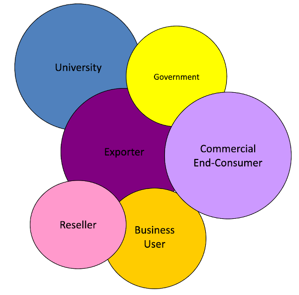

# Structure & Segmentation

## Segmentation/Targeting/Profiling
Segmentation is nothing more than acknowledging individual differences.  In marketing approaches that are more one-to-one you actually do uniquely address individual customers.  Think, for example, of selling business-to-business as an engineering job-shop who designs and builds manufacturing lines for their customers.  Where you utilize a face-to-face salesforce you get closer to one-to-one but still tend to 'group' prospective customers on some bases; say calling on Dermatologists for a skin care product rather than all physicians.   Digital advertising and promotion methods are also increasingly one-to-one is dynamic adjustment to unique customers depending on the sophistication of the techiques we employ.

Common ways customer segments are grouped include - 

  -  Behavioral: Group buyers based on what they purchase in the past 
  -  Descriptor: Group potential buyers based on characteristics of like buyers (demographic/firm-o-graphic) 
  -  Needs/Process: Group potential buyers based on how and why they buy (psychological/functional/economic) 

The purpose of leveraging this segmentation is basically intent upon achieving  

  - Product = Right Product for Target 
  - Price = Presenting Value Consistent with their Perceived  desires to Maximize your Profits 
  - Promotion = Saying the right stuff to the right target 
  - Place/Distribution = Delivering it to them with the most effective channels 

There is a [huge body of resources on segmentation](https://guides.loc.gov/consumer-research/market-segments).  These are mostly on methods and processes.  From a practical standpoint, the two most important things you should consider if you pursue any type of segmentation research are ... 

  - Don't just describe, find the targets.  When you see the collection of a list of things like demographics in a survey, make sure that the nature of the questions and the response buckets are matched identically with known third party data sources.  Census is a good one because you can then align your survey result data with it and project your findings to a larger universe.  Also, find list sources that you might use and align with the measures available on the lists; then you can target activity the matching subgroups your survey points to. 
 
  - Remember that when you collect something like a 'purchase intent', you don't need to just note the top box and top two box score your product or service achieved.  Rather, you want to take the top box people (Definitely will buy...) and find those who match them.  As long as you can use your findings to efficiently target exactly those who are raising their hand for what you offer, you are likely to have a solid business. 

## Basics

If you got here as a skeptic around this crazy segmentation stuff, at least consider basic structural segmentation.  Know who the buyers are of the category you are selling into and their relative size is terms of sales impact. 

## Who/What/How

If you might be more open to Market Segmentation being important, consider some key reasons.  For all intents and purposes, when we examine our [market potential](../business/potential.md) we drilled into geographically localing to tighten our targeting and increase the efficiency of our advertising and promotion.  However, tighter focus on "WHO ARE YOU GOING TO TALK TO" is really only the first level benefit of segmentation.  Remember, the most powerful lever of profitablity is really [how persuasive is your communication](..//business/admath.md#persuasion-scores).  Therefore, lets consider how segmentation addressing "WHAT ARE YOU GOING TO SAY" and "HOW ARE YOU GOING TO SAY IT". 

Here is an example where we have identified five attitudinal segments. From our [value ladder](../business/ladder.md) world, what higher level benefits they seek.  Some seek "fun", others "speed", still others "efficiency", etc. 

Our [value ladder](../business/ladder.md) painted a picture of how we might emphasize certain message elements and support them with underlying features as reasons-to-believe.  All good, however, before we start developing list sources and targeting methods to reach and deliver these focused messages to the right segment members, one of the first things we should know is just how prevalent is each segment. 

When we conducted our research to determine our segments, we also made sure to ask what product features the respondents considered most important on some scale.  We also asked them how much a product's features actual performance was perceived to be from a description or concept or mockup of our product and it attributes.  Then we plotted these two factors against one another and looked at how members of different segments answered.  We learned that if we wanted to position our message laddering up to "fun" the reason-to-believe support point of our product's "style" should be emphasize. 

Looks like the "speed" seekers need a strong package insert documentation along with just calling out the basic features of our widget.  We should make sure the copywriter preparing our documentation knows to emphasize the speed of how easily one can get going with our product, how fast it is to maintain, how quickly we get the job done using it, etc. 

The "endurance" seekers focused on the "quality" of our product and we call out these type of features as reasons-to-believe when aiming to reach them as our target. 

Looks like the "effiency" seekers are true to their basics; "don't give me a bunch of wrap around stuff, let's focus on the core features of the widget itself. 

Ok, so I might sort of buy into all this attitudinal, emotional segmentation craziness.  But are attitudes about basic things all that different?  Like why should I [value ladder](../business.ladder.md) when my product is a "health solution"?  Doesn't everyone just think their health is important and that is enough for me to talk about?  Think again their oh skeptical one!  Some people focus on "food/diet" as the definition of how they think about health.  Other people are all about "exercise".  Some just think about "what to avoid" and they will be health; like stop smoking and pour one less beer.  Still others just throw their hands in the air and think their health is "preordained by their genetics" and you better think about softly treading your message if that is your target segment.  

Yeah, yeah, so health is multifaceted.  But I have a simple food product which is just one of those health circles so I am done right?  Think again ole swamy!  So you must be in the "well, illness, feed good" segment area about food; "you eat just to prevent illness (scurvy), and as long as you don't burp it up (digestive) you are happy". Guess you never heard of athletic types closely managing their diet for "performance".  Perhaps you never read any of those women's magazines and all their tips about "better looking" skin, nails, hair, etc.  You really forgot that certain religions mandate various dietary practices?   

## Market Potential Link

### How Valuable
In our discussion of [market potential & structure](../business/potential.md) we started with a geographic example with differing level of prevalence for asthma. We started by broadly segmenting our market by regions of the country having a higher incidence of asthma.  We moved through state, county, and zip code geographic segment targeting with consideration of incidence, our own brand penetration, and even competitive price differential.  All this was to further pinpoint opportunity. Most of that approach was focused on "How Valuable". 

### How Receptive
We did introduce into that thinking the consideration of price advantage.  No matter how sharp or flat our [price elasticity]() low price is likely to influence how receptive a buyer is to our offer.  Since we noted that [persuasion](../business/admath.md#persuasion-score) is the strongest profit performance lever lets look more deeply into how we might make our [message relevant and different](../business/needgap.md) in that AsthmaFix example.  

Let's assume we did a value [ladder](../business/ladder.md) for our fictious AsthmaFix product.  Let's assume we have a [list source](https://www.leadsplease.com/) that claims to have an index which scores interest in health.  We have done our survey of AsthmaFix brand awareness along with both a [purchase intent]() score and a battery of high level [emotional reward and personal value](../business/ladder.md#a-continuity) attributes. And, of course we collected brands used along with their buying frequency to calculate AsthamFix [penetration rates and market share](../business/potential.md#penetration-&-share).

We bring these facts together and we discover that the [low market penetration](../business/potential.md#share-&-penetration) we reported relative to awareness may NOT have been the result of a low level of media spend and exposures; but likely the result of people not having their 'ears up' to our historical pattern of selling "health" as the positioning message for AsthmaFix.  When most of the market first thinks of their asthma in terms of its higher level impact on their energy, performance, serenity, and even appearance just directly talking "health" is missing top level connections to potential buyers.  Shift our message to these and we are likely to engage the market more directly; [stopping power and persuasion](../business/needgap.md) depend on 'relevance' regarding something buyers value as important. 

 
 
 

[Learn More - Business Chapter Index](/chapters.md#chapter-business-basics)

