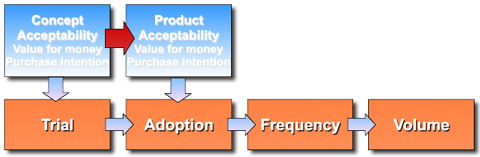
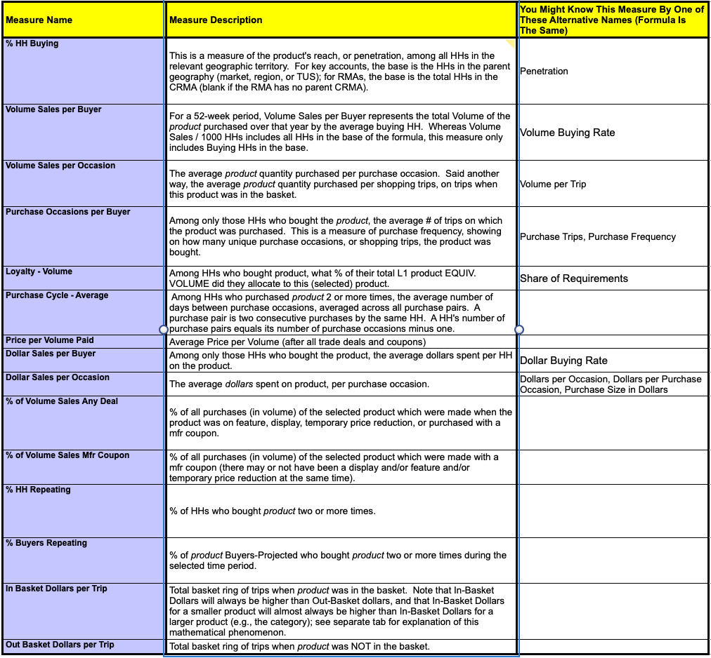

# Volumetric Modeling

Understand that there will be some uniqueness to exactly how you will model volume projections for your specific business, product, or service.  However, the example provided here intends to provide the basic factors you should consider and how they fit in mathematically.

## Market/Segment Size

Start with developing a measurement or estimated projection of how many people there are that would buy or use what you offer.  For this, think 'all in'.  Like everyone knew about it, liked everything about it, could find it without issue, didn't cost them anything monetarily or otherwise, the wouldn't be ridiculed or ostracized for using it, etc.   Think like if you are selling food, how many mouths are in the geographic area you will sell; if you are selling shoes, how many feet; etc.  Often times you can go to Census data and get counts of population by geography and further focus it down by age, gender, home type, education, or whatever else may be known to focus on your segment (keep track of this because you will use the same type of consideration for target marketing to reach them).

-- Gross Demographic Universe

-- Gross Eligible Target

-- Service Area Eligible Target

## How much/many

From the basic body count type of information you need to think about how much they might logically buy a good or service of the type you offer.  If you sell air to people who live underwater you can probably figure out they use it everyday.  You can probably even figure out the average number of breaths and lung volumes and get really close to specific use numbers.  If you sell hotdog buns it may not be as easy and you may need to carry out some research.  You really can just go look at hotdog sales because people put brats in them too or they eat a naked hotdog without a bun.  So you need to find out reasonable ways to get at consumer behavior consumption patterns. This is often research but might be industry records if you are entering an existing category.

-- Category Purchase Depth

## Buy your offer?

Of course you think what you have to offer the market is brilliant and everyone who knows about it will want it.  We burst that bubble by doing a [Concept Test](../business/conceptquestions.md) with a [Purchase Intent measure;](../business/purchaseintent.md) and know to discount stated intent for actual real purchase behavior.  But we can take our target segment body count times the adjusted purchase percents for a buyer count and use the how much to get a full saturation volume estimate.

-- Interested Viable Target

## Exposed/Aware

The section on [Advertising and Promotion Summary](../business/admathsummary.md) outlines the important concepts about how you use these to convert the exposure obtained from a media purchase buy into 'aware' potential purchasers.  Each step of media placement efficiency and the persuasion power of you message is critical.  However, the one additional factor you will need to fold in for good volumetric model is 'time'.  Think about it in the sense that just because you have a media plan doesn't mean it all unfolds day 1 or just because you have a distribution plan doesn't mean it is in every store day one so the consumers you did make aware can actually find it.  Rather, you want to create a build sequence minimally by month and more ideally by week.  This then is used to translate the interested viable buyers into interested and aware and who can actually find the product when they look counts!

-- Aware Viable Target

-- Time Appropriate Viable Target

## Trial 

So we now have a body count of people in our target segment, who we know logically have intent to purchase if they know about our offer, and they do, and we know some percent of these can actually find it in the store.  From this we would logically be able to estimate 'trial' in the first week.

We feel pretty good about our initial trial estimate because remember, these people bought on the "promise" made by our brand in its advertisement and that advertisement is a direct reflection of the concept statement we tested for purchase intent.  Where we may be paddling against the current is in regard to how well we "kept the promise".   If our product really does deliver on the promised attributes and experience, then people will buy again, the will repeat.

Since you didn't fall off the turnip truck yesterday, you are one smart business person and you know the importance of holding the product distribution in the stores.  If your advertising is building over time, all those promised buyers are exactly breaking down the doors in the first few weeks.  So your store managers are getting nervous.  The stockers are watching your shelf much because it is slow to empty.  That's not good.  So to goose up the turns in your initial stores, you are also adding in-store promotions to your advertising in your full media mix.  You have dropped in Displays, you are sending in your own Merchandisers, you are using Self-talkers, you have those instant coupons on the shelf, the carts, and you are leveraging 'free standing inserts' from your retailers.  	

You may need to obtain store traffic information along with your ACV distribution build tracking so you can account for this initial volume boost.  May be just a nice bonus override, but if you are also scaling your production to build and have limited inventory buffer, you need to chose your investment options wisely. 

## Repeat Rate/Depth/Cycle

To scale volumes you are going to need to move past just the trial build to also layer in the repeat.   This is where you consider what percent of those who tried the product purchase at repeat, how soon and how often, and how much.  Repeat Rate is the percent who buy again and you really measure this as a first, second, third, etc. repeat because the front-end percent dropped off and stabilizes.  Same with the how much at each of these repeats, there may be different patterns that emerge; could be they tried small amounts but more because they really liked it.  Could be less because they tried when you dropped a discount or coupon and they only stock up when they expect another discount.   The purchase cycle is the time in between purchases and it generally will stabilize toward true consumption rates over time; but may bounce around while you toy with in-store promotions early in launch.

-- Trial Rate @ Price Point by Feature driver 

-- Purchase Depth @ Price Point by Feature driver 

-- Renewal Rate @ Price Point by Feature driver 
  

Your in-store promotions, especially coupons, track like a special form of [price-elasticity;](../business/priceelasticity.md) and if you use a more advanced form of testing in your positioning work, you will have included not only price-elasticity itself but various types of in-store promotion effects in a discreet choice model study.  People doing this is not terribly common because the macro level effects aren't that large.  However, the tactical effects to hold early store distribution can be critical.

## Price/Margin/A&P Expense

The consumer counts translated to consumer takeaway under the store count, media plan exposure, and in-store promotion actions gives you volume estimates.  You can use the price and promotion discounted price conversion of these volumes to get to a revenue number.  And by tracking the costs of the media plan and in-store tactics as expenses, you can combine them with [COGS](../business/cogs.md) to move from gross-margin to net-margin estimates.  And, now you sort of have a stimulated test market model of your launch.  If you have done this up front, you also can take the input numbers and make them the functional area goals you put into the incentive compensation plans you use. 

## Retailer Perspective

As a side note, our modeling considers product availability or distribution [(ACV)](../business/glossary.md#--a--) to adjust volumes for our consumer's ability to find the product.  However, retailers themselves have their own perspective on the products on their shelves and it can be helpful to understand that.  Pretty much all retailers think about 'turns'; the number of times over a period of time that they sell the item taking up their space.  More turns, more money in their pocket.  But more sophisticated retailers translate that much further.  They are sort of like a real estate business.  So they want to understand the profit per linear or square foot.  That considers the size of the facings, depth of stock, profit per item, turns, and manufacturer concessions (and you thought you got those in-store promotions, slotting allowances, and free standing inserts out of the kindness or their hearts!).

## Measures

A good number of the measures described are very standard in the Food/Drug/Mass channel businesses.  Those businesses are heavily audited by panel data companies who you can turn to for service.  They are not only good at providing you with data but will guidance on interpreting and using it.

 
 
 

[Learn More - Business Chapter Index](../chapters.md#business)
