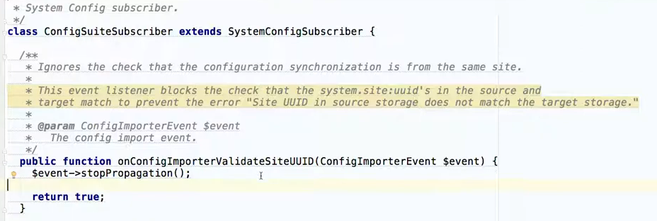
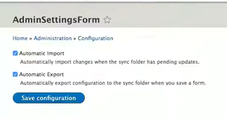

# UUIDs: Friend or Foe

#### Wonder why we have only populated the one configuration subdirectory?
You may have noticed that the process outlined has introduced and even specified differences in modules and configuration settings unique to different environments but never actually branched them into existence.  Oh sure, we set up subdirectories to house their unique configurations.  We even installed and enabled the config_split module where we named the splits and pointed at the subdirectories.  Yet, we still only have one subdirectory, /config/sync that is housing the yml files output by our  config export; `lando drush cex`.  

#### The reason
We didn't do those thing because we aim to essentially clone all the stuff we have done as a jumpstart for new websites.  However, we can't just install a new Drupal website hosted by Platform.sh and pull our code down from GitHub.  Yeah, crazy as it sounds, Drupal stops you from using such a clone.  When I first discovered this about Drupal I thought this must be a trick or something.  Conspiracy theories raced through my head… "Open Source my foot, now I know how they get you… bet they sell you a secret key or something".

#### The real reason
Eventually I learned about something called a UUID that is part of the file structure within Drupal.  These are unique codes, actually Universal Unique Identifiers, [UUID](https://en.wikipedia.org/wiki/Universally_unique_identifier).   Actually, they aren't just a Drupal thing.  The discussion about their use as keys for databases is probably the most coherent.  First, I like to think about these UUIDs as stuff in your database fields, in tables, which point at each other and the code in your applications points at at the right spot to read and write information.  Second, more importantly, UUIDs are used to keep you from doing stupid mistakes like trying to pull from some Drupal database you have developed for one purpose or client and mistakenly trying to connect your code from some other Drupal project.  You can see the value of not being stupid about this given you are going to be daisy chaining your 'local', 'develop', 'staged', and 'main' environments; you want code from the branches represented at the right place and the right time.

#### Instead of what I am doing here, isn't Drupal dealing with this?
While preventing stupid is a wonderful idea, it also creates a problem.  Drupal is aware of that problem and trying to do something about it.  Just like you and I, they agree it would be really helpful to people if they could just copy some other Drupal project and use it as your starting point.

An Initiative about [Starter Kits](https://www.drupal.org/about/core/strategic-initiatives-distributions-and-recipes) has been thrown around but it seems that the terms "Distributions and Recipes" is what is sticking with the Drupal crowd.   That is cool.  I have even enjoyed jumping on with those team members and hearing their thoughts.  I wish them every bit of luck. But even if they are fully successful, it will add to rather than replace where you are up to here.  The reason is that they are working to do what they are doing with Drupal, not with containers, Git Version Control, CI/CD processes and hosting.  When they launch their results, you will probably just take what you are doing here and add some stuff to your Composer.json file to get even a longer jumpstart.

In the meantime, we are going to make our approach of reusing a well crafted starting point over and over again.  To do so, we will leverage some workarounds for the UUID issue.  It really isn't abandoning the safety they provide, it is acknowledging that the CI/CD GitOps workflow processes themselves are a safety approach and using both safety nets can tangle.  So we opt for our workflow management approach which then allows our starting point to be cloned pretty much in the same way as most Git Repositories.

## Introducing the Config Suite module
The approach we are going to use is to leverage a contributed module called Config Suite.  This module has a secondary intent of dealing with the UUIDs and a primary intent of automating those config-export (drush cex) and config-import (drush cim) steps; we will get to those momentarily.  First, the way this module deals with the UUIDs is NOT to change them but to simply ignore them.  There is an [appendix](../cicd/changeUUIDs.md) which offers an alternative approach of the changing option.  The way that Conf Suite ignores the UUIDs is by doing a little php magic that extends Drupal's basic configuration of "SystemConfigSubscriber": 

No more php lessons, just the point that the yaml files you import from Git Cloning the starting point and the brand new Platform.sh Drupal Templated site you will import them into are doing to have different UUIDs if you have any reason you care.  And if you do, go to the appendix and just use the alternative outlined there and change them. 

Install and enable the Config Suite module with composer and drush like we have been doing with the other modules:

`lando composer require drupal/config_suite` 
`lando drush en config_suite`

The primary intent of the Config Suite module plays in to our workflow plans too.  We have shown a number of times already how you should expect to do a 'lando drush cex' from your local version of your site to get the changes you have done during development into yml files and then commit/stage/sync them in VSCode to get those into the platform.sh hosted branch you are working from.  If you think about having to 'cex and cim' all the time, you know your will be doing it all the time.  And the author of the Config Suite module points out in a video where he discusses it that he got into computing because the logic is that the computer should automate stuff you do all the time.  After you install and enable the Config Suite module and go look for it in the Administration menu by your Configuration Synchronization or Configuration Split options, you will see these simple options:

Cross-checking our Config Split table, we see that Config Suite is one we will set differently by split.  We very much want to automatically export our configuration in the 'local' and 'develop' environments. So every time we do any updates locally and commit/stage/sync them to hosted 'develop' the two are automatically updated.  When we merge 'develop' into 'staged', we are also happy to have 'staged' automatically import any configuration files that came along and get them into the active database for that environment; but not so as far as exporting the updated configuration to files.  I think we want to use the 'staged' testing environment as one where we first run our tests, review them, and make our export a manual step of that workflow approved release; so automatic import 'on' but NOT automatic export.  Our Config Split table shows automatic import and export 'on' in the 'main' or production split but we might debate that depending on our workflow preference protocols.  You definitely want automatic 'export' on in 'main'  because that environment is what we consider the ultimate source of truth.  When we need to go back to the starting point and grab a fresh start, our aim is to use 'main' and start branching.  So main should have the live environment's configuration available in yml files and having them automatically exported makes a ton of sense.  Since we are doing a manual 'export'  of 'staged' after testing, it should be ok for that to automatically be imported by 'main' as we merge 'staged' into it and the table is shown that way.  However, if you want an additional safety net, you could make 'main' automatic export but not import.

A video on the [Config Suite module](https://www.youtube.com/watch?v=02IJGgGPBAw&t=112s)!

[- Next -]()
