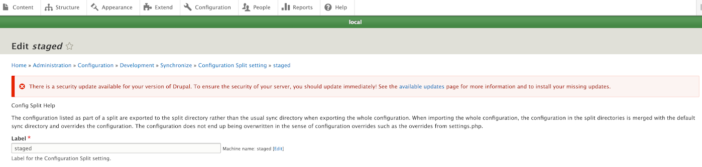

# Automate Configuration

A powerful Drupal capability that is often hidden is the fact that a `config-import` (or `cim`) actually manages changes to the connected database for you.  We outlined earlier that Drupal maintains configuration both in its database and in code.  You should recall that a [subdirectory where configuration code is to be sent to is established by some lines of code in the `php.settings` file.](../cicd/configatroot.md#drupal-environments)  Working with Drupal you can grab the configuration that is in the database and use the `drush cex` command to export it.  We used that drush command approach rather than the GUI interface under the Adminstration menu options becuase we want the export to go in the form of `yml` files  into that subdirectory we set up.    

In the prior section we noted that the primary intent of the Config Suite module we installed is automatic import and export of configuration.  If you think about having to 'cex and cim' all the time, doing something automatically sounds great.  Infact, the author of the Config Suite module [points out in a video](https://www.youtube.com/watch?v=02IJGgGPBAw&t=112s) that he got into computing because the logic is that the computer should automate stuff you do all the time.  The GUI interface for the Config Suite module looks like this:

However, for our Drupal CI/CD Workflow Project template we set up the automation another step further by having the right code in the right place.  To understand, lets review a couple of things we already set up to make this work.  First, we don't just need one configuration we need configurations for each of the environments we set up in our workflow.  Remember we kept our orginal 'sync' subdirectory to house the exported `yml` files we exported from our database but [set up 'main', 'staged', 'develop', and 'local' subdirectories as siblings to it.](../cicd/configsplit2.md)

We [installed and enabled the config_split module.](../cicd/configsplit2.md#install-and-enable-the-config-split-module)  After this module was installed we could see it under the Administration menu as an additional option and if we went in it we saw this:

The active and inactive status is something we decided we weren't going to switch on and off each time we worked in a given environment but again it was something we did automatically by detecting the environment 'case' in our php.settings file and flipping the right switches on and off in there.  So we didn't get lost with this automation doing this, we also set up the [Environment Indicator module to name and color code the environments for us to clearly tell where we were working.](../cicd/envindicator.md)  That too was done with code we put in the `php.settings` file:

## Automate the Automatic

If you reflect on a recommendation about how it is valuable to organize your thoughts about what you might want to uniquely be run within each of the environment splits you may remember this table:

TABLE KEY:  S = Site Builder,  B = Beginning Developer,   D = Developer 

Notice that one of the very first things noted to be different by split is the configuration for the Config_Suite module.  The logic may make more sense now that you have the perspective of the connected pieces.  You want to have the automatic configuration 'import' and 'export' on between your 'local' environment and your 'develop' environment so that as you use [Git commands](../book/gitbasics.md) to move your work from you own computer to your website's host computer the two will remain synchonized.  And when it is time to move your 'develop' work up to 'staged' you want your efforts to do so to be synchonized automatically.  However, you do NOT want to have your 'staged' database configuration automatically exported as files that would be automatically imported by your 'main' production environment; rather, you want to hold them back to do manually only after you have completed your testing on the 'staged' website to make sure it is ready for release.  Thus, look at the line in the table above and you will see you want automatic "export & import" on in all environments EXCEPT for 'staged' where you only want "import" on.

### So how are we going to set this up

We have set up configuration splits.  The Administration menu GUI has an option near the normal Configuration Synchronization option where you can click to go into the Configuration Split set ups:  

There you will see the splits we have set up.  And you can also note their active or inactive status.  Remember, you are NOT going to edit the status here. We have our `php.settings` file set up to detect the environment and turn active or inactive the correct splits. You can see on the far right the options to Edit, Enable, or Delete a give split and you are going to click Edit on the 'Develop' split.

You will remember that we set these splits up to [point at the subdirectory we created for each of our splits.](../cicd/splitcheck.md)

Cross-checking our Config Split table, we see that Config Suite is one we will set differently by split. We very much want to automatically export our configuration in the ‘local’ and ‘develop’ environments. So every time we do any updates locally and commit/stage/sync them to hosted ‘develop’ the two are automatically updated. When we merge ‘develop’ into ‘staged’, we are also happy to have ‘staged’ automatically import any configuration files that came along and get them into the active database for that environment; but not so as far as exporting the updated configuration to files. I think we want to use the ‘staged’ testing environment as one where we first run our tests, review them, and make our export a manual step of that workflow approved release; so automatic import ‘on’ but NOT automatic export. Our Config Split table shows automatic import and export ‘on’ in the ‘main’ or production split but we might debate that depending on our workflow preference protocols. You definitely want automatic ‘export’ on in ‘main’ because that environment is what we consider the ultimate source of truth. When we need to go back to the starting point and grab a fresh start, our aim is to use ‘main’ and start branching. So main should have the live environment’s configuration available in yml files and having them automatically exported makes a ton of sense. Since we are doing a manual ‘export’ of ‘staged’ after testing, it should be ok for that to automatically be imported by ‘main’ as we merge ‘staged’ into it and the table is shown that way. However, if you want an additional safety net, you could make ‘main’ automatic export but not import.

A video on the Config Suite module!

- Next -
