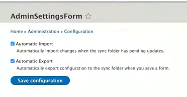

# Automate Configuration
## Config Export & Config Import triggers

A powerful Drupal capability that is often hidden is the fact that a `config-import` (or `cim`) actually manages changes to the connected database for you.  We outlined earlier that Drupal maintains configuration both in its database and in code.  You should recall that a [subdirectory where configuration code is to be sent to is established by some lines of code in the `php.settings` file.](../cicd/configatroot.md#drupal-environments)  Working with Drupal you can grab the configuration that is in the database and use the `drush cex` command to export it.  We used that drush command approach rather than the GUI interface under the Adminstration menu options becuase we want the export to go in the form of `yml` files  into that subdirectory we set up.    

In the prior section we noted that the primary intent of the Config Suite module we installed is automatic export and import of configuration.  If you think about having to 'cex and cim' all the time, doing something automatically sounds great.  Infact, the author of the Config Suite module [points out in a video](https://www.youtube.com/watch?v=02IJGgGPBAw&t=112s) that he got into computing because the logic is that the computer should automate stuff you do all the time.  The GUI interface for the Config Suite module looks like this:

However, for our Drupal CI/CD Workflow Project template we set up the automation another step further by having the right code in the right place.  To understand, lets review a couple of things we already set up to make this work.  First, we don't just need one configuration we need configurations for each of the environments we set up in our workflow.  Remember we kept our original 'sync' subdirectory to house the exported `yml` files we exported from our database but [set up 'main', 'staged', 'develop', and 'local' subdirectories as siblings to it.](../cicd/configsplit2.md)

We [installed and enabled the config_split module.](../cicd/configsplit2.md#install-and-enable-the-config_split-module--)  After this module was installed we could see it under the Administration menu as an additional option and if we went in it we saw this:

The active and inactive status is something we decided we weren't going to switch on and off each time we worked in a given environment but again it was something we did automatically by detecting the environment 'case' in our php.settings file and flipping the right switches on and off in there.  So we didn't get lost with this automation doing this, we also set up the [Environment Indicator module to name and color code the environments for us to clearly tell where we were working.](../cicd/envindicator.md)  That too was done with code we put in the `php.settings` file:

## Automate the Automatic

If you reflect on a recommendation about how it is valuable to [organize your thoughts about what you might want to uniquely be run within each of the environment splits you may remember this table:](../cicd/configsplit3.md) 

TABLE KEY:  S = Site Builder,  B = Beginning Developer,   D = Developer 

Notice that one of the very first things listed to be different by split is the configuration for the Config_Suite module.  The logic may make more sense now that you have the perspective of the connected pieces.  You want to have the automatic configuration 'import' and 'export' on between your 'local' environment and your 'develop' environment so that as you use [Git commands](../book/gitbasics.md) to move your work from you own computer to your website's host computer the two will remain synchonized.  And when it is time to move your 'develop' work up to 'staged' you want your efforts to do so to be synchonized automatically.  However, you do NOT want to have your 'staged' database configuration automatically exported as files that would be automatically imported by your 'main' production environment; rather, you want to hold them back to do manually only after you have completed your testing on the 'staged' website to make sure it is ready for release.  Thus, look at the line in the table above and you will see you want automatic "export & import" on in all environments EXCEPT for 'staged' where you only want "import" on.

## Import/Export by Split

We have set up configuration splits.  The Administration menu GUI has an option near the normal Configuration Synchronization menu item where you can click to go into Configuration Split:

There you will see the splits we have set up.  And you can also note their active or inactive status.  Remember, you are NOT going to edit the status here. We have our `php.settings` file set up to detect the environment and turn active or inactive the correct splits. You can see on the far right the options to Edit, Enable, or Delete a give split and you are going to click Edit on the 'Develop' split.

You will remember that we set these splits up to [point at the subdirectory we created for each of our splits.](../cicd/splitcheck.md)   Remember, you are NOT going to check or uncheck that active box here. We have our `php.settings` file set up to detect the environment and turn active or inactive the correct splits.

## Splits: Complete
### Modules & Items

We have the option of checking a box while in any given split and basically telling the system "We Don't Want that Here!"  For example, we might have installed the Devel module or the Webprofiler module to use in our 'local' and 'develop' environments.  But if we don't want those in 'staged' and 'main' environments we could check the box for each module while individually editing the 'staged' and 'main' environments.  

In the top "Complete Split" section of Config_Split the "Configuration Items"  list of check boxes work the same way up .  You check an item in that box and you eliminate that from the environment split you do it under.  Perhaps you might want to do that to `system.mail.yml` because you don't want standard mail operating in a 'develop' environment.

### Additional Configuration & Wildcards

You also see an input box for "Additional Configuration".  I am not smart enough to give you sophisticated 'use cases'.  However, I do know that it accepts you using "wildcards" to take sort of a bulk action on similiar configuration components that have separate files.  Say, for example, you had some odd need to get rid of all date formating you could put a line in there that said `core.date_format.*` that signals about a dozen date related 'yml' files to be surpressed in that environment.  Or, if for some reason "blocks" offended you and you wanted to get rid of them from an environment you could do a `block.*.*`.  The key being two separate lines if you want to do both.

## Splits: Conditional
### Complete vs Conditional

So what's this "Conditional Split" rather than a "Complete Split" all about?  One of the project maintainer's [summarized it best:](https://nuvole.org/blog/2021/aug/04/changes-coming-config-split)

"On export these two things happen:
Complete Split: Modules and config and all the config that depends on it is split off into the split storage and removed from the sync storage when the export is complete.
Conditional Split: The config is compared against the sync storage and is split to the split storage if it differs, the original config in the sync storage remains.

On import the config from the split storage is merged before Drupal imports the config from the sync storage." 

Under the Conditional option you don't have the whole modules option, just the configuration files list (although modules typically have files you can select if the 'contributing developer' used good names to make them easy to find).  There is also another "Additional Configuration" box in this section if you need it.

## Conditional and YML Editing

I am a fan of the "Conditional Split" because I like one clean master configuration in the `sync` directory and only the exceptions in the 'main', 'staged', 'develop' and 'local' directories.  Maybe that is because it offers some ease if you are ok with a "copy, paste, edit" approach to what is typically just a few files involved in the differences.  Otherwise you are just going into the GUI and doing edits from lists in each of those environments we showed in the earlier image.

The key is, I want to check these boxes so I am retaining and using what I want.

And, of course, after setting up your selections don't forget to "Save"

If we go back to the "Conditional Split" list you can see that you are presented with a long list of options regarding what is available in configuration 'yml' files.  And you can see our Config_Suite file on the list.  Here is the problem or challenge with just checkmarking it... what does that mean?  Well it means I turn it off.   But is that an 'export off, import off' condition?  What about the fact we want our 'staged' environment to have an 'export off, import on' condition?  How do we do that?

Go over to the VSCode IDE and look at the configuration directory which our `php.settings` instructs to store our base configuration 'yml' files; the 'sync'  subdirectory has everything because we did a `drush cex`.  You also see the 'main', 'staged', 'develop', and 'local' directories for the splits where I put a `.gitkeep` file as a placeholder to retain the subdirectory.   Looking through the 'sync' directory you see the 'yml' files listed from that earlier export.  You can scroll through that list just like you could pick them off the GUI in Config_Split to select which file(s) needs to be different.

There it is, our `Config_suite.settings.yml` is right there.  And, the "Automatic_Import" and "Automatic_Export" are both set to "false"; or, they are both in the "Off" position... the equivalent of unchecked in the module's GUI.  So all we need to do is to copy that file and paste the copy in the 'main', 'staged', 'develop' and 'local' subdirectories.  The we changed both lines to "true" in all but the 'staged' copy.  In the staged copy we changed the "Automatic_Import line to 'true' and left the "Automatic_Export" line as 'false'.   This was already done for you and stage/commit/sync'ed to the GitHub repository you will clone.  But the example is both good documentation and a 'how to' you might use to approach other setting splits you want to closely manage.

## Additional Resources:

You will be back revisiting this section even thoough the project 'Git Clone' will have taken care of several basics.  The reason is that the table we suggested to plan splits for a configuration best suited to your individual project needs will draw you back to set those up.  Remember, you can always go into the Config_Split module GUI and do the changes you want to make in each split you set up.  That will automatically generate the files you need to be storing so you don't have to manually edit 'yml' files if you don't want.

[Another walk through Config Split article with good basics](https://mikemadison.net/blog/2020/8/5/config-split-a-guide-to-conditional-configuration-in-drupal-9)
[Examples of Complex Split Settings for various use cases.](https://docs.acquia.com/blt/developer/config-split/)

[A video with more on the Config Suite module!](https://www.youtube.com/watch?v=02IJGgGPBAw&t=112s)

 
 
 

[- Next -](../cicd/stagefileproxy.md)

