## Don't Split it Just Yet

We indicated we are going to set up 'develop' and 'staged' along with our 'main' environment.  However, just starting a new site, the easiest thing is to get a bunch of stuff in place BEFORE you split environments.  It saves a little because you don't have to merge upstream the things you put in place now.  Don't be uptight about it if you don't get everything in place at this point because you can easily add stuff in 'develop' later and just let your Git workflow processes do what it is intended to do.

## Get things updated first

One of the most basic things you might do that this point is some updates.  If you happened to drive around in that Drupal site we had up, you will probably have noticed under the Configuration menu item that it may have a pink bar with a status report notice saying something about "available updates".   Since you just installed Drupal and probably no modules except those which came with Core, the update notice is probably about updates to Core itself.  Drupal is working toward a GUI Core update process but if that isn't ready for prime time, the best way remains to do it with composer.  Here are the commands: 
*Quick Lookup* 
&nbsp;&nbsp;&nbsp;&nbsp;lando start` 
&nbsp;&nbsp;&nbsp;&nbsp;`chmod u+w web/sites/default` 
&nbsp;&nbsp;&nbsp;&nbsp;`lando composer config --global process-timeout 2000` 
&nbsp;&nbsp;&nbsp;&nbsp;`lando composer update "drupal/core-*" --with-all-dependencies` 
&nbsp;&nbsp;&nbsp;&nbsp;`git push -u platform update` 
&nbsp;&nbsp;&nbsp;&nbsp;`platform e:activate -y` 

NOTE: Make sure Platform CLI is installed and SSH connection established. 

That first line makes sure the subdirectory you are doing this in can be written to.  Once your site is moving to the active deployment state, probably around associating the DNS, make sure you 'harden' the site and that your approach makes this subdirectory read only again. As long as you are updating Drupal, you might want to update lando on your local machine.  To do that, you will also work from a command line interface like your VSCode terminal and do the following:

&nbsp;&nbsp;&nbsp;&nbsp;`lando poweroff` 
&nbsp;&nbsp;&nbsp;&nbsp;Then -  
&nbsp;&nbsp;&nbsp;&nbsp;Turn off Docker (probably from its icon in your upper right menu bar) 
&nbsp;&nbsp;&nbsp;&nbsp;Install lando from its GitHub repository (download appropriate to your machines operating system) 

#### Let's tryout our base workflow:
You are a little invested in what you have worked on so far, but no where near what you will be after you spend a bunch of time really building out a website.  So now is a good time to take the initial parts of the workflow process for a test drive.  In fact, while you are first learning to use all this stuff, it really makes sense to practice the Git-GitHub-Platform.sh coordination steps with each little increment you do.  Soon it will become a natural instinct in how you work.

After you do the gitignore changes, add the .lando.yml file and Drupal updates to the base site that the Platform.sh Lando template pretty much put in place for you, you will see in your VSCode to the left of the directory list, that a little blue ball with a number in it shows up by the Git version control symbol.

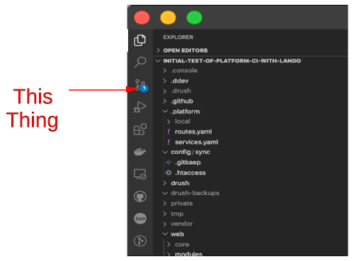

What you want to do is point your mouse at that version control symbol and click.  It will open up a dialog box under a 'source control' heading where it tells you to put in a Message about what the file changes that were made represent; your little reminder story about what you did or coded.  In our case we type in "Drupal Core Update". 

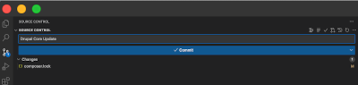

You can also see that the only thing this Drupal Core Update changed in terms of local files is the 'composer.lock' file.  That is because with a composer deployed Drupal container build all that really had to change was the require statement version number incrementing.

If we simply move our cursor over the line showing that 'composer.lock' file and watch to the far right on the line, we will see we have some options. The little box is to 'Open the File', the little curved line is to 'Discard Changes'.  The Plus sign is to 'Stage the Changes' and that is the one we select.

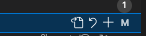

If we move our cursor over the line showing 'Changes' instead, it offer  a curved arrow with a plus sign (to 'stash' the changes for now rather than stage them),and an arrow by itself to discard all the changes from any file(s) or a plus sign to stage all the changed files.  We hit the plus sign and we see the composer.lock file is now a staged change.

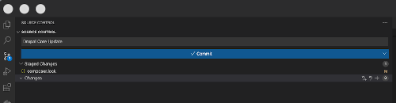

Once staged, we can still stash or discard but for us it is time for that big blue highlighted bar with a checkmark and the word Commit.  Sounds pretty ominous but we are going to click on it anyway.  It is important to remember that all we are doing at this stage is working in the world of local Git version control and just telling it that we wish to save that file on the branch we are located in.  All commit does is save our message and put the changed file(s) into a local copy of the branch we are on.  Remember that we tell which branch we are on by looking at the lower left corner of VSCode and we see we are on 'main'…

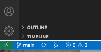

The action is with that next big blue bar that shows up and says to 'Sync Changes'...

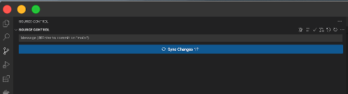

When you click it, up will pop a message asking you to confirm you want to do a pull and push and what players or environments are involved….

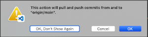

Give it a second depending on how many files might be involved but pop over to look directly in your GitHub account (that you are SSH connected to), and you will see the file that was updated showing right up in the matching branch.  

Platform.sh is referencing the GitHub 'main' branch through the SSH connection you set up between the two.  Therefore, you should see under the Activity section for your project, the recent activity for actions from the "GitHub-Integration" as seen in the example below where first the above process was done for the Drupal Update and a second time for the gitignore update annotation.

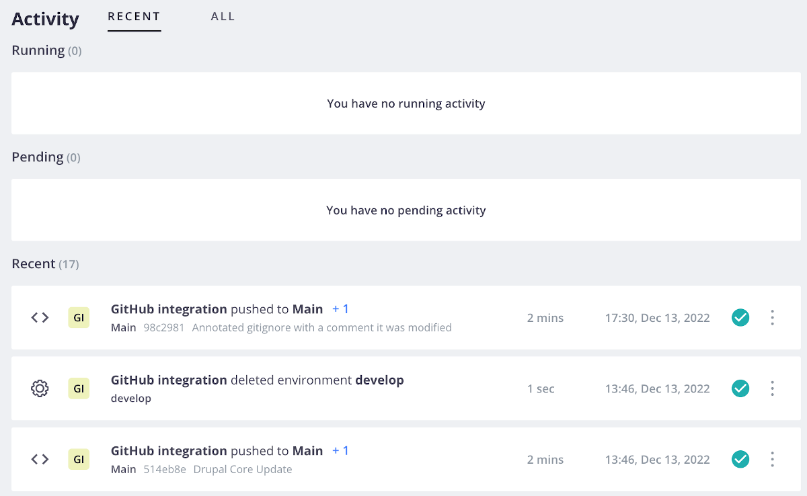

If you see your project update from local Git to GitHub but it doesn't seem to show up in Platform.sh, the Token behind their integration may have expired.  For security reasons, most times the integration Tokens are set to expire in 30, 60, or 90 days.  See the Appendix: Reestablishing your GitHub-Platform.sh Integration to fix this.  

## Let's do a Platform.sh backup:

Since we updated the code behind our website, it might be a good time to do a backup to secure what we did.  Since we are working directly on 'main' at this point we will just secure that main production branch as the only one we have on Platform.sh (once you really get going you will work on 'develop' push to 'staged' and after testing push to 'main').  It is good practice.  Even after you have the other branches in your workflow, it will logically be 'main' that you are going to routinely backup. 

Go your the Platform.sh site and then click on your project.  You will see the environments you have. 

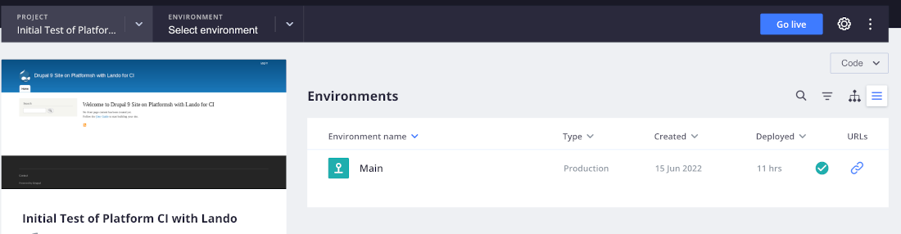

Click on the 'Environment' pull down in the second box from the left in that top black tab and select 'main'.

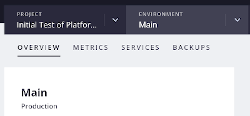

Slide over from 'OVERVIEW' to that 'BACKUPS' option in the grey area.  That will show any backups you already have & more importantly at this stage, pop up that blue "Backup" button on the far right.

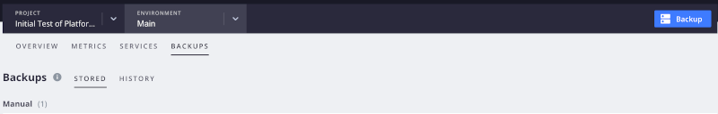

When you click that blue backup button it brings up this modal. You don't need to check the "Create live backup" option because your site isn't really live with content being dynamically updated while this is going on.  You probably don't want to bother copying and using that command line syntax; you can just hit the 'Yes' and run it directly.

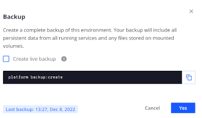

You will see a backup listed with a little spinning wheel over the right of that line.  Since you really don't have anything but the basic code for the starting point of a new website yet, this backup should probably take under a minute to run.  I have found that if it seems to take longer, just refresh your browser and it will be done.  Yours won't say 'rightsandwrongsgit' at the start; rather your own GitHub repository name.

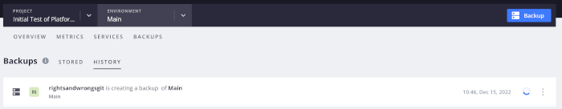

Mine took 48 seconds -

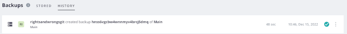

As long as you are in the Backups list section, move over from the 'HISTORY' option to the 'STORED' option.  If you click on the three stacked dots on the end of any backup's line, it will allow you to restore from it or to delete it.

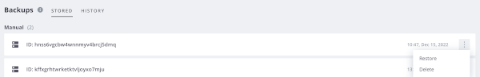

[- Next -]()
