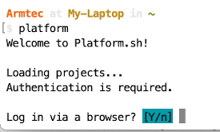

# Bring a copy of your project to your 'local' computer

We have a basic installation of Drupal running on our Platform.sh host.  It has a sole branch called 'main'.   We want to bring a copy of this to our local computer where we will run it in [Lando](../book/lando.md).  We will also want to put that 'local' copy of our Drupal project under [Git](../book/gitbasics.md) version control.  And we will want our Git local version control to speak to a GitHub repository.

For now, lets use the Terminal to use the [Command Line](../book/cheats.md#Terminal-Command-Line-Interface-(CLI)) that is available right from the utlities on your basic machine.  Go into Finder and in your Applications area, look toward the bottom of your list for Utilities.  Open Utilities and toward the bottom of it, look for Terminal and click it to open.

You want to be at the 'root' of your user account because we are going to install the Platform CLI globally; the logic being that you probably will work on other projects with different names and locations on your hard-drive in the future and want it available as you expand your development work.  In the example below, my 'User' is Armtec and I am at the My-Laptop root level.  If you don't have your own Terminal set up to show you your User, Location, and Git Project location you should consider enhancing its [Where am I](../book/WhereAmI.md) information.

Copy this `curl -fsS https://platform.sh/cli/installer | php1`

NOTE: [See more on Platform.sh CLI](../cicd/platformshcli.md)

The first part of your coordinating integration is you want Platform.sh to easily interact with your local machine and by installing its CLI tool.  To do that 'Paste' what you copied on that Terminal command line and hit enter.  The Platform CLI tool install is pretty automatic but you might have to answer a question (pick the defaults).  Again, you are doing this from your 'root' directory; mine in the example is ARMTEC.

The Platform CLI is installed.  You are going to use it right away.  And again, You want to be at the 'root' of your user account.  You can see right from the system as it comes back to a prompt, itbasically tells you want to run next. Do these two things at the prompt and hit enter.  Your are doing this from the 'root' and that is important because the hosted project will be brought down as a local copy in a directory off that 'root' unless you tell it otherwise in an upcoming step.

As Platform.sh starts, it ask you if you want to Log in via a browser and you select the default 'Y' that you do want to use the browser.

Since we signed up for Platform.sh with GitHub it is already SSH connected, recognizes our Username and Email Address.  Plus it see our list of projects as the one we just set up..

We need to choose the project we want to use. Since we only have the one project at this point, selecting it as number '0' from the list is easy.  And since we haven't set up any branches yet, our only environment is 'main'.  **It also notes the name of what will be our default directory; and since we invoked all this off of the root, it will just be at the level of a sub-directory right off of the root.**

As it runs, you can see the name of your 'Downloading project …'  and you can see where it is cloning it too as a sub-directory destination.  None of that should surprise you but if it doesn't look familiar to what you would have expected, write it down to go look for it.

You should be able to see the local copy of your project at that sub-directory if you go look in your 'Finder' on a Mac (believe it is 'Explorer' on Windows).

[- Next -](../cicd/vscodedrupallocal.md)

