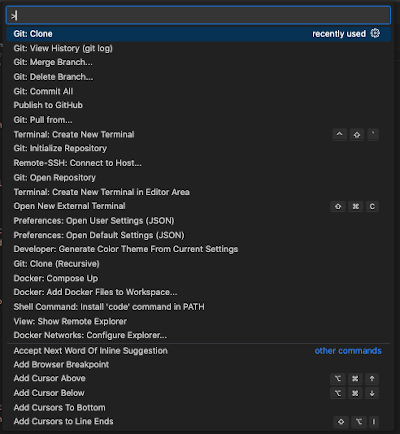
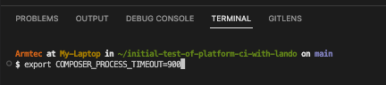
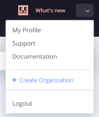
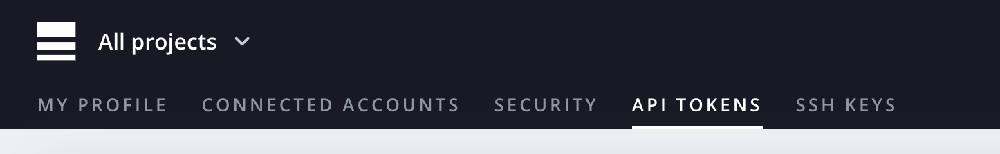
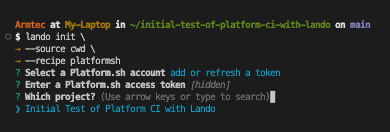
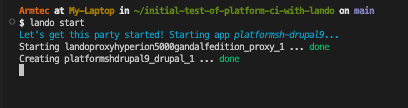
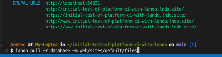
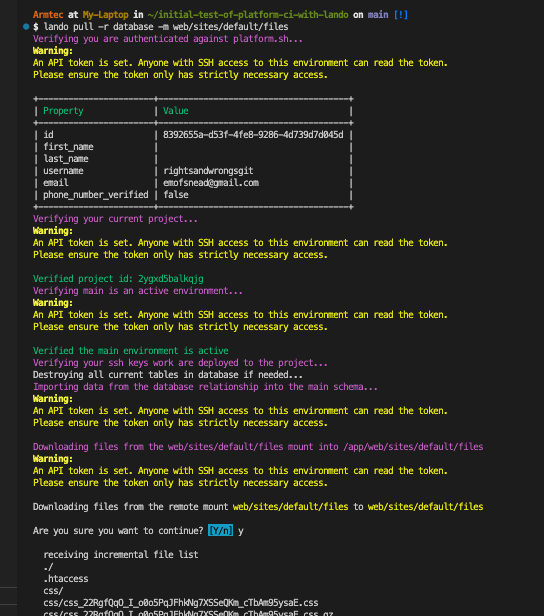
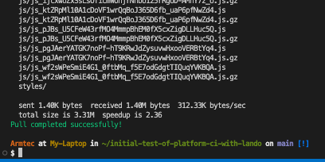
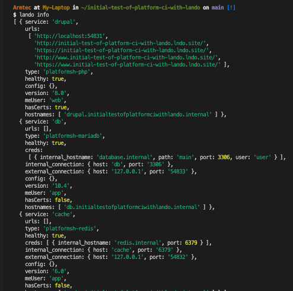

# GitClone the Project/Get the Database 

Remember that the actual code for your project is in your GitHub repository.  Remember that we kind of tucked a few files in that repository that we really don't want the host to run but that we want to have locally to do somethings in that Lando local machine-environment we have; one we marked was the 'my-example.settings.local.php' file so it can be cloned down and then that leading word removed to make it locally functional.
What you want to have as a starting point is your root level above where the project was/is going to be.  So if you have the project we have been working on in a directory, go a head and rename that directory with the word 'temphold' in front of the name you had. That way you can go back to it if you need but you can have GitClone bring down and tuck the retrieved project into the originally named directory.  Remember – DO NOT BE "IN" that directory, BE "ABOVE" it one level because GitClone will recreate it in the right spot that way.
Remember in your VSCode IDE you hit 'Shift-Cmd-P'  to bring up the "Command Palette" for the list of commands it will run for you.  Start typing 'Git Clone' and it will roll to the top of the list; select it -

The selection box will show you the projects you have set up in your GitHub repository that are available for you to select.  Make sure to select the right one that matches where your Platform.sh project is running from and hit enter.  
Up will pop a list of your directories sort of like your normal 'finder' (Explorer for Windows people).  Make sure you are at the level above where you want the project clone to show up; potentially parallel then to where that 'temphold-xxxxxxxxxx' directory is showing on the directory list you see.  You don't want to point to any existing subdirectory since Git Clone is making a new one; so don't be fooled into pointing at one by the "SELECT a Repository Destination" button hinting otherwise; just hit that button without pointing at anything!

If you look in the VSCode IDE on the left hand panel, like usual that little pages symbol is on the top left and clicking it will bring your project files into view; right back home on your own machine.
Since your GitClone brought your code from GitHub to your local machine, follow the steps in this Lando site documentation where it says "if you already have your code locally" for more detail -
https://docs.lando.dev/platformsh/getting-started.html

Before we kick off the Lando step, remember that you want to duplicate the 'my-example.settings.local.php' file and rename it without the "my-example." front portion.  The easiest thing to do is first remove the existing 'settings.local.php' file that the GitHub project would have had in it from the Drupal scaffold; then it won't be in the way of your renaming the copy you are replacing it with.

Here are the steps that the lando documentation outlines with you are using existing code:
NOTE: This step the documentation didn't mention but I found it important because of the larger number of files in a current version of Drupal's core and a slow connection speed for composer to get and then have time to install files.  The default composer process max timeout seemed to be 300 seconds and I jumped it to 900 because I was having some trouble.
export COMPOSER_PROCESS_TIMEOUT=900

With a step sequence, first do a lando init \
it will prompt with just an → where you enter --source cwd\
another →where you enter –recipe platformsh
then it asks you to select a Platform.sh account and list those you have and you 'arrow' to it

t that point it asks you to add or refresh a token.  Since you probably didn't save yours or it may have timed out, just go into Platform.sh, move to the upper right and select 'My Profile'

Remember that in 'My Profile' you can menu to the right and select the 'API Tokens' option -
Just go ahead and generate a new one and copy it -

Don't let the system fool you at the point you paste it in at the end of the line. The cursor doesn't move.  So now you think you need to try pasting it again and if you do you will get an error.  Rather, just accept the fact the cursor didn't move and hit enter.  Then you are prompted to 'arrow' to your project.

Do a 'lando start' -

After it runs and the list of URLs comes back, do a 'lando pull -r database -m web/sites/default/files' -

bring your database to the code you brought down from GitHub and you now how a fully functional local copy of your project running in Lando and connected to GitHub and Platform.sh

Run a lando info and you should see the URLs for your running local project plus stuff about it. It should look something like this -

[- Next -}()

