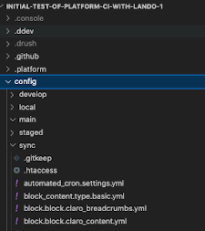

## Create subdirectories for the additional environment configurations -

Remember that your setting.php file tells your system to look for your configuration files in the ../config/sync directory.  You saw the huge list of the YAMl files that represent all the parts of your configuration after you did that lando drush config-export command.  Think of that location as the home of your common configuration in the config_split world and if you listen to other sources around setting up config_split they even name their directory common; don't you do that because you are trying to stay aligned with the Lando-Platform.sh standard template as much as possible. 

Go toward the top of the directory list on the left portion of your project in your VSCode IDE and highlight the 'config' director (not the 'sync' right next to it.  Then go over to the upper right and the second icon in is the 'New Folder' option; click it.

First, you put in a 'develop', 'main' and 'staged'  subdirectory under 'config'.  DON'T put it under 'sync'.

You can see your 'sync' directory with all the YAML files and its new sibling level 'develop', 'local', 'main', and 'staged' directories ready to hold your split off alternative YML files.  Think about the config_split module working like most Drupal stuff does by going to a unique starting place directory to find something and if what it needs isn't there, it will work its way up to a default directory to find a file.  Your 'sync' directory is your default location for files that your splits don't contain.  So once you get going, you can anticipate that 'develop', 'main', and 'staged' won't have very many YAML files, only those that you tell the config_split module you want something unique for that given environment.

NOTE: See that .gitkeep file at the top of your /config/sync directory?  YOU NEED TO POINT AT IT IN VSCode AND COPY IT.  NOW PASTE A COPY INTO EACH OF THE 'local', 'develop', 'staged', and 'main' DIRECTORIES YOU MADE.  This will result in these directories being acknowledge as new and picked up my Git so they indicate as changes for you to stage, commit, and sync.  

Go ahead and in VSCode, click that blue ball with the number to bring up the message entry box where you will put in something along the lines of "Exported configuration to sync and added sibling directories for workflow environments".  Look for the Plus sign to stage all the changed items as a group (and there will be over a hundred files because you exported all those YAML files to the sync directory with the config-export).  Once staged, hit the blue bar that says 'Commit' and after that, it changes to 'Sync' and you click it again to push the changes to GitHub.  Remember, Git locally is connected to GitHub via SSH and then GitHub is SSH connected to Platform.sh so they will populate that environment shortly.  Wouldn't hurt to run another backup in Platform.sh at this time.

Side Notes: 
If you happen to be a command line person, assuming you are in the project top level directory do this. 
`cd config` 
`mkdir develop` 
`mkdir local` 
`mkdir staged` 
`mkdir main` 
	
	
Ultimately you are going to be pointing the Config_Split module to the name and location of the splits you create.  It is possible to [deviate from this suggested directory structure](https://www.drupal.org/docs/contributed-modules/configuration-split/split-directory-structure) if you have some reason. But before you change your approach, make sure you understand a couple limitations on what NOT to do with those subdirectories since there are a couple approaches are simply won't work.  Read that documentation and do some searching to assure yourself. 

### Subdirectories in place …
## Install and enable the Config_Split module -

At the terminal, you install the config_split module with this command.
`lando composer require 'drupal/config_split'` 

After that runs you will be back at the prompt …

Having a Drupal module installed doesn't mean it is functional.  Rather, you need to enable it.  To do that you use this command at the terminal.
`lando drush en config_split`

Be aware, that this won't run until you confirm you want to continue.  The reason it has this extra step is that config_split has what are known as dependencies on other modules and the system confirms you agree to install those too.  Say yes!

After it runs a moment, the system will declare success.

I like to confirm the success by having Lando rebuild the local container and bring back up the Drupal site locally.

The rebuild take a little while so go get a cup of coffee.  When you come back you will see the usual list of URLs where you can bring the local site into your browser.

I like to pop in the one for 'localhost' and log into the Drupal application to take a look. From the administration menu, first click on the 'Extend' option.  In the little search box if you type 'config' it will take you to a list of modules that include that in their name; or you can just scroll down until you see them.  There you will see the Config Filter and Configuration Split modules you installed and the fact they have a check in their checkbox shows they are enabled.

From that administration menu, go over to the 'Configuration' option and click into it.  Now look down into the 'Development' group and you will see the 'Configuration Split settings' option has been added just above the original 'Configuration synchronization' option that came with Drupal Core.  Success confirmed!

If you go into the 'Configuration Split settings' option you will find a statement that "There are not configuration split setting entities yet." and a big blue button that says "+ Add Configuration Split settings".  We aren't going to do that just yet.  First, save your files in your VSCode editor, click the blue ball with the number to bring up the message box and type "Config_split module installed and enabled", stage it, commit it, and sync it to your GitHub account.

You might want to consider exporting your updated configuration after installing and enabling a module with --   
				`lando drush cex`

Where are we heading with configurations in these splits -

We have the config/sync directory for the common configuration across all environments.  We have installed Drupal Core so its modules are installed; although not all are enabled.  We can add contributed modules and enable modules anytime we want.  There are some advantages to doing so before we branch our splits in the sense that we don't have to commit, synch, merge Git-GitHub to assure they are in all environments.  So you may want to add others to the table on the next page but here we only note the Core and a configuration related contributed module called structure_sync to provide an example.
The table also shows the four split names that we set up directory homes for configuration yml files to be uniquely deposited.  Under each named split are modules you should consider installing for to be uniquely active in that environment.  Remember that the easiest way to thing about config_split is that is ADDS what you put in it TO THE BASE configuration in 'sync'.
What you need to do is the classic `lando composer require 'drupal/insertmodulename'` for each of the modules to be added to your system just like we did when we installed the config_split module itself.  But DO NOT ENABLE these modules like we previously did!  We are going to take a special approach to doing that only within the split where we want them.

[- Next -](../cicd/configsplit3.md)
