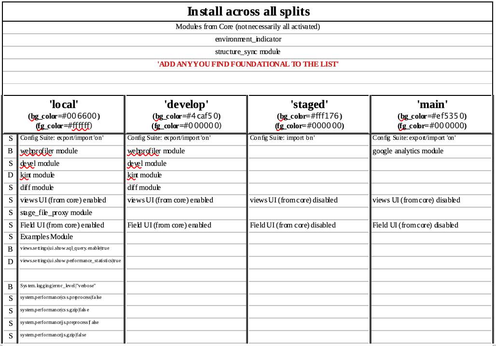

## Where are we heading with configurations in these splits

We have the config/sync directory for the common configuration across all environments.  We have installed Drupal Core so its modules are installed; although not all are enabled.  We can add contributed modules and enable modules anytime we want.  There are some advantages to doing so before we branch our splits in the sense that we don't have to commit, synch, merge Git-GitHub to assure they are in all environments.  So you may want to add others to the table on the next page but here we only note the Core and a configuration related contributed module called structure_sync to provide an example.
The table also shows the four split names that we set up directory homes for configuration yml files to be uniquely deposited.  Under each named split are modules you should consider installing for to be uniquely active in that environment.  Remember that the easiest way to thing about config_split is that is ADDS what you put in it TO THE BASE configuration in 'sync'.
What you need to do is the classic lando composer require 'drupal/insertmodulename' for each of the modules to be added to your system just like we did when we installed the config_split module itself.  But DO NOT ENABLE these modules like we previously did!  We are going to take a special approach to doing that only within the split where we want them.

[- Next -]()
