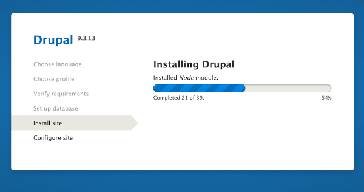

# Connecting Lando into your Github Platform.sh World 

## The Token: Lando-Platformsh
### Quick Summary
You want to connect your Drupal9 starting point project to a local development version on your own computer where it is faster to code changes you will make to the Drupal site to personalize it for your purposes.  More on adding module components, nice looking themes, and content to a Drupal site later, after we have the basic site in a CI/CD workflow between your local machine copy and the Platform.sh hosted copy.  (CI/CD stands for continuous integration & continuous deployment which allows you to make improvements as you gain experience and want to improve your site).

For now, what you want to do is connect the copies of your site on Platform.sh and GitHub with a copy on your local machine.  To do that use either of these two optional approaches:

a) Go through interactive prompts to get your site from platform.sh by typing this on your command line:

`lando init --source platformsh`

b) OR do it non-interactively 
&nbsp;&nbsp;&nbsp;&nbsp;NOTE: You will want to make sure you set $PLATFORMSH_CLI_TOKEN 
&nbsp;&nbsp;&nbsp;&nbsp;and $PLATFORMSH_SITE_NAME to values that make sense for you 

  `lando init\` 
&nbsp;&nbsp;&nbsp;&nbsp;`--source platformsh\` 
&nbsp;&nbsp;&nbsp;&nbsp;`--platformsh-auth "$PLATFORMSH_CLI_TOKEN"\` 
&nbsp;&nbsp;&nbsp;&nbsp;`--platformsh-site "$PLATFORMSH_SITE_NAME"` 

Details if you need them:
* If you haven't Installed Lando: [Instructions](https://docs.lando.dev/basics/installation.html#system-requirements){:target="_blank"}
* If you haven't already gotten your [Platformsh_CLI_TOKEN](https://docs.platform.sh/development/cli/api-tokens.html#get-a-token){:target="_blank"}
* If you aren't sure of the correct site name, go to the Platform.sh CLI and run `platform environment:info` which will show you all the projects you have established on this host with their name and id.
* Find more about this [Lando step](https://docs.lando.dev/platformsh/getting-started.html#quick-start){:target="_blank"}

### The practical steps by example -

Remember this basic page on Platform.sh?  We want to go back there.

Shouldn't be real hard to remember which project since we only have the one and only the 'Main' branch environment for it. 

But what we do need to make sure we do is over in the upper right corner there is a little pulldown carrot with 'My Profile' as an option under it that we want to go into:

Once you are in there, the My Profile is just the left most option on a new sub-menu bar.  And you want to scroll on over to the 'API Tokens' option where you will find a Token you want to Copy (click that blue Copy button).

Now run that 'lando init' from the terminal within VSCode (making sure you are in that local sub-directory for your project):

You should be able to answer the questions: 
&nbsp;&nbsp;&nbsp;&nbsp;- You are getting your codebase from = platformsh 
&nbsp;&nbsp;&nbsp;&nbsp;- You 'Paste' that token in we just copied 
&nbsp;&nbsp;&nbsp;&nbsp;- Your project is the name of the project we just created 
  
  
  
Once your local copy of the project is full installed by the prior actions, you should be able to type 'lando start' at the terminal command line, hit enter, and a local copy of your Drupal site will install.  It will be just like you saw with the host copy on Platform.sh:        

## The Token: Platformsh-GitHub

Git is a version management tool.  If you aren't familiar with it, go look at some videos and read some basics about it before continuing.   Git is an absolute requirement of using the Platform.sh approach to CI/CD, so installing it was listed as a prerequisite.  This is because Platform.sh uses a GitOps approach to DevOps.   GitHub is listed as a prerequisite too; although a purest would point out you could get away without it. If you ever have a possibility you want to involve others in developing or helping you with your website you will be really glad you used it.  There is more detail later about how you will use these but it really makes good sense to get your Platform.sh project linked into GitHub right as you first set things up, so here we go -

[Git & GitHub](../book/gitbasics.md)

#### Connecting Platform.sh to a GitHub repository- 
(this is NOT mandatory to be able to use Git with Platform.sh itself but is still advised)

A) Go to your Github account, set up your repository for this Drupal project, and generate a 'Token' to use in the next step.  Copy that Token to your clipboard. 
[How to set up a GitHub Token](https://docs.github.com/en/authentication/keeping-your-account-and-data-secure/creating-a-personal-access-token){:target="_blank"}

B) At the Platform.sh CLI enter: 
`platform integration:add –type=github –token=<paste in that token> --repository=<GithubUser/Repository>`

You modify the above command by putting in your own Token and entering your User & Repository. After you hit "Enter" the system will ask you (and answer you should give are) –

&nbsp;&nbsp;&nbsp;&nbsp;- Build every pull request?  Y
&nbsp;&nbsp;&nbsp;&nbsp;- Build pull requests based on their post-merge status? N  (see POST-MERGE NOTE below)
&nbsp;&nbsp;&nbsp;&nbsp;- Clone the parent environment data for pull request? Y
&nbsp;&nbsp;&nbsp;&nbsp;- Fetch all branches from the remote (as inactive environment)? Y
&nbsp;&nbsp;&nbsp;&nbsp;- Delete branches that do not exist on the remote? Y

POST-MERGE NOTE:You may want to think about making the pull request post-merge a Y if your routine 		development process includes doing this really frequently; and thus you would wait until the branch merger 		you were working on into its parent branch is done.  Only consider doing it that way if you are working on say 		something like a feature branch who has a development branch parent; never do it if the parent branch is the 		Main (Master or production) branch.)
  
  
  
  
