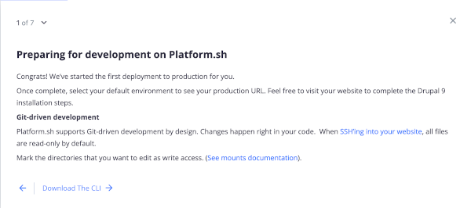
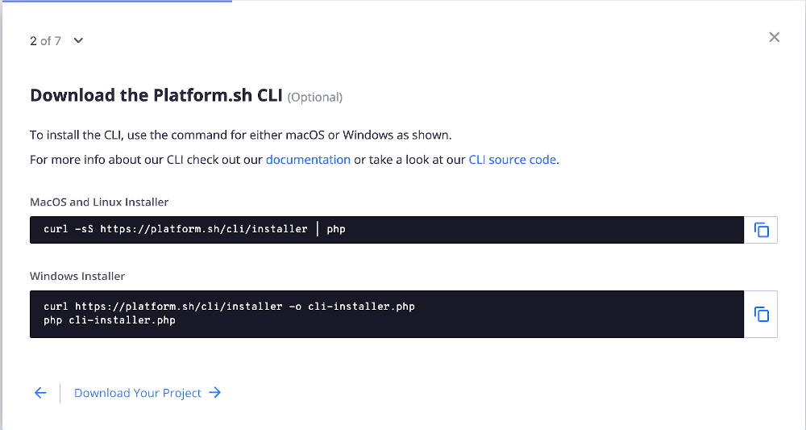
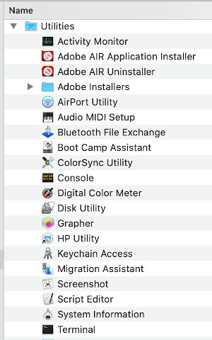
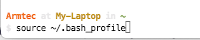
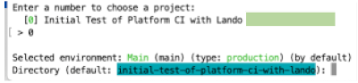
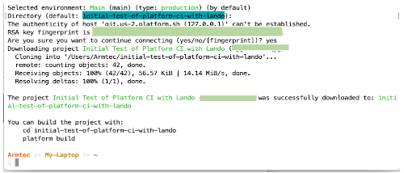

# Connecting Platform.sh Host and Lando Local

We also see a part of that page congratulating us that the project is created but that we need to so some other stuff.  The "What to expect" list gives you an outline. We are going to knock off the first few for now and see things really unfold easily.  Lets get the CLI (Command Line Interface) working and download or link our hosted Drupal site to a local copy on our machine. Our local copy will run on [Lando](../book/lando.html).  

Click "Start" to get to the next page.  We have already partly done some of this via the simple fact that we used our GitHub account to sign up for our Platform.sh account.   Remember, we didn't set up a specific project repository for our Project on GitHub yet; we will do that later.  But we obviously had a GitHub account and logically we have Git globally installed on our local machine (something noted as a [prerequisite](../cici/prerequisites.md) step).  We granted access approval earlier so our [SSH connect](https://www.youtube.com/watch?v=snCP3c7wXw0) is already established. We are going to worry about where on the local machine our Drupal project copy is going to be placed a little later; and since we are using [VSCode](../book/ide.md) some of that stuff will also flow pretty smoothly.  Thus, just click the "Download The CLI" highlighted text to proceed.

On the page for the second step you just copy the short code block (via clicking on the little squares at the end of the correct line for your machine Operating System).

You need somewhere to 'Paste' what you copied and we are going to open the 'Terminal' to use the [Command Line](../book/cheats.md#Terminal-Command-Line-Interface-(CLI))  If you look in your files under the "Applications" directory, near the bottom you will see a "Utilities" sub-directory.  Toward the bottom select 'Terminal'.  (In Windows it is the command prompt and you can move your mouse pointer to the bottom-left corner of the screen and right-click, or you can press Windows key + X to get there).

##### Local copy coming down

You want to be at the 'root' of your user account because we are going to install the Platform CLI globally; the logic being that you probably will work on other projects with different names and locations on your hard-drive in the future and want it available as you expand your development work.  In the example below, my 'User' is Armtec and I am at the My-Laptop root level.

Copy this `curl -fsS https://platform.sh/cli/installer | php1`

'Paste' what you copied on that command line and hit enter.  The Platform CLI tool install is pretty automatic but you might have to answer a question (pick the defaults).  Again, you are doing this from your 'root' directory; mine in the example is ARMTEC.

The system basically tells you want to run next. Do these two things at the prompt and hit enter.  Your are doing this from the 'root' and that is important because the hosted project will be brought down as a local copy in a directory off that 'root' unless you tell it otherwise in an upcoming step.

As Platform.sh starts, it ask you if you want to Log in via a browser and you select the default 'Y' that you do want to use the browser.

Since we signed up for Platform.sh with GitHub it is already SSH connected, recognizes our Username and Email Address.  Plus it see our list of projects as the one we just set up..

We need to choose the project we want to use. Since we only have the one project at this point, selecting it as number '0' from the list is easy.  And since we haven't set up any branches yet, our only environment is 'main'.  **It also notes the name of what will be our default directory; and since we invoked all this off of the root, it will just be at the level of a sub-directory right off of the root.**

As it runs, you can see the name of your 'Downloading project …'  and you can see where it is cloning it too as a sub-directory destination.  None of that should surprise you but if it doesn't look familiar to what you would have expected, write it down to go look for it.

You should be able to see the local copy of your project at that sub-directory if you go look in your 'Finder' on a Mac (believe it is 'Explorer' on Windows).

[- Next -](../cicd/vscodedrupallocal.md)
