# Start doing more with VSCode

VSCode is pretty straightforward to use.  The left window will show your directory structure, the upper right the content of any files you click on from those directories with an editor to work on them, and a terminal window in the lower right.  In that terminal window you will have command line interface to lando or platform.sh CLI.  There is a command pallet at the top of VSCode that opens up when you hit shift-command-P (in a Mac).  There are all sorts of extensions for smoothing out code, making it pretty, and triggering Git-GitHub workflows; recommended starting extensions were noted in the [prerequisites](../cicd/prerequisites.md) section.  Some of the most important stuff for you will be the Git-GitHub interactions because they are also GitOps workflow triggers within how Platform.sh works.  Here is a set of video's to watch on using [GitHub with VSCode](https://www.youtube.com/playlist?list=PLpPVLI0A0OkLBWbcctmGxxF6VHWSQw1hi).

## Put 'your project' into GitHub

First, don't be confused if you are looking at this section in isolation and have just brought a copy of the CI/CD workflow starting point project file down from GitHub; think of that as the borrowed project and what you are doing here is making it 'your project'.  What we are going to do next is also put your project under the control of a remote GitHub repository.  This is possibly optional just to work back and forth between Lando and Platform.sh on the project since they are already talking via a GitOps connection.  But we want to do some things with Configurations and Database backups that take advantage of using GitHub as a sort of intermediary copy of your project.  Worst case scenario, just do it because you are a worrier and want to have a copy of your project that is easier to move to another host if you get mad at Platform.sh for some reason. 

Back in VSCode you have the project in one window with all the sub-directories and files; and you are at the very top level.  You have a 'Terminal' window open too and you can click on the menu bar in the upper left to open one if you don't.

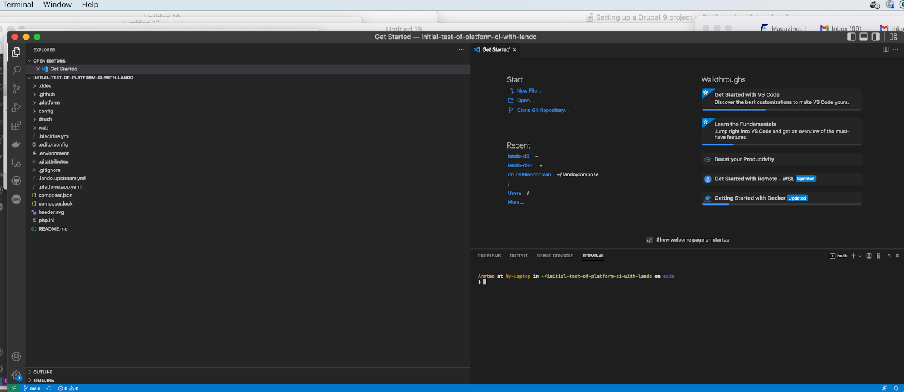

Look down here in the lower left corner and click on that little wheel.

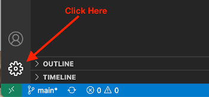

When the menu list opens up, select the 'Command Palette' option.

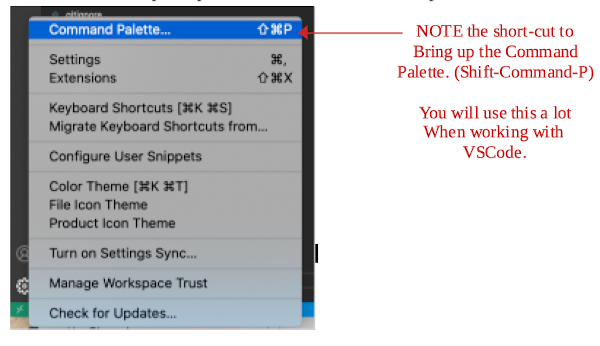

At the very top of VSCode, a little box will open up and start typing 'Publish in GitHub' at least until that option is easily selected in the list box options.

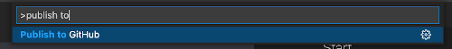

More than likely, VSCode will pop up a window to test if you really want to shake hands with GitHub on this project.  You should select 'Allow'.

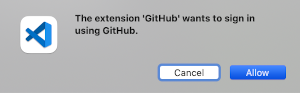

Oddly, since you started this from VSCode, it will ask you if you want to Open Visual Studio Code and you select the option to do so.

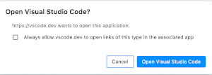

Back up in that box for the 'Command Pallet' you will see the name you have given your project locally and below it the option to Publish it to GitHub as either a 'private' or 'public' repository. 

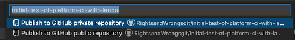

Pick which one you want for your project. Then it will do its thing.  To prove to yourself that it worked, go over to your GitHub account directly and take a look at your list of projects.  You should see the project you just put there.

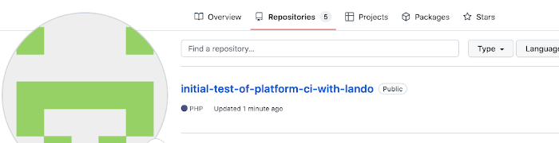

And, you should be able to actually look in that project and see all the sub-directories and files (excepting the ones you '.gitignore' marked).  You might also notice an interesting note at the top of the list that tells you that Platform.sh Bot is who initialized the environment and where it got it.

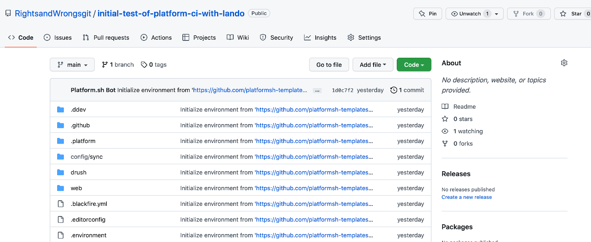

See Platform.sh own documentation for more detail on how to [Integrate with GitHub](https://docs.platform.sh/integrations/source/github.html).

## NOTE ABOUT THE TOOL CALLED "DRUSH"

Using your VSCode, look in the left panel at the subdirectory list for your project. You will likelysee .ddev, github, platform, and config/sync subdirectories.  You will also see Drush and then Web; Web being where your actual site stuff operates.  Drush is a tool used for a lot of Command Line actions when working with Drupal.  Even something as simple as `drush cr` to clear the cache is much faster than searching it down in the GUI interface of the Drupal Administration tabs.  The good news is that the Platform.sh Drupal 9 recipe or template includes a Drush installation automatically. You can anticipate you will use Drush a lot as your comfort grows with Drupal development.

If, for some reason, you found Drush wasn't installed, all you need to do is run the following at the CLI (Command Line Interface). 
`composer require drush/drush`

Remember, that when you are doing composer things in your local Lando environment you need to precede the commands with lando; thus
`lando composer require drush/drush`

Don't get too excited that the Drush was part of the standard lando Drupal Platform.sh template install.  You see, what the standard template does is generically notes Drush tooling as a service in the 'app'.  Go click on the lando.upstream.yml file that is also in the root of your project and look at the lines toward the bottom of it.  See how it says "service: app"?  Like in the image below.   If you happen to know how to use Docker Dashboard you can go take a look at your running containers and aren't going to find one ending in 'app'.

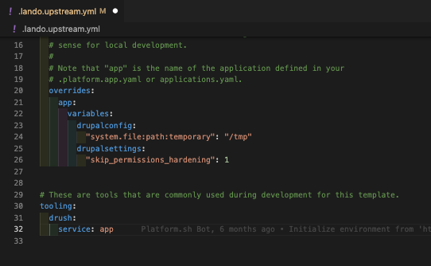

In the [Lando documentation](https://docs.lando.dev/core/v3/) you will find information on the 'order' Lando executes instructions.  You will find that .lando.upstream.yml precedes a .lando.yml file; in other words, you can tell Lando to do something different in your .lando.yml file and that will out-rule what is said in that  .lando.upstream.yml file.

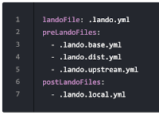

We are going to make a .lando.yml file to do that over-ruling and establish the tooling for Drush service in Drupal.  This is what the file you create should look like and it goes at the same level as the .lando.upstream.yml file.

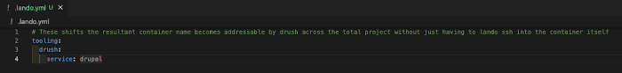

See how under `tooling` under `drush:` we change `service: app` to `service: drupal` in your lando.yml file

Put this new .lando.yml file in the top level or root of our project directory where the .lando.upstream.yml file it over-rides is located; like this -

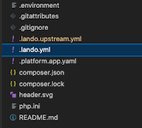

See, you are already brilliant.  You have done VSCode, worked with a lando yml file, and learned about Drush! 
  
[- Next -](../cicd/midpoint.md)
