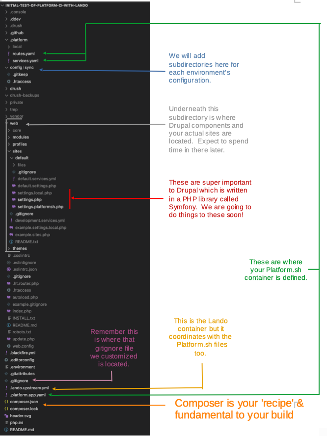

# Directory Roadmap

### Understand where things are and their role

We have mainly done this so far by selecting options and running commands in our terminal while pointed at the 'root'.  VSCode gives us a view into the many directories supporting our project.  Soon we are going to be finding files in some of those directories and clicking on them to open and edit them.  For that reason it makes sense to have a general understanding of what stuff is where and a little about what that stuff does.  

 This is important!  Knowing where to look for things in a Drupal project will be very helpful with certain things.  You might jump back to look at this map occassionally even after your basic set up is behind you.  

NOTE: There are ways that the directory structure of Drupal can be different on various sites, especially as versions have moved forward.  Don't let that throw you.  And if you happen to come from a Symfony developer background don't let Drupal's unique structure approach differing from what you are use to throw you.  Especially since both are used to [using the 'composer' packagist dependency to coordinate version compatibility.](https://drupalize.me/tutorial/composer-configuration-drupal)   not for the novice to chase down the rabbit hole, you may benefit from understanding how something called [Drupal Scaffolding](https://www.drupal.org/docs/develop/using-composer/using-drupals-composer-scaffold)  be used to cross-map directory structures.

Green line If you look down the directory list top left, you move past Drush and GitHub which we have already discussed.  You see Platform and that directory is opened to show some of its subdirectories.  This is where Platform.sh has put most of what it needs as your host talks to your local project.  Notice the 'routes.yaml' and the 'services.yaml' files tucked here under the '/platform/local' subdirectory.  You will also see the 'platform.app.yaml' file right at your project root.  These three files are fundamental and we will talk further about them in a future section.

Red line We see files under the '/sites/default' subdirectory with a php extension on them.  To a large extent Drupal is written in php and these files are central to the basic workings of your website.  Soon we are going to spend some significant time working on the 'settings.php' and related files.

Pink line We found this [.gitignore](../cicd/gitignore.md) file already and did some important edits in it. 

Yellow line We also noted the 'lando.upstream.yml' and earlier showed how to override it with our own ['lando.yml' file](../cicd/cruisevscode#note-about-the-tool-called-drush)

Orange line [Composer](../book/opensource.md#developer) is fundamental to modern Drupal.  You will run Composer commands from your [VSCode](../book/ide.md) terminal as you install new modules to enhance your project.  Composer is a critical coordinator of how parts fit together with compatible versions of Drupal Core and modules. 

[- Next -](../cicd/configatroot.md)
