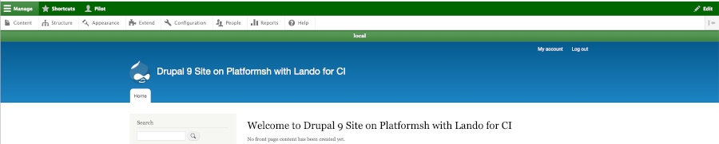

### Know where you are -
# Environment Indicator

## What they do and look like
Any time you are running multiple environments, there is always a risk of not being clear where the heck you are looking and working.   There is a contributed module that we are going to install and enable that is meant to give you signals to tell you which environment you are seeing; it is called the Environment_Indicator module.

The Environment_Indicator module shows the names you have given the environments, and color bands some of the things like toolbars to send a strong message of where you are. In the first example you see how our 'main' environment shows that name in a red band.  Don't worry this is only when logged in as the Administrator; users see a normal site. 

For our 'local' environment we see that name in a green band signaling it is safe to work in here.

 
 
 
## How you install
You install and enable the module with composer as usual.

`lando composer require 'drupal/environment_indicator'`

`lando drush en environment_indicator`

NOTE: remember `lando drush cex` either now or after the additional setup to export the updated configuration to YML files. 

I also did a 'stage/commit/sync' from lando to move the installed/enabled right into GitHub where Platform.sh did an updated deploy.  Then I went into the Platform.sh deployed site and looked to confirm it was there under Recent Activity.

After you install and enable the environment_indicator module you can go to the Configuration on your Administration menu and in the section called Development and the new module should appear right after "Configuration synchronization".  Notice Configuration Split settings are right above.

Since you haven't named your environment yet, nor set up alternatives, if you look at the top bar on your site you will probably see some long-string-of-letters-and-numbers that represent a container build environment.  We will be doing configuration of the environment_indicator module and this will being to move toward a more sane environment name.

 
 
 
## Who sees these indicators

Before we get into configuring the names and color indicators of different environments, lets take a look at an area we haven't talked about so far.  There is a menu item under Administration called 'People' and what this addresses if the 'who can do and see what' on a Drupal site.  There are four default standard roles; you can make more if you need, but that is beyond the scope of the immediate need.  An 'Anonymous User' is self explanatory.  An 'Authenticated User' is someone who is logged in.  A 'Content Editor' typically is granted permissions to do lots of other stuff on a site and putting in text, images, etc. would be common.  You are the 'Administrator' and you have permission to do everything. 

Right now, the only one who can config the Environment_Indicator is the 'Administrator'.   This is common for foundational level items around building a website.  So it is not surprising that the Config_split and even the core Configuration Manager configurations are under the control of the 'Administrator'. 

For more on the [Environment Indicator Module"]( https://www.drupal.org/project/environment_indicator) you can watch this [video](https://www.youtube.com/watch?v=8WbP9ZYxAx0)

[- Next -](envsettings.md)

