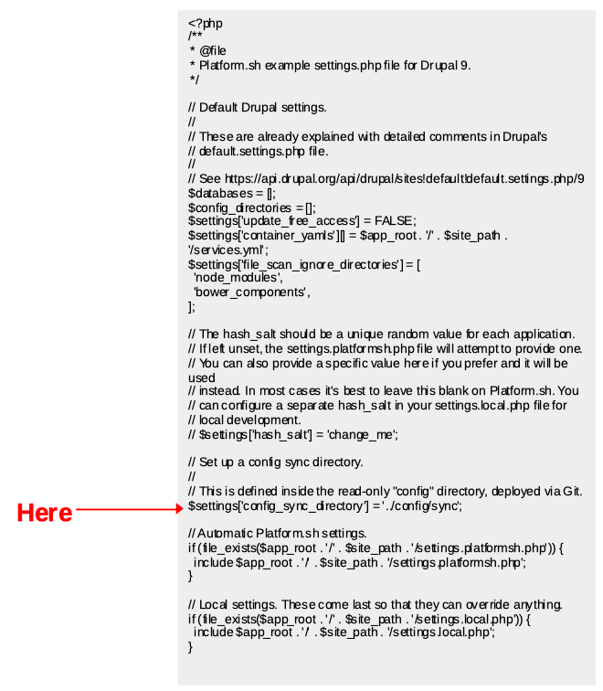
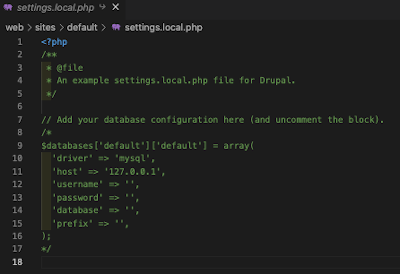
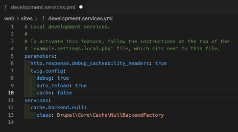
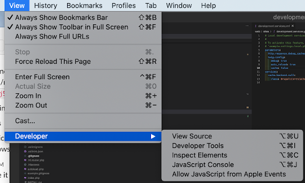
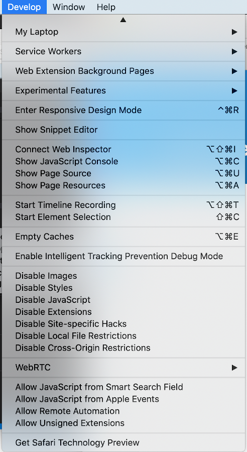
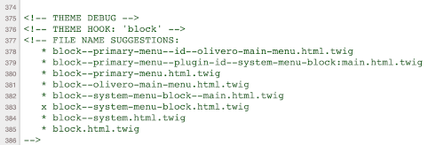
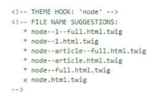

# Modify the settings.php file to tell the application about the different environments -

We have homes for our base configuration (sync) and sibling directories for unique configuration differences we may want in 'main', 'staged', and 'develop' environments.  Within that config_split module we just installed there are ways to name and point to those environments plus a checkbox to indicate when one is 'active'.  However, it is sort of a pain to try to remember which one we are in and to then jump to the right split and check the box in the right one.  Therefore, we want to set things up to do that automatically.  To do that we will tweak our settings.php file by inserting the following code right after the line  $settings['config_sync_directory'] = '../config/sync';

This code you  insert first assures the 'active' checkbox for all config_splits are unchecked, then detects the environment you are in, and based on that environment flips the checkbox to 'active'. 

code image

The above syntax sets all the splits to 'inactive' as the starting point.  Then it grabs the branch name from Platform.sh once detecting you are in that environment and checks that in the "switch case" checks to set the correct environment indicator colors and name plus active that environment in the config_split module.  NOTE:  Two key "watch outs" if you want to edit any of this.  Like any code syntax, make sure you use and actual editor tool or terminal and NOT a word processor; a word processor using slightly different characters underlying those things that look like single or double quotes and will mess you up. Second, if you add more "case" conditions, it is critical that those sections end in a "break" statement; with a "break", once a condition is found it stops searching but without the "break" it will likely 'activate' the found case condition PLUS the default local Lando case even if you aren't local. 
"Configuring the Environment Indicator for Drupal" video instructions:
https://www.youtube.com/watch?v=8WbP9ZYxAx0

## While in the settings.php file, check this -
As long as you are in and editing your settings.php file, take a look at the end of it and see if you find these lines of code:
// Local settings. These come last so that they can override anything.
if (file_exists($app_root . '/' . $site_path . '/settings.local.php')) {
include $app_root . '/' . $site_path . '/settings.local.php';
}

Good likelihood they are there and just make sure they are NOT commented out.  If not there, just add it at the very end of the file; for now, because we are going to put one item even later.  The role of this syntax is to call the settings.local.php file for any customizations that are unique to your local environment.  Be aware, some local changes can be handled by your  'yml' files but a couple, like 'css' and 'js' aggregation settings, are handled more directly in a settings.local.php file. 
Remember that we really only want the stuff in settings.local.php to happen within the 'local' machine-environment.  But if it sat over in our GitHub repository, it could be found by the call being made at the end of that settings.php file.  So the way to handle that problem is NOT to have a copy of it over on GitHub.  If you remember our gitignore file at the root of our total project (e.g. same level as composer.json and composer.lock), somewhere about line 14 we had already instructed NOT to save this file in our GitHub repository.  You can go look in your repository under the /web/sites directory on GitHub for your project to assure it is not there. 
Let's also run another clean up step on our local Lando copy of the project we brought down from the template recipe.  Mine has a setting.local.php file locally that has all its content commented out and it looks like this --

We have already been using our local Lando copy of the Platform.sh 'main' environment of our project, so I didn't see a need for the "$databases …" code block in here but thought I would check with Platform.sh personnel on their Slack channel and heard confirmation;  "If you use Lando’s Platform.sh recipe, Lando will recreate the PLATFORM_*  environmental variables, as well as read your .platform.app.yaml configuration file so your project will be set up and run the same as on Platform.sh without having to change settings. I believe the settings.local.php is only used if you aren't using the platform.sh recipe and was created from before the platform.sh was developed."  
Go ahead and delete the current settings.local.php file on your Lando local environment copy of your environment.  We are going to make a new one with the benefit of the goodies in your example.settings.local.php file instead.   Just so you are thinking about how to manage it, if like me you get a denial from VSCode trying to delete it directly to trash and then an "EACCES: permission denied, unlink" error when to try to force the issue, instead just try revealing it in 'finder' and you should be able to trash can it there after a request to enter your 'Mac' password. 

But you are going to call settings.local.php, but one of your own making -
(REVISIT LOOKUP ITEM)
The settings.local.php file that comes with the Platform.sh Lando Drupal 9 template is arriving via a reliance of that template on what is known as Drupal scaffolding.  Sort of a good thing, just not for one of the things we want to do.  In the prior section we deleted the existing settings.local.php file because you don't need the database stuff in it the way Lando shares information from Platform.sh's credentials.    What you will find in the same location is another file called my-example.settings.local.php and you can just copy it and rename it to settings.local.php in your local Lando copy of your project.  NOTE: You will do this any time you need to pull down a new copy of your project and want to set up your local environment for Development.  To be clear, we are not talking about having to do this every time you do a Git-GitHub 'stage/commit/sync' update between local and host.  First, that would be a pain.  Second, remember that settings.local.php is marked as a local only file in the way you have your gitignore set so it is only going to come from the host up to your local machine with a complete project pull from the host. 

What's in this magic settings.local.php file -

To be clear, you can do other stuff in this file that are your personal preferences.  And you can not do some of the stuff in the example by just commenting it out.  But here is what it has ...
Remember that we are fundamentally doing this so the Lando local machine-environment is set up for development.  Normally the positive things about how Drupal is set up for security and performance are actually things that work against development.  So we need to flip some switches the other way.  Ideally find the example.settings.local.php file in your local copy of the project and edit as follows; otherwise create your own new file with the examples name version of this file and put this stuff in it.
You will want to see a call to the development.services.yml file.  Some stuff needs to be set here at the php level but others can be handled in yml form and we call this file to make sure to do those things.
/**
* Enable local development services.
*/
$settings['container_yamls'][] = DRUPAL_ROOT . '/sites/development.services.yml';

Now we are going to deal with an idiosyncrasy you might not find a lot of information about elsewhere; an artifact of the Platform.sh Lando Drupal template using the Drupal Scaffold build process.  What happens with the scaffold build is that every time your do a composer update or a container rebuild, the scaffold instructions overwrite the development.services.yml file with a fresh copy from the template.  While that sort of sounds good, being fresh and all, what it means is that any customization you have done to that file gets overwritten.  And we are planning to do some customization for the local environment so this would be a problem.  There is a fancy way around this by suppressing the overwrite in composer and if you want to go that way look at "Appendix: Drupal Scaffold ("overwrite": false) solution".  What we are going to do is add the statement below just following the call to the standard development.services.yml file noted previously in our  settings.local.php file.  What this will do is call our personalized my-development.services.yml file that is NOT in our gitignore (thus secured in your GitHub repository) and it not part of the Drupal scaffolding process (so is not overwritten on update or rebuild).

/**
* Enable our personalized local development services. Not subject to the idiosyncrasy of
* Drupal scaffolding update or rebuild overwrites.
*/
$settings['container_yamls'][] = DRUPAL_ROOT . '/sites/my-development.services.yml';

We will be revisiting this rename workaround approach to deal with Drupal scaffolding overwrites one more time when we save our work here and below in an example.settings.local.php copy we which to secure.

In the process of site development you are likely to want to look at logs that are generated by Drupal to figure out why something you did isn't working the way you thought it should.  Logs can be cryptic.  So turn on a more narrative version of them.
/**
* Show all error messages, with backtrace information.
*/
$config['system.logging']['error_level'] = 'verbose';

CSS is used to pretty up HTML and JS (JavaScript) adds some functionality, perhaps like animation or logic, to that.  Front-end developer use both, in combination with TWIG, to make your website design come to life.  Code for both of these is pretty narrative with open spaces and a reasonably understandable style.  The tradeoff is that the code doesn't tend to be very compact and aggregation is sort like the ZIP file of these two types of code.  You don't want to try to read and work with a compressed and minified version of either during the development of your site, so you want to turn this aggregation off on the 'local' machine-environment. See also Appendix: Using Advanced Aggregation Alternative.

/**
* Disable CSS and JS aggregation.
*/
$config['system.performance']['css']['preprocess'] = FALSE;
$config['system.performance']['js']['preprocess'] = FALSE;

Drupal using a number of cache strategies to improve performance. If you want to dive down a rabbit hole for a week or so, go to the Drupal.org site and read the extensive detail about all the things you can do.  For our purposes however, we just want to uncomment the render cache, internal page cache, and dynamic page cache lines in the example.settings.local.php file (or add them if they don't exist) 
/**
* Disable the render cache.
*
* Note: you should test with the render cache enabled, to ensure the correct
* cacheability metadata is present. However, in the early stages of
* development, you may want to disable it.
*
* This setting disables the render cache by using the Null cache back-end
* defined by the development.services.yml file above.
*
* Only use this setting once the site has been installed.
*/
$settings['cache']['bins']['render'] = 'cache.backend.null';

* Disable Internal Page Cache.
*
* Note: you should test with Internal Page Cache enabled, to ensure the correct
* cacheability metadata is present. However, in the early stages of
* development, you may want to disable it.
*
* This setting disables the page cache by using the Null cache back-end
* defined by the development.services.yml file above.
*
* Only use this setting once the site has been installed.
*/
$settings['cache']['bins']['page'] = 'cache.backend.null';

/**
* Disable Dynamic Page Cache.
*
* Note: you should test with Dynamic Page Cache enabled, to ensure the correct
* cacheability metadata is present (and hence the expected behavior). However,
* in the early stages of development, you may want to disable it.
*/
$settings['cache']['bins']['dynamic_page_cache'] = 'cache.backend.null';

We are going to be installing and enabling a bunch of modules as we work on site building in Drupal.  We are going to be running tests as we do development to make sure stuff works.  We want to allow this in the 'local' Lando machine-environment.

/**
* Allow test modules and themes to be installed.
*
* Drupal ignores test modules and themes by default for performance reasons.
* During development it can be useful to install test extensions for debugging
* purposes.
*/
$settings['extension_discovery_scan_tests'] = FALSE;

A you potentially going to mess things up in development at some point that your site won't come up and you therefore can't get to the Administration page to clear caches and fix it and rebuild?  Probably. You know "drush cr" so after you do some code fixes you can do that and rebuild.  But another option has been established for rebuild access if you set your configuration to TRUE.  Here is more exploration about it https://www.drupaleasy.com/quicktips/just-case-drupal-8s-corerebuildphp

/**
* Enable access to rebuild.php.
*
* This setting can be enabled to allow Drupal's php and database cached
* storage to be cleared via the rebuild.php page. Access to this page can also
* be gained by generating a query string from rebuild_token_calculator.sh and
* using these parameters in a request to rebuild.php.
*/
$settings['rebuild_access'] = TRUE;

A security feature of Drupal is site hardening.  If that is on, you probably can't do site development work.  So you want to set 'skip_permissions_hardening' to be TRUE and in the 'local' Lando machine-environment you should be able to do your work.
/**
* Skip file system permissions hardening.
*
* The system module will periodically check the permissions of your site's
* site directory to ensure that it is not writable by the website user. For
* sites that are managed with a version control system, this can cause problems
* when files in that directory such as settings.php are updated, because the
* user pulling in the changes won't have permissions to modify files in the
* directory.
*/
$settings['skip_permissions_hardening'] = TRUE;

We want to secure this example.settings.local.php file and run into that Drupal scaffolding overwrite issue with it too.  So rename it to my-example.settings.local.php file and save it locally.  When you stage/commit/sync you should find it safely sitting in your GitHub repository.
The my-example.setting.local.php file you were editing is in the /web/sites directory.  You want to make a copy of it and put it in your  /web/sites/default/ directory.  Then you want to rename that copy to settings.local.php.  Now it should be good to go and work when needed locally.  But the renamed copy won't go to GitHub or your Platform.sh host environments because your gitignore file told it not to.  You do, however, want to retain that my-example.setting.local.php file in the /web/sites directory because it will be pushed to your GitHub repository where anyone else who needs it can copy it and set up another local Lando machine-environment (e.g. you want to work from another laptop, you have a helper work on something for you, etc.).  NOTE: You may need to jump to the file you want to copy, move, and rename in your Mac finder if your permissions in VSCode make doing it there a pain; your finder will let you do it and just ask for your password to approve the permissions.

Now that your setting.local.php file is set to work, you want to move forward on editing the my-development.services.yml file that it calls.  Go back into the /web/sites to find the development.services.yml file make a copy of it and rename the copy to my-development.services.yml or make a file named that in that directory if you don't have one.  Basically what you want to do in this file is set your 'twig.config' debug to true its reload to true and its own cache to false.  Take a look at the example below with all the syntax; the leading and ending stuff probably already in the file copy that was in the Platform.sh Lando template you started with. 

Here is a pretty solid article on the overall steps you are taking to set up your development situation.  It isn't specific to the Platform.sh Lando container world we outlined here but it gives you another's perspective for a second explanation. https://patrickmichael.co.za/drupal-8-9-set-development-environment  Just remember when you look at this article or others, you need to do what you want to customize your local environment within the my-development.settings.yml because of the scaffolding overwrite issue.
In case you aren't familiar with Drupal at this point, a quick explanation of what you just did and why may be helpful.  Drupal is written in a language called PHP and more specifically a flavor of that language called Symfony.  These talk to a database where your content is stored and even some parts of configuration like we pulled out with all that configuration stuff.  The database is typically something like mySQL and pretty functional and scalable; part of why Drupal is popular with large, sophisticated websites.  You will have fields of information along with images and that sort of thing stored in the database and PHP will talk to the database to grab what is needed when.  Lots of times those fields and images will be what you want to make up and display on a page; other times the fields are more instructions to trigger actions you want to happen even if not ultimately displayed.  Pulling that stuff from the database and putting it on a webpage involves HTML,  CSS and JavaScript because they talk well to web browsers like Chrome, Safari, FireFox, Opera, etc.  But it can involve some pretty detailed coding to get PHP talking to those other languages to talk to a browser.  Luckily, this is where you really benefit from the contributions of others in an Open Source software world.  Someone else has already written base themes that do this sort of thing and are made up of a bunch of templates for different page looks, feels, and functionality.  The templates most fundamental are written in TWIG; a very simple and basic language that you will probably mess with at some point.  You can do a lot to make the base templates be uniquely your own just with HTML, CSS, and JS and your site will establish its own article, basic page, blog, forum, e-commerce or whatever else you want.   However, sometimes you will want to tweak a template a step further and have it as a slight variation from what your own standards have established for your site.  TWIG is where you can 'clone' a template and then do an alternative version of your very own.
When you want to do something to a TWIG template clone, you need to know the general practice in Drupal is look for unique and if you don't find it default to the then level up a chain to most generic.  But it is important to know how to fit your clone in to that naming chain process and that is basically what you just turned on with the 'twig debug true' you set for your development environment.  What it does is let you go into your browser's developer view. 

In Chrome, look under "View/Developer/View Source"

In Safari use "Develop/Show Web Inspector"

You will see all sorts of code familiar to someone who knows HTML, CSS, and JS.  But you will also see some lines that indicate a THEME HOOK: and this is telling you the TWIG template controlling that page or page section.  The one with a'X' in it is the name of the active one.  The ones with the '*' on them are alternative names that will be recognized in the chain.  Move from the 'X' upward and it gets more specific and you can grab one of those to call a uniquely customized alternative of a template.  The process is basically copy the 'X' template, rename the copy to the more unique name, edit the uniquely named copy.  Your copy will be called first and if not found, it will default back to the base template.  
Here are some examples of what you will see.

We aren't going to dive any further into this TWIG template and theme stuff here.  Just an exposure to what you have set up in your development environment by the actions you took on the development.services.yml file.

[- Next -]()

