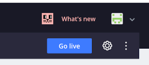
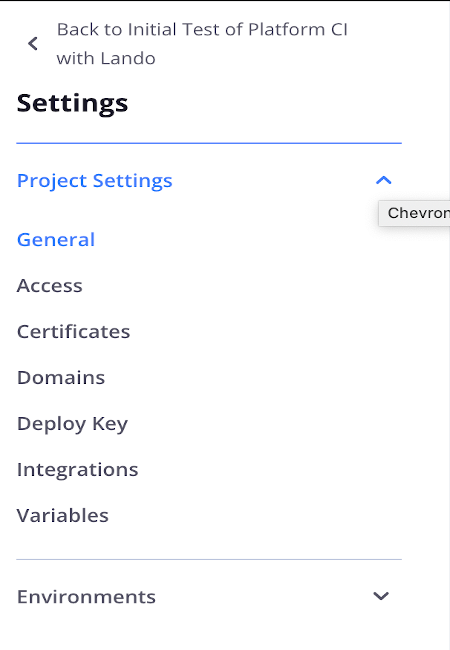
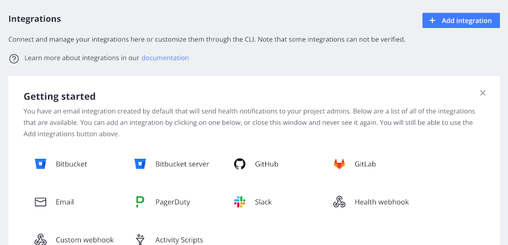
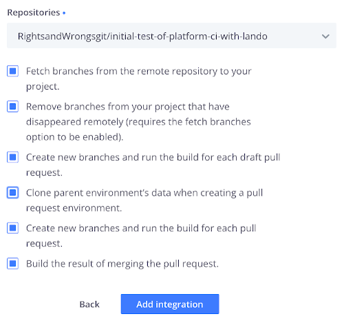
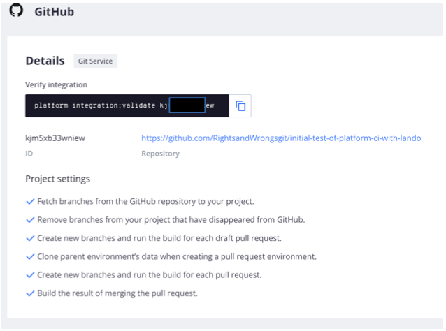
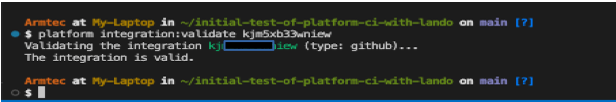
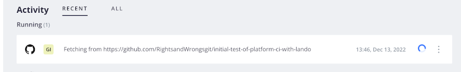

# Appendix:
## Reestablishing your GitHub-Platform.sh Integration

If you have an expired connection and your workflow updates are making it from local Git to your GitHub account but not Platform.sh, do this …

From the project main page click on that cog wheel in the upper right corner.

Under Settings, expand the Project Settings list and select 'Integrations'.

Click on the GitHub options…

When it asks which repository, just pick the one you are having an issue with if you have several.  Check the options for the control level you are willing to provide.

After you click "Add integration"  you will see a list of those you have.  Very likely you already have an email integration on the list because you are set to receive update notices from Platform.sh about your project's status.  But you now have a Git integration and if you click on it you are presented with the command syntax to copy and then paste in your terminal to confirm the integration is valid and works.

Run it from the command line and you should see something back that looks like this.

And if you go back into your Platform.sh account and look at your project you should see it building or running...

