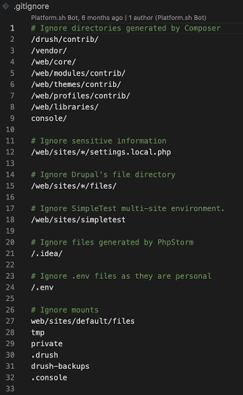

#### Where we stand at this point
We have our base Drupal project with 'main' branch set up on our Platform.sh host.  We have a local version of that project available on our own machine within a Lando supported container.  We have a GitHub account and Git installed globally plus VSCode installed from our [Prerequisites.](../cicd/prerequisites.md)    A `.gitignore` file is at the root of our 'local' project that came as a standard part of the Platform.sh Lando template.  

You probably will find it convenient to use [VSCode](../book/vscodedrupallocal.md) at this point to start working with your local project.  

# Do more with .gitignore

Look at the standard default .gitignore file already present at our project root.  It should be at the very top level of your project on your local machine; the same level as the composer.json and composer.lock files.  Don't be surprised that there are other .gitignore files in various subdirectories that we also automatically installed from the template; but you want to use that top one.  It should look pretty close to this:

That is a good start for a plain vanilla Drupal site that isn't being worked on but your site will likely use some other stuff with it that really doesn't belong in the GitHub repository.  The simplest example is something we already started to use, VSCode, and have no reason we want to push its IDE generated files to our repository.  What we want to do is change line 20 to a broader perspective of tools and then add some others under it:

`20      # Ignore IDE files`  
`21      /.idea/` 
`22      /.vscode/` 
`23     *.code_workspace` 
`24     *.iml` 

Make a space line at 25, then below that lets ignore all packages required by JavaScript with:

`26     # Ignore mode modules` 
`27      node_modules` 

Space, and since we may use SASS in CSS generation we can ignore some of the files used in its debugging:

`29      # Ignore some CSS related stuff` 
`30       *.css.map` 
`31       *.css.map.map` 

Space and since we have no reason we want to push our log files to the repository:

`33      # Ignore all log files` 
`34       *.log` 

Finally, at the end, lets just avoid pushing up unnecessary text files by adding these:

 `# Ignore default text files` 
&nbsp;&nbsp;&nbsp;&nbsp;`/CHANGELOG.txt` 
&nbsp;&nbsp;&nbsp;&nbsp;`/COPYRIGHT.txt` 
&nbsp;&nbsp;&nbsp;&nbsp;`/INSTALL*.txt` 
&nbsp;&nbsp;&nbsp;&nbsp;`/LICENSE.txt` 
&nbsp;&nbsp;&nbsp;&nbsp;`/MAINTAINERS.txt` 
&nbsp;&nbsp;&nbsp;&nbsp;`/UPGRADE.txt` 
&nbsp;&nbsp;&nbsp;&nbsp;`/README.txt` 
&nbsp;&nbsp;&nbsp;&nbsp;`sites/README.txt` 
&nbsp;&nbsp;&nbsp;&nbsp;`sites/all/modules/README.txt` 
&nbsp;&nbsp;&nbsp;&nbsp;`sites/all/themes/README.txt` 

Since we are storing our site content in the database at the Platform.sh host and will have a backup procedure at that host site, we don't want to be pushing potentially voluminous content to the repository and want to add these final lines:

`# Ignore path that contain user-generated content.`
&nbsp;&nbsp;&nbsp;&nbsp;`sites/*/files` 
&nbsp;&nbsp;&nbsp;&nbsp;`sites/*/private` 

You should basically end up with something that looks a lot like this.  Of course if you know of other tools you might use you might add more.  If you want to make a public facing repository you might want to keep a README or a MAINTAINER text file to help people.  

#### Removing something you already added to a repository:
As a quick reference note, you might have done a 'git init' and pushed some files that you now wish you hadn't and plan to edit your .gitignore so they don't go up in the future.  You might try this to remove items; 'node_modules' is the example.

`git rm -r --cached node_modules`

What does this do? 
-r flag assure command is applied recursively to all files and subdirectories in node_modules directory 
--cached makes sure we remove the files only from git index and keep them in the working directory.  

## Now let's do that 'git init'

It is assumed you had installed the basic prerequisite of 'Git' itself on your machine before you started.  While GitHub is talking to Platform.sh and Lando's recipe pull from Platform.sh has the project local, you need to make sure that the local project is talking to the GitHub and Platform.sh repositories of that project; this is where your local copy of Git comes into play.  Move into the top directory level of the project (not the lower level 'web' directory itself but the very top) and run a 'Git Init' command. You could do this by using the terminal in the lower right of your VSCode IDE or using its GUI this way:

&nbsp;&nbsp;&nbsp;&nbsp;• Open Visual Studio Code. 
&nbsp;&nbsp;&nbsp;&nbsp;• Put your cursor in and 'click' on the top level directory of your project 
&nbsp;&nbsp;&nbsp;&nbsp;• Select 'shift-command-P' and the command pallet will open 
&nbsp;&nbsp;&nbsp;&nbsp;• Start typing `git init`, see “Initialize Git Repository” in the bar; select and run. 

[- Next -](../cicd/cruisevscode.md)
