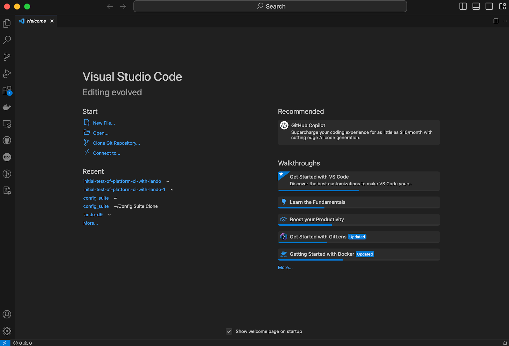
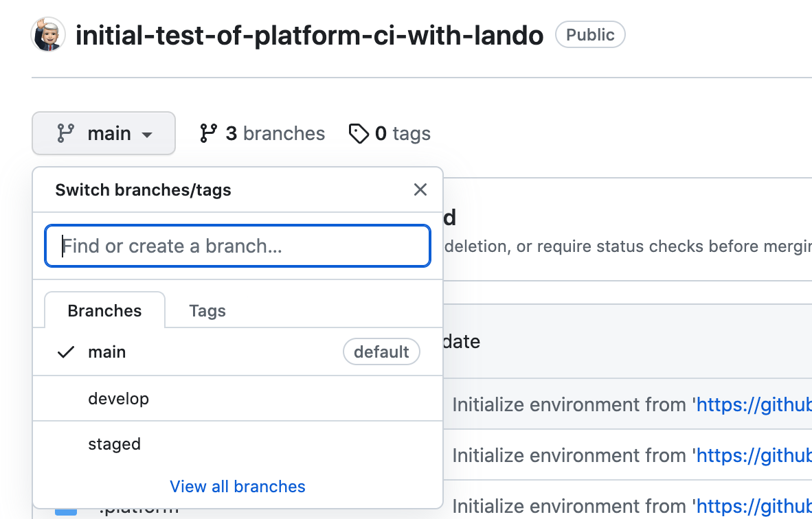
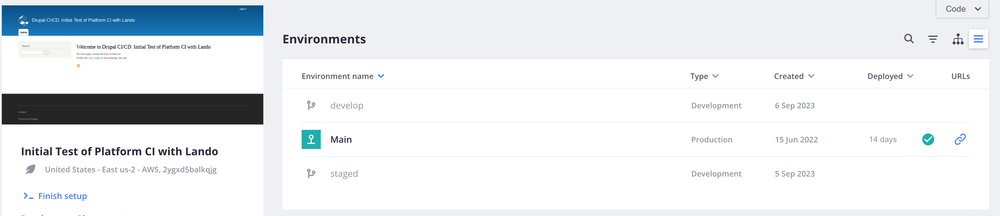
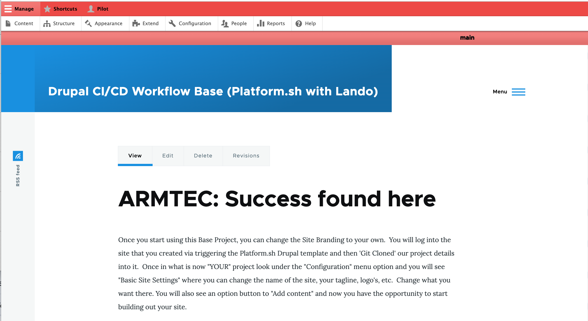
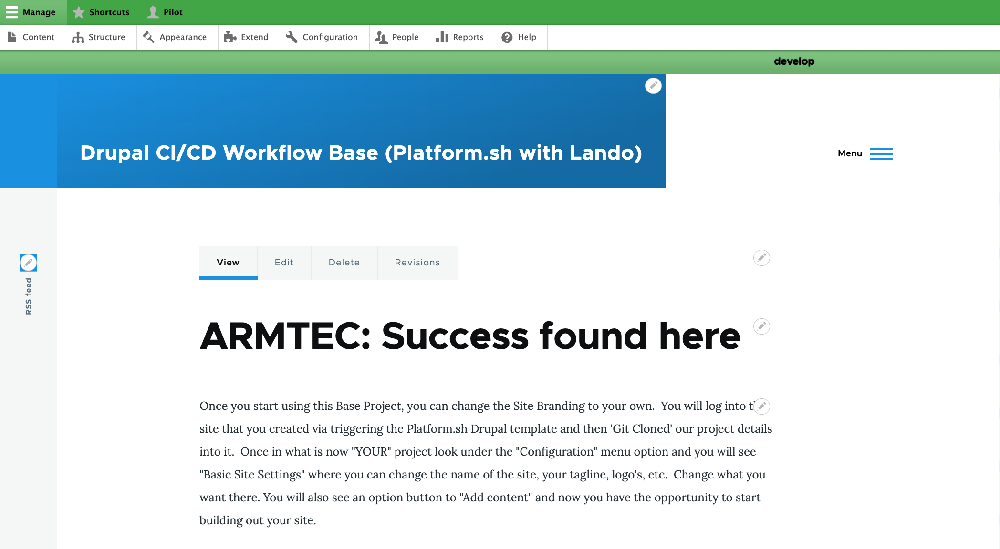
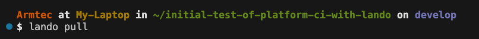

# Drupal CI/CD Start Point

This should be viewed as your 'Quick Start' to setting up a Drupal hosted website pre-configured to follow basic [CI/CD Workflow principles.](../book/drupalcicd.md#what-is-cicd)  There is a complete documentation outline on [how all this is put together which you can move through page-by-page.](cicdoverview.md)  But here you are just going to be given the most basic of steps to simply dive right in. 

Make sure our local machine is set up like [outlined in the first part of the documentation.](/book/Novice.md#setting-up-your-basic-system) 

## Make Your Own Copy

[Create a GitHub account.](https://docs.github.com/en/get-started/signing-up-for-github/signing-up-for-a-new-github-account)  I assume you could use GitLab or BitBucket or any other Git Repository that you confirm has an easy connection with Platform.sh for our later steps; but I have not confirmed any of the alternatives.  

[Establish an SSH connection.](https://docs.github.com/en/authentication/connecting-to-github-with-ssh/adding-a-new-ssh-key-to-your-github-account)You want to make it smooth to connect your local computer to a GitHub repository without constantly typing a password.  There is a computer-to-computer secret code handshake call SSH that does that.  You want to set it up by clicking on the little picture in the upper RIGHT HAND corner of your GitHub account page and a menu pops open.  Near the bottom of the list click on the "Settings" option. A menu will open on the left side of your new screen which includes a "SSH and GPG keys" item about midway down.  Select that and follow the steps. 

 

[Find our "Public Template" on GitHub.](https://github.com/RightsandWrongsgit)  Pick the one that is called "initial-test-of-platform-ci-with-lando". 

 

[Make your own project repository from that template.](https://docs.github.com/en/repositories/creating-and-managing-repositories/creating-a-repository-from-a-template)  Basically just go over the right side on that main project bar and click on the green "Use this template" pulldown.  

 

Then select the <b style='color:white;'>"Create a new repository"</b> option. 

 

You will see an "Owner*" box with a pulldown where you should select the user account you set up.  And to the right you will see a "Repository name*" box where you will enter whatever you want to call YOUR PROJECT. 

It will ask you about what you want for your project visability.  Mainly, at this point, you just need to indicate "Public" or "Private". If you are headed toward some enhanced version of the base template we provide where you enable a bunch more stuff out the gate to make your own 'super template' starting point set to your individual preferences, you might make it "Public" for easy sharing with others.  But if you are building your own personal site, even if that will involve inviting other team members to work with you on it, you probably want to make it "Private".  There are a bunch of [other visablity setting options you can learn more about here.](https://docs.github.com/en/repositories/creating-and-managing-repositories/about-repositories#about-repository-visibility) 

Then just click <b style='color:white;'>"Create repository from template".</b> 

## Add Project to Platform.sh

Sign into Platform.sh with GitHub. Platform.sh offers several alternatives for how to sign-in.  Please use the "GitHub" option using the GitHub account you just set up.  That will make things continue to flow easily. 

 

From the Platform.sh page, you want to click on "Create Project", that blue box in the upper right corner. 

 

It asks you if you want to use one of Platform.sh's own templates or "Create from scratch".  Don't be confused by the fact GitHub calls our repository a template.  As far as Platform.sh is concerned they consider this as us wanting to Create from scratch so select that option. 

 

Give your new project a name here too; ideally the same as you called it on GitHub when you renamed the code you brought from the repository template.  You want to make sure that the "Main production environment" is called 'main'.  That is used very specifically throughout the working functionality of the CI/CD workflow process; so now is NOT the time to get creative.  Then select the Region you want your server host to reside for this project.  I tend to the geographically the closest. 

 

You are likely to then see a plan and pricing notice from Platform.sh.  Often they are running a trial period that is free for like 30 days just to see if you like their system.  If you use that, remember to change to a paid account before your 30 days is up to save your project going forward.  The low price in the example is for a development plan.  Once you would assign a URL via DNS set up to a project to make it live, the rates go up. 

 

When you click "Continue" your project will start to build.  It won't take long in this first round because there is really nothing there yet in terms of the code we will bring in shortly. 

 

The next flash screen that pops up may or may not be helpful.  That first step, to "Download the CLI", is a good one if this is your first time using Platform.sh because it sets up the CLI or Command Line Interface.  

 

You will use that later while working with your project on you local machine because it offers from convenient shortcuts. So install it as instructured. 

 

The rest of the stuff we will accomplish via things already set up in the project you will pull in from GitHub, so after you install the CLI, just "X-out" of this screen. 

 

Once you are at the basic project screen for your new project, you will find it has a blue "go live" button and to the right of that a little Cogwheel.  Click on the Cogwheel to open settings options. 

 

There are two main options under settings, "Project Settings" and "Environments".  Click the "Project Settings" option to open its pulldown menu up. 

 

Near the end of that menu you will see the critical "Integrations" option; select it. 

 

That will pop open a screen showing some integration options and features.  You want to go to the blue button in the upper right saying "Add integration" and click on it. 

 

Click this button... 

 

This leads you to the "Select integration" options and you will hit the "+Add" under the GitHub option. 

 

That will lead to a "Configure your integration" screen asking for you to input a GitHub Access Token. 

Keep that page open and click the "Generate a new token" so it opens in a new browser tab. 

## Token from GitHub

Go to your project on GitHub. In the upper-right corner click on your profile photo, then click Settings. When the left sidebar opens, way at the botton of the list click Developer settings. Then within that left sidebar, click Personal access tokens. Click Generate new token. You will see a short list with things like GitHub Apps, OAuth Apps, and Personal Access Tokens; click the down arrow of the later and you will see options.  Most likely you will want the "Tokens (classic)" option unless you want to dig more into what was a "beta" test alternative as this is being written.  

Do take advantage of the "Note" box and write something like Platform.sh integration into it just as a reminder what this token was generated for.  The duration of the token is something you should make a careful choice about in that "Expiration" pulldown.  Too short and you will be back trying to figure out how to regeneration & restore, too long and you have a security risk. 

 

The options available with Token's would be a book in and of itself.  They are listed with the continued screen shots but you are likely to just leave them in default settings as you start out. 

## Bring Project Local

What we have done so far should be agnostic as far as which IDE (Integrated Development Environment) and which local Container system you might use.  Our prerequistes point to VSCode as the IDE and to Lando as our local container environment; but is you know what you are doing you might use PHPStorm and DDEV as example alternatives.  There are some Lando files in the repository but they shouldn't interfere it you want to head off on your own. 

For most people, now is the time we want to make sure you have installed [VSCode](https://code.visualstudio.com/) on your local machine and have globally installed [Lando](https://lando.dev/) as well.  The example details going forward will be leveraging both of these.>br>

<b style='color:white;'>Open up VSCode.</b>  It should look something like this. 

 

<b style='color:white;'>Git Clone your GitHub Repository.</b> There is a "Clone Git Repository" Start option right on the main screen you can click and it opens the Command Palette at the top of the page with the Clone from GitHub prompt (Remember we set up a local machine SSH connection to GitHub earlier).  Click on the "Clone from GitHub" prompt and it will bring up a list of the projects you have on GitHub that you can clone.  Look for what you <b style='color:white;'>NamedYourProject</b> 

 

If you click on the little icon that looks like two pages from a book in the upper left from that start page. 

 

You will open up the editor but since you didn't Git Clone yet, there will be nothing to edit.  The good news is that if offers another chance to "Clone Repository" to grab your project's code from GitHub. 

 

If you stumble along and think that the way to get to the code is to open the "Terminal" you might click that toward the right end of the VSCode menu bar.<br.

 

That will open the third pane in VSCode to show the Terminal in the lower right section with your command line. Note that we had previously modified our command line to show the "User at Machine in Directory by Environment" with color coding; [you can have that "Where am I" prompt if you want.](../book/WhereAmI.md) 

 

If you have actually Git Cloned your project you will see the directory structure with files in the left-hand panel of VSCode.  If you were to click on a file you would see it's content in the upper right panel.  And the Terminal will be in the lower right panel or you can click "Terminal" from the menu bar and it will be as noted earlier. 

 

Stop and study that screen shot for a moment.  There are some things you need to check carefully.  At the top of the page and the top of the left panel 'Explorer' it shows "initial-test-of-platform-ci-with-lando"; YOURS SHOULD NOT!  In the prior steps you were shown how to make a copy of the project template and give it your own project name... the name you gave your project is what should be showing up. 

Now look in the upper right panel and it is blank or empty.  That is because you haven't pointed at any file from the directory list in the left panel.  If you don't see the directories and files in the left panel, click on that icon that looks like two pages from a book and the list will show up.  Then go down that list, find a file, and click on it.  That file will open in the upper right page so you can see its contents. 

Finally, look in the extreme lower left corner and it says 'main' just to the right of the tiny blue box with opposing arrowheads.  That says you are on the 'main' branch.  You DO NOT WANT TO WORK FROM 'Main". 

## Make some Branches

Go click on that word 'main' and the command palette should pop open.  Otherwise do a "Command-P" to open it and start typing "Create...".  When that box asks you for the name of the branch you want to create type staged 

You should then see the clone of your project is now on the 'staged' branch; see that lower left corner. 

See that little cloud next to the name 'staged'?  Click on it.  What it is telling you is that you have named a branch 'staged' but that it isn't up on GitHub yet and the little arrow in the cloud sends it there. 

Don't be surprised if the cloud looks like it turns into a tornado and spins.  With a project of any size, it take a while to get to the GitHub repository. 

Open another window in your browser and go to GitHub. Click on your project in GitHub.  Where it says "branches", go pull down the list and at the bottom click on 'View all branches'. 

You should see your 'main' branch listed and now a second branch called 'staged'.  

Once you have the 'staged' branch made, you want to make the 'develop' branch.  Here you need to be careful.  The first option to create a branch will simply make 'develop' as another branch off 'main'; a sister branch.  You want 'develop' to be a child of 'staged'.  So you need to use the "create a new branch from" option. 

You will get a command palette box where you will type 'staged' because that is what you want to be the parent. 

You will then be prompted to indicate what you want to name the NEW branch and you will enter 'develop'. 

Now if you go back into GitHub and look at the branches you will see 'main', 'staged', and 'develop'.  The bad news from the list you don't know if 'staged' and 'develop' are sisters or parent-child. 

##### Over to Platformsh

Let's go over to Platform.sh next and see if it tells us anything.  First, if you click on the project you can see it has three branches of the names you provided.  So the good news is the GitHub is updating Platform.sh as expected.   

We see in the prior view that 'main' is deployed but that 'staged' and 'develop' are not.  If it is a first time fresh action it is likely that all three are deployed.  But often you will be going back and doing this process for additional updates and old, inactive versions of 'staged' and 'develop' may exist.  Even though you just brought a new one in from GitHub, if it doesn't automatically indicate it was deployed, you may need to reactivate that branch on Platform.sh  This is not a big deal, just click on the branch so you are in it, and go to that little gear in the upper right corner.  Click on it! 

You will see some options for the branch name, who the parent is, the branch type; if you edit any of these remember to hit save.  But more likely all you are needing to do is scroll down a little more and you will see the reactivate button; click it!  It takes a little while so don't get trigger happy. 

Once 'staged' is done you will see it marked deployed.  Now select the 'develop' branch. 

Click the gear in the up right corner again. 

Reactivate the 'develop' branch. 

Go look at the front page of your project and pull down the environments list to see the hierarchy.  'Main' is the parent of 'staged' and 'staged' is the parent of 'develop'. 

Now you can go to each of the environments and follow the link to that deployed site's address.  If you go to 'main' and log in, you will see the banner at the top indicating 'main' and the color RED to signal STOP... don't be messing directly on this production version of your project. 

Go to the 'staged' environment, log in and you will see the name 'staged' and the YELLOW banner color warning that this is the testing site, so be careful with what you do. 

Go to the 'develop' environment and see that name with a GREEN banner to signal it is your safe work environment.  

If you are NOT logged in, any of the site environments look normal; without environment name or banner colors 

## Initialize Local

You are going to mirror the host environment on your local machine with a [Lando](../book/lando.html) container; thus why you need Lando installed, ideally Globally.  The Lando install should have been part of what you [set up as the foundation for your basic machine.](../book/Novice.html#setting-up-your-basic-system)

You GitCloned your project to bring it to your local machine and you made you way to being in the 'develop' branch which, along with parent branch 'staged' and grandparent branch 'main' also lives on your Platform.sh host.  Just  because the branch files are local doesn't mean they are running in a Lando container.  For that you need to initialize the project.  Make sure you are pointing to the top level of the files you cloned and are in the 'develop' branch; the [informative command prompt we established makes that clear.](../book/WhereAmI.md)   You can do a `lando init \` with the trailing backslash so it doesn't immediately run and takes your next lines of direction.  Then you input `--source cwd \`; again with the trailing backslash to allow the final command.  Then input `--recipe platformsh` and hit return for these commands to all run. 

If you are into a long one and done command line approach just type it all out line this. 

## Retrieve Database

To bring in the database isn't hard but there is one trick you need to be aware of.  Unlike move of the command line menu options where you use your arrow keys to select before hitting 'return', here you need to hit your space bar.  Start out by just typeing `lando pull` and hit 'return'. 

When it ask you questions, move with the space bar to the one you want, in our case we want to import the "database".   And we want our mounts to be to the "/web/sites/default/files" location. 

A whole bunch of lines will float by.  Then it should come back with the "Pull completed successfully" reply. 

Given the run time you probably are reluctant but you really do need to run a `lando rebuild` at this point. 

The good news is that now when it comes back your project should be available at those URLs lando spits back at the end. It may look something like this as a basic site page.  

However, if you log in, it should give your a GREEN go ahead banner color with the environment name 'local' showing. 

## Give it Access & Time

# See how to work

********************************************************************

## The Basics

Try and confirm that this works, and if so, clean this up to be almost as simply outlined with minimal narrative:

- Make sure you have steps 1 to 4 of the overview done.  This gets your accounts set up, your computer configured, and the connections between things in place.

- Clone the CI/CD Workflow Project and integrate it into the generic Drupal install the set up steps put in place.

- Add and run locally the UUID restoration module, disable the UUID ignore module

- Git init the local project and push it, under your own project name, to the GitHub or other repository of your choice

- Follow standard Git procedures to first create the 'staged' environment off of 'main', and the 'develop' environment off of 'staged' so your local Lando environment is dynanamically sync'ed with the Platform.sh hosted 'develop' environment.

- Work using standard Git processes in VSCode to work on your website.

- Use Platform.sh to move a 'develop' you are satisfied with to the 'staged' environment where you will then do any testing before moving it to 'main'

- Publish 'main' to a URL you own using Platform.sh standard DNS management procedures

********************************  NOTES THAT MIGHT ELABORATE THE ABOVE STEPS  ***********************

Once your basic computer is set up with the foundations noted, you are going to sign up with [Platform.sh](https://platform.sh/) as a hosting company.  It offers several key things relative to this project.  First, it is an experienced host of Drupal in a [container](https://code.visualstudio.com/docs/devcontainers/containers) type of environment; this includes the fact they offer a Drupal template with a good portion of what you need.  Second, it already uses a GitOps capability that leverages basic [Git](../book/gitbasics.md) based commands for its [multi-environment](configatroot.md#drupal-environments) workflow plus concurrent code backup within a [Git Repository.](../book/gitbasics.md#git-repository)  Third, they are reasonably priced, especially in the way they offer development accounts at a substantial discount before you go live.   THE KEY THING YOU NEED TO PAY ATTENTION TO IS THE VERY SPECIFIC DRUPAL VERSION OF THE TEMPLATE YOU BRING DOWN TO START WITH!

You need to be careful with the Git step in this quick start.   Don't do a "Git Init" on the project until instructed in the sequence below.  What you are going to do is you will look at the [GitHub Repository for this Drupal CI/CD Project in the Composer.json file](https://github.com/RightsandWrongsgit/initial-test-of-platform-ci-with-lando/blob/main/composer.json) and look for a line under the 'require' section (typically near the top) for a line that says   "drupal/core-recommended": "^xx.x",   and see what numbers are in the "xx.x".  The plan is that those should match the Drupal version you grabbed from the Platform.sh template you loaded.  If I am running behind the current Platform.sh template, drop me a note on GitHub to get my act together and update the GitHub repository.  Basically, all you need to do is to [clone this GitHub Repository to your local machine where Lando will be able to run it](cloneandpull.md) in its container.

However, before you kick off the Lando step, remember that you want to duplicate the my-example.settings.local.php file you pulling from the clone and rename it without the my-example front portion. The easiest thing to do is first remove the existing settings.local.php file that the GitHub project would have had in it from the Drupal scaffold; then it won’t be in the way of your renaming the copy you are replacing it with.

Now you can move into the top level directory where you brought the project into on you local machine and do a "Lando Init" on the project.  

*****  NOTE -  Need to specfy when to Git Init this*******

### The host
    
  - We are going to make sure we have a Platform.sh account to work with; even if it is just the free trial one that we can convert if we like it.  And when offered how we want to log into Platform.sh we are going to chose to do it with our GitHub account.

  - We are going to do the Platform.sh template install of Drupal SELECTING THE SAME DRUPAL VERSION THAT IS NOTED IN THE GITHUB DIRECTORY FOR THIS BASE PROJECT.  And we will just follow the prompts from the template, including giving our project its new name.  Install the Platform.sh CLI (remember this is [done with homebrew and you want it globally installed because you will likely have multiple projects](bringitlocal.md) at least the branches on Platform.sh that you might pull locally at some point)
        
### The local

In the mean time, here is what we are going to do in a nutshell; followed by a deeper explanation and 'how to':

  - Install Lando (Ideally have done this globally as part of your local machine set up because you will likely use it on other projects as well)

  - We are going to go on your local machine to the directory we want to install the local version of our project (Think sitting in the level 'above'  your new project because your project will be a directory within that level and all the files will be below it).  

  - We are going to set up the SSH relationship between our local machine and GitHub if it doesn't already exist.  And we are going to set it up between GitHub and Platform.sh because that is how our project gets its build code.  Make sure you have API tokens set too.

  - Now that we have a 'new' Drupal project running on Platform.sh we pull it into Lando as a starting point.   That is a "connect" Drupal instance but it is NOT our desired "capable" base instance with all the CI/CD goodies.

  - We go to our local Lando 'new' Drupal project in our VSCode editor and park ourselves at the top level in the left panel showing the directory structure.  Do a "Command-P" to bring up the command bar and start typing GitClone and then point it to the capable' base' project that has all the good code we want be bring it.  Pull it down but don't do anything to it (ESPECIALLY DO NOT CONFIG EXPORT IT).  

  - Your local 'new' project now has all it needs; sort of.  It actually has one thing extra and that is the UUID of the new project that is in conflict with the one in the 'base' project.  So we will now deal with that.  
        ◦ First we are going to find the 'new' project UUID and copy it to our clipboard
        ◦ Next we are going to go in the /config/sync subdirectory of out Lando copy of the 'base' project we GitCloned locally and find the files with UUIDs.  You will edit those files by replacing the old UUID values with the one from the 'new' project instance; you probably are just going to paste over the old value from what you hopefully saved in your clipboard.
        ◦ Save your work locally in VSCode.  Do a lando drush cim to import the files from the /config/sync directory into the local 'active' Drupal project.  If all goes as planned, you should have no error for mismatched UUID and things should update.
        ◦ Having the right stuff where it belongs isn't the end of things, remember that besides those /config/sync files you GitCloned, a bunch of other stuff is different, especially the composer.json file that actually builds the Drupal Project.  So run a lando rebuild and after it runs grab one of the URLs, paste it in your browser and bring up the now 'new-but-base-configured' Drupal project.  Drive around in it for a while and check things out. 
        ◦ Back in your VSCode IDE go to the Git symbol which by now should have a fairly high number for the files added and changed by the GitClone you did.  Select it, do your commit with "message", stage and sync.  This should put the updated local project into the 'new projects name' GitHub repository and a minute or two later you can go over to Platform.sh to see that the project has also rebuilt there.  Go look at it on the web at the project URL it shows (that is likely still the development URL for the 'main' branch since you have neither assigned an actual DNS nor branched your project yet for CI/CD workflow).  Again, check this web version and since the environment_indicator is part of our 'base' project modules and it was configured by our settings.php commands to detect and point to the right "case" in our test syntax, it should show up with a different color bar, bar label, and even favicon color. 

*******************************************************************
## Merge, Test, Launch
*******************************************************************

### Merge 'develop' into 'staged'
Say our have been working back and forth with your Lando 'local' and Platform.sh 'develop' branches doing saves, commits, and syncs as you work.  You have done your first level practical testing by driving around in your Platform.sh hosted 'develop' branch and things look great.  Since that 'develop' branch was cloned from your 'staged' branch you want to move the changes up one level so you can carry out your formal testing on the hosted 'staged' branch.   

Go down to the lower left corner of your VSCode IDE and click on the branch name; probably 'develop' since that is what you just said you were happy with.  When you click, the command bar at the top should show up and now you want to click 'staged' (the basic one, not the longer named 'origin/staged' one.  Now you should see this in that lower left corner. 

Click on the Git Source Control logo (odd branch thing with circle on the branches).  Go to the line in the left panel that says "SOURCE CONTROL" and click on the three dots on the right end of that line.  An option pull down list should appear and you will move down it to the Branch option.  From the sublist that appears, select the Merge Branch option. 

That will open the command bar at the top with a message to "Select a branch to merge from 

You enter 'develop' in that box because you want to grab all your fine development work and bring it into the 'stage' environment for final testing. 

### Do your testing

Insert a link here to any testing recommendations on a separate page.  

### Merge 'staged' into 'main'

Go into the 'main' branch in your VSCode IDE. The lower left indicator should look like this. 

Go to the line in the left panel that says "SOURCE CONTROL" and click on the three dots on the right end of that line.  An option pull down list should appear and you will move down it to the Branch option.  From the sublist that appears, select the Merge Branch option. 

That will open the command bar at the top with a message to "Select a branch to merge from 

You enter 'staged' in that box because you want to grab all your fully tested work and bring it into the 'main' production environment and bring it live to the world. 

