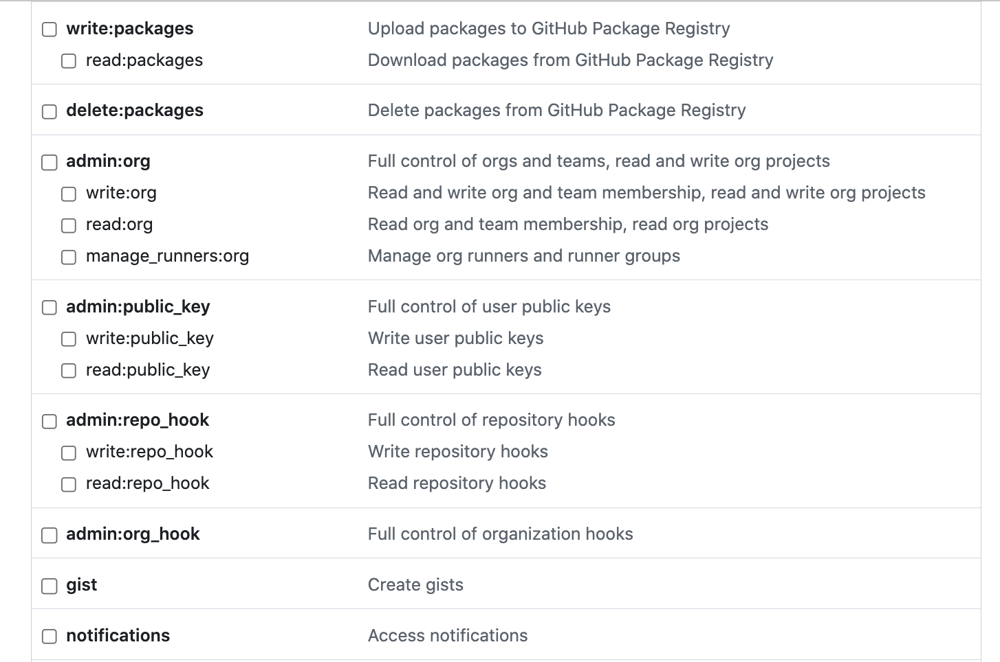

# Drupal CI/CD Start Point

You should [have the prerequisites](cicd/prerequisites.md)

## Make Your Own Copy

[Create a GitHub account.](https://docs.github.com/en/get-started/signing-up-for-github/signing-up-for-a-new-github-account)  I assume you could use GitLab or BitBucket or any other Git Repository that you confirm has an easy connection with Platform.sh for our later steps; but I have not confirmed any of the alternatives.  

[Establish an SSH connection.](https://docs.github.com/en/authentication/connecting-to-github-with-ssh/adding-a-new-ssh-key-to-your-github-account)You want to make it smooth to connect your local computer to a GitHub repository without constantly typing a password.  There is a computer-to-computer secret code handshake call SSH that does that.  You want to set it up by clicking on the little picture in the upper RIGHT HAND corner of your GitHub account page and a menu pops open.  Near the bottom of the list click on the "Settings" option. A menu will open on the left side of your new screen which includes a "SSH and GPG keys" item about midway down.  Select that and follow the steps. 

 

[Find our "Public Template" on GitHub.](https://github.com/RightsandWrongsgit)  Pick the one that is called "initial-test-of-platform-ci-with-lando". 

 

[Make your own project repository from that template.](https://docs.github.com/en/repositories/creating-and-managing-repositories/creating-a-repository-from-a-template)  Basically just go over the right side on that main project bar and click on the green "Use this template" pulldown.  

 

Then select the <b style='color:white;'>"Create a new repository"</b> option. 

 

You will see an "Owner*" box with a pulldown where you should select the user account you set up.  And to the right you will see a "Repository name*" box where you will enter whatever you want to call YOUR PROJECT. 

It will ask you about what you want for your project visability.  Mainly, at this point, you just need to indicate "Public" or "Private". If you are headed toward some enhanced version of the base template we provide where you enable a bunch more stuff out the gate to make your own 'super template' starting point set to your individual preferences, you might make it "Public" for easy sharing with others.  But if you are building your own personal site, even if that will involve inviting other team members to work with you on it, you probably want to make it "Private".  There are a bunch of [other visablity setting options you can learn more about here.](https://docs.github.com/en/repositories/creating-and-managing-repositories/about-repositories#about-repository-visibility) 

Then just click <b style='color:white;'>"Create repository from template".</b> 

## Add Project to Platform.sh

Sign into Platform.sh with GitHub. Platform.sh offers several alternatives for how to sign-in.  Please use the "GitHub" option using the GitHub account you just set up.  That will make things continue to flow easily. 

 

From the Platform.sh page, you want to click on "Create Project", that blue box in the upper right corner. 

 

It asks you if you want to use one of Platform.sh's own templates or "Create from scratch".  Don't be confused by the fact GitHub calls our repository a template.  As far as Platform.sh is concerned they consider this as us wanting to Create from scratch so select that option. 

 

Give your new project a name here too; ideally the same as you called it on GitHub when you renamed the code you brought from the repository template.  You want to make sure that the "Main production environment" is called 'main'.  That is used very specifically throughout the working functionality of the CI/CD workflow process; so now is NOT the time to get creative.  Then select the Region you want your server host to reside for this project.  I tend to the geographically the closest. 

 

You are likely to then see a plan and pricing notice from Platform.sh.  Often they are running a trial period that is free for like 30 days just to see if you like their system.  If you use that, remember to change to a paid account before your 30 days is up to save your project going forward.  The low price in the example is for a development plan.  Once you would assign a URL via DNS set up to a project to make it live, the rates go up. 

 

When you click "Continue" your project will start to build.  It won't take long in this first round because there is really nothing there yet in terms of the code we will bring in shortly. 

 

The next flash screen that pops up may or may not be helpful.  That first step, to "Download the CLI", is a good one if this is your first using Platform.sh because it sets up the CLI or Command Line Interface.  

 

You will use that later while working with your project on you local machine because it offers from convenient shortcuts. So install it as instructured. 

 

The rest of the stuff we will accomplish via things already set up in the project you will pull in from GitHub, so after you install the CLI, just "X-out" of this screen. 

 

Once you are at the basic project screen for your new project, you will find it has a blue "go live" button and to the right of that a little Cogwheel.  Click on the Cogwheel to open settings options. 

 

There are two main options under settings, "Project Settings" and "Environments".  Click the "Project Settings" option to open its pulldown menu up. 

 

Near the end of that menu you will see the critical "Integrations" option; select it. 

 

That will pop open a screen showing some integration options and features.  You want to go to the blue button in the upper right saying "Add integration" and click on it. 

 

Click this button... 

 

This leads you to the "Select integration" options and you will hit the "+Add" under the GitHub option. 

 

That will lead to a "Configure your integration" screen asking for you to input a GitHub Access Token. 

Keep that page open and click the "Generate a new token" so it opens in a new browser tab. 

## Token from GitHub

Go to your project on GitHub. In the upper-right corner click on your profile photo, then click Settings. When the left sidebar opens, way at the botton of the list click Developer settings. Then within that left sidebar, click Personal access tokens. Click Generate new token. You will see a short list with things like GitHub Apps, OAuth Apps, and Personal Access Tokens; click the down arrow of the later and you will see options.  Most likely you will want the "Tokens (classic)" option unless you want to dig more into what was a "beta" test alternative as this is being written.  

Do take advantage of the "Note" box and write something like Platform.sh integration into it just as a reminder what this token was generated for.  The duration of the token is something you should make a careful choice about in that "Expiration" pulldown.  Too short and you will be back trying to figure out how to regeneration & restore, too long and you have a security risk. 

 

The options available with Token's would be a book in and of itself.  They are listed with the continued screen shots but you are likely to just leave them in default settings as you start out. 

## Suggestion from Ben at Platform.sh:

A bit of a correction there, the api token needed to use our inbuilt integrations is actually the api token provided by the external source, I.e. Github, not from Platform.sh. 

I'd suggest something more like this: 

-- Use project creation button to create Platform.sh project from your template (and an account if needed) 

-- Create an external source code repository also as a copy of your template. It doesn't much matter how this is done, either by cloning from your repo, or the Platform.sh project directly, or by some external mechanism like Github's forking process. 

-- Create an api token for the external repository. 

-- Add the source integration to the Platform.sh project via the CLI / UI with the newly created api token. 

********************************************************************

This should be viewed as your 'Quick Start' to setting up a Drupal hosted website pre-configured to follow basic [CI/CD Workflow principles.](../book/drupalcicd.md#what-is-cicd)  There is a complete documentation outline on [how all this is put together which you can move through page-by-page.](cicdoverview.md)  But here you are just going to be given the most basic of steps to simply dive right in.

## The Basics

Try and confirm that this works, and if so, clean this up to be almost as simply outlined with minimal narrative:

- Make sure you have steps 1 to 4 of the overview done.  This gets your accounts set up, your computer configured, and the connections between things in place.

- Clone the CI/CD Workflow Project and integrate it into the generic Drupal install the set up steps put in place.

- Add and run locally the UUID restoration module, disable the UUID ignore module

- Git init the local project and push it, under your own project name, to the GitHub or other repository of your choice

- Follow standard Git procedures to first create the 'staged' environment off of 'main', and the 'develop' environment off of 'staged' so your local Lando environment is dynanamically sync'ed with the Platform.sh hosted 'develop' environment.

- Work using standard Git processes in VSCode to work on your website.

- Use Platform.sh to move a 'develop' you are satisfied with to the 'staged' environment where you will then do any testing before moving it to 'main'

- Publish 'main' to a URL you own using Platform.sh standard DNS management procedures

********************************  NOTES THAT MIGHT ELABORATE THE ABOVE STEPS  ***********************

Once your basic computer is set up with the foundations noted, you are going to sign up with [Platform.sh](https://platform.sh/) as a hosting company.  It offers several key things relative to this project.  First, it is an experienced host of Drupal in a [container](https://code.visualstudio.com/docs/devcontainers/containers) type of environment; this includes the fact they offer a Drupal template with a good portion of what you need.  Second, it already uses a GitOps capability that leverages basic [Git](../book/gitbasics.md) based commands for its [multi-environment](configatroot.md#drupal-environments) workflow plus concurrent code backup within a [Git Repository.](../book/gitbasics.md#git-repository)  Third, they are reasonably priced, especially in the way they offer development accounts at a substantial discount before you go live.   THE KEY THING YOU NEED TO PAY ATTENTION TO IS THE VERY SPECIFIC DRUPAL VERSION OF THE TEMPLATE YOU BRING DOWN TO START WITH!

You are going to mirror the host environment on your local machine with a [Lando](../book/lando.html) container; thus why you need [Lando installed, ideally Globally.]  The Lando install should have been part of what you set up as the foundation for your basic machine.

You need to be careful with the Git step in this quick start.   Don't do a "Git Init" on the project until instructed in the sequence below.  What you are going to do is you will look at the [GitHub Repository for this Drupal CI/CD Project in the Composer.json file](https://github.com/RightsandWrongsgit/initial-test-of-platform-ci-with-lando/blob/main/composer.json) and look for a line under the 'require' section (typically near the top) for a line that says   "drupal/core-recommended": "^xx.x",   and see what numbers are in the "xx.x".  The plan is that those should match the Drupal version you grabbed from the Platform.sh template you loaded.  If I am running behind the current Platform.sh template, drop me a note on GitHub to get my act together and update the GitHub repository.  Basically, all you need to do is to [clone this GitHub Repository to your local machine where Lando will be able to run it](cloneandpull.md) in its container.

However, before you kick off the Lando step, remember that you want to duplicate the my-example.settings.local.php file you pulling from the clone and rename it without the my-example front portion. The easiest thing to do is first remove the existing settings.local.php file that the GitHub project would have had in it from the Drupal scaffold; then it won’t be in the way of your renaming the copy you are replacing it with.

Now you can move into the top level directory where you brought the project into on you local machine and do a "Lando Init" on the project.  

*****  NOTE -  Need to specfy when to Git Init this*******

### Foundation

We are going to make sure our local machine is set up like [outlined in the first part of the documentation.](prerequisites.md)  If you are a relative novice, you might first want to look at our [even more core basics](/book/Novice.md#setting-up-your-basic-system) to make sure you have those in place.

IDE: VSCode & Extentions
Git
Git Respository: GitHub
  - We are going to make sure we have a GitHub account

### The host
    
  - We are going to make sure we have a Platform.sh account to work with; even if it is just the free trial one that we can convert if we like it.  And when offered how we want to log into Platform.sh we are going to chose to do it with our GitHub account.

  - We are going to do the Platform.sh template install of Drupal SELECTING THE SAME DRUPAL VERSION THAT IS NOTED IN THE GITHUB DIRECTORY FOR THIS BASE PROJECT.  And we will just follow the prompts from the template, including giving our project its new name.  Install the Platform.sh CLI (remember this is [done with homebrew and you want it globally installed because you will likely have multiple projects](bringitlocal.md) at least the branches on Platform.sh that you might pull locally at some point)
        
### The local

In the mean time, here is what we are going to do in a nutshell; followed by a deeper explanation and 'how to':

  - Install Lando (Ideally have done this globally as part of your local machine set up because you will likely use it on other projects as well)

  - We are going to go on your local machine to the directory we want to install the local version of our project (Think sitting in the level 'above'  your new project because your project will be a directory within that level and all the files will be below it).  

  - We are going to set up the SSH relationship between our local machine and GitHub if it doesn't already exist.  And we are going to set it up between GitHub and Platform.sh because that is how our project gets its build code.  Make sure you have API tokens set too.

  - Now that we have a 'new' Drupal project running on Platform.sh we pull it into Lando as a starting point.   That is a "connect" Drupal instance but it is NOT our desired "capable" base instance with all the CI/CD goodies.

  - We go to our local Lando 'new' Drupal project in our VSCode editor and park ourselves at the top level in the left panel showing the directory structure.  Do a "Command-P" to bring up the command bar and start typing GitClone and then point it to the capable' base' project that has all the good code we want be bring it.  Pull it down but don't do anything to it (ESPECIALLY DO NOT CONFIG EXPORT IT).  

  - Your local 'new' project now has all it needs; sort of.  It actually has one thing extra and that is the UUID of the new project that is in conflict with the one in the 'base' project.  So we will now deal with that.  
        ◦ First we are going to find the 'new' project UUID and copy it to our clipboard
        ◦ Next we are going to go in the /config/sync subdirectory of out Lando copy of the 'base' project we GitCloned locally and find the files with UUIDs.  You will edit those files by replacing the old UUID values with the one from the 'new' project instance; you probably are just going to paste over the old value from what you hopefully saved in your clipboard.
        ◦ Save your work locally in VSCode.  Do a lando drush cim to import the files from the /config/sync directory into the local 'active' Drupal project.  If all goes as planned, you should have no error for mismatched UUID and things should update.
        ◦ Having the right stuff where it belongs isn't the end of things, remember that besides those /config/sync files you GitCloned, a bunch of other stuff is different, especially the composer.json file that actually builds the Drupal Project.  So run a lando rebuild and after it runs grab one of the URLs, paste it in your browser and bring up the now 'new-but-base-configured' Drupal project.  Drive around in it for a while and check things out. 
        ◦ Back in your VSCode IDE go to the Git symbol which by now should have a fairly high number for the files added and changed by the GitClone you did.  Select it, do your commit with "message", stage and sync.  This should put the updated local project into the 'new projects name' GitHub repository and a minute or two later you can go over to Platform.sh to see that the project has also rebuilt there.  Go look at it on the web at the project URL it shows (that is likely still the development URL for the 'main' branch since you have neither assigned an actual DNS nor branched your project yet for CI/CD workflow).  Again, check this web version and since the environment_indicator is part of our 'base' project modules and it was configured by our settings.php commands to detect and point to the right "case" in our test syntax, it should show up with a different color bar, bar label, and even favicon color. 

*******************************************************************
## Merge, Test, Launch
*******************************************************************

### Merge 'develop' into 'staged'
Say our have been working back and forth with your Lando 'local' and Platform.sh 'develop' branches doing saves, commits, and syncs as you work.  You have done your first level practical testing by driving around in your Platform.sh hosted 'develop' branch and things look great.  Since that 'develop' branch was cloned from your 'staged' branch you want to move the changes up one level so you can carry out your formal testing on the hosted 'staged' branch.   

Go down to the lower left corner of your VSCode IDE and click on the branch name; probably 'develop' since that is what you just said you were happy with.  When you click, the command bar at the top should show up and now you want to click 'staged' (the basic one, not the longer named 'origin/staged' one.  Now you should see this in that lower left corner. 

Click on the Git Source Control logo (odd branch thing with circle on the branches).  Go to the line in the left panel that says "SOURCE CONTROL" and click on the three dots on the right end of that line.  An option pull down list should appear and you will move down it to the Branch option.  From the sublist that appears, select the Merge Branch option. 

That will open the command bar at the top with a message to "Select a branch to merge from 

You enter 'develop' in that box because you want to grab all your fine development work and bring it into the 'stage' environment for final testing. 

### Do your testing

Insert a link here to any testing recommendations on a separate page.  

### Merge 'staged' into 'main'

Go into the 'main' branch in your VSCode IDE. The lower left indicator should look like this. 

Go to the line in the left panel that says "SOURCE CONTROL" and click on the three dots on the right end of that line.  An option pull down list should appear and you will move down it to the Branch option.  From the sublist that appears, select the Merge Branch option. 

That will open the command bar at the top with a message to "Select a branch to merge from 

You enter 'staged' in that box because you want to grab all your fully tested work and bring it into the 'main' production environment and bring it live to the world. 

