# Makefile

Makefiles are a way you can run scripts to automate things.  There may be a number of steps which are opportunities for further automation of what is outlined in this documentation.  We will start by simply describing the use case related to running this project versus updating it. 

## Cache in settings.local.php

We had previously outlined how it is valuable to [disable the render, page, and dynamic page caches during development.](../cicd/envsettings.md#disabling-cache)  For the typical user of the Drupal CI/CD Base Project that covers what they need while running their connected local and hosted environments.  However, there are times when you may have to fully bring the hosted site local on a clean start.  Perhaps another developer joins the team.  Perhaps you need to work from a different computer.  Perhaps you had some sort of failure on the local and need to recover by grabbing the host 'main' source of truth to start forward again. 

In the [Updating Master](../cicd/updateproject.md#tweak-settingslocalphp) step this situation is faced by ARMTEC, Inc. as project author.  The underlying problem which needs to be addressed is that which the cache's need to be turned off for development, they need to be turned on for the initial lando build of the local project.  Oh sure, you can go into the `settings.local.php` file and manually edit the involved [lines noted in the disabling cache discussion.](../cicd/envsettings.md#disabling-cache)  The potential for error is high and automating repeating tasks is what computers are all about. 

So, we wrote a Makefile script to set which situation we want to run. It sets off a sequence of commands.  Things like switching to the correct subdirectories, removing (rm) files we want to get rid of, copying (cp) template files we have created for the conditions we want to run and putting them into the right subdirectories, and even triggering lando actions to run. 

With that script we can type `make update_project` to set the caches on for the initial local lando build.  We can type `make development_project` to set the caches back off for the local development environment with a lando rebuild. 

Here is what it looks like when you run the `make update_project` 

The `lando init` at the end tells the system that the 'source' is the local project in the subdirectory from which we are running the command. It also tells the 'recipe' to use is the one defined by the way 'platformsh` has the environment set up. However, we are still prompted to point to our Platform.sh account (which works because we have SSH credentials set up) and to point to the specific project on our account (because different projects can be set up differently on our host depending upon their needs). 

## Database Pull

If you are needing to run the `make update_project` option it probably means you just brought the project code local too.  But remember, the project code of files is only part of what makes your project run; you also need the database.  We outlined how to [pull the database earlier, with steps that even included putting a new 'token' in place.](../cicd/cloneandpull.md)  However, if your SSH and token are still in a good place, the summary of how to pull in the database is to follow these steps. 

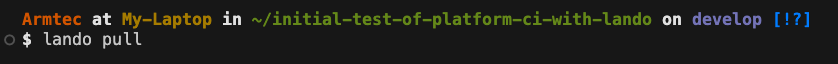

Obviously replace the email address you use with your own GitHub account.  And this is where the assumption is that your 'token' remains good.  If it bounces at this point go back to that [more detailed discussion of doing a database pull](../cicd/cloneandpull.md) 
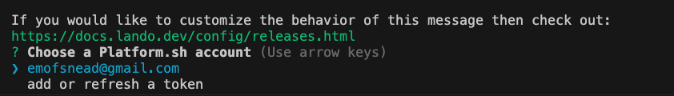

The only tricky part here is to notice that little blue dot in front of the work 'database' is hollow. 
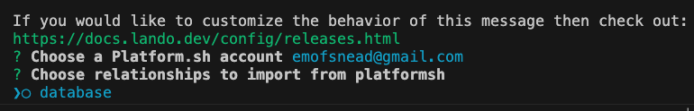

You actually use your "space bar"<.font> to move to choice options rather than your arrow keys. 
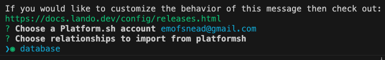

Same deal on telling the system where you want to put the database your are bringing down. 
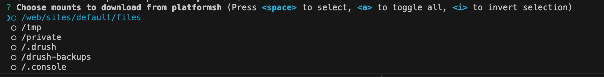

The /web/sites/default/files subdirectory is the classic Drupal location to put the database and that is what you select; again with the space bar". 
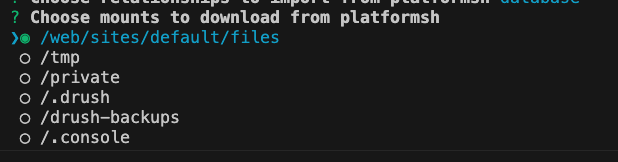

## There but not running

So you brought the code down, told lando about it, brought in the database, but the project is not running.  You need to start the container running and build the project in it.  So do a `lando rebuild` to set it all off. 
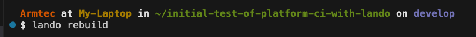

The system should come back at this point with the URL addresses of the running project that you can copy, paste in your browser, and go to the running site. 

If you do there and it looks like this, you tried to run an update and kicked off the lando container without getting the caches enabled in your `settings.local.php` file. (e.g. you didn't run `make updated_project` on the freshed Git Cloned code.   
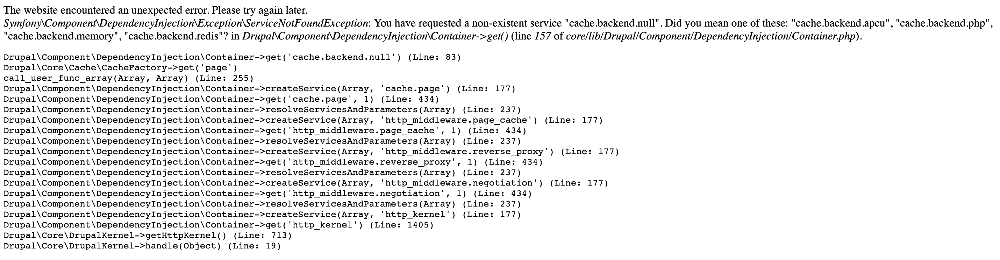

Once your project is running locally it should look something like this as a basic site page.  

When you log in, it should give your a GREEN go ahead banner color with the environment name 'local' showing. 

## Go back to Development

Just because the project is running locally does NOT mean the caches are set for development.  So now you need to run `make development_project` and it will put in place a template file where the lines to disable the render, page, and dynamic page caches are set to disabled. 
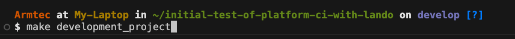

Then like noted in the earlier "There but not running" section, you need to rebuild again with these new settings in your lando container. 

The system will ask you to confirm you want to rebuild. 
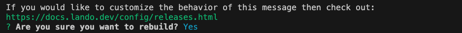

## Make your own

Doing Make files isn't a big deal.  I tend to do individual line by line runs of the commands I am going to include to test each before throwing them into a pile.  But other than that, it is straight forward.  You might want to add this extension to your VSCode IDE to make it even easier. 
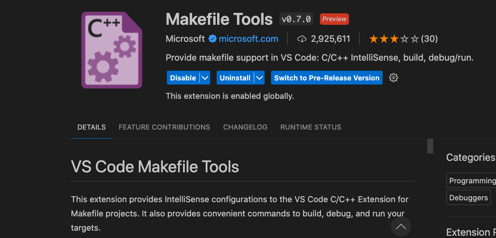

 
 
 

[- Next -](../cicd/updateproject.md)
