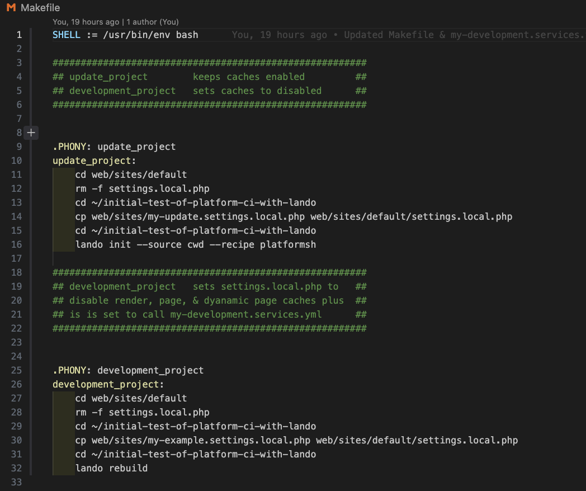
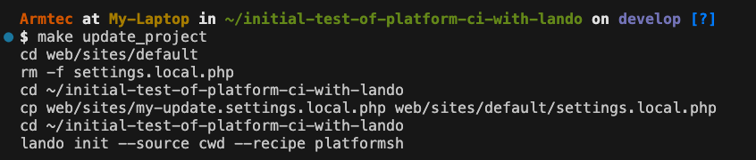
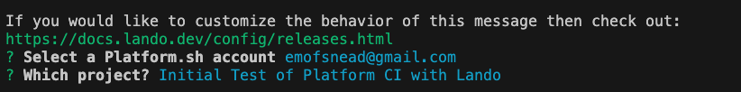

# Makefile

Makefiles are a way you can run scripts to automate things.  There may be a number of steps which are opportunities for further automation of what is outlined in this documentation.  We will start by simply describing the use case related to running this project versus updating it. 

## Cache in settings.local.php

We had previously outlined how it is valuable to [disable the render, page, and dynamic page caches during development.](../cicd/envsettings.md#disabling-cache)  For the typical user of the Drupal CI/CD Base Project that covers what they need while running their connected local and hosted environments.  However, there are times when you may have to fully bring the hosted site local on a clean start.  Perhaps another developer joins the team.  Perhaps you need to work from a different computer.  Perhaps you had some sort of failure on the local and need to recover by grabbing the host 'main' source of truth to start forward again. 

In the Updating Master](../cicd/updateproject.md) step this situation is faced by ARMTEC, Inc. as project author.  The underlying problem which needs to be addressed is that which the cache's need to be turned off for development, they need to be turned on for the initial lando build of the local project.  Oh sure, you can go into the `settings.local.php` file and manually edit the involved [lines noted in the disabling cache discussion.](../cicd/envsettings.md#disabling-cache)  The potential for error is high and automating repeating tasks is what computers are all about. 

So, we wrote a Makefile script to set which situation we want to run. It sets off a sequence of commands.  Things like switching to the correct subdirectories, removing (rm) files we want to get rid of, copying (cp) template files we have created for the conditions we want to run and putting them into the right subdirectories, and even triggering lando actions to run. 

With that script we can type `make update_project` to set the caches on for the initial local lando build.  We can type `make development_project` to set the caches back off for the local development environment with a lando rebuild. 

Here is what it looks like when you run the `make update_project` 

Even though the `lando init` at the end tells the system that the 'source' is the local project in the subdirectory we are running the command from and tells the system that the 'recipe' to use is the one defined by the way 'platformsh` has the environment set up, we are still prompted to point to our Platform.sh account (which works because we have SSH credentials set up) and to point to the specific project on our account (because different projects can be set up differently on our host depending upon their needs). 

