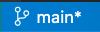
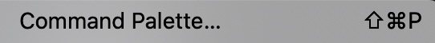

# Mid-Point Update

## Where are we and What's Next?

- At this point, we have Platform.sh running our 'main' site as host, we have a copy of that locally running on Lando, and the two are linked to each other as well as GitHub. 

- We are working with our local Lando based site through a VSCode interface that allows us … 
-- To see the sub-directories and file list on the left 
-- To see a 'Terminal' on the lower right to run 'Command Line' stuff &nbsp;&nbsp;&nbsp;&nbsp;&nbsp;&nbsp;&nbsp;&nbsp;◦ To see the actual content and syntax in any file we click on from the left panel to show up in a view pane on the upper right.  And we can edit files right there when we want. 
-- In the bottom left menu bar we see an indicator that tells us we are on the Git main branch locally too.   
-- We remember that we can hit 'Shift', 'Command', 'P' to open the Command Palette to do stuff   

&nbsp;&nbsp;&nbsp;&nbsp;• We are headed toward setting up additional 'environments' so we have 'develop', and 'staged' in addition to our 'main' as workflow branches.  We will use standard Git branching to create the additional environments.  First we will branch 'staged' off of 'main'.  Then we will branch 'develop' off of 'staged'.  This sequence allows us to merge back up the chain.  In a situation where multiple developers are working together on a common site and are assigned to develop specific features, it can be as simple as branching 'feature1name' and 'feature2name' off of 'develop' and having each developer work on their specific feature branch before merging them back up the chain.  We aren't going to detail this multiple developer-feature further but it is pretty parallel in most ways if you need it for some reason.  

&nbsp;&nbsp;&nbsp;&nbsp;&nbsp;&nbsp;&nbsp;&nbsp;◦ 'develop' is where we will be working on code changes.  That isn't saying your are necessarily writing computer syntax level code; you may be just turning on 'themes' for a different look, or enabling a 'module' for some functionality you want your site to have.  
&nbsp;&nbsp;&nbsp;&nbsp;&nbsp;&nbsp;&nbsp;&nbsp;◦ 'staged' is where we will be testing those changes before deploying them to 'main'.  Testing might be technical stuff, it might be just driving around in a copy of your site to see how things look and work after you did the changes just to be sure you like them, or it might be sending a link to that staged environment to a client or a friend to see if they like it before you deploy it.  
&nbsp;&nbsp;&nbsp;&nbsp;&nbsp;&nbsp;&nbsp;&nbsp;◦ In one of the key steps around setting up and using these three environments we will see that it doesn't make sense to have all of the same stuff operating in each.  For example, your 'main' site may have something like Google Analytics running in it but you want that turned off in your 'develop' copy so you don't screw up counts, statistics, etc.  Or, you might have some tools installed in the 'develop' copy of the site that make it easier to do some stuff as you work on it but you don't want those tools out in 'main' so your site users stumble into them. 

&nbsp;&nbsp;&nbsp;&nbsp;• What we want to do in preparation BEFORE we set up these additional environments is to … 
&nbsp;&nbsp;&nbsp;&nbsp;&nbsp;&nbsp;&nbsp;&nbsp;◦ Install and enable some of the modules we might anticipate using on our site (don't worry, we can add others later, it is just easier up front because then they will automatically be present across all three). 
&nbsp;&nbsp;&nbsp;&nbsp;&nbsp;&nbsp;&nbsp;&nbsp;◦ Automatically, that is, unless we <u>Don't Want<u> them to be.  What we will be learning about is how Drupal has something called 'Configuration' and this tells how an environment is set up.  So that we can achieve having differences between our environments, we will be installing a Config_Split module.  Think about Config_Split as basically '**turning off**' stuff we don't want operating in a specific environment; so, think that we really have all stuff present everywhere but just not always active in each environment.  
