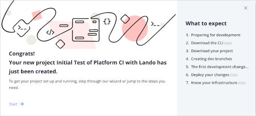

# Connecting Platform.sh Host and Lando Local

We also see a part of that page congratulating us that the project is created but that we need to so some other stuff.  The "What to expect" list gives you an outline. We are going to knock off the first few for now and see things really unfold easily.  Lets get the CLI (Command Line Interface) working and download or link our hosted Drupal site to a local copy on our machine. Our local copy will run on [Lando](../book/lando.html).  

Click "Start" to get to the next page.  We have already partly done some of this via the simple fact that we used our GitHub account to sign up for our Platform.sh account.   Remember, we didn't set up a specific project repository for our Project on GitHub yet; we will do that later.  But we obviously had a GitHub account and logically we have Git globally installed on our local machine (something noted as a [prerequisite](../cici/prerequisites.md) step).  We granted access approval earlier so our [SSH connect](https://www.youtube.com/watch?v=snCP3c7wXw0) is already established. We are going to worry about where on the local machine our Drupal project copy is going to be placed a little later; and since we are using [VSCode](../book/ide.md) some of that stuff will also flow pretty smoothly.  Thus, just click the "Download The CLI" highlighted text to proceed.

On the page for the second step you just copy the short code block (via clicking on the little squares at the end of the correct line for your machine Operating System).

You need somewhere to 'Paste' what you copied and we are going to open the 'Terminal' to use the [Command Line](../book/cheats.md#Terminal-Command-Line-Interface-(CLI))  If you look in your files under the "Applications" directory, near the bottom you will see a "Utilities" sub-directory.  Toward the bottom select 'Terminal'.  (In Windows it is the command prompt and you can move your mouse pointer to the bottom-left corner of the screen and right-click, or you can press Windows key + X to get there).

[- Back -](../cicd/bringitlocal.md)
