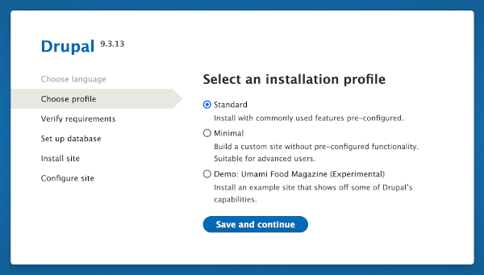
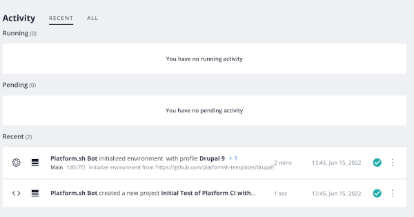

# Starting the Project on Platform.sh 

## Short-cut approach:

NOTE: You may want to review the Regular Approach section before you run the "Short-cut approach" so you know what it is doing behind the scenes.  And if you are going to do other projects or migrate an existing project to Platform.sh having this process understanding is helpful.

A) Go over to this repository on GitHub and you will find the Platform.sh template for Drupal 9 `https://github.com/platformsh-templates/drupal9`
	
B) Click on the button at the top of the repository that looks like this 	

C) Follow the on-line instructions to bring up the hosted Drupal site	
	
D) Back to the Github template site and follow the  [Drupal: using Lando section](https://github.com/platformsh-templates/drupal9#:~:text=Drupal%3A-,using,-Lando)
	
E) In the "Migrate" section in the Github template for a totally new site follow the  [Getting started instructions](https://github.com/platformsh-templates/drupal9#getting-started-1)
	

## Regular approach: 

You should have gone to Platform.sh, signed up for an account and installed their command line interface (CLI) tool. If not, jump back to the end of the Prerequisites and follow those instructions.

A) From the Platform.sh CLI enter: `platform create`

This will prompt you for 
– a project title
– your hosting region (e.g. us-2.platform.sh)		
– the plan size (use 'Development' until you want to go live)
– Number of Environments (default 3)
– Amount of Storage (default 5 Gig)
– Confirm "Y" to continue

B) A Project ID will be assigned and shown.  Copy and save it somewhere safe.

		If you forgot and missed it, just type this `platform project:list`

C) At the CLI enter:  `platform environment:init <Project ID> -e main https://github.com/platformsh-templates/drupal9`

	NOTE: you can replace 'drupal9' with whatever other template version is available from this source.

This is now building your project on the platform.sh host.  (What is going on in this step is that the system is looking at the platform.app.yaml file in that template's project root and the routes.yaml and services.yaml file that that template has in a next level down subdirectory called .platform to create a host system environment your project is running in.  Eventually you might edit these files to tweak your environment to improve performance.  But to start out the template being pulled has all you need.)

D) At the CLI, now enter:   `platform url -p <Project ID>`

A new browser window will open where you see an install screen for the Drupal9 application. Should look something like this:

From that Drupal screen, setting up your Drupal site is pretty much like all the tutorials out there on Drupal. And, it is pretty much follow the prompts and answer the questions.  The exception is that the "Set up database" step just sort of flies by automatically because the Platform.sh container recipes are doing it for you.

## Step-by-Step (#stepbystep)

From the main screen at Platform.sh you first sign up.  I did this with the GitHub account I had established earlier rather than using just an email address; this approach giving you a head start on coordinating Platform.sh and GitHub. 

Then you will indicate you are starting a 'New project' and will fill in the Project name, the Production environment name (USE "main" for our CI/CD workflow approach rather than master, prod, or whatever else you might call it), and select the geographic region for your location.

They don't want to surprise you on costs, so you will be shown the pricing plan.  But if you are just starting out to see how it goes, you will be in the 'free trial' and don't even have to put in any credit card or that type of information.  So just hit 'Continue'.

They will tell you that your 'Free trial' is starting.  And basically you have 30 days to work with the Platform.sh host to see how you like it.   Your project is being saved and assuming you are happy, you put in your billing details at the end of the trial to keep it running. WARNING:  DON'T LET A PROJECT YOU WANT TO SAVE HIT THAT 30 DAY PERIOD WITHOUT CONVERTING IT TO PAID OUR YOU MAY NOT BE ABLE TO GET IT BACK.

At that point your new project is actually building.  Remember, you are using a Drupal template supplied right by Platform.sh to do that build.  The template is driven by a Composer file that coordinates the installation of all the package parts into a 'container' environment; Docker is underneath all this but you don't have to specifically know Docker since the system is all set up for you.

If you look back at the overall main screen you can see at the top menu bar who you are; since I used my GitHub account as how I signed up you see that noted; "rightsandwrongsgit".  Yours will show your user name in that spot.  Then you see the Project we started "Initial Test of Platform…." and a box to select the 'environment' or branch; we only have 'main' that we started with at this point (and we don't want to create more just yet).

As you look further down the page, on the left you see our Project, that it is on a 'trial/development plan' with an option to Upgrade button, the Apps & Services running in our container are graphically shown.  On the right you see we just have the one environment running; 'Main'.

What you care about at this point is at the bottom of that left box with the Project name, Plan, Geographic location…  You see a URL at the very bottom and you are going to want to open that in another browser window ('Control-Click' on a Mac).

ChaChing!  When you open it, you sort of see the beginnings of your Drupal site running on the Platform.sh host.  We are going to have to do the Drupal site set up steps but the actual host environment is already running.  

Select your language, then 'Save and continue'...

Choose profile; most likely 'Standard' if you are aiming to establish your own site with CI/CD workflow steps...

Here is where that container based approach and a starting template really pay off.  You will see the install process has skipped the 'Verify requirements' and 'Set up database' steps because these are already handled.  So just watch that 'Installing Drupal' bar whiz by...

The Drupal install has you interacting with that site you just watch loading by telling the system your Site name, Site email address, and the your basic site credentials. These things can be edited within the site under the 'Admin' menu once you start using your Drupal site; so don't freak over doing this step.

Now what you will see at that browser address Platform.sh pointed you to is an actual Drupal website running on a host.  And notice you are also logged in; see the upper right corner of the page.  Make sure you record your 'Credentials' from what you put in on that last step.  You will need these next time you want to log in.

You actually have a hosted Drupal site on the internet at this point.  If you you gave someone else that web address they could also get to it; which you may later do with your 'staged' environment for a client review in a testing step.  You haven't assigned a DNS (Domain Name System) address to the location yet but you could do so on Platform.sh and make this a fully live site.  You could also actually go in with your administrator credentials, and work directly on the hosted site.  That is NOT something that is recommended because you may mess things up and not have a good way to back out of your problems; and you likely know that as one reason you are reading this setup documentation to do some amount of a CI/CD type of process. Plus, you probably know that working on your local machine is faster, or more comfortable.  

We have our Drupal site running on Platform.sh and we really need to think of that, its 'main' environment specifically, as the ruler of all, the gold standard…   If we look back at the Platform.sh site page where we started we will see the site we installed under the 'Activity' section.

We also see a part of that page congratulating us that the project is created but that we need to so some other stuff.  The "What to expect" list gives you an outline; don't let it seem as big and long as it suggests since we are just going to knock off the first few for now and you will feel things really unfold for you easily.  What we are going to do it get the CLI (Command Line Interface) working and download or link this hosted Drupal site to a local copy on our machine running in Lando.  Then we are going to do some key things at a basic level before worrying about branches and development changes.

Click "Start" to get to the next page.  The first of the steps we already have partly done via the simple fact that we used our GitHub account to sign up for our Platform.sh account.   Remember, we didn't set up a specific project repository for our Project on GitHub yet; we will do that later.  But we obviously had a GitHub account and logically we have Git globally installed on our local machine (something noted as a prerequisite step).  We granted access approval earlier so our SSH connect is already established. We are going to worry about where on the local machine our Drupal project copy is going to be placed a little later; and since we are using VSCode (another recommended prerequisite) some of that stuff will also flow pretty smoothly.  Thus, just click the "Download The CLI" highlighted text to proceed.

One the page for the second step you just copy the short code block (via clicking on the little squares at the end of the correct line for your machine Operating System).

You need somewhere to 'Paste' what you copied and we are going to open the 'Terminal' to use the Command Line in it.  If your look in your files under the "Applications" directory, near the bottom you will see a "Utilities" sub-directory.  Toward the bottom of that list you will see and select 'Terminal'.  (In Windows it is the command prompt and you can move your mouse pointer to the bottom-left corner of the screen and right-click, or you can press Windows key + X to get there).

You want to be at the 'root' of your user account because we are going to install the Platform CLI globally; the logic being that you probably will work on other projects with different names and locations on your hard-drive in the future and want it available as you expand your development work.  In the example below, my 'User' is Armtec and I am at the My-Laptop root level.  So I 'Paste' what I copied on that line and hit enter.  The Platform CLI tool install is pretty automatic but you might have to answer a question (pick the defaults).

Back at your command prompt you will see above it the CLI install process ended by telling you to start running it …  type 'platform' and hit enter.

As Platform.sh starts, it ask you if you want to Log in via a browser and you select the default 'Y' that you do want to use the browser.

Since we signed up for Platform.sh with GitHub it is already SSH connected, recognizes our Username and Email Address.  Plus it see our list of projects as the one we just set up..
