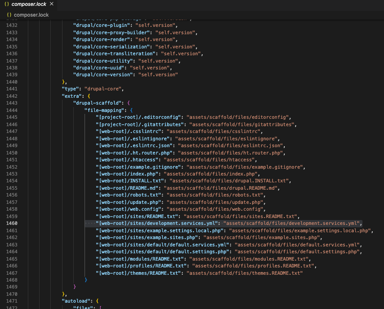
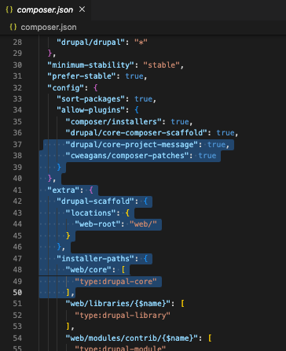
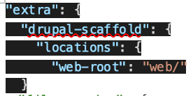
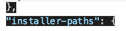

# Appendix: 
## Drupal Scaffold ("overwrite": false) solution

As discussed when setting up 'settings.local.php' alternative tocreate a development environment in your Lando local, the Platform.sh Lando Drupal template uses the Drupal Scaffolding approach to installation of a project.  The scaffolding approach is a fancy way of saying "move file assets around to different locations".  Drupal has a pretty long history and has been excellent in continuity support with version updates. This is actually pretty amazing as it has gone through some pretty significant changes over time.  One way that this continuity support has been accomplished is by having file locations that may be termed "assets" in one location for a prior version and a different location in an updated version but the presentation of a 'scaffolding' solution that file-maps the asset location between locations to move it to the right place for your given version.  That is the good news view.

The bad news view is that while the scaffolding shifts are to move files at the point of installation, it can also happen with composer updates and container rebuilds.  What that means, is if you customized the file after moved into the right location for your project, all of a sudden the update or rebuild overwrites it with the install original; all your customization of that file lost.  For our project here, we had two files we wanted to customized for the local Lando environment and don't want overwritten; 'example.settings.local.php' and 'development.settings.yml'.  We took the short-cut solution of just calling these files something slightly different as the easiest workaround.  But the other, slightly more complicated, alternative is to address it as the scaffolding level directly.

In your VSCode IDE, go click on the 'composer.lock' file and scroll down to around line 1460.  You will see just below the "extra" line the "file-mapping" section with lines that show where your project needs the listed file and the asset location from which it will grab it.

The lightly highlighted line shows the 'development.services.yml' file and the next line shows the 'example.settings.local.php' file.  We want to retain our own 'development.servics.yml' file to put in the twig debug, auto_reload, etc. stuff we want to work in our development environment.  We want to retain our own 'example.settings.local.php' file because we are pushing that to our GitHub repository to retain it for other developers who might join our project or for using it torestore our own 'settings.local.php' file in our Lando local machine-environment if we need to.  Again, we did this via the short-cut of tweaking the file names but we also could suppress the overwrite.

To do this, we move upstream from our 'composer.lock' file back to the 'composer.json' file that generates it.  Typically not fair into that file you will see the "extra" line and under it the direction to envoke "drupal-scaffold" plus the location where to find the file-mapping assets.  In the example image below, look at line 45 for the }, ending that section of syntax.  You are going to insert some syntax right above that which will supress the overwrite.

The syntax you use is shown below and put in the context of the preceeding and following code...

    `"file-mapping": {` 
      `"[web-root]/sites/default/development.services.yml": {` 
        `"mode": "replace",` 
        `"path": "assets/sites/default/development.services.yml",` 
        `"overwrite": false` 
     `}` 
      `"[web-root]/sites/default/example.settings.local.php": {`     
        `"mode": "replace",` 
        `"path": "assets/sites/default/example.settings.local.php",` 
        `"overwrite": false` 
      `}` 
  `}` 

 
 
For more on [Drupal scaffolding](https://www.drupal.org/docs/develop/using-composer/using-drupals-composer-scaffold)
 
 

<ul class="pager"> <!--this is the style of the button-->
<li><a href="../cicd/envsettings.md">Back to Summary</a></li> <!--This button takes me to the table of contents-->
<!-- <li><a href="#render-document">Next</a></li> <!--This button takes me to the previous page-->
</ul>
