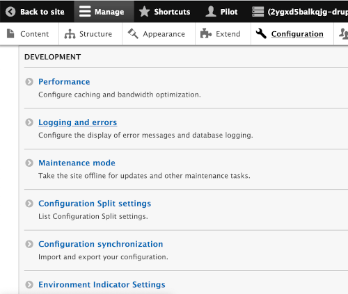
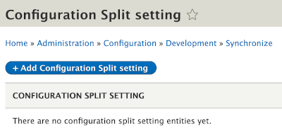
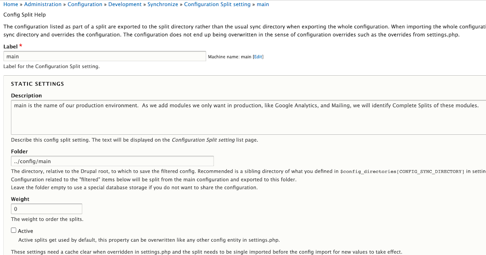
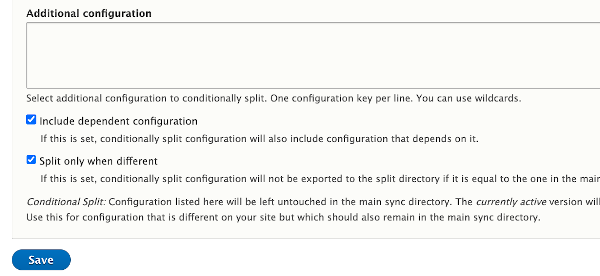
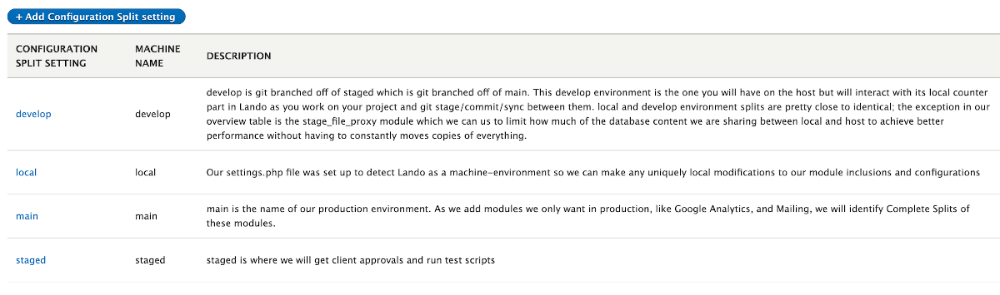

# Config_Split Module in place
## Let's set it in motion 

With config_split module installed and enabled plus sub-directories set up for our splits, we need to point the module at those locations.  Go into the 'Configuration' menu under Administration and find the 'Development' section.  There select the 'Configuration Split settings' option.  

We will 'Add Configuration Split setting' for each of the named splits we establish; 'main', 'stage', 'develop', and 'local'.

For now, we aren't going to put all the different module and setting attributes we will eventually want from that table of options by environment presented earlier.  We will simply start with the basics of naming those four splits and pointing the module to the location sub-directories we set up.  There are fill-in boxes for the name (Label), an optional description, the location (Folder), and a checkbox for 'Active' or not.  Leave the Weight option at its default zero.  Uncheck the 'Active' box; remembering we have the syntax in our `settings.php` file to do this dyanmically.  In the example below, we are setting up 'main' and pointing to the folder location sub-directory we established for that environment   `../config/main`

Scroll past the 'Complete split' and 'Conditional split' sections; each of which offer options at the module or configuration item level from the decision we made in our table of environment preferences.  Don't mess with these for now.  However, it is informative to see a list of your module's checkboxes and configuration items with checkboxes.  A glance at the names of the configuration items looking a lot like the file names your 'drush cex' exported as yml files but without that final file name extension showing. 

Just scroll on past the two checkboxes but this time leave them checked.  Then hit the "Save" button 

When you have all four environments named and pointing to their sub-directory homes, you should see something like this:

* John Picozzi "Configuration Management & Config Split" is a nice but long video on some additional options for splits like even Multi-site environments.  He doesn't use the same approach to environment case detection and the 'case' test; but something fairly similar.  He also doesn't do the environment-indicator but actually uses system.site within split configurations to do the same sort of thing manually as a demonstration of the yml level conditional (rather than full module) splits. 
https://www.youtube.com/watch?v=rwKjVVhOHs4

- Next -
