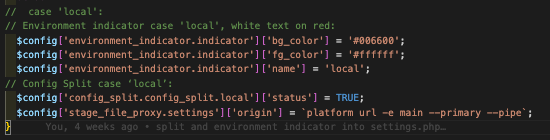
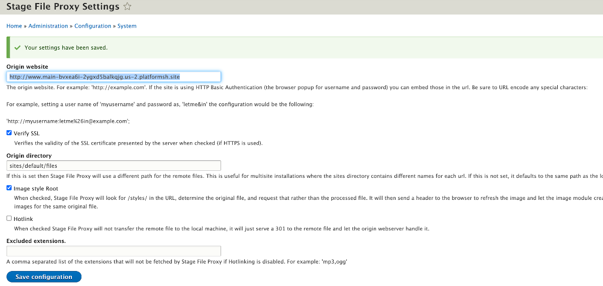
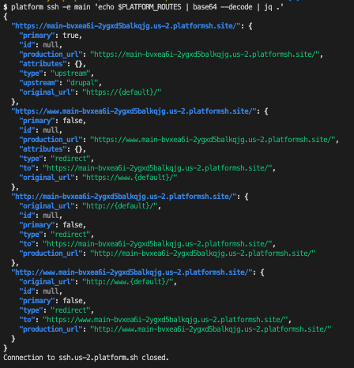

# Stage_file_proxy module
## Set it up in the 'local' split

You will notice on the table showing our configuration splits that we have the Stage File Proxy module on just the 'local' split.  Platform.sh is taking care of the code to database content relationship at the host with the container builds for each branch.  And, really, it is the local-to-host connection with your internet speed dependency that is important to use this module anyway.  The logic behind this module is that as content grows more and more for your site, it represents transmission overhead to be passing all of it to your local development environment.   Therefore, this module is sort of a 'just-in-time' line of thinking around what content to bring local.  As a developer, when you are working on the site's code, it is most likely you are working in some very specific section of the overall site so why bring all the content from the site to you local machine; save space and transmission time, especially on larger, content rich sites.  This module does just that; pulling content with a context of what is related to what you are working on so you can see your work in a real world setting.  As a side note, developers often use the Devel module's generate capability to make a set of fake or mocked up content to do this in a new site or where a totally new functionality of a site wouldn't have any actual content to test with.

Install with composer as usual:

`lando composer require drupal/stage_file_proxy`  
`lando drush en stage_file_proxy`

After you install and enable this module, the easiest think to do is just have it turned off by default and have it turn on automatically in the 'local' environment by another tweak in the settings.php code you are using to trigger which environment and the environment indicator signals.  Remember, it is that section of the file where you detect the `$env` and test it against `case '_name_of_each_split_'`  and then tell it if that config is `TRUE` and what color and name you want to appear on its banner.

Sounds like a brilliant plan.. Except, normally you set the stage_file_proxy module to look for content from the DNS deployed site URL list with something like this:

`drush config-set stage_file_proxy.settings origin "https://www.example.com"`

But we are doing development before we have a DNS assigned.  Now what?
Actually, platform.sh project do have URLs that can be utilized.  If you look in the settings for Stage_file_proxy under your sites "Administration/Configuration menu" you see the box you are supposed to put the URL into and it outlines that it should look like this:

`http://example.com`

The problem is that the URL needed to reference your project's site would look something like this:

`http://www.main-bvxea6i-2ygxd5balkqjg.us-2.platformsh.site`

The problem with that address is two fold.  First, that `main-bvxea6i` portion is your specific project's machine name and that `2ygxd5balkqjg` portion is your project's ID (the 'us' is your hosting location).  Typing all that out accurately after querying your platform.sh product via the CLI interface is fraught with risk of errors.  The second issue is that you would be expected to remember to edit this and update it anytime the values change with container builds or new projects started from our cloned base; magnifying the risk of errors again and again.

Being as smart as you are, and knowing that you can set configuration on these types of critical environment variables within your settings.php file, you reflect on the fact you did just that with reading and setting your config_split environments.  And you brilliantly already set up the syntax to detect your environments and step through CASE values to set things different in 'local', 'develop', etc.  You really only want to tell stage_file_proxy to point at the production or 'main' environment content to bring its context to your Lando development efforts because platform.sh takes care of full builds in your hosted environments.  Therefore, you just need a line of syntax to be in the 'local' case which sets stage_file_proxy to look for the URL from platform.sh for your 'main' production environment on the host; and to do it even BEFORE you have associated any DNS endpoint relationships.  Those masterminds at platform.sh have a URL detector that spits back an HTTP address by running this:

`platform url -e main --primary –-pipe`

So you are going to write a line of code that looks like this to set the HTTP address:

`$config['stage_file_proxy.settings']['origin'] = \`platform url -e main --primary --pipe\`;`

Now because you and I are simple humans we are going to make the error I did when I first tried to write that line and think that the thing before the word PLATFORM and after the word PIPE are single quotation marks and frustrate ourselves for why it isn't working.  Then some kind individual will take pity on us and explain those should be "back-ticks".  Then we are going to ask what the heck are those and how do I get one in my code; whereupon they will say look at the upper left of most keyboards and under the "tilde" symbol or wavy line thing ~ and you will find what starts and ends that syntax.  Apparently this will trigger that command line to actually execute within the lando container and send out of HTTP answer.  Here is the section of the `settings.php` code I inserted this line:

So I saved the file update in my local lando copy of the project, and then ran a `lando rebuild`.  The rebuild gives you the new browser address of your project, go in it, pop down to Administration/Configuration/Stage File Proxy and when you open it you should see something that looks like this (with different alpha-numeric strings for your own project's machine name and ID values).

If you are a happy camper that it is working, do your usual commit/stage/sync in VSCode and get it into your repository.  
For the other CASE conditions for each of the other environments we have in your settings.php I have also inserted placeholder lines referencing no HTTP being set for any of the other environments because we don't aim to use them there.  But you will find this syntax near the end of each CASE except 'local'

`$config['stage_file_proxy.settings']['origin'] = '';`

NOTE:  If you want to independently test for the HTTP URL that should be in the stage_file_proxy GUI field, you can run this from your terminal command line (make sure your project has Lando running and the link to platform.sh active at the time you run it; so refresh these if needed).
You can get your URLs this way:

`platform ssh -e main 'echo $PLATFORM_ROUTES | base64 --decode | jq .'`

Here is what results from running this code:

The production_url value should match what you found in the Stage File Proxy configuration, e.g.:

`http://www.main-bvxea6i-2ygxd5balkqjg.us-2.platformsh.site`

[- Next -]()

