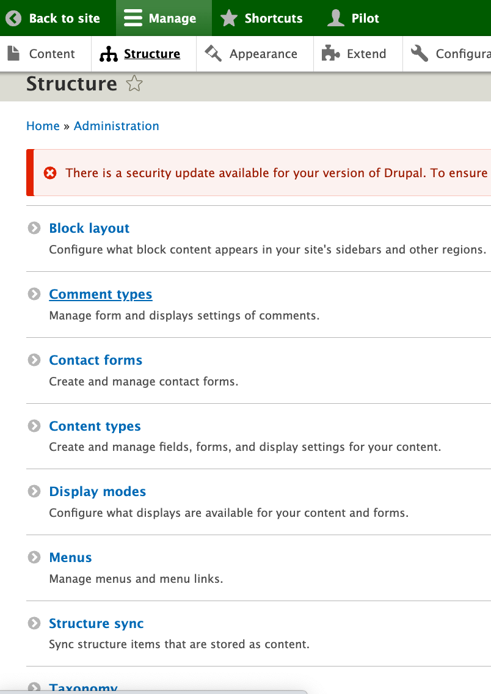
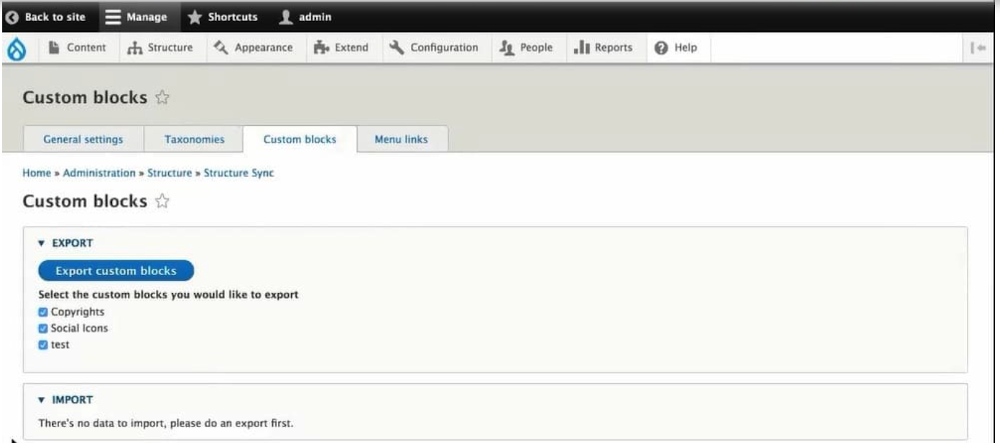
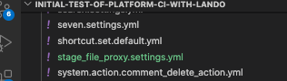
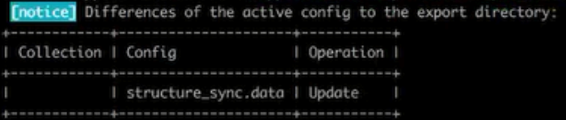
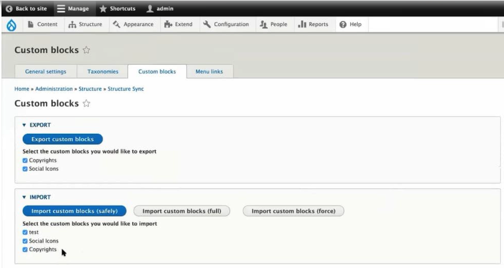
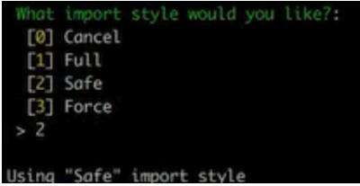

# Structure_sync module
## REVISITING CONFIGURATION 'EXPORT' AND 'IMPORT'
### Think CONFIGURATIONS for each of the environments you set up

#### Basic Export/Import
Earlier we showed the use of basic [Configuration Export and Import](../cicd/configatroot.md#SITE-CONFIGURATION-EXPORT-AND-IMPORT) is pretty plain vanilla.  We learned that your website has an active configuration it is using while it is operating.  And, if we wanted to save that active configuration so we might use it in another environment, we ran `lando drush cex` to export it into yml files.  There were a whole long list of those yml files. We found that our `settings.php` had told the system we wanted ours to go into the `/config/sync` subdirectory.

#### Configuration Files and Copies
We used our [VSCode IDE](../book/ide.md) and did a 'commit/stage/sync' between our local project and its [GitHub repository](../book/gitbasics.md).  We also figured out that if we did a few things and then decided we screwed up we could get out of a fair amount of trouble by just doing a `lando drush cim` to pull the prior configuration back into "active".  Depending on what we had done and how we changed various things we might also have to recover ourselves by restoring from a prior GitHub branch.  Heck, we might even have to restore to a prior code branch and pull from our database backup.

#### Basic Different Between Code and Content
Understanding some of this begins to get you to wrap your head around "code" versus "content".  Let's consider an example.  Your code might define the fields in a basic page; lets say the fields define a name and address and phone numbers.  Your content would be a list of actual people and their address and phones that would be stored in the database.  We might have half a dozen fields set up in the code for various things about them. In contrast we could have tens of thousands of their individual names, addresses, phone numbers and other stuff in the database.

#### Drupal's Slight Idiosyncratic Code vs Content Consideration
There are a handful of items where the "what is code" vs "what is content" question isn't as crystal clear.  Menus/taxonomy/blocks are where the line blurs.  Take taxonomy… you might have a restaurant taxonomy for the 'style' of dining and another for the 'cuisine'.   Well, the style and the cuisine are taxonomies defined by code but the term items within each is content; e.g. restaurant 'style' is code but casual, food truck, fine dinning, fast food, etc. are stored as content.  'Cuisine' is code but pizza, Chinese, Indian, south pacific, French, etc. are stored as content.  Same sort of deal on menus where you might have a menu in main navigation right below the hero section and another menu in the footer; these being code but the individual items you can select from in each menu is stored as content.  

This code or content stuff is of more than academic interest.  You know that you can share code between environments just like you already did with a 'local' and a 'main' copy of your files moving with Git/GitHub.  Since you know how to do a simple export and import of configuration via YML files, you have those things in code also well covered.  You might think that your core foundational website would be fine as you developed, and moved the updated code to 'main' for production were your database of content would be linked into it.  However, wrap your head around a mental image where you are developing around menu option but none of you actual menu option names are showing up; or where you see some classification taxonomy but no actual terms in it for you to relate to.  Having some of these core things being 'content' rather than 'code' can make working uncomfortable.

#### Structure_Sync Module to the Rescue
Sure, if you were working on a really small site and had high speed bandwidth, you could move a copy of your whole database back and forth to have 'code' and 'content' fully available in all environments.  If you have a huge website of content and had to move it all every time you were working on your site you would not be happy.  Still, if your menus details, taxonomy items, and blocks are just in the database you would feel sort of in a contextual vacuum as you worked.  So there is a module you can install that simply grabs the content from the database for menu/taxonomy/block items and folds them into your configuration workflow (with a couple extra "Drush" commands.   What you will want is to install and enable the structure_sync module:

`lando composer require drupal/structure_sync` 
`lando drush en structure_sync` 

#### A Brief Explanation: Menu/Taxonomy/Blocks 
We said some pretty important items on the edge of the code-content borderline get synchronized in your work flow with this module.  These are menu, taxonomy, and blocks.  Examples were already provided for menu and taxonomy.  Let's next understand blocks.

Blocks are one type of what Drupal calls 'entities'.  That doesn't do much for me because Drupal sort of defaults to everything being some sort of entity - people, pages, blocks…  I mentally simplify Blocks as being chunks of a page within a page (purest, don't beat me up).  Even UI designers tend to think of page layouts as organized into chunks and they may even plot out a grid system approach to display.  Think of Drupal Blocks as doing that but because Drupal is a content management system it can reuse them on different pages.  Heck, Drupal can conditionally display blocks differently within different contexts.  It can retrieve database stored parts, or blocks, to make a unique whole on the fly!   These are powerful capabilities that you will use.  You can kind of see how these chunks would be consider content.  Yet, if you think of some block that your drop into a sidebar on a variety of page types you can kind of see how having them present in a working development environment can provide a valuable context.

#### How to think about using Structure_Sync
To wrap your head around this Structure_Sync module, it helps to think about where this module places itself in the Drupal Administration.  You will find it under the "Structure" main menu rather than under the "Configuration".  Why would that be since it works with configuration at that code-content borderline?  The reason is because you are more likely to be using it while you are working with something you are doing with the Structure aspects of your website. And, once you set it, it simply works with the rest of Configuration naturally.  I am not saying you won't update it and then need to do a "drush cex" and "drush cim".  But unless you are adding or changing the menu, taxonomies, or blocks, once you set it up, it should fly on auto-pilot with normal configuration workflow.

It probably makes sense to start by looking at the GUI interface that was added as an option under Structure.  

Clinck on the Structure Sync option and you will find separate tabs for menus, taxonomies, and blocks that work the same way but they present separately so you don't have to figure out which are available from one large cluster.  What is available to export shows up on a list with that title that looks very much like a configuration GUI.  Like the example image, you probably are going to checkbox all of them unless you have some reason not to, like a work in progress item.. 

After you select the items for export, you need to click that blue button labeled "Export..Something" and the Something will depend on if it is a block, a menu, or a taxonomy.  After you do that for each tab option, then you want to export your configuration; remember we do that with:

`lando drush cex`
			
To go prove to yourself how this works, you can pop over to your configuration and see that a new file has been added.  In our case, you can look in that left directory map panel of VSCode and see the /config/sync subdirectory which had all those 'yml' files we found after our prior `lando drush cex` and you will find a new one called `structure_sync.data.yml` in the list.   

That little blue Git indicator should also show a count of "1" (or more if you did something else too) for the file change/addition of that file.   While that `lando drush cex` runs, it will likely show you an expected update in a box like shown below and ask you to confirm with a 'yes' that you want to overwrite the prior export with the more current one.  

### The STEPS
Like typical, that 'yml' file that was exported in your 'local' environment is sitting available.  But it isn't doing anything to your upstream alternative environment  configurations until they would import it.  Think the steps this way:

- You build your menu, taxonomy, and/or blocks; in our case in our Lando 'local' site.  
- Then you mark those you wish to make available in other environments with Structure_Sync using either the GUI interface or some CLI alternatives we will discuss shortly.  
- Doing a configuration export `lando drush cex` in your local Lando environment puts a new structure_sync.data.yml file into your yml files used to pass to other environments.
- In our case, and our little blue dots showing files have changed but not been version controlled, we can 'commit/stage/sync' in VSCode.  The files will then be in our GitHub and in the Platform.sh environment for the branch we are working on.
- If that new yml file is in the environment, a `lando drush cim` put it into 'active' configuration.  We want to make sure the 'setting' within that yml file align between environments so we tell the 'active' configuration to leverage the knowledge imbedded in that file to set matching menu, taxonomy, and blocks in the alternative environment. To do that you go back in the GUI where you can now see the "Import..Something" is populated and you can hit one of the three buttons to do so. 

### There are three option buttons to select from; Safely, Full, and Force.  

**Safely** = 'new stuff' and it only imports those custom blocks/taxonomies/menus in config that were not previously there. 
**Full** = 'new and refresh' because it imports all the custom blocks/taxonomies/menus regardless if they have already existed before. It deletes any custom blocks/taxonomies/menus that are not in config which might be a little questionable if somehow your exported list had changed unintentionally; like you forgot to check all the boxes at export because you thought you were just wanting to add the new ones (crash and burn but you can go back local and redo the process to dig out of the hole). 
**Force** = 'skate on thin ice'  because this option will not check for any existing blocks, menus or taxonomies and just deletes all custom blocks/taxonomies/menus in the system and creates new ones. 

Here is the GUI way ---

Click for a [good overview of this process](https://www.specbee.com/blogs/export-import-menus-customblocks-taxonomies-drupal9-8-structure-sync-module) by an actually eloquent writer.

#### Or do it by CLI
If you are a Command Line Interface (CLI) person, there are drush commands to do what the GUI offers.  REMEMBER THAT SINCE WE ARE USING LANDO for our local environment, we need to preceed these with 'lando drush somecommand'

The drush commands and their abbreviations are:

export-taxonomies (et) - Export taxonomy terms to configuration
import-taxonomies (it) - Import taxonomy terms from configuration
export-blocks (eb) - Export custom blocks to configuration
import-blocks (ib) - Import custom blocks from configuration
export-menus (em) - Export menu links to configuration
import-menus (im) - Import menu links from configuration
export-all (ea) - Export taxonomy terms, custom blocks and menu links to configuration
import-all (ia) - Import taxonomy terms, custom blocks and menu links from configuration

In case you were wondering how the Full/Safe/Force import options play out under these with drush CLI, you will get the option list after you type and run the basic command:

Do we need these next paragraphs?
 by doing:

`lando drush cim`

"The module will prevent you from having to create content multiple times and also decrease the risk of some elements being out of sync between environments, the main menu for example. It will also synchronize the UUIDs for these items to prevent you from having to change references to this in other configuration files. Finally, you have the ability to do a partial export or import so some of these elements can still be considered environment-specific content.
Before the mechanics of using the module, you may be new to Drupal and need a brief explanation of a couple of these parts.  Menus are select explanatory.  Taxonomy is how to make structured tags or categories that are used to help organize your content for people to more easily find and see what they are looking for."

[- Next -]()

