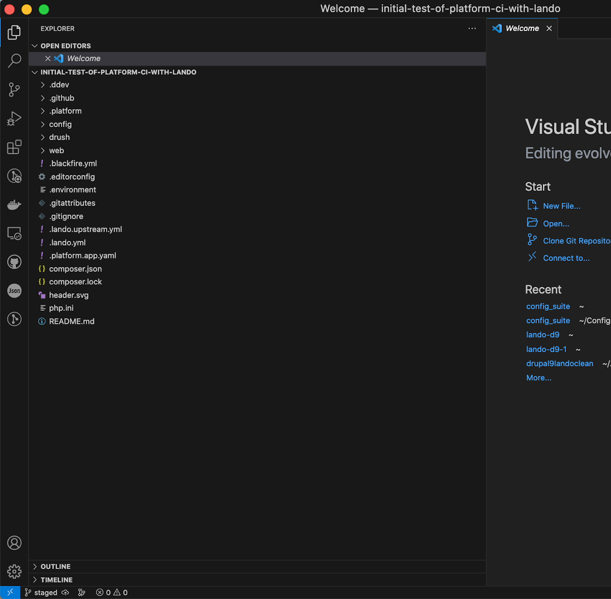
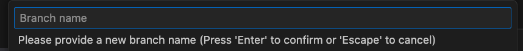
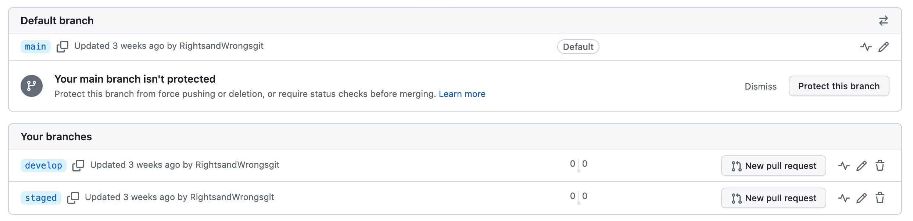
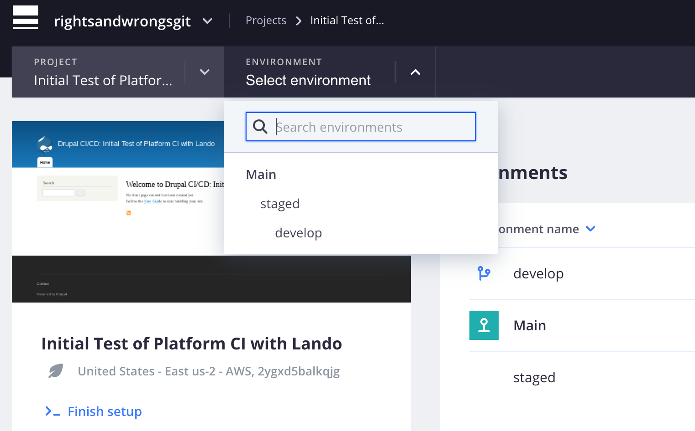
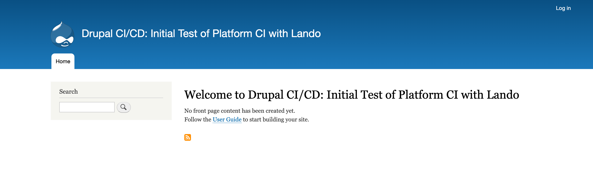
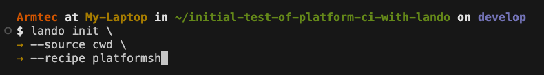
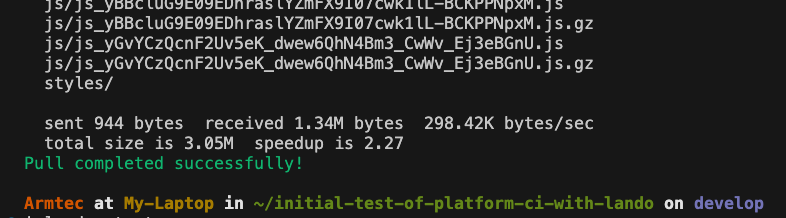

<font size=6 color=red>Update Base Project</font>

Notes for the project author, not necessary for normal users. Explains doing updates to the Lando, Platform.sh, Drupal CI/CD workflow base project provided for easy-start Drupal sites. 

# Summary Steps

1. Back up a clean copy of the most current project 'main'
2. 'Git Clone' a copy of 'main' to Lando
3. Create from 'main' a 'staged' and sync with host
4. Create from 'staged' a 'develop' and sync with host
5. Work updates on 'develop'
6. `lando init --source cwd --recipe platformsh`
7. Open directory and file permissions `chmod u+w web/sites/default`
8. Set extra run time for the many and large files involved `lando composer config --global process-timeout 2000`
9. Run `lando pull` [Need details?](cicd/make.md#database-pull)
10. Run `make update_project` [Sets caches to enabled](cicd/make.md#cache-in-settings-local-php)
11. Run `lando rebuild`
12. Check the local running project at the URL provided
13. Make any updates in your local lando copy [Update tricks and traps](cicd/make.md#update-tricks-and-traps)
14. Run `lando rebuild`, check the updated local running project URL to confirm you got what you wanted
15. Commit/Sync the Lando 'local' copy
16. Check the project GitHub repository to confirm the 'develop'branch update
17. [Check the Platform.sh build](cicd/make.mdover-to-platformsh) of the 'develop' branch
18. Once done with doing and intial testing of updates on the platformsh 'develop' branch go to the 'staged' branch and under the VSCode activity bar click on Source Code; click on three dots, go to "Branch" option and select "Merge", fill in command palette box with the "merge from" question with 'develop'
19. Let the 'staged' branch build on Platform.sh, reactivating if needed, and follow the branch URL to see the running branch to conduct further testing before repeating the process to updated 'main' from 'staged'

# Details
## Merge to 'staged'

If you have any pending work that should be retained in your production website, you will want to 'Git Sync' your way from 'local' to the host 'develop' environment and then  merge 'develop' up to 'staged'.  Since you are using the Config_Suite module and have set up automatic exports and imports between these environments, these initial steps are pretty automatic.  <font color=yellow>Complete your testing on 'staged'.</font>

## Start with a Backup

It makes sense to be sure you have [backed up on Platform.sh before you do any updates; even the well tested 'staged'.](../cicd/basebeforesplit.md#lets-do-a-platformsh-backup) 

## Merge to 'main'

Once you are satisfied with your testing on 'staged' you can merge that to 'main'.  Your clean production environment is the starting point.

## Make Clean 'staged' & 'develop'

<font size="4" color=HotPink>Do NOT create branch environments directly in Platform.sh</font><br>

Since we have an integrated GitHub:Platform.sh setup, the correct way to create branches for a project is on GitHub.  These will subsequently appear on Platform.sh because you have an SSH connection between the two.  We use VSCode as our IDE and this interface, with the [correct extensions installed](../cicd/prerequisites.md#vscode-extensions) makes this easy.  

One of the options when you start VSCode is to "Clone Git Repository".  If that doesn't show, hit Command-P and the little window at the top will appear to let you start there.<br>


At the top of VSCode the command palette opens to list the remote repositories you have and you can select from the list or type one in directly.<br>


You are offered the option to open the project. Click "Open" and you will see the project with all it subdirectories in the left panel.<br>


It should look something like this.  Note specifically the lower left corner and you will see which branch you are on.  Since you previously brought everything current in the production 'main' branch, that branch is the only one logically available to cloed.<br>


Go click on that word 'main' and the command palette should pop open.  Otherwise do a "Command-P" to open it and start typing "Create...".  When that box asks you for the name of the branch you want to create type <font color=yellow>staged</font><br>


You should then see the clone of your project is now on the 'staged' branch; see that lower left corner.<br>


See that little cloud next to the name 'staged'?  Click on it.  What it is telling you is that you have named a branch 'staged' but that it isn't up on GitHub yet and the little arrow in the cloud sends it there.<br>


Don't be surprised if the cloud looks like it turns into a tornado and spins.  With a project of any size, it take a while to get to the GitHub repository.<br>


Open another window in your browser and go to GitHub. Click on your project in GitHub.  Where it says "branches", go pull down the list and at the bottom click on 'View all branches'.<br>


You should see your 'main' branch listed and now a second branch called 'staged'.<br> 


Once you have the 'staged' branch made, you want to make the 'develop' branch.  Here you need to be careful.  The first option to create a branch will simply make 'develop' as another branch off 'main'; a sister branch.  You want 'develop' to be a child of 'staged'.  So you need to use the "create a new branch from" option.<br>


You will get a command palette box where you will type 'staged' because that is what you want to be the parent.<br>


You will then be prompted to indicate what you want to name the NEW branch and you will enter 'develop'.<br>


Now if you go back into GitHub and look at the branches you will see 'main', 'staged', and 'develop'.  The bad news from the list you don't know if 'staged' and 'develop' are sisters or parent-child.<br>


##### Over to Platformsh

Let's go over to Platform.sh next and see if it tells us anything.  First, if you click on the project you can see it has three branches of the names you provided.  So the good news is the GitHub is updating Platform.sh as expected.<br>  


We see in the prior view that 'main' is deployed but that 'staged' and 'develop' are not.  If it is a first time fresh action it is likely that all three are deployed.  But often you will be going back and doing this process for additional updates and old, inactive versions of 'staged' and 'develop' may exist.  Even though you just brought a new one in from GitHub, if it doesn't automatically indicate it was deployed, you may need to reactivate that branch on Platform.sh  This is not a big deal, just click on the branch so you are in it, and go to that little gear in the upper right corner.  Click on it!<br>


You will see some options for the branch name, who the parent is, the branch type; if you edit any of these remember to hit save.  But more likely all you are needing to do is scroll down a little more and you will see the reactivate button; click it!  It takes a little while so don't get trigger happy.<br>


Once 'staged' is done you will see it marked deployed.  Now select the 'develop' branch.<br>


Click the gear in the up right corner again.<br>


Reactivate the 'develop' branch.<br>


Go look at the front page of your project and pull down the environments list to see the hierarchy.  'Main' is the parent of 'staged' and 'staged' is the parent of 'develop'.<br>


Now you can go to each of the environments and follow the link to that deployed site's address.  If you go to 'main' and log in, you will see the banner at the top indicating 'main' and the color RED to signal STOP... don't be messing directly on this production version of your project.<br>


Go to the 'staged' environment, log in and you will see the name 'staged' and the YELLOW banner color warning that this is the testing site, so be careful with what you do.<br>


Go to the 'develop' environment and see that name with a GREEN banner to signal it is your safe work environment.<br> 


If you are NOT logged in, any of the site environments look normal; without environment name or banner colors<br>


## Initialize Local

You GitCloned your project to bring it to your local machine and you made you way to being in the 'develop' branch which, along with parent branch 'staged' and grandparent branch 'main' also lives on your Platform.sh host.  Just  because the branch files are local doesn't mean they are running in a Lando container.  For that you need to initialize the project.  Make sure you are pointing to the top level of the files you cloned and are in the 'develop' branch; the [informative command prompt we established makes that clear.](../book/WhereAmI.md)   You can do a `lando init \` with the trailing backslash so it doesn't immediately run and takes your next lines of direction.  Then you input `--source cwd \`; again with the trailing backslash to allow the final command.  Then input `--recipe platformsh` and hit return for these commands to all run.<br>



If you are into a long one and done command line approach just type it all out line this.<br>


##  Tweak settings.local.php

Normally we want to have a number of our cache's disabled in local as it is a development site.  We set up our basic project to do this.  There is a long, complicated reason behind this step you can [read more about here.](../cicd/envsettings.md#a-settingslocalphp-of-your-own-making) But the net of it is you need to go into your local copy of the files, get down to the  and rename `my-example.settings.local.php` to `settings.local.php`. The my-example.settings.local.php file we built for the project is retained in the <font color=yellow>web/sites</font> subdirectory.<br>


If you go to that subdirectory with your VSCode IDE and look at it, you will see three <font color=LightBlue>$settings</font> lines that are active (e.g. NOT commented out).<br>


We make a COPY of that file <font color=HotPink>DO NOTE CUT OR REMOVE THE OLD ONE)</font>, move down one subdirectory level to the <font color=yellow>web/sites/default</font> subdirectory, and PASTE it there.<br>


If there happens to already be a settings.local.php file in that 'web/sites/default' subdirectory, especially if it looks like this one seeking credentials, delete it.  The containers you are using are supplying the credentials and you want the clean, renamed one discussed next.<br>


Once in the <font color=yellow>web/sites/default</font> subdirectory, you will RENAME the `my-example.settings.local.php` to `settings.local.php` and go into that file and comment out those three lines (put a # and space in front of the lines).  SAVE it and it should look like this.  Notice that the very top of the image shows how your VSCode IDE will also actually confirm the subdirectory you are in, just to make sure.<br>


Now that the basic code is local, the project initialize, and our `settings.local.php` tweaked for a virgin status update, let lando do a first build of the project.  You can either `lando start` or `lando rebuild` to do so.<br>


<font size=4 color=HotPink>MILD WARNING:</font> <font color=HotPink>It takes some time to run on this first build of the project locally.  And it will spit out URLs at the end where you could go to look at the project in your browser.  However, it is a waste of time to bother at this point because you need to retrieve the database into the project for it to run correctly.  We do that next.)</font><br>


## Retrieve Database

To bring in the database isn't hard but there is one trick you need to be aware of.  Unlike move of the command line menu options where you use your arrow keys to select before hitting 'return', here you need to hit your space bar.  Start out by just typeing `lando pull` and hit 'return'.<br>


When it ask you questions, move with the space bar to the one you want, in our case we want to import the "database".   And we want our mounts to be to the "/web/sites/default/files" location.<br>


A whole bunch of lines will float by.  Then it should come back with the "Pull completed successfully" reply.<br>



Given the run time you probably are reluctant but you really do need to run a `lando rebuild` at this point.<br>


The good news is that now when it comes back your project should be available at those URLs lando spits back at the end. It may look something like this as a basic site page.<br> 


However, if you log in, it should give your a GREEN go ahead banner color with the environment name 'local' showing.<br>


## php Update?

Does the version of Drupal you are going to attempt to update too require a php version update?  If so, you may need to follow these steps.  The "may" part of that statement is because sometimes it depends on how up to date lando is, which may depend on how up to date your local computer operating system is, etc.

Lando attempts to mirror the environment you are using to run your application on the host.  So with Drupal, you will want to open the `.platform.app.yaml` file on your local machine and look near the top for what php version is currently running.  In my most recent case it was 8.0 but I was heading toward a Drupal version that needed php 8.1.  So just edit the entry behind "type" in line ten in the example below.<br>


That simple edit could be all you need.  You will want to at least to a `lando rebuild` after making that end.  I would suggest you go one step further and to a `lando destroy` followed by a `lando poweroff` and then go into your Docker Desktop and stop the running local containers that were behind the prior running Drupal application.  If you look at the "images" in your Docker Desktop before you "remove" them, you will probably notice one has the old php 8.0 (or whatever you are coming from) in the name of the image toward the tailend.  Basically what you are doing is clearing out the old php image so the new one called bye the `type: php 8.1` line doesn't bump into it.<br>

The little idiosyncracy noted next may be just a temporary thing that future lando application updates will fix.  But Platform.sh uses a `php-8.1:stable` image and the basic line of `type: php 8.1` calls a slightly different image. So you want to override this in your `.lando.yml` file.  If you look this up with an internet search you will probably see people telling you how they inserted this code to do that.<br>


In reality, you will pound your head against the wall if you use that.  Rather, since your 'app' is Drupal, your `.lando.yml` needs to look something like this in that "services:" section.<br>


# Updated Tricks and Traps

## Drupal Core Update
### Assure permissions

Make sure directory and file permissions are open.<br>

&nbsp;&nbsp;&nbsp;&nbsp;`chmod u+w web/sites/default`<br>

### Make sure there is time

Make sure we set some extra run time for the many and large files involved.<br>

&nbsp;&nbsp;&nbsp;&nbsp;`lando composer config --global process-timeout 2000`<br>

### Turn on lando

Get lando running...<br>

&nbsp;&nbsp;&nbsp;&nbsp;`lando start`<br>

### Do a Dry-run

Make a "Dry-run" to see if the system says it should run cleanly.<br>


### Do it for real

Run the commands to update the drupal version.<br>

&nbsp;&nbsp;&nbsp;&nbsp;`lando composer update "drupal/core-*" --with-all-dependencies`<br>


<sup><sub>NOTE: Make sure Platform CLI is installed and SSH connection established.</sub></sup><br>

First line starts lando.  The second line makes sure the subdirectory you are doing this in can be written to.  Once your site is moving to the active deployment state, probably around associating the DNS, make sure you 'harden' the site and that your approach makes this subdirectory read only again. As long as you are updating Drupal, you might want to update lando on your local machine.  To do that, you will also work from a command line interface like your VSCode terminal and do the following:<br>

&nbsp;&nbsp;&nbsp;&nbsp;`lando poweroff`<br>
&nbsp;&nbsp;&nbsp;&nbsp;Then -<br> 
&nbsp;&nbsp;&nbsp;&nbsp;Turn off Docker <sup><sub>(probably from its icon in your upper right menu bar)</sub></sup><br>
&nbsp;&nbsp;&nbsp;&nbsp;Install lando from its GitHub repository <sup><sub>(download appropriate to your machines operating system)</sub></sup><br>

## Drush update

The command itself is very simple.  However you definitely want to do it with a `--dry-run` appended to see what conflicts may exist.<br>

`lando composer require 'drush/drush:^12' --dry-run`

In the major version update between Drupal 9.5.10 to Drupal 10.1.3 I had all sorts of bumps in the night.  I had made the strategic error of adding the Aggregator contributed module to replace the deprecated one on the shifted Drupal Core.  I had also added the Update_Status module in preparation for doing the update from the Drupal verion that my project was previously on (9.3).  While the Update_Status module was helpful to see what changes needed to be made to get Drupal 9.5.10 in shape to make the shift, who would have thought it was one of the two which actually created a 'guzzle' conflict in the composer process.  So I [uninstalled and removed both modules](cicd/updateproject.md#remove-modules) and even then still needed to do both a `composer update` step and fully remove my `composer lock` file on the product to get the Drupal update to version 10 to work.  After checking, that Drupal update did NOT update Drush to 12 but left it at 11.6.  Platform.sh indicated it was running and needed Drush 12.  So that was done AFTER the Drupal update but before merging the 'local' up the chain through 'develop', 'staged', and 'main'.

After the "--dry-run" passes muster, just remove it from the above command string and run...<br>

`lando composer require 'drush/drush:^12'`

## Remove modules

Run the following Drush command to uninstall the module:,br>

`lando drush pm-uninstall module_name`

Next, clear cache using the Drush command:<br>

`drush cr`

Run<br>
`composer remove drupal/module`

## Merge up

Once you have your work where you want it in your Lando 'local' copy, and have 'saved' the changes on your local drive...<br>

Run `lando rebuild`

Check your work on the localhost URL lando provides at the end of its run.<br>

In your VSCode IDE do a 'Commit/Sync' to move the local file changes up to the platform.sh host 'develop' branch.<br>

Go into the Platform.sh Administrative screen and watch that the 'develop' branch updates.  Refresh you browser until you see the branch update spinning wheel has finished.  If the branch is bright, go into it and click on its URL to check it.  If the branch is washed out, go into it and click on the cogwheel on the upper right check it says it's parent is 'staged' and "save" and then run 'reactivate' the branch; then go into its URL to check it.

Go bach to your VSCode IDE and change to the 'staged' branch in the lower left corner.  Click on the Source Code icon in the lefthand activity bar and then at the end of the source code line click on the three dots.  From the menu that opens, select "Branch" and then "Merge".  When the command bar opens and asks "Merge <font color=yellow>from</font> where" tell it from the 'develop' branch. Then tell it the name of the branch you want to call it is 'staged'. 

Go into the Platform.sh Administrative screen and watch that the 'staged' branch updates. Go into check it.  It is possible that you may find an error related to differences between the underlying database and the configuration files.  <font color=HotPink>This just means you need to look under "Configuration/Configuration Synchronization" and run the update.</font>


## Local Lando


While in the root of your now local project, type
`lando init`


afdlkjfaj;

## Do updates to 'local'

<font size="6" color=pink> Do I need to reinstall DRUSH?</font><br>## Publish 'local' to 'develop'

## Confirm 'develop' made 'staged'

## Test 'staged'

## Merge to 'main'

___________________

## General Drupal Requirements
[Drupal.Org link](https://www.drupal.org/docs/getting-started/system-requirements)

## Start with Minor version updates

Say you are going from Drupal 9 to Drupal 10.  But your current site is on Drupal core 9.3 and the most current version of main version 9 is 9.5.8.  You want to make sure you first do an update from 9.3 to 9.5.8 before ou try a major version update.  With minor updates you aren't going to face different php versions, not likely different drush versions, and the typical steps are fairly straight-forward.  Because we are doing this in containers and our local is in Lando, we will preceed our commands with the word lando.

First a test or dry run to see if anything blows up:

`lando composer update "drupal/core*" -W --dry-run`

This will show line by line all the things that would be updated with their names and versions.  Don't be surprised that a lot of the lines of for symphony because that is the framework Drupal is built in.  And don't be surprised if at the end you see something like..

```
conflicts
webflo/drupal-core-strict
```

For those or other errors/conflicts you want to run ...

`lando composer audit`

That command will dump the details at a fairly high level.  But, it will also give you a URL (http://something....) that you can copy for each conflict item and go look up if it is anything you need to worry about.  Often it is just some security warning that was actually fixed by the very update you were trying to do with the dry-run.  So you are clear to let the update run without that 'dry-run' part of the statement.

`lando composer update "drupal/core*" -W`

After the minor version update, go into your site and look at the update and error reports.  You will probably see things like some module is deprecated (no longer used) but that some alternative is available for you do put in its place.  A recent example is the CKeditor package where the old one was deprecated and you should activate the new; but you don't have to because you also have the option to keep the old one which is now available and considered as a contributed module alternative.  These types of things are typically not a big deal depending on how they may or may not be used on your site.  Particularily if they are just development tools and new, better tool option upgrades are coming in, it would be a big deal at all.  It is is something used in your main production site and you did some really unique things with it, it may take longer for a workaround.


## Composer-update version
[Version requirements](https://www.drupal.org/docs/system-requirements/composer-requirements)<br>

How you update..<br>
`composer self-update`

## PHP version

### Version you are on...

#### Drupal
Check under "Status report": /admin/reports/status

Or run `drush core:status` 

#### Platform.sh

You can look at the PHP and/or Composer versions that Platform.sh is using by examining the copy of `platform.app.yml` in your local copy of the project; right near the `composer.json` file.


### Version you are moving to...

[First check the Host PHP version cabability before moving it forward too far!](https://www.drupal.org/docs/getting-started/system-requirements/php-requirements)
<font size="4" color=yellow> don't move forward more than the Drupal version you are updating to can run.</font> 

#### Platform.sh

Edit the copy of `platform.app.yml` in your local copy of the project; right near the `composer.json` file. Then do your `Git commit`, `Git sync` in your VSCode IDE to get it up to the host. 


#### Lando

Run [lando](https://docs.lando.dev/) in the local copy of the project:
`lando init`

Find the lando yml file and edit the PHP version line to the new one you want:<br>
`# .lando.yml
services:
  appserver:
    type: php:8.1 #edit this line`

Destroy and rebuild after making that php-change:<br>
`lando destroy -y && lando start`

## Update Drupal Core
<font color=yellow>(On your local machine in the CI/CD Workflow Project directory.)</font><br>
<font color=yellow>(Confirmed 'main' on the bottom of VSCode, connected to the host copy.)</font><br>
<font color=yellow>(If in doubt, first do a `composer update --dry-run`)</font>

The following steps make sure the directories are writable, extends time to handle slower connections, updates the core locally in Lando, and get the updates into the Platform.sh host:<br> 
&nbsp;&nbsp;&nbsp;&nbsp;`lando start`<br>
&nbsp;&nbsp;&nbsp;&nbsp;`chmod u+w web/sites/default`<br>
&nbsp;&nbsp;&nbsp;&nbsp;`lando composer config --global process-timeout 2000`<br>
&nbsp;&nbsp;&nbsp;&nbsp;`lando composer update "drupal/core-*" --with-all-dependencies`<br>
&nbsp;&nbsp;&nbsp;&nbsp;`git push -u platform update`<br>
&nbsp;&nbsp;&nbsp;&nbsp;`platform e:activate -y`<br>

<sup><sub>NOTE: Make sure Platform CLI is installed and SSH connection established.</sub></sup><br>

## Update Drush

Sometimes updating Drush will overcome issues occuring from the Drupal update.

`composer require drush/drush:^11`


## I screwed up
## Back me out
<font color=yellow>This assumes the local lando Drupal update isn't running right AND that you haven't pushed the update to the host (Platform.sh and GitHub)!</font>
You are going to flush the whole local copy of the project and simply clone the clean copy you have in the repository to restore the local.

a) Go to the project in your VSCode IDE at its top level.  Then do a `shift-command-P` to pull up the command bar where you will start typing `Gitclone <project name>` to pull it back local.

b) Go to the terminal in VSCode and type `lando start` to make sure the project that was restored is what you expected.  

c) Make your next move!

<font color=yellow>This assumes the local lando Drupal update isn't running right AND you also made the error of pushing the bad update to the host (Platform.sh and GitHub)!</font>
Nearly the same as if you hadn't pushed it to Platform.sh EXCEPT <font color=yellow>first you are going to restore the backup you made on Platform.sh</font> then you are going to flush the whole local copy of the project and simply clone the clean backup copy you have in the repository to restore the local.

a) Go toward the end of the section discussing [back Up on Platform.sh ](../cicd/basebeforesplit.md#lets-do-a-platformsh-backup) and you will see the "Restore" option on the image which you can select and bring that copy back live. Give it a chance to run, especially if it happens to be large.

b) Go to the project in your VSCode IDE at its top level.  Then do a `shift-command-P` to pull up the command bar where you will start typing `Gitclone <project name>` to pull it back local.

c) Go to the terminal in VSCode and type `lando start` to make sure the project that was restored is what you expected.  

d) Make your next move!

<br>
<br>

## Some possibly good references to reveiw

[A guide, explaining how to upgrade a Drupal application to PHP 8 keeping backward compatibility with PHP 7. This is to allow deploying to production without the need to synchronize with the update of the servers to PHP 8.](https://metadrop.net/en/articles/updating-drupal-php-8)<br>


## Working Note Material
________________

Updating the production environment in 'main', demands a cautious approach. Instead of making direct changes, work on a clone of 'main' for your updates. Remove the previous 'develop' and 'staged' environments on the host, and create fresh new environments from the most current 'main'.  You can create these cloned host environments [using either the console GUI or the CLI options in Platform.sh](https://docs.platform.sh/other/glossary.html#branch)  For easy reference the CLI approach is shown here:<br>

Do this -<br>
`platform branch staged main`

Then this -<br>
`platform branch develop staged`

<font size="1" color=yellow>NOTE: this project is NOT currently using the Platform.sh variable</font>`<ENVIRONMENT_TYPE>`.  <font size="1" color=yellow>Rather, the settings.php file is using</font>`<PLATFORM_BRANCH>` <font size="1" color=yellow>to set the</font> `$env` <font size="1" color=yellow>variable where the "case" is tested to set the environment split, indicator, and stage_file_proxy settings. Thus do NOT be confused into using the</font>`--type <ENVIRONMENT_TYPE>`<font size="1" color=yellow>option.</font><br> 
_______________
Got to the Platform.sh "current" version deploy options on their site; it will likely offer more than one so confirm what your intended upgrade path plan is (e.g. Drupal 9 to Drupal 10, some minor 10.0 to 10.2 upgrade, etc.).  Don't hit the deploy button there; rather, follow the link they provide to the Git Repository for that version. 

### Drupal, the application
Pop into the `composer.json` file for the upgrade target in that Git repository and in it should find lines near the top that look something like this ...

```
"require": {
    "composer/installers": "^2.0",
    "drupal/core-composer-scaffold": "^10.0",
    "drupal/core-project-message": "^10.0",
    "drupal/core-recommended": "^10.0",
    "drupal/redis": "^1.6",
    "drush/drush": "^12",
    "platformsh/config-reader": "^2.4"
```
These are showing the Drupal project versions.  Note the ^ symbol is implying... “Compatible with version”, will update you to all future minor/patch versions, without incrementing the major version. ^1.2.3 will use releases from 1.2.3 to <2.0.0

So you know the Drupal version is 10, up to but excluding 11.  You know the Drush version is 12 up to but excluding 13.

### Platform.sh, the host environment

In that same Git repository, look for the file `.platform.app.yaml` and open it up.  You should see lines like these...
```
# The name of this app. Must be unique within a project.
name: 'drupal'

# The runtime the application uses.
type: 'php:8.1'

dependencies:
    php:
        composer/composer: '^2.1'

runtime:
    # Enable the redis extension so Drupal can communicate with the Redis cache.
    extensions:
        - redis
        - sodium
        - apcu
        - blackfire
```
You see that the php version is 8.1 and that the composer version is 2.1 up to but excluding 3.


<br><br>
<br>

[Back to CI/CD Project Documentation List](../book/drupalcicd.md#i-kind-of-need-to-know-how-it-works)
