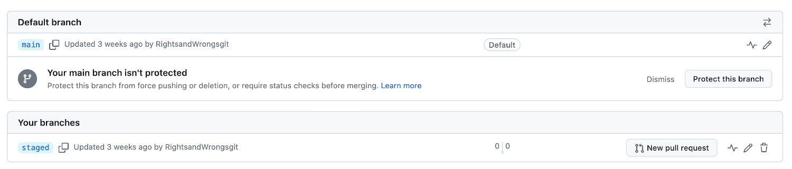
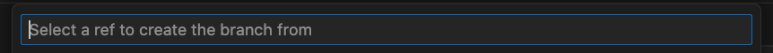
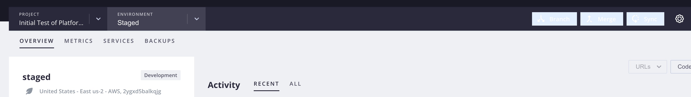
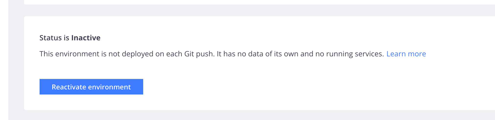
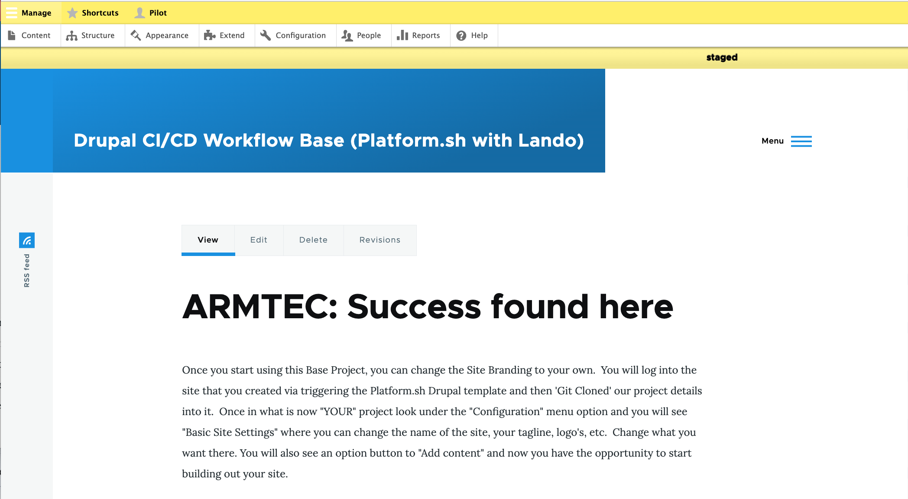

# Update Base Project

Notes for the project author, not necessary for normal users. Explains doing updates to the Lando, Platform.sh, Drupal CI/CD workflow base project provided for easy-start Drupal sites. 

## Merge to 'staged'

If you have any pending work that should be retained in your production website, you will want to 'Git Sync' your way from 'local' to the host 'develop' environment and then  merge 'develop' up to 'staged'.  Since you are using the Config_Suite module and have set up automatic exports and imports between these environments, these initial steps are pretty automatic.  <font color=yellow>Complete your testing on 'staged'.</font>

## Start with a Backup

It makes sense to be sure you have [backed up on Platform.sh before you do any updates; even the well tested 'staged'.](../cicd/basebeforesplit.md#lets-do-a-platformsh-backup) 

## Merge to 'main'

Once you are satisfied with your testing on 'staged' you can merge that to 'main'.  Your clean production environment is the starting point.

## Make Clean 'staged' & 'develop'

<font size="6" color=HotPink>Do NOT create branch environments directly in Platform.sh</font><br>

Since we have an integrated GitHub:Platform.sh setup, the correct way to create branches for a project is on GitHub.  These will subsequently appear on Platform.sh because you have an SSH connection between the two.  We use VSCode as our IDE and this interface, with the [correct extensions installed](../cicd/prerequisites.md#vscode-extensions) makes this easy.  

One of the options when you start VSCode is to "Clone Git Repository".  If that doesn't show, hit Command-P and the little window at the top will appear to let you start there.<br>


At the top of VSCode the command palette opens to list the remote repositories you have and you can select from the list or type one in directly.<br>


You are offered the option to open the project. Click "Open" and you will see the project with all it subdirectories in the left panel.<br>


It should look something like this.  Note specifically the lower left corner and you will see which branch you are on.  Since you previously brought everything current in the production 'main' branch, that branch is the only one logically available to cloed.<br>


Go click on that word 'main' and the command palette should pop open.  Otherwise do a "Command-P" to open it and start typing "Create...".  When that box asks you for the name of the branch you want to create type <font color=yellow>staged</font><br>


You should then see the clone of your project is now on the 'staged' branch; see that lower left corner.<br>


See that little cloud next to the name 'staged'?  Click on it.  What it is telling you is that you have named a branch 'staged' but that it isn't up on GitHub yet and the little arrow in the cloud sends it there.<br>


Don't be surprised if the cloud looks like it turns into a tornado and spins.  With a project of any size, it take a while to get to the GitHub repository.<br>


Open another window in your browser and go to GitHub. Click on your project in GitHub.  Where it says "branches", go pull down the list and at the bottom click on 'View all branches'.<br>


You should see your 'main' branch listed and now a second branch called 'staged' is shown below it.<br> 


Once you have the 'staged' branch made, you want to make the 'develop' branch.  Here you need to be careful.  The first option to create a branch will simply make 'develop' as another branch off 'main'; a sister branch.  You want 'develop' to be a child of 'staged'.  So you need to use the "create a new branch from" option.<br>


You will get a command palette box where you will type 'staged' because that is what you want to be the parent.<br>


You will then be prompted to indicate what you want to name the NEW branch and you will enter 'develop'.<br>


Now if you got back into GitHub and look at the branches you will see you have 'main', 'staged', and 'develop'.  The bad news is that for all you know looking at that list 'staged' and 'develop' could be sisters or parent-child.<br>


Let's go over to Platform.sh next and see if it tells us anything.  First, if you click on the project you can see it has three branches of the names your provided.  So the good news is the GitHub is updating Platform.sh as expected.<br>  


We see in the prior view that 'main' is deployed but that 'staged' and 'develop' are not.  If it is a first time fresh action it is likely that all three are deployed.  But often you will be going back and doing this process for additional updates and old, inactive versions of 'staged' and 'develop' may exist.  Even though you must brought a new one in from GitHub, if it doesn't automatically indicate it was deployed, you may need to reactivate that branch on Platform.sh  This is not a big deal, just click on the branch so you are in it, and go to that little gear in the upper right corner.  Click on it!<br>


You will see some options for the branch name, who the parent is, the branch type; if you edit any of these remember to hit save.  But more likely all you are needing to do is scroll down a little more and you will see the reactivate button; click it!  It takes a little while so don't get trigger happen.<br>


Once 'staged' is done you will see it marked deployed.  Now select the 'develop' branch.<br>


Click the gear in the up right corner again.<br>


Reactivate the 'develop' branch.<br>


Go look at the front page of your project and pull down the environments list to see the hierarchy.  'main' is the parent of 'staged' and 'staged' is the parent of 'develop'.<br>


Now you can go to each of the environments and follow the link to that deployed site's address.  If you go to 'main' and log in, you will see the banner at the top indicating 'main' and the color RED to signal STOP... don't be messing directly on this production version of your project.<br>


Go to the 'staged' environment, log in and you will see the name 'staged' and the YELLOW banner color warning that this is the testing site, so be careful with what you do.<br>


Go to the 'develop' environment and see that name with a GREEN banner to signal it is your safe work environment.<br> 


If you are NOT logged in, any of the site environments look normal; without environment name or banner colors<br>


<font size="6" color=pink> Do I need to reinstall DRUSH?</font><br>

## Bring 'develop' local

Just like you did with the original template project from Platform.sh you want to now [bring the hosted 'develop' environment copy to your local machine.](../cicd/bringitlocal.md)

Since you already have an SSH connection to Platform.sh and GitHub plus you have Platform.sh's CLI installed, you just need to the `platform` to get started.<font color=yellow>Remember to be in the ROOT DIRECTORY so your project will be built below it</font><br>


Yes, you want to do it via your Browser...<br>


Type `platform environments -p [id]` with the id from this project at the end of that statement...<br>


Instead of picking the '0' option for the 'main' branch of the project, pick whatever number is associated with the 'develop' branch...<br>


You will see something like this after the project is brought local.  <font color=yellow>DON'T DO THOSE COMMANDS!</font> Just note the directory name and location.  You are going to be using Lando for those next steps instead...<br>


## Local Lando

afdlkjfaj;

## Do updates to 'local'


## Publish 'local' to 'develop'

## Confirm 'develop' made 'staged'

## Test 'staged'

## Merge to 'main'

___________________

## General Drupal Requirements
[Drupal.Org link](https://www.drupal.org/docs/getting-started/system-requirements)

## Start with Minor version updates

Say you are going from Drupal 9 to Drupal 10.  But your current site is on Drupal core 9.3 and the most current version of main version 9 is 9.5.8.  You want to make sure you first do an update from 9.3 to 9.5.8 before ou try a major version update.  With minor updates you aren't going to face different php versions, not likely different drush versions, and the typical steps are fairly straight-forward.  Because we are doing this in containers and our local is in Lando, we will preceed our commands with the word lando.

First a test or dry run to see if anything blows up:

`lando composer update "drupal/core*" -W --dry-run`

This will show line by line all the things that would be updated with their names and versions.  Don't be surprised that a lot of the lines of for symphony because that is the framework Drupal is built in.  And don't be surprised if at the end you see something like..

```
conflicts
webflo/drupal-core-strict
```

For those or other errors/conflicts you want to run ...

`lando composer audit`

That command will dump the details at a fairly high level.  But, it will also give you a URL (http://something....) that you can copy for each conflict item and go look up if it is anything you need to worry about.  Often it is just some security warning that was actually fixed by the very update you were trying to do with the dry-run.  So you are clear to let the update run without that 'dry-run' part of the statement.

`lando composer update "drupal/core*" -W`

After the minor version update, go into your site and look at the update and error reports.  You will probably see things like some module is deprecated (no longer used) but that some alternative is available for you do put in its place.  A recent example is the CKeditor package where the old one was deprecated and you should activate the new; but you don't have to because you also have the option to keep the old one which is now available and considered as a contributed module alternative.  These types of things are typically not a big deal depending on how they may or may not be used on your site.  Particularily if they are just development tools and new, better tool option upgrades are coming in, it would be a big deal at all.  It is is something used in your main production site and you did some really unique things with it, it may take longer for a workaround.


## Composer-update version
[Version requirements](https://www.drupal.org/docs/system-requirements/composer-requirements)<br>

How you update..<br>
`composer self-update`

## PHP version

### Version you are on...

#### Drupal
Check under "Status report": /admin/reports/status

Or run `drush core:status` 

#### Platform.sh

You can look at the PHP and/or Composer versions that Platform.sh is using by examining the copy of `platform.app.yml` in your local copy of the project; right near the `composer.json` file.


### Version you are moving to...

[First check the Host PHP version cabability before moving it forward too far!](https://www.drupal.org/docs/getting-started/system-requirements/php-requirements)
<font size="4" color=yellow> don't move forward more than the Drupal version you are updating to can run.</font> 

#### Platform.sh

Edit the copy of `platform.app.yml` in your local copy of the project; right near the `composer.json` file. Then do your `Git commit`, `Git sync` in your VSCode IDE to get it up to the host. 


#### Lando

Run [lando](https://docs.lando.dev/) in the local copy of the project:
`lando init`

Find the lando yml file and edit the PHP version line to the new one you want:<br>
`# .lando.yml
services:
  appserver:
    type: php:8.1 #edit this line`

Destroy and rebuild after making that php-change:<br>
`lando destroy -y && lando start`

## Update Drupal Core
<font color=yellow>(On your local machine in the CI/CD Workflow Project directory.)</font><br>
<font color=yellow>(Confirmed 'main' on the bottom of VSCode, connected to the host copy.)</font><br>
<font color=yellow>(If in doubt, first do a `composer update --dry-run`)</font>

The following steps make sure the directories are writable, extends time to handle slower connections, updates the core locally in Lando, and get the updates into the Platform.sh host:<br> 
&nbsp;&nbsp;&nbsp;&nbsp;`lando start`<br>
&nbsp;&nbsp;&nbsp;&nbsp;`chmod u+w web/sites/default`<br>
&nbsp;&nbsp;&nbsp;&nbsp;`lando composer config --global process-timeout 2000`<br>
&nbsp;&nbsp;&nbsp;&nbsp;`lando composer update "drupal/core-*" --with-all-dependencies`<br>
&nbsp;&nbsp;&nbsp;&nbsp;`git push -u platform update`<br>
&nbsp;&nbsp;&nbsp;&nbsp;`platform e:activate -y`<br>

<sup><sub>NOTE: Make sure Platform CLI is installed and SSH connection established.</sub></sup><br>

## Update Drush

Sometimes updating Drush will overcome issues occuring from the Drupal update.

`composer require drush/drush:^11`


## I screwed up
## Back me out
<font color=yellow>This assumes the local lando Drupal update isn't running right AND that you haven't pushed the update to the host (Platform.sh and GitHub)!</font>
You are going to flush the whole local copy of the project and simply clone the clean copy you have in the repository to restore the local.

a) Go to the project in your VSCode IDE at its top level.  Then do a `shift-command-P` to pull up the command bar where you will start typing `Gitclone <project name>` to pull it back local.

b) Go to the terminal in VSCode and type `lando start` to make sure the project that was restored is what you expected.  

c) Make your next move!

<font color=yellow>This assumes the local lando Drupal update isn't running right AND you also made the error of pushing the bad update to the host (Platform.sh and GitHub)!</font>
Nearly the same as if you hadn't pushed it to Platform.sh EXCEPT <font color=yellow>first you are going to restore the backup you made on Platform.sh</font> then you are going to flush the whole local copy of the project and simply clone the clean backup copy you have in the repository to restore the local.

a) Go toward the end of the section discussing [back Up on Platform.sh ](../cicd/basebeforesplit.md#lets-do-a-platformsh-backup) and you will see the "Restore" option on the image which you can select and bring that copy back live. Give it a chance to run, especially if it happens to be large.

b) Go to the project in your VSCode IDE at its top level.  Then do a `shift-command-P` to pull up the command bar where you will start typing `Gitclone <project name>` to pull it back local.

c) Go to the terminal in VSCode and type `lando start` to make sure the project that was restored is what you expected.  

d) Make your next move!

<br>
<br>

## Some possibly good references to reveiw

[A guide, explaining how to upgrade a Drupal application to PHP 8 keeping backward compatibility with PHP 7. This is to allow deploying to production without the need to synchronize with the update of the servers to PHP 8.](https://metadrop.net/en/articles/updating-drupal-php-8)<br>


## Working Note Material
________________

Updating the production environment in 'main', demands a cautious approach. Instead of making direct changes, work on a clone of 'main' for your updates. Remove the previous 'develop' and 'staged' environments on the host, and create fresh new environments from the most current 'main'.  You can create these cloned host environments [using either the console GUI or the CLI options in Platform.sh](https://docs.platform.sh/other/glossary.html#branch)  For easy reference the CLI approach is shown here:<br>

Do this -<br>
`platform branch staged main`

Then this -<br>
`platform branch develop staged`

<font size="1" color=yellow>NOTE: this project is NOT currently using the Platform.sh variable</font>`<ENVIRONMENT_TYPE>`.  <font size="1" color=yellow>Rather, the settings.php file is using</font>`<PLATFORM_BRANCH>` <font size="1" color=yellow>to set the</font> `$env` <font size="1" color=yellow>variable where the "case" is tested to set the environment split, indicator, and stage_file_proxy settings. Thus do NOT be confused into using the</font>`--type <ENVIRONMENT_TYPE>`<font size="1" color=yellow>option.</font><br> 
_______________
Got to the Platform.sh "current" version deploy options on their site; it will likely offer more than one so confirm what your intended upgrade path plan is (e.g. Drupal 9 to Drupal 10, some minor 10.0 to 10.2 upgrade, etc.).  Don't hit the deploy button there; rather, follow the link they provide to the Git Repository for that version. 

### Drupal, the application
Pop into the `composer.json` file for the upgrade target in that Git repository and in it should find lines near the top that look something like this ...

```
"require": {
    "composer/installers": "^2.0",
    "drupal/core-composer-scaffold": "^10.0",
    "drupal/core-project-message": "^10.0",
    "drupal/core-recommended": "^10.0",
    "drupal/redis": "^1.6",
    "drush/drush": "^12",
    "platformsh/config-reader": "^2.4"
```
These are showing the Drupal project versions.  Note the ^ symbol is implying... “Compatible with version”, will update you to all future minor/patch versions, without incrementing the major version. ^1.2.3 will use releases from 1.2.3 to <2.0.0

So you know the Drupal version is 10, up to but excluding 11.  You know the Drush version is 12 up to but excluding 13.

### Platform.sh, the host environment

In that same Git repository, look for the file `.platform.app.yaml` and open it up.  You should see lines like these...
```
# The name of this app. Must be unique within a project.
name: 'drupal'

# The runtime the application uses.
type: 'php:8.1'

dependencies:
    php:
        composer/composer: '^2.1'

runtime:
    # Enable the redis extension so Drupal can communicate with the Redis cache.
    extensions:
        - redis
        - sodium
        - apcu
        - blackfire
```
You see that the php version is 8.1 and that the composer version is 2.1 up to but excluding 3.


<br><br>
<br>

[Back to CI/CD Project Documentation List](../book/drupalcicd.md#i-kind-of-need-to-know-how-it-works)
