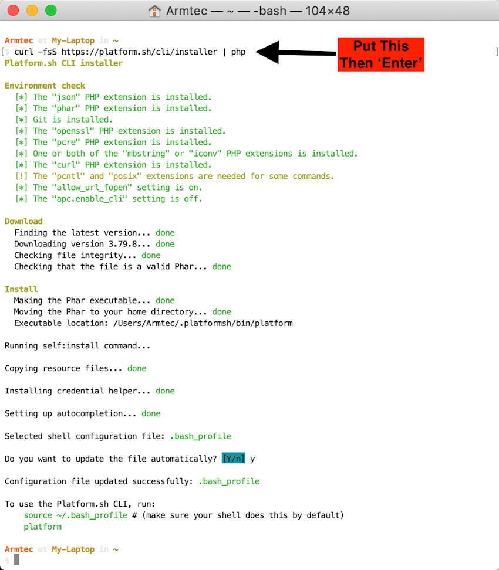

# VSCode coordination of Platform.sh, Lando, and Git/GitHub

We have a basic installation of Drupal running on our Platform.sh host.  It has a sole branch called 'main'.   We want to bring a copy of this to our local computer where we will run it in [Lando](../book/lando.md).  We will also want to put that 'local' copy of our Drupal project under [Git](../book/gitbasics.md) version control.  And we will want our Git local version control to speak to a GitHub repository.

[VSCode](../book/ide.md) will become our coordination point for all of this.  It will give us a view of the directories of the local project, a view into the individual files we open, and through its extensions it will help do the Git/GitHub stuff.  VSCode also offers a Terminal to run things and we could go directly there to do the first step in setting up this coordination.  However, lets do it this first time with the Terminal to use the [Command Line](../book/cheats.md#Terminal-Command-Line-Interface-(CLI)) that is available right from the utlities on your basic machine.  Go into Finder and in your Applications area, look toward the bottom of your list for Utilities.  Open Utilities and toward the bottom of it, look for Terminal and click it to open.

## Bring a copy of your project to your 'local' computer

**You want to be at the 'root' of your user account** because we are going to install the Platform CLI globally; the logic being that you probably will work on other projects with different names and locations on your hard-drive in the future and want it available as you expand your development work.  In the example below, my 'User' is Armtec and I am at the My-Laptop root level.  If you don't have your own Terminal set up to show you your User, Location, and Git Project location you should consider enhancing its [Where am I](../book/WhereAmI.md) information.

Copy this `curl -fsS https://platform.sh/cli/installer | php1`

The first part of your coordinating integration is you want Platform.sh to easily interact with your local machine and by installing its CLI tool.  To do that 'Paste' what you copied on that Terminal command line and hit enter.  The Platform CLI tool install is pretty automatic but you might have to answer a question (pick the defaults).  Again, you are doing this from your 'root' directory; mine in the example is ARMTEC.

The Platform CLI is installed.  You are going to use it right away.  And again, **You want to be at the 'root' of your user account**.  You can see right from the system as it comes back to a prompt, itbasically tells you want to run next. Do these two things at the prompt and hit enter.  Your are doing this from the 'root' and that is important because the hosted project will be brought down as a local copy in a directory off that 'root' **unless you tell it otherwise** in an upcoming step.

