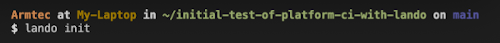

## Our Drupal Code is Local
# Let's Take Advantage of VSCode

VSCode will become your go to place while working on your website. This is because you can see your directory structure, your files, a terminal command, do git/github actions, and much more from an integrated development view.  We will just start by seeing where that local copy of your website project is located and then how you can use a terminal right from within the same tool.

See that 'Start' section in the middle of the page and go click on the 'Open' option.

You should see a 'Finder' like view where you will see the sub-directory with the name you cloned the project from Platform.sh into on your local hard-drive.

When you click on that sub-directory, you will find the project, a whole bunch of lower level sub-directories under it, and a lot of files for your project ready and waiting for you.

If you look in the very top level menu bar of your screen you will see all sorts of options for VSCode and one of those is 'Terminal'.   Select that and the first option is 'New Terminal'; which you pick and the lower right quarter of your screen opens into a terminal. 

DON'T Do this yet: You should see something like is in that terminal but without the 'lando init' filled in.  You are going to run that in a moment but you need to be prepared to answer some questions.

