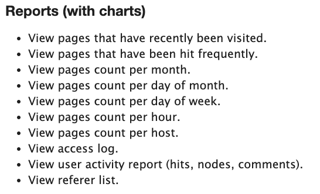

# Modules to manage an Active Site

## [Visitors Module](https://www.drupal.org/project/visitors)

Would it be cool to know all this about your site? 

`composer require drupal/visitors` 
`drush en visitors`

## [FAQ Field Module](https://www.drupal.org/project/faqfield)

Fundamentally this is a simple accordion that drops in on all your content types if you add this field to that content type.  You might put it on any given content type to make the field available to put helpful questions and answers directly in the context of the associated page. When you configure it, you can do things like set a zero default so it doesn't show up at all unless populated and set the available Q and A's to unlimited so you can put in all you want.  Because the answer block can use the various HTML formatting options, you can not only go wild with your WYSIWYG editor including images or any other tools you have folded into your CKEditor.   If, when you set it up and are asked for a Title, by putting in FAQ you get the common use but you can do other titles as you put it on a content type and have say a picture accordion or some other options for usage. 

`composer require drupal/faqfield` 
`drush en faqfield`

## [Website Feedback Module](https://www.drupal.org/project/website_feedback)

Don't know about you, but I always worry a link is broken, I have a typo, or I was blantly wrong about something.  This module provides the way you can get feedback from your website users.  The idea that they can screen capture it is cool.  And if it doesn't give you a specific page node location out of the box, you can just bring [tokens](../modules/development.md#token-module) play with it.

`composer require drupal/website_feedback` 
`drush en website_feedback`

## [Webform Module](https://www.drupal.org/project/webform)

If you want to do more than monitor your visitors, like interact and engage them, survey them, collect more about them, you want to install the Webform module.  It is extensive and you should go to the Drupal.org site to look at the module.  In addition, there are extensive videos on they many uses and features of this module; some of which you can link to right off the module page…  

* See Appendix Section on Webform and Workflows control for more.

Google Analytics:

## [XML Site Map module](https://www.drupal.org/project/xmlsitemap)

Search engine performance is impacted by a site map conforming to the sitemaps.org specifications.  So use this module to generate and submit the map to the search engines. 

`composer require drupal/xmlsitemap` 
`drush en xmlsitemap`

## [Metatag Module](https://www.drupal.org/project/metatag)

This is the base module with over 250 metatag control functions across search, google+, Facebook, Dublin Core, etc.    Because it Schema Metatag has a dependency upon it, and that module is noted next, install it as indicated and this will be added automatically (may need to be independently enabled). 

`composer require drupal/metatag` 
`drush en metatag`

## [Schema Metatag Module](https://www.drupal.org/project/schema_metatag)

You obviously want to enhance SEO performance if you are bothering to use Google Analytics, so you probably want to add a way to manage Metatags better.  As an enhancement to the basic Metatag Module, this Schema_Metatag module will press your installing and enabling the former as well.

`composer require drupal/schema_metatag` 
`drush en schema_metatag`

## [Views Bulk Operations Module](https://www.drupal.org/project/views_bulk_operations)

Once you are working with content, you may have repetitive actions you want to carry out.  A simple action might be you are done with development where you have generated mock content with Devel Generate and now want to get rid of it.  Instead of individually deleting 50 generated nodes, leverage the Bulk Operations.

`composer require drupal/views_bulk_operations` 
`drush en views_bulk_operations`

## [DIFF Module](https://www.drupal.org/project/diff)

This module can be helpful to the content editors.  You should set it up so it has an association with that Role as you do permissions.  What it will do is allow you to put above/below or side-by-side comparisons of versions as you make revisions.  So it is an enhancement of the core revision capabilities in that it allows you do more than just revert to prior version but actually examine the differences.

`composer require drupal/diff` 
`drush en diff`

## Content Moderation Module

Part of core, you want to enable this module once you are ready to leverage the role permissions and establish content contributor, editor, publisher or other types of publishing steps to assure content contribution has some level of authorization before going live.

For an [outline of how to do content moderation with the Diff module included, take a look at this link](https://www.lullabot.com/articles/basics-drupal-revisions-and-content-moderation)

https://www.youtube.com/watch?v=8R2qiFMU8v8

https://www.drupal.org/docs/8/core/modules/content-moderation/overview

## [Scheduler Module](https://www.drupal.org/project/scheduler)

Once you have your site going, you may want to move the content from unpublished to published under a schedule.  Let's say you are taking a holiday and you want the site to looked refreshed while you are gone.  Just prepare content in advance and then schedule when it will be published. 

`composer require drupal/scheduler` 
`drush en scheduler`

## [Override Node Options module](https://www.drupal.org/project/override_node_options)

Drupal has a pretty powerful role permission capability out of the box.  You can set up roles, grant them access to various things at an already pretty granular level.  But, sometimes you might want to have a trusted content person control publishing, promoting, revisioning settings, and stuff even a little deeper so some bright person added this contributed module to do so.  Things like this …

`composer require drupal/override_node_options` 
`drush en override_node_options`

Once Fields and Content Types are established, one can prepare for operating the site by establishing Roles, Role Permissions, and the Workflow around Content Moderation.

In the Admin interface, under the "People" menu, you can set Roles and then grant Permissions for what that Role can do.

## [Field Permissions Module](https://www.drupal.org/project/field_permissions)
You can set role permissions from the admin section of Core.  But you can move that further with field level permissions:

`composer require drupal/field_permissions` 
`drush en field_permissions`

And also see under Taxonomy, using taxonomy term associations to set tight permissions on various entities.

From core:

drush en content moderation

https://www.drupal.org/docs/8/core/modules/content-moderation/overview

Plus add in Workflows:
https://www.youtube.com/watch?v=gRdU4vF2LcM
drush en workflows

Content Moderation Sidebar (This module is something you probably don't want to bother with as a developer or site builder but when it comes time for adding and editing content you probably want it; or your content editors will.  You need to enable the basic 'content moderation' that is part of Core and then add this module to make the GUI interface a little easier for content editors to use.)

composer require 'drupal/moderation_sidebar:^1.4'

If you find you are going to have a bunch of content editors and approvers in a workflow, you might consider a streamline interface UI for these roles by using Workbench, Workbench Moderation, Workbench Email or Content Moderation Notifications contrib modules.

https://www.webwash.net/delete-files-instantly-using-fancy-file-delete-in-drupal/
composer require 'drupal/file_delete:^1.0'

 
 
 

[Learn More - Drupal Modules List](../chapters.md#drupal-modules)
