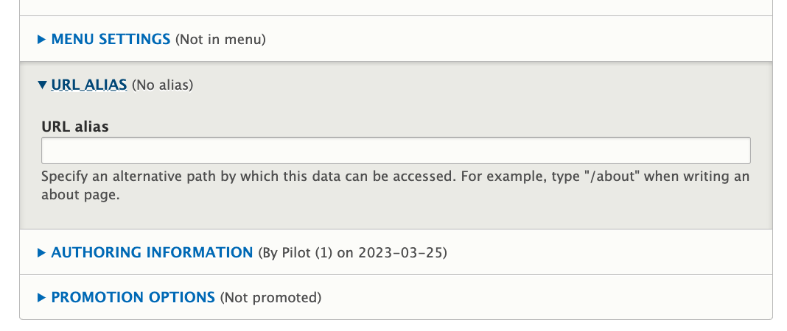
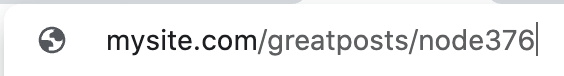
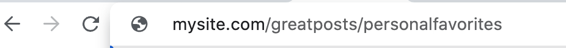
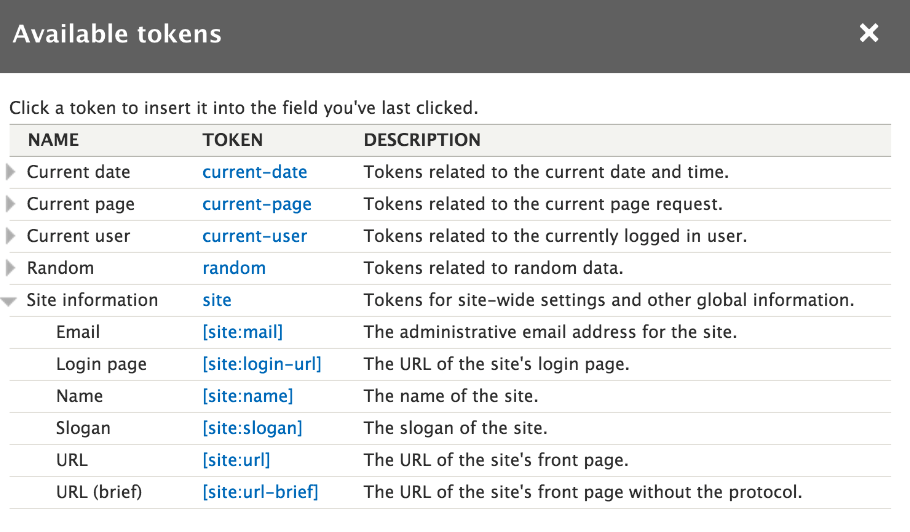

# Development Tools Modules

## Drush
You would have installed this if you followed the building of or cloning of the CI/CD Project.  

Consider Drush foundational.  It is a convenient way to execute many important commands much more quickly than winding through the GUI menu of Drupal Administration.  One of the most fundamental of all is to 'secure what you have done' by making an exported copy of your site configuration.  There is a GUI (graphical user interface) under the Administration/configuration called 'configuration synchronization' that can do this too but sometimes the GUI is more confusing and certainly a lot slower than just [exporting a configuration](../cicd/configatroot.md#site-configuration-export-AND-import) ...

		`lando drush config-export`    OR      `lando drush cex`

NOTE: If we want to 'bailout' because we messed up what were were changing we can always just import back in the prior existing configuration with `lando drush cim`.

If drush isn't already installed and enabled do this:

`composer require --dev drush/drush` 

Confirm the install with this:

`./vendor/bin/drush --version`

- [Drush is so basic you really need it for all the rest of the module install/enable steps](https://drupalize.me/tutorial/install-drush-using-composer?p=3516)
- [How to use Drush for your Drupal site](https://www.a2hosting.com/kb/installable-applications/optimization-and-configuration/drupal2/using-drush-for-drupal/#Enabling-modules)
- [Drupal Command List](https://drushcommands.com/)

* Take Drupal out of Maintenance Mode via Drush.  `drush sset system.maintenance_mode FALSE`

## Environment Indicator module
[To easily see which environment split you are in](../cicd/envindicator.html)

`composer require drupal/environment_indicator` 

`drush en environment_indicator`

## Stage File Proxy module
[Real content sharing from Production to Development Environments](../cicd/stagefileproxy.md)

`composer require drupal/stage_file_proxy` 

`drush en stage_file_proxy`

## PathAuto
As you build out each page of your site you are presented with an option where you can provide a specific URL for that page.

If you use that, you might take something which may default to this...

And make it look like this.  A more human readable, meaningful URL.

See how the [Pathauto module](https://www.webwash.net/automatically-generate-url-aliases-using-pathauto-drupal-8/) is simply a way that you can make this process more automatic; or hear more about it in a [Podcast Overview](https://www.youtube.com/watch?v=3l8ihak4_uk). If you are building a tiny site then you really aren't leveraging the value of a content managment system like Drupal.  But if you are having frequently updated content, potentially from various sources, even fed to you via RSS, then having more automatic URL naming is important. 

Having it on during development might get you to think about 'naming' with end-user thinking in sight.  Instead of a path that is something like a node and its number you might have a content category and a node title; and you can use 'Tokens' in the naming strategy for the paths. [See adding the Token module](../modules/development.md#token-module) 

`composer require drupal/pathauto` 
`drush en pathauto`

## Token module
It is easiest to think about tokens as variables.  One part of your site might contain a variable like the name of the logged in user and you want to use that variable in another section of the site.  The Token module provides visiblity into the availble variables and the syntax for how you need to refer to them.  

[This summary](https://gole.ms/blog/tokens-drupal-how-they-work-and-what-they-can-give-your-website) tells more about the basic categories of tokens and how the module helps you use them.  The prior module, PathAuto, is a common one that taps into your site's tokens to spruce up the URLs people see going from page to page.  An overview of [how those two modules work together](https://www.volacci.com/drupal-seo-guide/drupal-token-system) also helps see more clearly how you might use them in other contexts.  [Token's also work with taxonomy in valuable ways](https://www.youtube.com/watch?v=5A3y0N_1Ufk).

Install and enable the token module as usual...

`composer require drupal/token` 
`drush en token`

## Token Filter module
You are likely to want to use tokens in field replacement values.  This will get you loads more value from Tokens.  To do that you also want to install the [Token Filter module.](https://www.drupal.org/project/token_filter)  You can see [how to use this module in this quick training overview.](https://ostraining.com/blog/drupal/tokens-in-drupal-fields/) 

`composer require drupal/token_filter` 
`drush en token_filter`

## Masquerade module
This module lets you switch users and back to your own account.  You can experience testing what it is like for various log-in roles. Does it work for an anonomous user, for a logged in non-paid users, for a subscribing user, for a contributing editor, etc.

`composer require drupal/masquerade`
`drush en masquerade`

## Responsive Preview module
Masquerade gets you the feel of different user type experiences. Responsive Preview gets you the feel of different device experiences. This module provides a way to quickly test the look of your site in various responsive view breakpoints while you are doing development.  They warn it isn't a perfect simulation but pretty solid.

`composer require drupal/responsive_preview` 
`drush en responsive_preview`

## Devel module
As valuable as masquerading as different users or like you are on different devices may be, having mock content can be very helpful to really get a feel for how a finished site will work.  The Devel modules isgood to generate fake content to better see what things will look like without having to spend a ton of time manually loading real content.  But before you go down that road, if you are using our [CI/CD Process](../book/drupalcicd.md) you may want to consider the fact we are using the [Stage File Proxy Module](../cicd/stagefileproxy.html) to share production ('main') level data with our 'local' lando site in a tight contextual manner that may provide even better full perspective developer experience.

`composer require 'drupal/devel` 
`drush en devel`

## Devel Generate Alternative

### Add Another module
You can put this in early if you are dropping in some content while developing so you get a feel for your site but don't like Devel's Generate output as realistic enough.  Or, you can put it in after your site is built and you are loading in a bunch of content one after the next.  What it does is put in an 'Add Another' button to quickly create additions nodes after creating a new node. You can customize the text on that tab with the [Custom Add Another](https://www.drupal.org/project/custom_add_another) module.

`composer require drupal/addanother` 
`drush en addanother`

## WebProfiler module
WebProfiler adds a toolbar at the bottom of every page and shows you all sorts of stats such as the amount of database queries loaded on the page, which services are used and much more. This was previously part of the Devel module but is now separate.

`composer require drupal/webprofiler` 
`drush en webprofiler`

## Devel Kint Extras module
This module was parsed out of the prior Devel module into a separate tool.  Makes sense because this tool starts to move you past a site builder level to true developer skill set. The [Kint Debugging Tool](https://kint-php.github.io/kint/) might be of interest only to some of the more advanced users.

`composer require drupal/devel_kint_extras` 
`drush en webprofiler`

Admin Toolbar (an alternative layout to the out-of-the-box toolbar that developers and site builders normally work with.  It used more of the vertical space of a pulldown style tool bar rather than drilling page by page into submenus; thus faster for developers).

composer require 'drupal/admin_toolbar:^3.0'

The Autosave Form Module is a 'maybe' addition to development and content editing.  It does NOT retain pure true revision versions but has its own temporary storage logic while you are working.  It is set at 60 second for an autosave but should be configurable.
composer require 'drupal/autosave_form:^1.2'

Backup Add section on backup plan in coordination with hosting provider's set up, Git repo strategy, and local Dev rebuild strategy.

Feeds Module is one that can be used to grab CSV and other file format data plus HTML from another site, and import it.  It is another candidate for pulling in Taxonomies or even airport data sets to preload nodes for all the airports.  It is in an Alpha 10 for Drupal 9 and it lists as not secure; however, if you install it to build and then remove it afterward it should be fine.

Development Mode module (stop cache, aggregation, turn on debug, in your 'Development' Split:
composer require –dev drupal/dev_mode
drush en dev_mode

Backup and Migrate module:
composer require drupal/backup_migrate
drush en backup_migrate

Password Reset Landing Page module (clarifies password reset process from core):
composer require drupal/prlp
drush en prlp

Super Login module (take control of the appearance of log in):
composer require drupal/super_login
drush en super_login

[Login with Google module (set up)](https://www.codimth.com/blog/web/drupal/how-login-google-drupal-8-9)

Redirect module (assures external links back to your site pages work if you change your site):
composer require drupal/redirect
drush en redirect

Ctools or Chaos Tools module (If you just installed PathAuto, it already installed Ctools.):
composer require drupal/ctools
drush en ctools

 
 
 

[Learn More - Drupal Modules List](../chapters.md#drupal-modules)

