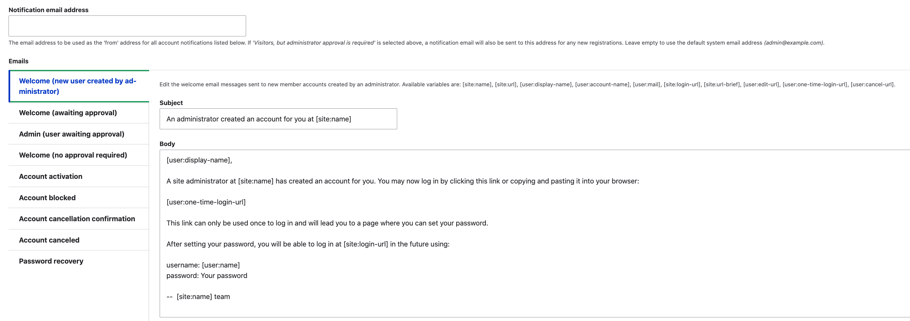

# Email

## Core

Drupal has email capability out of the box.  So, for example, when a [new user signs up it can trigger a confirming email.](https://www.drupal.org/docs/8/core/modules/contact/overview) You set up the basic choices for your email system under the 'configuration' option in the Administration menu.

You basically will see some choices regarding the 'parts' of the email system.  What the heck do 'parts' mean with regard to email.  Since we use email all the time we don't tend to think about the fact that there are at least two major chunks to the process; Format and Mail it.  

Another thing that the underlying mail API in Drupal has is an ability to point to a specific module.  Without going nuts on reading code, just look at the second line listed below and the first item in parentheses; it says $module.

If you are interested in [the underlying email system in Drupal](https://www.drupal.org/docs/contributed-modules/mime-mail/how-email-works-in-drupal) you kind of need to be in the mindset that it is meant to deliver core functions to be used by other, more capable mailing alternatives.  What is provided as part of Drupal core will basically only provide a plain text format email and send it.  Most people are going to want to do more than that with their email.  Having an HTML format capability to present a better look, include images in the email, allow for attachments, are sort of considered fundamental if you want to send emails that are more than a sign-up confirmation.

Since the sort of basic way the core email system is used is around confirming a sign-up, you can actually work the first level use of it from the Administration/Configuration/Account settings part of your website.

From within that area, you put in the address that will be default in your website for who any emails will be 'from'.  Then there are a bunch of standard email templates that you can use directly or you can edit.  Notice the odd little brackets aroudn some items and what these represent are variables or fields that get custom filled to personalize the emails from other information in your site.  There is something called [Tokens](../modules/development.md#token-module) that can be turned on to further expand things that can be inserted into emails outlined in the Contact forms where you move past these standard templates to some of your own.

When you select which form you want to work with, you get some options that will look very familiar to anyone who has started to work with [Content types and Fields](../book/contenttype.md) which is probably the most heavily used part of working with Drupal.  You will see the opportunity to add fields to the form, to create a form display, and to define the final output display.

You can also see that there is a part of the display where a users picture can be included in their profile on the site.  Both to include it in the input form made available.

And to present the picture in the profile display. 

#### What to send

As noted, besides the mechanics of sending mail, there is a need to actually format or create it.  So you start by looking under Administration/Structure/Contact forms.

You can add a contact form and then you can clone a prior, edit, manage fields present, their form and display, and even interface with Devel if you have that module installed. 

When you click to add one, you give it a name, then the subject of the email, they go into your editor and fill out the body.

Continuing on the form you indicate who you are sending it to and you can also indicate a reply address of the site default or some other email address you want any replies to go to.

You can see that multiple contact forms can be defined and applied to your List of contacts.

You will note that even a note in Drupal core Contact forms/Contact settings notes the requirement of adding something like the Swiftmailer contrib module to use HTML mailings.

## Contrib Modules

To better [understand what is and isn't in the email capability of Drupal Core you might want to listen to this.](https://events.drupal.org/seattle2019/sessions/amazing-emails-drupal-8) One of the most insightful graphics from the presentation pulls forward what should really be present in a full fledged email system.

That graphic notes the use of Swift Mailer replacing or leveraging the core formatting and sending(transport) functions in Drupal's base mail system.  The other functions it points out are really all about taking full advantage of the fact that Drupal CMS has a database that you ought to be able to store stuff in like templates and history plus an interface with functions that allow much better editing, and things like event or scheduled triggering.  The individual presenting in that video is the person behind the [Easy Mail module.](https://www.drupal.org/project/easy_email)  We could be all over heading in this direction with a well integrated mailing add-on except for a watchout to check if the module has passed Drupal's secuity check when you decide.

Let's take a look at some other contributed module options to help see the alternatives.

### Contact Emails module

The [Contact Emails module](https://www.drupal.org/project/contact_emails) gooses up managing Drupal Core Contact submissions emails by allowing a permission to 'manage contact form emails'.  Then users can add as many emails as desired, with a different recipients.  Even allowing tweaks to the  subject and/or messages the recipients get.  The module write up describes a use case for a larger organization where one email says thank you to the submitter of the form, another goes to the office administrator with some basic info, and another to a marketing manager with specific details about the form.

Just think of this module as adding a 'Manage emails' tab to the Administration/Structure/Contact form interface; and allowing you to also get to it in as an additional operations option for a specific email form you have set up.

From there, you can review the emails you have set up by subject, recipients, and active status or create another.

### Contact Mail Formatter module

The relatively new [Contact Mail Formatter module](https://www.drupal.org/project/contact_mail_formatter) adds even more capability. It integrates with the [Token module,](../modules/development.md#token-module) your CKeditor for WYSIWG ease in preparing your emails, and includes HTML capabilities. It also provides a relatively clean interface, especially to see the available tokens you might use.  It integrates with the Mail System module discussed below.

### Mail System module

The [Mail System module](https://www.drupal.org/project/mailsystem) is installed by your adding the Contact Mail Formatter module because it is a dependency.  You probably don't need to go deep into this module unless you are a developer who is going to work on writing mail related APIs.  You want it, but it will get there automatically with the above formatter.

### Symfony Mailer module

The [Symfony Mailer module](https://www.drupal.org/project/symfony_mailer) is the replacement for the deprecated Swift Mailer; so use it instead.  The Mail System module mentioned above is noted as working with the Swift Mailer but it will be fine with this replacement.   You want to head this way if you are looking for great integration with some key modules, for HTML emails, for attachments, and even for the use of TWIG integration with your Drupal website.   What you need to understand is that earlier point that emailing involves formating and sending; and the Symfony Mailer module is more about the sending part of this.  It integrates with the other parts of Drupal easily because this [mailer as well as Drupal itself are written in the Symfony framework of PHP.](https://www.youtube.com/watch?v=pHJCgkzVGXk)  Again, you probably don't have to go under the hood on this Symfony Mailer module unless you are a developer; just install it and enjoy the benefits. 

### MailHog integration

Making sure your mailing system is set up appropriately benefits from testing.  Drupal outlines a whole bunch of [details on testing.](https://www.drupal.org/docs/develop/local-server-setup/managing-mail-handling-for-development-or-testing)  Toward the end of that it points out a service called MailHog; [MailHog is available from GitHub.](https://github.com/mailhog/MailHog)  It involves bringing it to your local environment so you can do testing there with fake emails that don't go out and bother anyone.  The good news is that [if you use Lando](../book/Novice.md#setting-up-your-basic-system) you don't need to load from GitHub, you can just [call it as a service in your Lando file and it will be there.](https://docs.lando.dev/mailhog/)  Since this is just an underlying Docker feature of Lando, the same general approach is likely to work with [DDEV](https://ddev.com/) and [DockSal.](https://docksal.io/)

## Mailchimp alternative

Many people will find that Mailchimp is their preferred route for a mailing system integration.  There is a [Mailchimp module](https://www.drupal.org/project/mailchimp) available from Drupal.  [Mailchimp](https://mailchimp.com/) is a professional email marketing business system that has all sorts of functionality external to Drupal.  While external, that doesn't mean it isn't integrated.  Mailchimp is free but only at a relatively low number of emails per month and then you start to move into their paid levels.  It is definitely worth a look [and checkout a video on setting it up.](https://www.webwash.net/getting-started-with-mailchimp-in-drupal/)

### Mailchimp Transactional module

The [Mailchimp Transactional module](https://www.drupal.org/project/mailchimp_transactional) is a Drupal module intended for email facilitated transactions when your store offering changes, confirming things have shipped, people need a password resets, or any actions taken on the Drupal site. You can utilize its submodule for Mailchimp Templates that help style emails.  There is also a submodule under reports for a Dashboard and Account Summary;  so you can see volume, open and click rates, and other measures right in your Drupal website.

 
 
 

[Learn More - Drupal Modules List](../chapters.md#drupal-modules)
